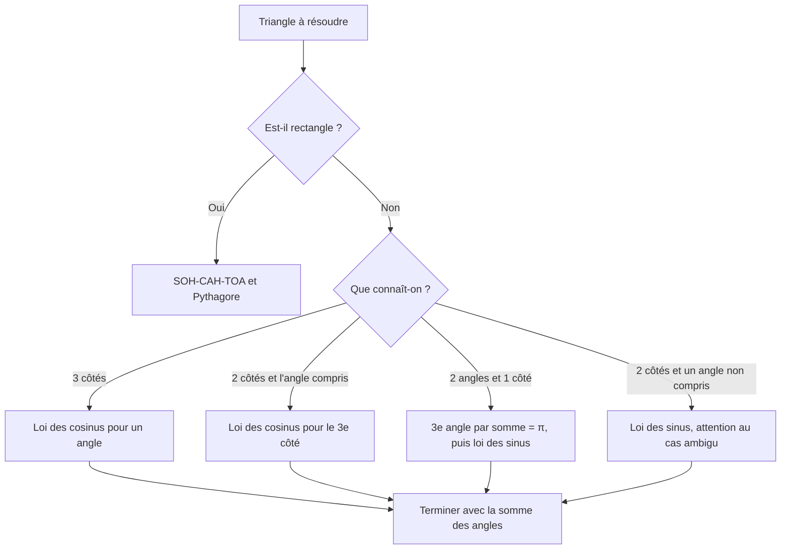
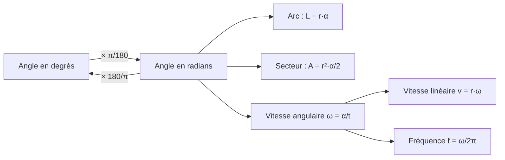

# 1. Angles, triangles et mouvements circulaires

> 🎯 **Objectif** : maîtriser les unités d'angle, la géométrie du cercle (arc, secteur, angle inscrit) et la résolution de triangles quelconques. Ces outils reviennent dans **chaque** premier test d'Algèbre linéaire (« Test 1 Pb 1 », « TE F-1 – Triangle & Co »).

---

## 1. Introduction & définitions

### 1.1 Mesurer un angle : degrés et radians

Un angle mesure une **ouverture** entre deux demi-droites. On utilise deux unités :

- le **degré** : un tour complet vaut $360°$ ;
- le **radian** : un tour complet vaut $2\pi$ rad.

Le radian est l'unité « naturelle » : **un angle de 1 rad intercepte sur un cercle de rayon $r$ un arc de longueur exactement $r$**. D'où la règle de conversion, à connaître par cœur :

$$\pi \text{ rad} = 180°$$

On passe donc d'une unité à l'autre par une simple règle de trois :

$$\alpha_{\text{rad}} = \alpha_{\text{deg}} \cdot \frac{\pi}{180} \qquad \alpha_{\text{deg}} = \alpha_{\text{rad}} \cdot \frac{180}{\pi}$$

Les degrés se subdivisent aussi en **minutes** ($1° = 60'$) et **secondes** ($1' = 60''$). Par exemple $7{,}5° = 7°30'$ car $0{,}5 \cdot 60 = 30$.

| Degrés | $0°$ | $30°$ | $45°$ | $60°$ | $90°$ | $180°$ | $270°$ | $360°$ |
| --- | --- | --- | --- | --- | --- | --- | --- | --- |
| Radians | $0$ | $\frac{\pi}{6}$ | $\frac{\pi}{4}$ | $\frac{\pi}{3}$ | $\frac{\pi}{2}$ | $\pi$ | $\frac{3\pi}{2}$ | $2\pi$ |

### 1.2 Arc et secteur de cercle

Sur un cercle de rayon $r$, un angle au centre $\alpha$ (**en radians !**) intercepte :

- un **arc** de longueur $L = r\,\alpha$ ;
- un **secteur** (la « part de pizza ») d'aire $A = \frac{1}{2} r^2 \alpha$.

> ⚠️ Ces deux formules ne sont vraies **qu'en radians**. En degrés il faudrait écrire $L = 2\pi r \cdot \frac{\alpha}{360}$.

### 1.3 Angle au centre et angle inscrit

Un **angle inscrit** a son sommet **sur** le cercle ; un **angle au centre** a son sommet au centre $O$.

> 💡 **Théorème de l'angle au centre** : un angle au centre vaut **le double** de l'angle inscrit qui intercepte le même arc.

Cas particulier (théorème de Thalès) : un angle inscrit qui intercepte un **demi-cercle** vaut $90°$. Tout triangle inscrit dans un demi-cercle, avec le diamètre comme côté, est donc **rectangle**.

### 1.4 Trigonométrie du triangle rectangle

Dans un triangle rectangle, pour un angle aigu $\alpha$ :

$$\sin\alpha = \frac{\text{opposé}}{\text{hypoténuse}} \qquad \cos\alpha = \frac{\text{adjacent}}{\text{hypoténuse}} \qquad \tan\alpha = \frac{\text{opposé}}{\text{adjacent}}$$

On définit aussi les fonctions **inverses multiplicatives** (très fréquentes dans les tests) :

$$\sec\alpha = \frac{1}{\cos\alpha} \qquad \csc\alpha = \frac{1}{\sin\alpha} \qquad \cot\alpha = \frac{1}{\tan\alpha} = \frac{\cos\alpha}{\sin\alpha}$$

Moyen mnémotechnique : **SOH-CAH-TOA** (Sinus = Opposé/Hypoténuse, Cosinus = Adjacent/Hypoténuse, Tangente = Opposé/Adjacent).

### 1.5 Triangles quelconques

Soit un triangle de côtés $a, b, c$ et d'angles opposés $\alpha, \beta, \gamma$.

**Loi des sinus** :

$$\frac{a}{\sin\alpha} = \frac{b}{\sin\beta} = \frac{c}{\sin\gamma}$$

**Loi des cosinus** (un « Pythagore généralisé ») :

$$c^2 = a^2 + b^2 - 2ab\cos\gamma$$

**Somme des angles** : $\alpha + \beta + \gamma = \pi$ (soit $180°$).

> ⚠️ **Piège de la loi des sinus** : $\arcsin$ ne renvoie que des angles de $\left[-\frac{\pi}{2}, \frac{\pi}{2}\right]$. Si l'angle cherché peut être **obtus**, il existe une seconde solution $\pi - \beta$. Pour trouver un angle, préférez la **loi des cosinus** : $\arccos$ renvoie directement un angle de $[0, \pi]$, sans ambiguïté.

### 1.6 Mouvement circulaire : vitesses angulaire et linéaire

Un objet qui tourne (roue, aiguille, disque) est décrit par :

- la **vitesse angulaire** $\omega$ (en rad/s) : l'angle parcouru par unité de temps ;
- la **fréquence** $f$ (en tours/s = Hz) : le nombre de tours par seconde ;
- la **vitesse linéaire** $v$ (en m/s) d'un point situé à la distance $r$ du centre.

$$\omega = 2\pi f \qquad v = r\,\omega \qquad T = \frac{1}{f} = \frac{2\pi}{\omega}$$

> 💡 Une roue qui **roule sans glisser** avance, à chaque tour, d'une longueur égale à son périmètre : la vitesse du véhicule est la vitesse linéaire $v = r\omega$ d'un point de la jante.

---

## 2. Méthodes de résolution

### Méthode A — Trouver un rayon à partir d'un arc et d'un angle inscrit

1. Repérer l'angle inscrit $\theta$ qui intercepte l'arc.
2. Angle au centre : $\alpha = 2\theta$.
3. Convertir $\alpha$ en radians.
4. Appliquer $L = r\alpha$, donc $r = \frac{L}{\alpha}$.

### Méthode B — Résoudre un triangle

### Méthode C — Problèmes de roues, aiguilles, vitesses

1. Tout convertir en unités SI : km/h → m/s (diviser par $3{,}6$), cm → m, minutes → secondes.
2. Écrire la relation clé $v = r\omega$ et $\omega = 2\pi f$.
3. Pour deux roues entraînées ensemble (même véhicule), c'est la **vitesse linéaire** qui est commune : $v = r_A\omega_A = r_B\omega_B$.
4. Pour des aiguilles de montre : calculer la position angulaire de chaque aiguille **depuis midi**, puis la différence.

---

## 3. Exemples de calculs détaillés

### Exemple 1 — Rayon d'un cercle (Test 1, variante A)

*L'arc $BC$ mesure $10$ cm et on le voit depuis le point $A$ du cercle sous un angle de $20°$. Calculer $r$.*

**Étape 1 — Angle au centre.** L'angle $20°$ est **inscrit** (sommet $A$ sur le cercle). L'angle au centre qui intercepte le même arc vaut donc le double :

$$\alpha = 2 \cdot 20° = 40°$$

**Étape 2 — Conversion.** On passe en radians, car la formule de l'arc l'exige :

$$\alpha = 40 \cdot \frac{\pi}{180} = \frac{2\pi}{9} \text{ rad}$$

**Étape 3 — Formule de l'arc.** $L = r\alpha$ donne :

$$r = \frac{L}{\alpha} = \frac{10}{2\pi/9} = \frac{90}{2\pi} = \frac{45}{\pi} \text{ cm} \approx 14{,}3 \text{ cm}$$

### Exemple 2 — Triangle inscrit dans un demi-cercle (TE F-1)

*$ADC$ est un demi-cercle de diamètre $AC$, avec $AD = 25$ et $DC = \sqrt{131{,}25}$. Trouver $AC$ et l'angle $\alpha = \angle DAC$.*

**Étape 1 — Reconnaître l'angle droit.** $D$ est sur le demi-cercle de diamètre $AC$, donc (Thalès) l'angle en $D$ est droit.

**Étape 2 — Pythagore** pour l'hypoténuse $AC$ :

$$AC = \sqrt{AD^2 + DC^2} = \sqrt{625 + 131{,}25} = \sqrt{756{,}25} = 27{,}5$$

**Étape 3 — Angle.** Dans le triangle rectangle en $D$, le côté opposé à $\alpha$ est $DC$ :

$$\alpha = \arcsin\left(\frac{DC}{AC}\right) = \arcsin\left(\frac{11{,}456}{27{,}5}\right) \approx 0{,}43 \text{ rad} \approx 24{,}6°$$

Ici $\arcsin$ est sans danger : dans un triangle rectangle, les angles aigus sont forcément dans $\left]0, \frac{\pi}{2}\right[$.

### Exemple 3 — La roue d'un caddie (« Vous avez dit crétins ? »)

*Pour décoller d'une rampe, un caddie doit rouler à $79{,}2$ km/h. a) Combien de tours par seconde fait la roue arrière de diamètre $10$ cm ? b) La roue avant fait $50$ tours/s : quel est son diamètre ?*

**a) Conversion** en m/s :

$$v = \frac{79{,}2}{3{,}6} = 22 \text{ m/s}$$

Le rayon de la roue arrière vaut $r_B = 0{,}05$ m. De $v = r\omega$ :

$$\omega_B = \frac{v}{r_B} = \frac{22}{0{,}05} = 440 \text{ rad/s}$$

Puis $f = \frac{\omega}{2\pi}$ :

$$f_B = \frac{440}{2\pi} \approx 70{,}0 \text{ tours/s}$$

**b)** La roue avant avance à la **même vitesse** $v = 22$ m/s (elle est sur le même caddie). Avec $f_A = 50$ tours/s, on a $\omega_A = 2\pi \cdot 50 = 100\pi$ rad/s, donc :

$$r_A = \frac{v}{\omega_A} = \frac{22}{100\pi} \approx 0{,}070 \text{ m}$$

Le diamètre vaut donc environ $14$ cm. **Commentaire** : la roue avant est plus grande, elle tourne moins vite pour la même vitesse du caddie, ce qui est cohérent.

### Exemple 4 — Les aiguilles d'une montre (TE F-1, 2023)

*Il est 2 h 38. La petite aiguille mesure $20$ cm, la grande $30$ cm. a) Vitesses angulaires ? b) Angle entre les aiguilles ? c) Distance entre leurs extrémités ?*

**a)** La grande aiguille fait un tour en $60$ min, la petite en $12$ h $= 720$ min :

$$\omega_M = \frac{360°}{60 \text{ min}} = 6°/\text{min} \qquad \omega_H = \frac{360°}{720 \text{ min}} = 0{,}5°/\text{min}$$

En rad/s : $\omega_M = \frac{2\pi}{3600} \approx 1{,}75 \cdot 10^{-3}$ rad/s et $\omega_H = \frac{2\pi}{43\,200} \approx 1{,}45 \cdot 10^{-4}$ rad/s.

**b)** Positions depuis midi (sens horaire). Depuis 12 h, il s'est écoulé $2 \cdot 60 + 38 = 158$ min :

$$\theta_M = 38 \cdot 6° = 228° \qquad \theta_H = 158 \cdot 0{,}5° = 79°$$

L'angle entre les aiguilles vaut donc $228° - 79° = 149°$.

**c)** Le triangle formé par le centre et les deux extrémités a deux côtés connus ($0{,}2$ et $0{,}3$ m) et **l'angle compris** : c'est la loi des cosinus :

$$\delta^2 = 0{,}2^2 + 0{,}3^2 - 2 \cdot 0{,}2 \cdot 0{,}3 \cdot \cos(149°) \approx 0{,}13 + 0{,}1029 = 0{,}2329$$

$$\delta \approx 0{,}483 \text{ m}$$

---

## 4. Visualisation : la « boîte à outils » du chapitre

---

## 5. Exercices pratiques

### Exercice 1 — Arc de cercle

On voit un arc $BC$ de longueur $30$ cm sous un angle inscrit de $40°$. Calculer le rayon $r$ du cercle, puis l'aire du secteur circulaire $BOC$.

💡 Cliquez pour voir l'indice

L'angle au centre vaut le double de l'angle inscrit. Convertissez-le en radians avant d'utiliser $L = r\alpha$ puis $A = \frac{1}{2}r^2\alpha$.

**Solution détaillée**

1. Angle au centre : $\alpha = 2 \cdot 40° = 80°$.
2. En radians : $\alpha = 80 \cdot \frac{\pi}{180} = \frac{4\pi}{9}$.
3. Rayon :

$$r = \frac{L}{\alpha} = \frac{30}{4\pi/9} = \frac{270}{4\pi} = \frac{135}{2\pi} \text{ cm} \approx 21{,}5 \text{ cm}$$

4. Aire du secteur :

$$A = \frac{1}{2} r^2 \alpha = \frac{1}{2} r \cdot (r\alpha) = \frac{1}{2} r L = \frac{1}{2} \cdot \frac{135}{2\pi} \cdot 30 = \frac{2025}{2\pi} \approx 322 \text{ cm}^2$$

L'astuce $r\alpha = L$ évite de refaire le calcul de $r^2$.

### Exercice 2 — Triangle quelconque

Dans un triangle $ABC$, on connaît $b = 8$, $c = 5$ et l'angle $\alpha = 60°$ (compris entre $b$ et $c$). Calculer $a$, puis l'angle $\beta$.

💡 Cliquez pour voir l'indice

Deux côtés et l'angle **compris** : c'est la loi des cosinus qui donne le troisième côté. Pour l'angle, réutilisez la loi des cosinus plutôt que la loi des sinus (pas de cas ambigu).

**Solution détaillée**

1. Loi des cosinus :

$$a^2 = b^2 + c^2 - 2bc\cos\alpha = 64 + 25 - 2 \cdot 8 \cdot 5 \cdot \frac{1}{2} = 89 - 40 = 49$$

donc $a = 7$.

2. Pour $\beta$ (opposé à $b$), on isole $\cos\beta$ dans $b^2 = a^2 + c^2 - 2ac\cos\beta$ :

$$\cos\beta = \frac{a^2 + c^2 - b^2}{2ac} = \frac{49 + 25 - 64}{70} = \frac{10}{70} = \frac{1}{7}$$

$$\beta = \arccos\left(\frac{1}{7}\right) \approx 81{,}8°$$

3. Vérification : $\gamma = 180° - 60° - 81{,}8° = 38{,}2°$ ; le plus petit côté ($c = 5$) est bien opposé au plus petit angle.

### Exercice 3 — Vitesse d'une voiture

Les roues d'une voiture ont un diamètre de $60$ cm et tournent à $12$ tours/s. Quelle est la vitesse de la voiture en km/h ? Quelle distance parcourt-elle en $5$ min ?

💡 Cliquez pour voir l'indice

Calculez $\omega = 2\pi f$, puis $v = r\omega$ avec $r$ en mètres. Multipliez par $3{,}6$ pour passer en km/h.

**Solution détaillée**

1. $r = 0{,}30$ m et $\omega = 2\pi \cdot 12 = 24\pi$ rad/s.
2. Vitesse linéaire :

$$v = r\omega = 0{,}30 \cdot 24\pi = 7{,}2\pi \approx 22{,}6 \text{ m/s}$$

3. En km/h : $v \approx 22{,}6 \cdot 3{,}6 \approx 81{,}4$ km/h.
4. En $5$ min $= 300$ s : $d = v \cdot t \approx 22{,}6 \cdot 300 \approx 6786$ m, soit environ $6{,}8$ km.
