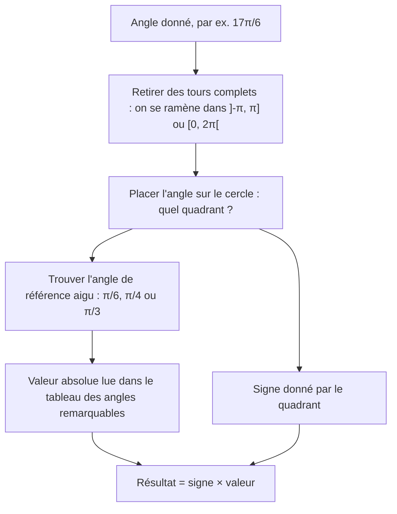
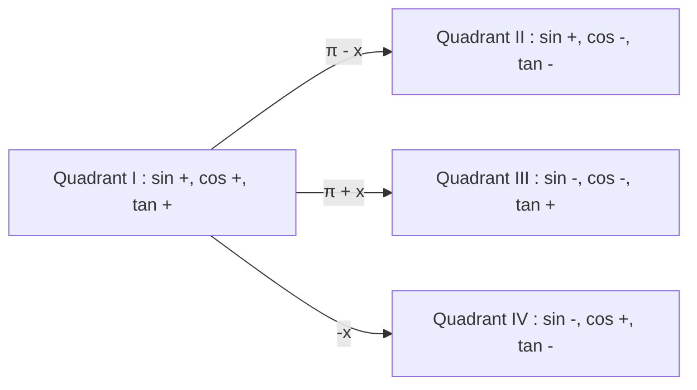

# 2. Le cercle trigonométrique

> 🎯 **Objectif** : lire sinus, cosinus et tangente de **n'importe quel angle** sur le cercle unité, utiliser les symétries pour se ramener aux angles remarquables, et comparer des valeurs sans calculatrice. Les tests se font **sans calculatrice** : tout repose sur ce chapitre.

---

## 1. Introduction & définitions

### 1.1 Le cercle unité

Le **cercle trigonométrique** est le cercle de centre $O(0;0)$ et de rayon $1$. On y mesure les angles :

- à partir de l'axe $Ox$ positif ;
- dans le **sens antihoraire** (positif) ; un angle négatif tourne dans le sens horaire.

À chaque angle $\alpha$ correspond un point $M$ du cercle. **Par définition** :

$$\cos\alpha = \text{abscisse de } M \qquad \sin\alpha = \text{ordonnée de } M \qquad \tan\alpha = \frac{\sin\alpha}{\cos\alpha}$$

Géométriquement, $\tan\alpha$ se lit sur la **droite verticale $x = 1$** : c'est l'ordonnée du point où la droite $(OM)$ coupe cette tangente au cercle.

Comme $M$ est sur un cercle de rayon $1$, Pythagore donne immédiatement **l'identité fondamentale** :

$$\sin^2\alpha + \cos^2\alpha = 1$$

En divisant par $\cos^2\alpha$, puis par $\sin^2\alpha$, on obtient deux identités utiles :

$$1 + \tan^2\alpha = \sec^2\alpha \qquad 1 + \cot^2\alpha = \csc^2\alpha$$

### 1.2 Les quatre quadrants et les signes

| Quadrant | Angles | $\sin$ | $\cos$ | $\tan$ |
| --- | --- | --- | --- | --- |
| I | $\left]0, \frac{\pi}{2}\right[$ | $+$ | $+$ | $+$ |
| II | $\left]\frac{\pi}{2}, \pi\right[$ | $+$ | $-$ | $-$ |
| III | $\left]\pi, \frac{3\pi}{2}\right[$ | $-$ | $-$ | $+$ |
| IV | $\left]\frac{3\pi}{2}, 2\pi\right[$ | $-$ | $+$ | $-$ |

Les fonctions $\sec$, $\csc$, $\cot$ ont respectivement le signe de $\cos$, $\sin$, $\tan$.

### 1.3 Les angles remarquables

| $\alpha$ | $0$ | $\frac{\pi}{6}$ | $\frac{\pi}{4}$ | $\frac{\pi}{3}$ | $\frac{\pi}{2}$ |
| --- | --- | --- | --- | --- | --- |
| $\sin\alpha$ | $0$ | $\frac{1}{2}$ | $\frac{\sqrt{2}}{2}$ | $\frac{\sqrt{3}}{2}$ | $1$ |
| $\cos\alpha$ | $1$ | $\frac{\sqrt{3}}{2}$ | $\frac{\sqrt{2}}{2}$ | $\frac{1}{2}$ | $0$ |
| $\tan\alpha$ | $0$ | $\frac{\sqrt{3}}{3}$ | $1$ | $\sqrt{3}$ | non défini |

> 💡 **Astuce mémoire** : les sinus valent $\frac{\sqrt{0}}{2}, \frac{\sqrt{1}}{2}, \frac{\sqrt{2}}{2}, \frac{\sqrt{3}}{2}, \frac{\sqrt{4}}{2}$ ; les cosinus sont la même liste à l'envers.

### 1.4 Les symétries (« angles associés »)

Toutes ces formules se **lisent** sur le cercle : il suffit de dessiner l'angle $x$ et l'angle transformé.

| Transformation | Symétrie sur le cercle | Résultat |
| --- | --- | --- |
| $-x$ | par rapport à l'axe $Ox$ | $\sin(-x) = -\sin x$, $\cos(-x) = \cos x$ |
| $\pi - x$ | par rapport à l'axe $Oy$ | $\sin(\pi - x) = \sin x$, $\cos(\pi - x) = -\cos x$ |
| $\pi + x$ | par rapport à l'origine | $\sin(\pi + x) = -\sin x$, $\cos(\pi + x) = -\cos x$ |
| $\frac{\pi}{2} - x$ | par rapport à la bissectrice $y = x$ | $\sin\left(\frac{\pi}{2} - x\right) = \cos x$, $\cos\left(\frac{\pi}{2} - x\right) = \sin x$ |
| $\frac{\pi}{2} + x$ | rotation d'un quart de tour | $\sin\left(\frac{\pi}{2} + x\right) = \cos x$, $\cos\left(\frac{\pi}{2} + x\right) = -\sin x$ |
| $x + 2k\pi$ | un ou plusieurs tours complets | valeurs inchangées (**période** $2\pi$) |

Conséquences pour la tangente : $\tan(-x) = -\tan x$, $\tan(\pi + x) = \tan x$ (période $\pi$), $\tan\left(\frac{\pi}{2} + x\right) = -\cot x$ et $\tan(\pi - x) = -\tan x$.

---

## 2. Méthodes de résolution

### Méthode A — Évaluer $\sin$, $\cos$, $\tan$ d'un angle quelconque

### Méthode B — Une fonction connue, trouver toutes les autres

1. Placer l'angle dans son **quadrant** (donné par l'énoncé) : cela fixe **tous les signes**.
2. Dessiner un triangle rectangle « de référence » avec les longueurs positives (par exemple $\cos\alpha = \frac{4}{5}$ → adjacent $4$, hypoténuse $5$, donc opposé $3$ par Pythagore).
3. Écrire chaque fonction avec les longueurs du triangle, puis **appliquer le signe** du quadrant.

### Méthode C — Estimer une valeur sans calculatrice (« exclure les valeurs erronées »)

1. Placer l'angle : le **signe** élimine déjà la moitié des propositions.
2. Encadrer l'angle entre deux angles remarquables et utiliser la **monotonie** de la fonction sur ce quadrant.

### Méthode D — Comparer deux expressions ($<$, $>$ ou $=$)

1. Réécrire les deux expressions avec les symétries (par exemple $\tan\left(\frac{\pi}{2} + \alpha\right) = -\cot\alpha$).
2. Déterminer le **signe** de chaque expression grâce au quadrant.
3. Si les signes sont égaux, comparer les **valeurs absolues** en lisant le dessin (longueurs des segments sur le cercle).

---

## 3. Exemples de calculs détaillés

### Exemple 1 — Valeurs d'un angle négatif (Test 1, variante A)

*Donner $\sin\left(-\frac{2\pi}{3}\right)$, $\cos\left(-\frac{2\pi}{3}\right)$ et $\tan\left(-\frac{2\pi}{3}\right)$.*

- $-\frac{2\pi}{3} = -120°$ : on tourne de $120°$ dans le sens horaire. On arrive dans le **quadrant III** ($\sin < 0$, $\cos < 0$).
- Angle de référence : $\pi - \frac{2\pi}{3} = \frac{\pi}{3}$.

$$\sin\left(-\frac{2\pi}{3}\right) = -\frac{\sqrt{3}}{2} \qquad \cos\left(-\frac{2\pi}{3}\right) = -\frac{1}{2}$$

$$\tan\left(-\frac{2\pi}{3}\right) = \frac{-\sqrt{3}/2}{-1/2} = \sqrt{3}$$

La tangente est positive, ce qui est bien cohérent avec le quadrant III.

### Exemple 2 — Retrouver toutes les fonctions (Test 1, variante A)

*$\alpha \in \left[\frac{3\pi}{2}, 2\pi\right]$ et $\cos\alpha = \frac{4}{5}$. Calculer les autres fonctions trigonométriques.*

**Étape 1 — Quadrant IV** : $\cos > 0$, $\sin < 0$, donc $\tan < 0$.

**Étape 2 — Sinus** par l'identité fondamentale :

$$\sin^2\alpha = 1 - \frac{16}{25} = \frac{9}{25} \quad\Rightarrow\quad \sin\alpha = -\frac{3}{5}$$

(on garde la racine **négative** à cause du quadrant).

**Étape 3 — Le reste** découle des définitions :

$$\tan\alpha = \frac{-3/5}{4/5} = -\frac{3}{4} \qquad \cot\alpha = -\frac{4}{3} \qquad \sec\alpha = \frac{5}{4} \qquad \csc\alpha = -\frac{5}{3}$$

### Exemple 3 — Réduire un grand angle

*Calculer $\sin\left(\frac{17\pi}{6}\right)$ et $\tan\left(\frac{5\pi}{4}\right)$.*

- $\frac{17\pi}{6} = 2\pi + \frac{5\pi}{6}$ : un tour complet ne change rien, on étudie $\frac{5\pi}{6}$ (quadrant II, référence $\frac{\pi}{6}$). Le sinus est positif :

$$\sin\left(\frac{17\pi}{6}\right) = \sin\left(\frac{5\pi}{6}\right) = \sin\left(\pi - \frac{\pi}{6}\right) = \sin\left(\frac{\pi}{6}\right) = \frac{1}{2}$$

- $\frac{5\pi}{4} = \pi + \frac{\pi}{4}$ et la tangente est de période $\pi$ :

$$\tan\left(\frac{5\pi}{4}\right) = \tan\left(\frac{\pi}{4}\right) = 1$$

### Exemple 4 — Estimation (Test 1)

*$\cos\left(\frac{4\pi}{5}\right)$ arrondi à 1 décimale vaut-il $0{,}3$ ; $-0{,}3$ ; $0{,}8$ ou $-0{,}8$ ?*

- $\frac{4\pi}{5} = 144°$ est dans le quadrant II : le cosinus est **négatif**. Il reste $-0{,}3$ ou $-0{,}8$.
- $144°$ est proche de $180°$ où $\cos = -1$ ; plus précisément $144° > 135°$ et $\cos(135°) = -\frac{\sqrt{2}}{2} \approx -0{,}71$. Le cosinus décroît sur le quadrant II, donc $\cos(144°) < -0{,}71$.
- Réponse : $-0{,}8$.

*$\sin\left(\frac{6\pi}{7}\right)$ vaut-il $0{,}4$ ; $-0{,}4$ ; $0{,}6$ ou $-0{,}6$ ?*

- $\frac{6\pi}{7} = \pi - \frac{\pi}{7}$ donc $\sin\left(\frac{6\pi}{7}\right) = \sin\left(\frac{\pi}{7}\right) > 0$.
- Or $\frac{\pi}{7} < \frac{\pi}{6}$ et $\sin\left(\frac{\pi}{6}\right) = 0{,}5$ : la valeur est inférieure à $0{,}5$. Réponse : $0{,}4$.

### Exemple 5 — Comparer (TE F-1, « Comparaison d'angles »)

*$\gamma$ est un angle du quadrant II. Compléter : $\sec(\gamma) \;\square\; \cos(\gamma)$.*

- Dans le quadrant II, $\cos\gamma \in \left]-1, 0\right[$.
- Donc $\sec\gamma = \frac{1}{\cos\gamma} < -1$ (l'inverse d'un nombre compris entre $-1$ et $0$ est inférieur à $-1$).
- Ainsi $\sec\gamma < -1 < \cos\gamma$ : on écrit $\sec(\gamma) < \cos(\gamma)$.

*$\alpha$ est un angle du quadrant I. Compléter : $\tan\left(\frac{\pi}{2} + \alpha\right) \;\square\; \cot(\alpha)$.*

- Symétrie : $\tan\left(\frac{\pi}{2} + \alpha\right) = -\cot\alpha$.
- Dans le quadrant I, $\cot\alpha > 0$, donc $-\cot\alpha < 0 < \cot\alpha$ : on écrit $<$.

---

## 4. Visualisation : se repérer sur le cercle

Chaque flèche indique comment l'angle de référence $x$ du quadrant I « se transporte » dans les autres quadrants : la **valeur absolue** reste celle de $x$, seul le **signe** change.

---

## 5. Exercices pratiques

### Exercice 1 — Trouver les autres fonctions

L'angle $\alpha$ se trouve dans $\left[-\frac{3\pi}{2}, -\pi\right]$ et $\sin\alpha = \frac{3}{5}$. Calculer exactement $\cos\alpha$, $\tan\alpha$, $\cot\alpha$, $\sec\alpha$ et $\csc\alpha$.

💡 Cliquez pour voir l'indice

Ajoutez $2\pi$ pour voir dans quel quadrant « usuel » se trouve l'intervalle $\left[-\frac{3\pi}{2}, -\pi\right]$. Le signe du cosinus en découle.

**Solution détaillée**

1. $\left[-\frac{3\pi}{2}, -\pi\right] + 2\pi = \left[\frac{\pi}{2}, \pi\right]$ : c'est le **quadrant II** ($\sin > 0$ ✓, $\cos < 0$).
2. $\cos^2\alpha = 1 - \frac{9}{25} = \frac{16}{25}$, donc $\cos\alpha = -\frac{4}{5}$.
3. Les autres fonctions :

$$\tan\alpha = \frac{3/5}{-4/5} = -\frac{3}{4} \qquad \cot\alpha = -\frac{4}{3} \qquad \sec\alpha = -\frac{5}{4} \qquad \csc\alpha = \frac{5}{3}$$

### Exercice 2 — Valeurs exactes

Calculer sans calculatrice : a) $\cos\left(\frac{4\pi}{3}\right)$ ; b) $\sin\left(-\frac{5\pi}{6}\right)$ ; c) $\tan\left(\frac{5\pi}{6}\right)$ ; d) $\sec\left(\frac{7\pi}{4}\right)$.

💡 Cliquez pour voir l'indice

Pour chaque angle : quadrant (→ signe), puis angle de référence parmi $\frac{\pi}{6}$, $\frac{\pi}{4}$, $\frac{\pi}{3}$ (→ valeur absolue).

**Solution détaillée**

a) $\frac{4\pi}{3} = \pi + \frac{\pi}{3}$, quadrant III, cosinus négatif : $\cos\left(\frac{4\pi}{3}\right) = -\cos\left(\frac{\pi}{3}\right) = -\frac{1}{2}$.

b) $-\frac{5\pi}{6}$ est dans le quadrant III (on tourne de $150°$ en sens horaire), sinus négatif, référence $\frac{\pi}{6}$ : $\sin\left(-\frac{5\pi}{6}\right) = -\frac{1}{2}$.

c) $\frac{5\pi}{6} = \pi - \frac{\pi}{6}$, quadrant II, tangente négative : $\tan\left(\frac{5\pi}{6}\right) = -\tan\left(\frac{\pi}{6}\right) = -\frac{\sqrt{3}}{3}$.

d) $\frac{7\pi}{4} = 2\pi - \frac{\pi}{4}$, quadrant IV, cosinus positif : $\cos\left(\frac{7\pi}{4}\right) = \frac{\sqrt{2}}{2}$, donc $\sec\left(\frac{7\pi}{4}\right) = \frac{2}{\sqrt{2}} = \sqrt{2}$.

### Exercice 3 — Comparaisons

Soit $\beta \in \left]\frac{\pi}{2}, \pi\right[$ (quadrant II) et $\delta \in \left]-\frac{\pi}{2}, 0\right[$ (quadrant IV). Compléter par $<$, $>$ ou $=$ :

a) $\cos(\beta) \;\square\; \tan(\pi - \beta)$ ; b) $\sin(\beta) \;\square\; \sin(\pi - \beta)$ ; c) $\tan(\delta) \;\square\; \tan(-\delta)$.

💡 Cliquez pour voir l'indice

Utilisez $\tan(\pi - \beta) = -\tan\beta$ et $\sin(\pi - \beta) = \sin\beta$, puis raisonnez sur les signes.

**Solution détaillée**

a) $\beta$ au quadrant II : $\cos\beta < 0$. Et $\tan(\pi - \beta) = -\tan\beta$ ; comme $\tan\beta < 0$ au quadrant II, $-\tan\beta > 0$. Donc $\cos(\beta) < \tan(\pi - \beta)$.

b) La symétrie par rapport à l'axe $Oy$ conserve le sinus : $\sin(\pi - \beta) = \sin\beta$. On écrit $=$.

c) $\delta$ au quadrant IV : $\tan\delta < 0$ ; et $\tan(-\delta) = -\tan\delta > 0$. Donc $\tan(\delta) < \tan(-\delta)$.
