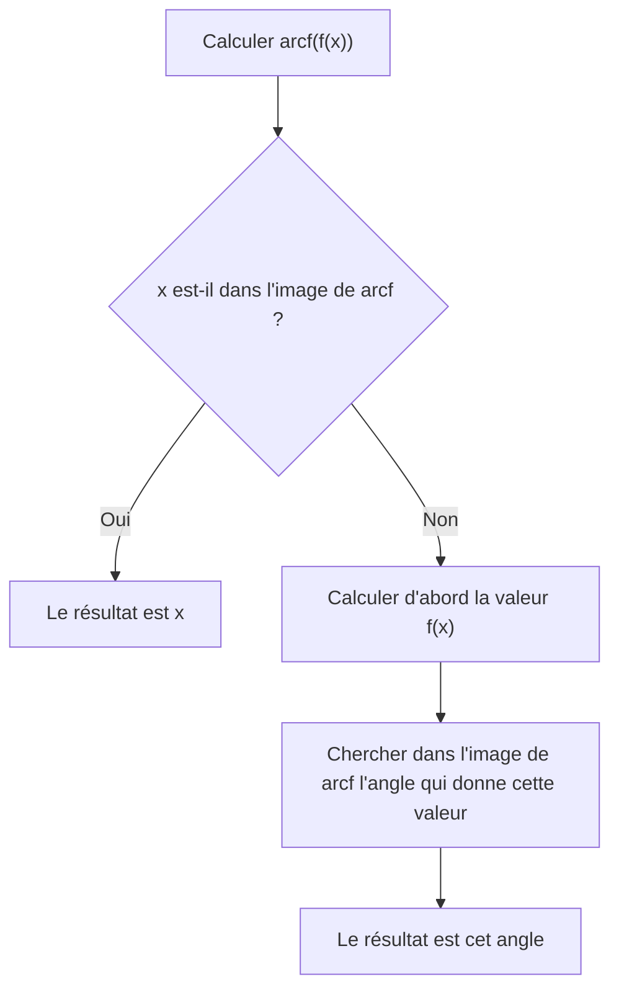
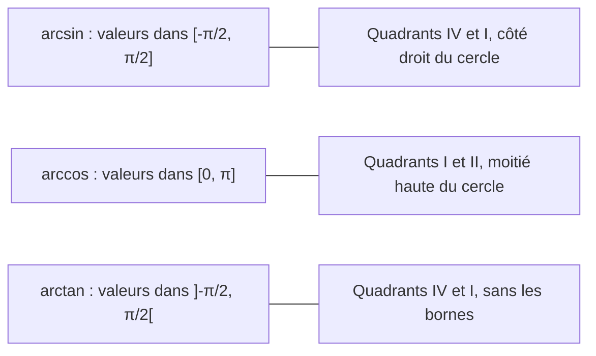

# 3. Fonctions trigonométriques réciproques

> 🎯 **Objectif** : connaître $$\arcsin$$, $$\arccos$$, $$\arctan$$ (domaines, images, graphes), calculer leurs valeurs exactes, déjouer les pièges du type $$\arcsin(\sin x)$$, et les utiliser pour exprimer un angle inconnu (problème de l'avion). Ce chapitre correspond à « Test 1 Pb 2 ».

---

## 1. Introduction & définitions

### 1.1 Pourquoi « restreindre » ?

On voudrait « défaire » le sinus : trouver l'angle $$x$$ tel que $$\sin x = y$$. Problème : il y a **une infinité** de réponses (par exemple $$\sin x = \frac{1}{2}$$ pour $$x = \frac{\pi}{6}, \frac{5\pi}{6}, \frac{13\pi}{6}, \dots$$). Une fonction ne peut renvoyer qu'**une seule** valeur.

On restreint donc chaque fonction à un intervalle où elle est **bijective** (strictement monotone et prenant toutes ses valeurs une seule fois). Sa réciproque est alors bien définie.

### 1.2 Les trois fonctions

| Fonction | Domaine | Image | Se lit « l'angle... » |
| --- | --- | --- | --- |
| $$\arcsin x$$ | $$[-1, 1]$$ | $$\left[-\frac{\pi}{2}, \frac{\pi}{2}\right]$$ | ...de $$[-90°, 90°]$$ dont le sinus vaut $$x$$ |
| $$\arccos x$$ | $$[-1, 1]$$ | $$[0, \pi]$$ | ...de $$[0°, 180°]$$ dont le cosinus vaut $$x$$ |
| $$\arctan x$$ | $$\mathbb{R}$$ | $$\left]-\frac{\pi}{2}, \frac{\pi}{2}\right[$$ | ...de $$]-90°, 90°[$$ dont la tangente vaut $$x$$ |

Ainsi, par définition :

$$y = \arcsin x \iff \left(\sin y = x \text{ et } y \in \left[-\tfrac{\pi}{2}, \tfrac{\pi}{2}\right]\right)$$

### 1.3 Graphes et propriétés

Le graphe d'une réciproque est le **symétrique** du graphe de la fonction (restreinte) par rapport à la droite $$y = x$$.

- $$\arcsin$$ : croissante, impaire ($$\arcsin(-x) = -\arcsin x$$), passe par $$(-1; -\frac{\pi}{2})$$, $$(0; 0)$$, $$(1; \frac{\pi}{2})$$ ; tangentes verticales aux extrémités.
- $$\arccos$$ : décroissante, passe par $$(-1; \pi)$$, $$(0; \frac{\pi}{2})$$, $$(1; 0)$$ ; ni paire ni impaire, mais $$\arccos(-x) = \pi - \arccos x$$.
- $$\arctan$$ : croissante, impaire, définie sur tout $$\mathbb{R}$$, avec deux **asymptotes horizontales** $$y = -\frac{\pi}{2}$$ (en $$-\infty$$) et $$y = \frac{\pi}{2}$$ (en $$+\infty$$).

| Fonction | Borne min | Borne max | Asymptotes |
| --- | --- | --- | --- |
| $$\arcsin$$ | $$-\frac{\pi}{2}$$ en $$x = -1$$ | $$\frac{\pi}{2}$$ en $$x = 1$$ | aucune |
| $$\arccos$$ | $$0$$ en $$x = 1$$ | $$\pi$$ en $$x = -1$$ | aucune |
| $$\arctan$$ | aucune (inf. $$-\frac{\pi}{2}$$) | aucune (sup. $$\frac{\pi}{2}$$) | $$y = \pm\frac{\pi}{2}$$ |

### 1.4 Compositions : le piège classique

- $$\sin(\arcsin x) = x$$ **pour tout** $$x \in [-1, 1]$$ : on part d'un nombre, on prend un angle, on revient au nombre. Toujours vrai.
- $$\arcsin(\sin x) = x$$ **seulement si** $$x \in \left[-\frac{\pi}{2}, \frac{\pi}{2}\right]$$. Sinon, le résultat est **l'angle de l'image** $$\left[-\frac{\pi}{2}, \frac{\pi}{2}\right]$$ qui a le même sinus que $$x$$.

Mêmes règles pour $$\arccos$$ (image $$[0, \pi]$$) et $$\arctan$$ (image $$\left]-\frac{\pi}{2}, \frac{\pi}{2}\right[$$).

---

## 2. Méthodes de résolution

### Méthode A — Valeur exacte de $$\arcsin a$$, $$\arccos a$$, $$\arctan a$$

1. Chercher l'angle remarquable de référence dont la fonction vaut $$\lvert a \rvert$$.
2. Choisir, **dans l'image de la fonction réciproque**, l'angle qui a le bon signe.

### Méthode B — Calculer $$\arcsin(\sin x)$$, $$\arccos(\cos x)$$, $$\arctan(\tan x)$$

### Méthode C — Calculer $$\sin(\arccos a)$$, $$\tan(\arcsin a)$$, etc.

1. Poser $$\theta = \arccos a$$ : on sait que $$\cos\theta = a$$ **et** $$\theta \in [0, \pi]$$.
2. Utiliser $$\sin^2\theta + \cos^2\theta = 1$$ pour la valeur absolue.
3. Choisir le signe grâce à l'intervalle de $$\theta$$ (par exemple, sur $$[0, \pi]$$, $$\sin\theta \geq 0$$).

### Méthode D — Exprimer un angle inconnu (problèmes de visée)

1. Faire un croquis, introduire les distances inconnues (altitude $$y$$, distances horizontales $$x$$, $$d$$).
2. Écrire une équation en $$\tan$$ (ou $$\cot = \frac{1}{\tan}$$) pour **chaque** angle de visée.
3. Éliminer les inconnues auxiliaires par combinaison des équations.
4. Conclure avec $$\arctan$$ (valable si l'angle cherché est aigu).

---

## 3. Exemples de calculs détaillés

### Exemple 1 — Valeurs exactes (Test 1, variante A)

- $$\arcsin\left(-\frac{\sqrt{3}}{2}\right)$$ : l'angle de référence est $$\frac{\pi}{3}$$ ; on cherche dans $$\left[-\frac{\pi}{2}, \frac{\pi}{2}\right]$$ un angle de sinus **négatif** : $$-\frac{\pi}{3}$$.
- $$\arccos\left(-\frac{\sqrt{2}}{2}\right)$$ : référence $$\frac{\pi}{4}$$ ; dans $$[0, \pi]$$, le cosinus est négatif au quadrant II : $$\pi - \frac{\pi}{4} = \frac{3\pi}{4}$$.
- $$\arctan(-\sqrt{3})$$ : référence $$\frac{\pi}{3}$$ ; dans $$\left]-\frac{\pi}{2}, \frac{\pi}{2}\right[$$ : $$-\frac{\pi}{3}$$.

### Exemple 2 — Compositions (Test 1, variante A)

On prend $$x = \frac{2\pi}{3}$$, qui est au quadrant II.

- $$\arcsin\left(\sin\frac{2\pi}{3}\right)$$ : $$\frac{2\pi}{3} \notin \left[-\frac{\pi}{2}, \frac{\pi}{2}\right]$$. On calcule $$\sin\frac{2\pi}{3} = \frac{\sqrt{3}}{2}$$, puis $$\arcsin\frac{\sqrt{3}}{2} = \frac{\pi}{3}$$.
- $$\arccos\left(\cos\frac{2\pi}{3}\right)$$ : $$\frac{2\pi}{3} \in [0, \pi]$$, donc le résultat est directement $$\frac{2\pi}{3}$$.
- $$\arctan\left(\tan\frac{2\pi}{3}\right)$$ : $$\tan\frac{2\pi}{3} = -\sqrt{3}$$, et $$\arctan(-\sqrt{3}) = -\frac{\pi}{3}$$ (la tangente a une période $$\pi$$ : $$\frac{2\pi}{3} - \pi = -\frac{\pi}{3}$$).

### Exemple 3 — Un sinus d'arctangente

*Calculer $$\sin(\arctan(-1))$$.*

$$\arctan(-1) = -\frac{\pi}{4}$$, donc $$\sin\left(-\frac{\pi}{4}\right) = -\frac{\sqrt{2}}{2}$$.

> ⚠️ Erreur fréquente vue dans les copies : répondre $$\sin\left(\frac{3\pi}{4}\right)$$. L'angle $$\frac{3\pi}{4}$$ a bien une tangente égale à $$-1$$, mais il n'est **pas** dans l'image de $$\arctan$$.

### Exemple 4 — L'avion observé (Test 1 Pb 2)

*Un avion vole horizontalement à altitude inconnue $$y$$ et vitesse constante. L'observateur en $$O$$ le voit sous l'angle d'élévation $$\alpha$$ à l'instant $$t$$, sous $$\beta$$ une minute plus tard, et sous $$\gamma$$ encore une minute plus tard. Les trois angles sont aigus. Exprimer $$\gamma$$ en fonction de $$\alpha$$ et $$\beta$$.*

**Étape 1 — Notations.** L'avion s'approche de $$O$$. Soit $$x$$ sa distance horizontale à $$O$$ au 3e instant et $$d$$ la distance parcourue en une minute. Aux trois instants, les distances horizontales valent $$x + 2d$$, $$x + d$$ et $$x$$.

**Étape 2 — Une équation par angle** (triangle rectangle : $$\tan = \frac{\text{opposé}}{\text{adjacent}}$$) :

$$\tan\alpha = \frac{y}{x + 2d} \qquad \tan\beta = \frac{y}{x + d} \qquad \tan\gamma = \frac{y}{x}$$

On inverse les deux premières pour isoler des rapports simples :

$$\frac{1}{\tan\alpha} = \frac{x}{y} + 2\frac{d}{y} \quad (1) \qquad \frac{1}{\tan\beta} = \frac{x}{y} + \frac{d}{y} \quad (2)$$

**Étape 3 — Éliminer $$d$$.** La différence $$(1) - (2)$$ donne $$\frac{d}{y} = \frac{1}{\tan\alpha} - \frac{1}{\tan\beta}$$. On remplace dans $$(2)$$ :

$$\frac{x}{y} = \frac{1}{\tan\beta} - \frac{d}{y} = \frac{2}{\tan\beta} - \frac{1}{\tan\alpha}$$

**Étape 4 — Conclure.** Comme $$\tan\gamma = \frac{y}{x}$$ :

$$\tan\gamma = \frac{1}{\frac{2}{\tan\beta} - \frac{1}{\tan\alpha}} = \frac{\tan\alpha\tan\beta}{2\tan\alpha - \tan\beta}$$

$$\gamma$$ étant aigu, il est dans l'image de $$\arctan$$ :

$$\gamma = \arctan\left(\frac{\tan\alpha \tan\beta}{2\tan\alpha - \tan\beta}\right)$$

**Contrôle de vraisemblance** : si $$\alpha = \beta$$ (l'avion est très loin, les angles varient peu), on obtient $$\tan\gamma = \tan\alpha$$. C'est cohérent.

---

## 4. Visualisation : où vivent les résultats

Retenir cette image évite 90 % des erreurs : **arcsin et arctan renvoient un angle « à droite », arccos un angle « en haut »**.

---

## 5. Exercices pratiques

### Exercice 1 — Valeurs réciproques (Test 1, variante B)

Calculer : a) $$\arcsin\left(-\frac{\sqrt{2}}{2}\right)$$ ; b) $$\arccos\left(-\frac{\sqrt{3}}{2}\right)$$ ; c) $$\arctan\left(-\frac{\sqrt{3}}{3}\right)$$ ; d) $$\arcsin\left(\sin\frac{7\pi}{6}\right)$$ ; e) $$\arccos\left(\cos\frac{7\pi}{6}\right)$$ ; f) $$\arctan\left(\tan\frac{7\pi}{6}\right)$$.

💡 Cliquez pour voir l'indice

Pour d), e), f), calculez d'abord $$\sin\frac{7\pi}{6}$$, $$\cos\frac{7\pi}{6}$$ et $$\tan\frac{7\pi}{6}$$ ($$\frac{7\pi}{6}$$ est au quadrant III, référence $$\frac{\pi}{6}$$), puis cherchez l'angle dans la bonne image.

**Solution détaillée**

a) Référence $$\frac{\pi}{4}$$, sinus négatif dans $$\left[-\frac{\pi}{2}, \frac{\pi}{2}\right]$$ : $$-\frac{\pi}{4}$$.

b) Référence $$\frac{\pi}{6}$$, cosinus négatif dans $$[0, \pi]$$ : $$\pi - \frac{\pi}{6} = \frac{5\pi}{6}$$.

c) Référence $$\frac{\pi}{6}$$ : $$-\frac{\pi}{6}$$.

d) $$\sin\frac{7\pi}{6} = -\frac{1}{2}$$, puis $$\arcsin\left(-\frac{1}{2}\right) = -\frac{\pi}{6}$$.

e) $$\cos\frac{7\pi}{6} = -\frac{\sqrt{3}}{2}$$, puis $$\arccos\left(-\frac{\sqrt{3}}{2}\right) = \frac{5\pi}{6}$$.

f) $$\tan\frac{7\pi}{6} = \tan\frac{\pi}{6} = \frac{\sqrt{3}}{3}$$, puis $$\arctan\frac{\sqrt{3}}{3} = \frac{\pi}{6}$$.

### Exercice 2 — Compositions mixtes

Calculer exactement : a) $$\cos\left(\arcsin\left(-\frac{1}{3}\right)\right)$$ ; b) $$\sin\left(\arctan\frac{3}{4}\right)$$ ; c) $$\tan\left(\arccos\left(-\frac{3}{5}\right)\right)$$.

💡 Cliquez pour voir l'indice

Posez $$\theta$$ égal à la fonction réciproque. Écrivez ce que vous savez sur $$\theta$$ (une valeur trigonométrique **et** un intervalle), puis utilisez $$\sin^2 + \cos^2 = 1$$ ou un triangle rectangle de référence.

**Solution détaillée**

a) $$\theta = \arcsin\left(-\frac{1}{3}\right)$$ : $$\sin\theta = -\frac{1}{3}$$ et $$\theta \in \left[-\frac{\pi}{2}, 0\right]$$, où le cosinus est positif :

$$\cos\theta = +\sqrt{1 - \frac{1}{9}} = \sqrt{\frac{8}{9}} = \frac{2\sqrt{2}}{3}$$

b) $$\theta = \arctan\frac{3}{4}$$ : $$\tan\theta = \frac{3}{4}$$ avec $$\theta \in \left]0, \frac{\pi}{2}\right[$$. Triangle de référence : opposé $$3$$, adjacent $$4$$, hypoténuse $$5$$. Donc $$\sin\theta = \frac{3}{5}$$.

c) $$\theta = \arccos\left(-\frac{3}{5}\right)$$ : $$\cos\theta = -\frac{3}{5}$$ et $$\theta \in [0, \pi]$$, donc $$\sin\theta \geq 0$$ : $$\sin\theta = \frac{4}{5}$$. D'où :

$$\tan\theta = \frac{4/5}{-3/5} = -\frac{4}{3}$$

### Exercice 3 — Vrai ou faux ? (TE F-1)

Justifier : a) $$\arccos\left(\cos\left(-\frac{\pi}{3}\right)\right) = -\frac{\pi}{3}$$ ; b) l'équation $$\arccos(x) = -1$$ possède une solution ; c) pour tout $$x \in [0, 1]$$, $$\sin(\arcsin x) = x$$ ; d) $$\arcsin\left(\sin\frac{2\pi}{3}\right) = \frac{2\pi}{3}$$.

💡 Cliquez pour voir l'indice

Comparez chaque résultat proposé avec l'**image** de la fonction réciproque.

**Solution détaillée**

a) **Faux** : $$\cos\left(-\frac{\pi}{3}\right) = \frac{1}{2}$$ et $$\arccos\frac{1}{2} = \frac{\pi}{3}$$. Un $$\arccos$$ ne peut jamais être négatif.

b) **Faux** : l'image de $$\arccos$$ est $$[0, \pi]$$ ; $$-1$$ n'y appartient pas.

c) **Vrai** : $$\sin(\arcsin x) = x$$ pour tout $$x \in [-1, 1]$$, donc en particulier sur $$[0, 1]$$.

d) **Faux** : $$\frac{2\pi}{3} \notin \left[-\frac{\pi}{2}, \frac{\pi}{2}\right]$$ ; le résultat vaut $$\frac{\pi}{3}$$.
