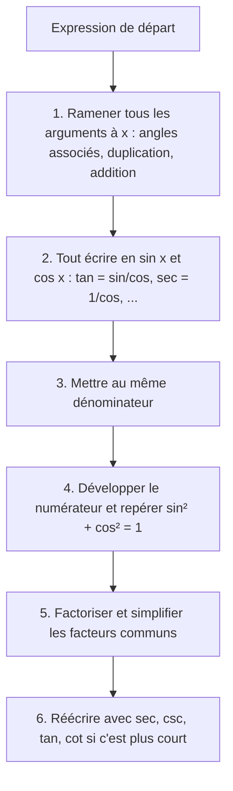
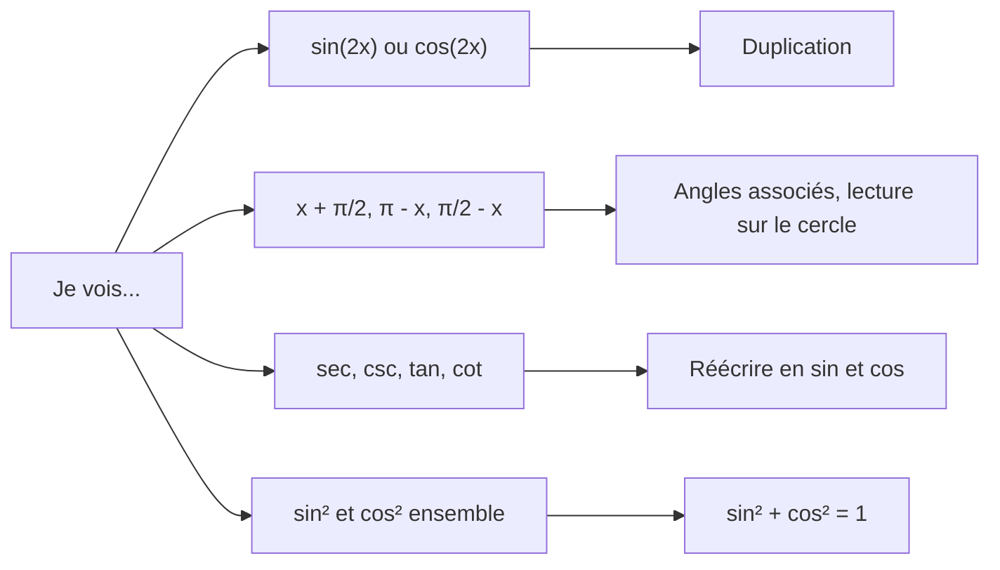

# 4. Identités trigonométriques et simplifications

> 🎯 **Objectif** : transformer une expression trigonométrique pour qu'elle ne contienne plus que l'argument $(x)$, puis la simplifier « avec le moins de caractères possible » (consigne de « Test 1 Pb 3 »), et démontrer des identités.

---

## 1. Introduction & définitions

Une **identité** est une égalité vraie pour **toutes** les valeurs de la variable où les deux membres sont définis (par exemple $\sin^2 x + \cos^2 x = 1$). On s'en sert comme d'outils de réécriture.

### 1.1 Le formulaire indispensable

**Identités de Pythagore**

$$\sin^2 x + \cos^2 x = 1 \qquad 1 + \tan^2 x = \sec^2 x \qquad 1 + \cot^2 x = \csc^2 x$$

**Formules d'addition**

$$\sin(a \pm b) = \sin a\cos b \pm \cos a\sin b$$

$$\cos(a \pm b) = \cos a\cos b \mp \sin a\sin b$$

$$\tan(a \pm b) = \frac{\tan a \pm \tan b}{1 \mp \tan a\tan b}$$

**Formules de duplication** (cas $a = b = x$)

$$\sin(2x) = 2\sin x\cos x$$

$$\cos(2x) = \cos^2 x - \sin^2 x = 2\cos^2 x - 1 = 1 - 2\sin^2 x$$

**Formules de linéarisation** (on les obtient en isolant $\cos^2$ ou $\sin^2$ ci-dessus)

$$\cos^2 x = \frac{1 + \cos(2x)}{2} \qquad \sin^2 x = \frac{1 - \cos(2x)}{2}$$

**Angles associés** (voir le chapitre 2) : par exemple $\sin\left(\frac{\pi}{2} - x\right) = \cos x$, $\cos(\pi - x) = -\cos x$, $\tan\left(x + \frac{\pi}{2}\right) = -\cot x$.

> 💡 La formule $\cos(2x)$ a **trois** versions : choisissez celle qui fait disparaître un terme. S'il y a un « $1 +$ » à côté, $\cos(2x) = 2\cos^2 x - 1$ ou $1 - 2\sin^2 x$ l'absorbe souvent.

### 1.2 Qu'est-ce qu'une expression « la plus simple » ?

Dans les tests, on compte les caractères : $\frac{\sin^2 x}{2}$ compte 7 caractères. On vise donc des résultats comme $2$, $\sec x$, $\frac{1}{2}\cot x$, $-4\sec x\tan x$, $4\cos^4 x$...

---

## 2. Méthodes de résolution

### Méthode générale de simplification

### Démontrer une identité $A = B$

- Partir du membre le **plus compliqué** et le transformer jusqu'à obtenir l'autre.
- Ne **jamais** partir de « $A = B$ » pour aboutir à « $0 = 0$ » en manipulant les deux membres à la fois sans équivalences : c'est une faute de logique.
- Préciser les **propriétés utilisées** à chaque étape (l'énoncé le demande souvent).

---

## 3. Exemples de calculs détaillés

### Exemple 1 — (Test 1 Pb 3, variante A, a)

$$\frac{1 + \cos(2x) - \cos^2 x}{\sin(2x)}$$

**Étape 1 — Argument $x$.** On remplace $\cos(2x) = \cos^2 x - \sin^2 x$ et $\sin(2x) = 2\sin x\cos x$ :

$$= \frac{1 + \cos^2 x - \sin^2 x - \cos^2 x}{2\sin x\cos x} = \frac{1 - \sin^2 x}{2\sin x\cos x}$$

**Étape 2 — Pythagore.** $1 - \sin^2 x = \cos^2 x$ :

$$= \frac{\cos^2 x}{2\sin x\cos x} = \frac{\cos x}{2\sin x} = \frac{1}{2}\cot x$$

### Exemple 2 — (Test 1 Pb 3, variante A, b)

$$\frac{\cos x}{1 - \sin x} - \tan x$$

**Étape 1 — Tout en sinus et cosinus**, puis dénominateur commun $(1 - \sin x)\cos x$ :

$$= \frac{\cos x \cdot \cos x - \sin x(1 - \sin x)}{(1 - \sin x)\cos x} = \frac{\cos^2 x + \sin^2 x - \sin x}{(1 - \sin x)\cos x}$$

**Étape 2 — Pythagore au numérateur** : $\cos^2 x + \sin^2 x = 1$ :

$$= \frac{1 - \sin x}{(1 - \sin x)\cos x} = \frac{1}{\cos x} = \sec x$$

### Exemple 3 — (Test 1 Pb 3, variante A, c)

$$\frac{\tan x - \tan\left(x + \frac{\pi}{2}\right)}{\csc\left(\frac{\pi}{2} - x\right)}$$

**Étape 1 — Angles associés.** $\tan\left(x + \frac{\pi}{2}\right) = -\cot x$ et $\csc\left(\frac{\pi}{2} - x\right) = \frac{1}{\sin\left(\frac{\pi}{2} - x\right)} = \frac{1}{\cos x}$ :

$$= \frac{\tan x + \cot x}{1/\cos x} = \cos x\left(\frac{\sin x}{\cos x} + \frac{\cos x}{\sin x}\right)$$

**Étape 2 — Dénominateur commun** :

$$= \cos x \cdot \frac{\sin^2 x + \cos^2 x}{\sin x\cos x} = \cos x \cdot \frac{1}{\sin x\cos x} = \frac{1}{\sin x} = \csc x$$

### Exemple 4 — Un résultat constant (Test 1 Pb 3, variante D)

$$\left[\sec x + \csc x\right]\cdot\left[\sin x + \cos x\right] - 2\csc(2x)$$

**Étape 1** — Le premier crochet vaut $\frac{1}{\cos x} + \frac{1}{\sin x} = \frac{\sin x + \cos x}{\sin x\cos x}$ et $\csc(2x) = \frac{1}{2\sin x\cos x}$ :

$$= \frac{(\sin x + \cos x)^2}{\sin x\cos x} - \frac{2}{2\sin x\cos x} = \frac{(\sin x + \cos x)^2 - 1}{\sin x\cos x}$$

**Étape 2** — Identité remarquable et Pythagore : $(\sin x + \cos x)^2 = 1 + 2\sin x\cos x$ :

$$= \frac{2\sin x\cos x}{\sin x\cos x} = 2$$

### Exemple 5 — Démontrer une identité (Test 2017)

*Démontrer que $\frac{1 - \cos(2x)}{\sin(2x)} = \tan x$.*

On part du membre de gauche :

$$\frac{1 - \cos(2x)}{\sin(2x)} = \frac{1 - (1 - 2\sin^2 x)}{2\sin x\cos x} = \frac{2\sin^2 x}{2\sin x\cos x} = \frac{\sin x}{\cos x} = \tan x$$

Propriétés utilisées : $\cos(2x) = 1 - 2\sin^2 x$ (duplication, version choisie pour annuler le $1$), $\sin(2x) = 2\sin x\cos x$ (duplication), simplification par $2\sin x \neq 0$.

---

## 4. Visualisation : quelle formule choisir ?

---

## 5. Exercices pratiques

### Exercice 1 — (Test 1 Pb 3, variante D, a)

Simplifier $\dfrac{1 - \sin x}{1 + \sin x} - \dfrac{1 + \sin x}{1 - \sin x}$.

💡 Cliquez pour voir l'indice

Le dénominateur commun est $(1 + \sin x)(1 - \sin x) = 1 - \sin^2 x = \cos^2 x$. Au numérateur, développez les deux carrés.

**Solution détaillée**

1. Dénominateur commun :

$$\frac{(1 - \sin x)^2 - (1 + \sin x)^2}{(1 + \sin x)(1 - \sin x)}$$

2. Numérateur : $(1 - 2\sin x + \sin^2 x) - (1 + 2\sin x + \sin^2 x) = -4\sin x$.
3. Dénominateur : $1 - \sin^2 x = \cos^2 x$.
4. Résultat :

$$\frac{-4\sin x}{\cos^2 x} = -4 \cdot \frac{1}{\cos x}\cdot\frac{\sin x}{\cos x} = -4\sec x\tan x$$

### Exercice 2 — (Test 1 Pb 3, variante B, b)

Simplifier $\left[2\cos x + \sin(2x)\right]\cdot\left[2\cos x - \sin(2x)\right]$.

💡 Cliquez pour voir l'indice

Reconnaissez $(a + b)(a - b) = a^2 - b^2$, puis écrivez $\sin(2x) = 2\sin x\cos x$ et factorisez par $4\cos^2 x$.

**Solution détaillée**

1. Identité remarquable : $= 4\cos^2 x - \sin^2(2x)$.
2. Duplication : $\sin^2(2x) = 4\sin^2 x\cos^2 x$.
3. Factorisation :

$$4\cos^2 x - 4\sin^2 x\cos^2 x = 4\cos^2 x\left(1 - \sin^2 x\right) = 4\cos^2 x \cdot \cos^2 x = 4\cos^4 x$$

### Exercice 3 — (Test 1 Pb 3, variante C)

Simplifier a) $\dfrac{1 - \cos(2x) - \sin^2 x}{1 - \sin^2 x}$ et b) $\dfrac{\sec x + \csc x}{1 + \tan x}$.

💡 Cliquez pour voir l'indice

a) Utilisez $\cos(2x) = 1 - 2\sin^2 x$ pour annuler le $1$. b) Écrivez tout en sinus et cosinus, puis simplifiez la « fraction de fractions ».

**Solution détaillée**

a) Numérateur : $1 - (1 - 2\sin^2 x) - \sin^2 x = \sin^2 x$ ; dénominateur : $\cos^2 x$. Donc :

$$\frac{\sin^2 x}{\cos^2 x} = \tan^2 x$$

b) Numérateur : $\frac{1}{\cos x} + \frac{1}{\sin x} = \frac{\sin x + \cos x}{\sin x\cos x}$. Dénominateur : $1 + \frac{\sin x}{\cos x} = \frac{\cos x + \sin x}{\cos x}$. En divisant :

$$\frac{\sin x + \cos x}{\sin x\cos x}\cdot\frac{\cos x}{\sin x + \cos x} = \frac{1}{\sin x} = \csc x$$
