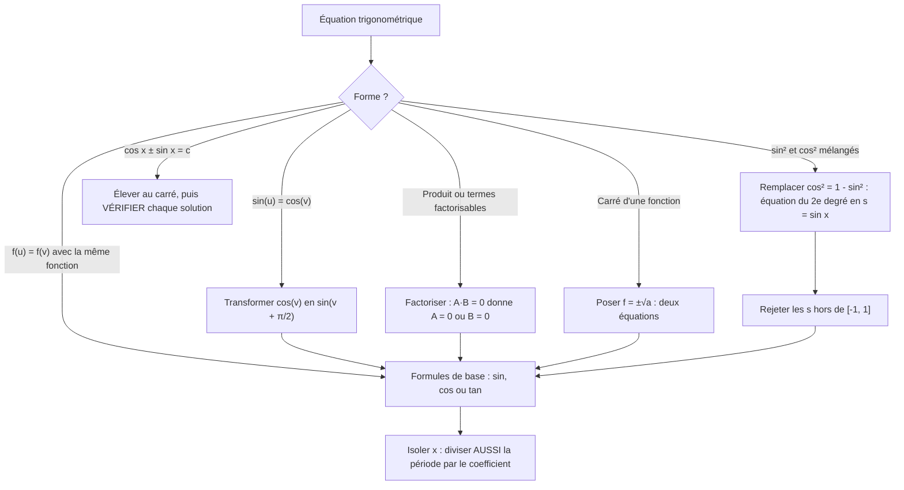
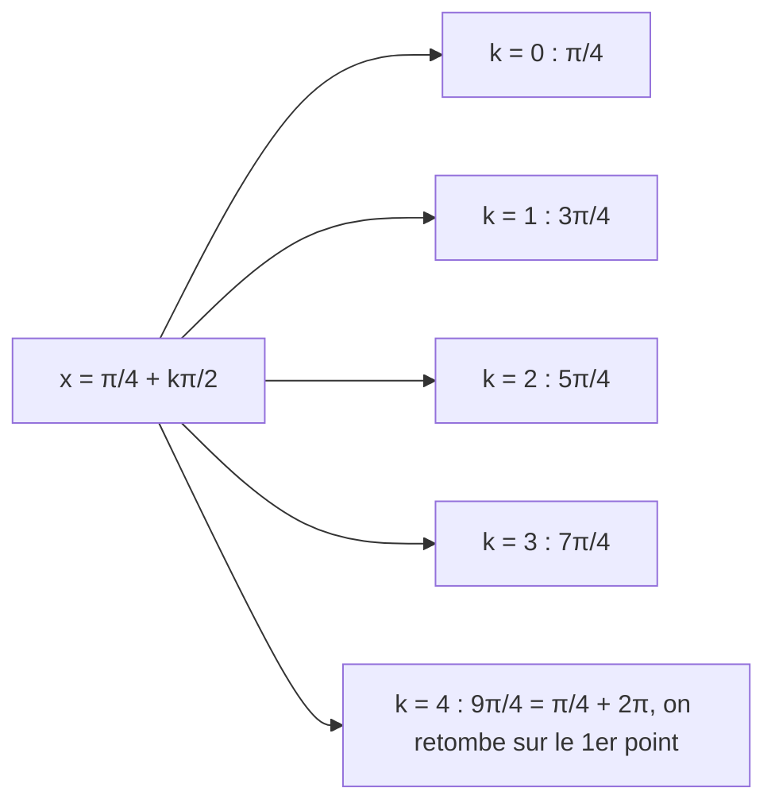

# 5. Équations trigonométriques

> 🎯 **Objectif** : trouver **toutes** les solutions réelles d'une équation trigonométrique (avec le $$+2k\pi$$ ou $$+k\pi$$), les représenter sur le cercle, et éviter les solutions parasites. C'est « Test 1 Pb 4 » et l'exercice « Équation trigonométrique » de chaque TE F-1.

---

## 1. Introduction & définitions

Les fonctions trigonométriques sont **périodiques** : une équation comme $$\sin x = \frac{1}{2}$$ a une **infinité** de solutions. On les décrit par des **familles** de la forme $$x = x_0 + 2k\pi$$, $$k \in \mathbb{Z}$$.

### 1.1 Les trois équations de base

À partir du cercle trigonométrique :

**Sinus** — deux points du cercle ont la même ordonnée, symétriques par rapport à l'axe $$Oy$$ :

$$\sin u = \sin v \iff u = v + 2k\pi \quad \text{ou} \quad u = \pi - v + 2k\pi, \quad k \in \mathbb{Z}$$

**Cosinus** — deux points ont la même abscisse, symétriques par rapport à l'axe $$Ox$$ :

$$\cos u = \cos v \iff u = v + 2k\pi \quad \text{ou} \quad u = -v + 2k\pi, \quad k \in \mathbb{Z}$$

**Tangente** — période $$\pi$$, une seule famille :

$$\tan u = \tan v \iff u = v + k\pi, \quad k \in \mathbb{Z}$$

### 1.2 Cas particuliers à connaître

| Équation | Solutions |
| --- | --- |
| $$\sin u = 0$$ | $$u = k\pi$$ |
| $$\cos u = 0$$ | $$u = \frac{\pi}{2} + k\pi$$ |
| $$\sin u = 1$$ | $$u = \frac{\pi}{2} + 2k\pi$$ |
| $$\cos u = -1$$ | $$u = \pi + 2k\pi$$ |
| $$\sin u = a$$ avec $$a > 1$$ ou $$a < -1$$ | **aucune** solution |

### 1.3 Passer d'une fonction à l'autre

Pour obtenir une équation « du même type » des deux côtés, on utilise :

$$\cos\theta = \sin\left(\theta + \frac{\pi}{2}\right) \qquad \sin\theta = \cos\left(\frac{\pi}{2} - \theta\right) \qquad -\sin\theta = \sin(-\theta)$$

---

## 2. Méthodes de résolution

### Points de vigilance

1. **Diviser la période** : si $$3x = \frac{\pi}{2} + 2k\pi$$, alors $$x = \frac{\pi}{6} + \frac{2k\pi}{3}$$. La période est divisée elle aussi !
2. **Ne pas diviser par une fonction qui peut s'annuler** : dans $$\sin(2x) = \sin x$$, on **factorise** par $$\sin x$$ au lieu de simplifier, sinon on perd les solutions $$\sin x = 0$$.
3. **Hypothèses de définition** : dès que $$\tan x$$ ou $$\frac{1}{\cos x}$$ apparaît, noter « hypothèse $$\cos x \neq 0$$ » et vérifier que les solutions la respectent.
4. **Élévation au carré** : elle crée des solutions parasites. Il faut tester chaque famille dans l'équation de départ.

### Représenter les solutions sur le cercle

Une famille $$x = x_0 + \frac{2k\pi}{n}$$ donne **$$n$$ points** régulièrement espacés sur le cercle (un polygone régulier). Par exemple $$x = \frac{\pi}{4} + \frac{k\pi}{2}$$ donne 4 points : $$\frac{\pi}{4}$$, $$\frac{3\pi}{4}$$, $$\frac{5\pi}{4}$$, $$\frac{7\pi}{4}$$.

---

## 3. Exemples de calculs détaillés

### Exemple 1 — Sinus contre cosinus (Test 1 Pb 4, variante A, a)

$$\sin\left(2x + \frac{\pi}{3}\right) - \cos\left(x + \frac{\pi}{2}\right) = 0$$

**Étape 1 — Même fonction des deux côtés.** $$\cos\theta = \sin\left(\theta + \frac{\pi}{2}\right)$$ donne :

$$\sin\left(2x + \frac{\pi}{3}\right) = \sin\left(x + \frac{\pi}{2} + \frac{\pi}{2}\right) = \sin(x + \pi)$$

**Étape 2 — Formule du sinus, première famille :**

$$2x + \frac{\pi}{3} = x + \pi + 2k\pi \iff x = \frac{2\pi}{3} + 2k\pi$$

**Étape 3 — Deuxième famille :**

$$2x + \frac{\pi}{3} = \pi - (x + \pi) + 2k\pi = -x + 2k\pi \iff 3x = -\frac{\pi}{3} + 2k\pi \iff x = -\frac{\pi}{9} + \frac{2k\pi}{3}$$

$$S = \left\{\frac{2\pi}{3} + 2k\pi \;;\; -\frac{\pi}{9} + \frac{2k\pi}{3} \;\middle|\; k \in \mathbb{Z}\right\}$$

### Exemple 2 — Un carré (Test 1 Pb 4, variante A, b)

$$\cot^2\left(3x + \frac{\pi}{6}\right) = 3$$

**Étape 1** — On prend la racine **avec les deux signes** : $$\cot\left(3x + \frac{\pi}{6}\right) = \sqrt{3}$$ ou $$-\sqrt{3}$$.

**Étape 2** — Comme $$\cot$$ a une période $$\pi$$ :

- $$\cot u = \sqrt{3} \iff u = \frac{\pi}{6} + k\pi$$ ; donc $$3x + \frac{\pi}{6} = \frac{\pi}{6} + k\pi$$, soit $$x = \frac{k\pi}{3}$$.
- $$\cot u = -\sqrt{3} \iff u = \frac{5\pi}{6} + k\pi$$ ; donc $$3x = \frac{2\pi}{3} + k\pi$$, soit $$x = \frac{2\pi}{9} + \frac{k\pi}{3}$$.

$$S = \left\{\frac{k\pi}{3} \;;\; \frac{2\pi}{9} + \frac{k\pi}{3} \;\middle|\; k \in \mathbb{Z}\right\}$$

### Exemple 3 — Factorisation (Test 1 Pb 4, variante A, c)

$$\sin(2x) - \tan x = 0 \qquad \text{hypothèse : } \cos x \neq 0$$

**Étape 1 — Argument $$x$$** : $$2\sin x\cos x - \frac{\sin x}{\cos x} = 0$$.

**Étape 2 — Factoriser** (surtout pas diviser !) par $$\sin x$$ :

$$\sin x\left(2\cos x - \frac{1}{\cos x}\right) = 0$$

**Étape 3 — Produit nul** :

- $$\sin x = 0 \iff x = k\pi$$ (et $$\cos(k\pi) = \pm 1 \neq 0$$ ✓).
- $$2\cos x = \frac{1}{\cos x} \iff \cos^2 x = \frac{1}{2} \iff \cos x = \pm\frac{\sqrt{2}}{2}$$, ce qui donne les 4 angles $$\pm\frac{\pi}{4}$$, $$\pm\frac{3\pi}{4}$$ modulo $$2\pi$$, qu'on regroupe en $$x = \frac{\pi}{4} + \frac{k\pi}{2}$$.

$$S = \left\{k\pi \;;\; \frac{\pi}{4} + \frac{k\pi}{2} \;\middle|\; k \in \mathbb{Z}\right\}$$

### Exemple 4 — Équation du second degré en $$\sin x$$ (Test 2017)

$$2\cos^2 x + 3\sin x = 0$$

**Étape 1 — Une seule fonction** : $$\cos^2 x = 1 - \sin^2 x$$, d'où $$2 - 2\sin^2 x + 3\sin x = 0$$.

**Étape 2 — Changement de variable** $$s = \sin x$$ : $$2s^2 - 3s - 2 = 0$$, de discriminant $$\Delta = 9 + 16 = 25$$ :

$$s = \frac{3 \pm 5}{4} \quad\Rightarrow\quad s = 2 \quad \text{ou} \quad s = -\frac{1}{2}$$

**Étape 3 — Tri** : $$\sin x = 2$$ est impossible (un sinus reste dans $$[-1, 1]$$). Reste $$\sin x = -\frac{1}{2} = \sin\left(-\frac{\pi}{6}\right)$$ :

$$x = -\frac{\pi}{6} + 2k\pi \quad \text{ou} \quad x = \pi + \frac{\pi}{6} + 2k\pi = \frac{7\pi}{6} + 2k\pi$$

### Exemple 5 — Solutions parasites (TE F-1, 2023)

$$\cos x - \sin x = 1$$

**Étape 1 — Élever au carré** : $$\cos^2 x - 2\sin x\cos x + \sin^2 x = 1 \iff 1 - \sin(2x) = 1 \iff \sin(2x) = 0$$.

**Étape 2** : $$2x = k\pi$$, soit $$x = \frac{k\pi}{2}$$. Sur un tour, candidats : $$0$$, $$\frac{\pi}{2}$$, $$\pi$$, $$\frac{3\pi}{2}$$.

**Étape 3 — Vérifier dans l'équation de départ** :

| $$x$$ | $$\cos x - \sin x$$ | Solution ? |
| --- | --- | --- |
| $$0$$ | $$1 - 0 = 1$$ | ✓ |
| $$\frac{\pi}{2}$$ | $$0 - 1 = -1$$ | ✗ |
| $$\pi$$ | $$-1 - 0 = -1$$ | ✗ |
| $$\frac{3\pi}{2}$$ | $$0 - (-1) = 1$$ | ✓ |

$$S = \left\{2k\pi \;;\; \frac{3\pi}{2} + 2k\pi \;\middle|\; k \in \mathbb{Z}\right\}$$

Le carré avait introduit les solutions de $$\cos x - \sin x = -1$$ : il fallait les éliminer.

### Exemple 6 — Valeur non remarquable (TE F-1, 2025)

$$4\cos(2x) + 1 = 0 \iff \cos(2x) = -\frac{1}{4}$$

$$-\frac{1}{4}$$ n'est pas une valeur remarquable : on garde $$\arccos$$ (calculatrice autorisée au TE) :

$$2x = \pm\arccos\left(-\frac{1}{4}\right) + 2k\pi \iff x = \pm\frac{1}{2}\arccos\left(-\frac{1}{4}\right) + k\pi \approx \pm 0{,}912 + k\pi$$

---

## 4. Visualisation : de l'équation aux points du cercle

Le nombre de points distincts vaut $$\frac{2\pi}{\text{période de la famille}}$$ ; ici $$\frac{2\pi}{\pi/2} = 4$$ : un carré inscrit dans le cercle.

---

## 5. Exercices pratiques

### Exercice 1 — (TE 2017)

Résoudre dans $$\mathbb{R}$$ : $$\cos(4x) = \sin x$$.

💡 Cliquez pour voir l'indice

Écrivez $$\sin x = \cos\left(\frac{\pi}{2} - x\right)$$, puis utilisez $$\cos u = \cos v \iff u = \pm v + 2k\pi$$.

**Solution détaillée**

1. $$\cos(4x) = \cos\left(\frac{\pi}{2} - x\right)$$.
2. Première famille : $$4x = \frac{\pi}{2} - x + 2k\pi \iff 5x = \frac{\pi}{2} + 2k\pi \iff x = \frac{\pi}{10} + \frac{2k\pi}{5}$$.
3. Deuxième famille : $$4x = -\frac{\pi}{2} + x + 2k\pi \iff 3x = -\frac{\pi}{2} + 2k\pi \iff x = -\frac{\pi}{6} + \frac{2k\pi}{3}$$.

$$S = \left\{\frac{\pi}{10} + \frac{2k\pi}{5} \;;\; -\frac{\pi}{6} + \frac{2k\pi}{3} \;\middle|\; k \in \mathbb{Z}\right\}$$

### Exercice 2 — (Test 1 Pb 4, variante C)

Résoudre $$\sec^2\left(4x + \frac{\pi}{6}\right) = 2$$.

💡 Cliquez pour voir l'indice

$$\sec^2 u = 2 \iff \cos^2 u = \frac{1}{2} \iff \cos u = \pm\frac{\sqrt{2}}{2}$$. Les quatre angles correspondants sur un tour s'écrivent en une seule famille de période $$\frac{\pi}{2}$$.

**Solution détaillée**

1. $$\cos^2\left(4x + \frac{\pi}{6}\right) = \frac{1}{2}$$, donc $$\cos\left(4x + \frac{\pi}{6}\right) = \pm\frac{\sqrt{2}}{2}$$.
2. Les angles $$u$$ vérifiant $$\cos u = \pm\frac{\sqrt{2}}{2}$$ sont $$\frac{\pi}{4}, \frac{3\pi}{4}, \frac{5\pi}{4}, \frac{7\pi}{4}$$ modulo $$2\pi$$, c'est-à-dire $$u = \frac{\pi}{4} + \frac{k\pi}{2}$$.
3. On isole $$x$$ :

$$4x + \frac{\pi}{6} = \frac{\pi}{4} + \frac{k\pi}{2} \iff 4x = \frac{\pi}{12} + \frac{k\pi}{2} \iff x = \frac{\pi}{48} + \frac{k\pi}{8}, \quad k \in \mathbb{Z}$$

### Exercice 3 — (TE F-1, 2022)

Résoudre $$\frac{1}{3}\tan^2(2x) - 1 = 0$$, puis représenter les solutions sur le cercle trigonométrique.

💡 Cliquez pour voir l'indice

Isolez $$\tan^2(2x) = 3$$, prenez $$\tan(2x) = \pm\sqrt{3}$$ et n'oubliez pas que la période de la tangente est $$\pi$$ (qui devient $$\frac{\pi}{2}$$ après division par 2).

**Solution détaillée**

1. $$\tan^2(2x) = 3 \iff \tan(2x) = \sqrt{3}$$ ou $$\tan(2x) = -\sqrt{3}$$.
2. $$\tan(2x) = \sqrt{3} \iff 2x = \frac{\pi}{3} + k\pi \iff x = \frac{\pi}{6} + \frac{k\pi}{2}$$.
3. $$\tan(2x) = -\sqrt{3} \iff 2x = -\frac{\pi}{3} + k\pi \iff x = -\frac{\pi}{6} + \frac{k\pi}{2}$$.

$$S = \left\{\pm\frac{\pi}{6} + \frac{k\pi}{2} \;\middle|\; k \in \mathbb{Z}\right\}$$

4. Sur le cercle : chaque famille donne 4 points (période $$\frac{\pi}{2}$$), soit 8 points : $$\frac{\pi}{6}, \frac{2\pi}{3}, \frac{7\pi}{6}, \frac{5\pi}{3}$$ et $$\frac{\pi}{3}, \frac{5\pi}{6}, \frac{4\pi}{3}, \frac{11\pi}{6}$$.
5. Hypothèse de définition : $$\cos(2x) \neq 0$$. Aucune de ces valeurs ne l'annule ✓.
