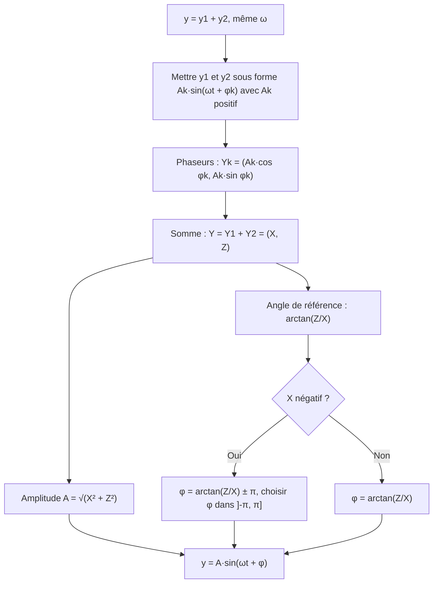

# 6. Oscillations harmoniques et phaseurs

> 🎯 **Objectif** : lire et tracer un signal $y(t) = A\sin(\omega t + \varphi)$, déterminer amplitude, période, fréquence et déphasage, et **additionner deux oscillations** grâce aux phaseurs. C'est « Test 2 Pb 1 » et l'exercice « Oscillations / Superposition » de chaque TE F-1.

---

## 1. Introduction & définitions

### 1.1 Le modèle sinusoïdal

Un **signal harmonique** (ou sinusoïdal) s'écrit :

$$y(t) = A\sin(\omega t + \varphi)$$

| Symbole | Nom | Unité | Lecture sur le graphe |
| --- | --- | --- | --- |
| $A > 0$ | amplitude | unité de $y$ | hauteur d'un sommet par rapport à l'axe |
| $\omega > 0$ | vitesse (pulsation) angulaire | rad/s | $\omega = \frac{2\pi}{T}$ |
| $T$ | période | s | distance entre deux sommets |
| $f$ | fréquence | Hz | $f = \frac{1}{T} = \frac{\omega}{2\pi}$ |
| $\varphi$ | angle de phase (phase initiale) | rad | position du « départ » |

Le **départ** d'un sinus est le point où la courbe **coupe l'axe en montant** (pour $\sin$, c'est l'angle $0$).

### 1.2 Déphasage : avance et retard

On peut écrire $y(t) = A\sin\left(\omega\left(t + \frac{\varphi}{\omega}\right)\right)$. Le signal est donc le sinus de base **décalé dans le temps** de :

$$\Delta t = \frac{\varphi}{\omega}$$

- Si $\varphi > 0$, le départ a lieu en $t = -\frac{\varphi}{\omega} < 0$ : le signal est **en avance** de $\frac{\varphi}{\omega}$.
- Si $\varphi < 0$, le départ a lieu en $t > 0$ : le signal est **en retard**.

Comme $\varphi$ est défini à $2\pi$ près, un même signal a une avance **et** un retard équivalents (différant d'une période $T$).

> 💡 **Règle pratique** : lire sur le graphe l'abscisse $t_0$ d'un départ, puis $\varphi = -\omega\, t_0$.

### 1.3 Convertir un cosinus en sinus

Pour mettre un signal sous la forme standard $A\sin(\omega t + \varphi)$ avec $A > 0$ :

$$\cos\theta = \sin\left(\theta + \frac{\pi}{2}\right) \qquad -\sin\theta = \sin(\theta + \pi) \qquad -\cos\theta = \sin\left(\theta - \frac{\pi}{2}\right)$$

### 1.4 Les phaseurs

À chaque oscillation $A\sin(\omega t + \varphi)$ on associe un vecteur du plan, le **phaseur** :

$$\vec{Y} = \begin{pmatrix} A\cos\varphi \\ A\sin\varphi \end{pmatrix}$$

C'est un vecteur de longueur $A$ faisant l'angle $\varphi$ avec l'axe horizontal. **Propriété fondamentale** : pour deux signaux de **même pulsation $\omega$**, le phaseur de la somme est la somme des phaseurs. On additionne donc des oscillations comme on additionne des vecteurs.

Si $y_1 + y_2 = A\sin(\omega t + \varphi)$ :

$$A\cos\varphi = A_1\cos\varphi_1 + A_2\cos\varphi_2 \qquad A\sin\varphi = A_1\sin\varphi_1 + A_2\sin\varphi_2$$

$$A = \sqrt{(A\cos\varphi)^2 + (A\sin\varphi)^2} \qquad \tan\varphi = \frac{A\sin\varphi}{A\cos\varphi}$$

Formule directe équivalente (loi des cosinus) :

$$A^2 = A_1^2 + A_2^2 + 2A_1A_2\cos(\varphi_1 - \varphi_2)$$

> ⚠️ **Le piège du quadrant** : $\arctan$ renvoie un angle de $\left]-\frac{\pi}{2}, \frac{\pi}{2}\right[$. Si la composante horizontale $A\cos\varphi$ est **négative**, le phaseur est au quadrant II ou III et il faut **ajouter ou retrancher $\pi$**.

---

## 2. Méthodes de résolution

### Méthode A — Lire les caractéristiques sur un graphe

1. **Amplitude** $A$ : hauteur maximale.
2. **Période** $T$ : distance entre deux sommets (ou deux départs).
3. $\omega = \frac{2\pi}{T}$ et $f = \frac{1}{T}$.
4. **Départ** : repérer $t_0$ où la courbe coupe l'axe en montant (le plus proche de $0$).
5. $\varphi = -\omega t_0$ ; avance si $t_0 < 0$, retard si $t_0 > 0$.

### Méthode B — Tracer $y(t) = A\sin(\omega t + \varphi)$

1. Calculer $T = \frac{2\pi}{\omega}$ et le départ $t_0 = -\frac{\varphi}{\omega}$.
2. Placer le départ, puis les points clés tous les quarts de période : départ ($0$), sommet ($A$), zéro descendant ($0$), creux ($-A$), nouveau départ.
3. Choisir la grille adaptée : axe gradué en multiples de $\pi$ si $T$ contient $\pi$, en entiers sinon.

### Méthode C — Superposition de deux oscillations

---

## 3. Exemples de calculs détaillés

### Exemple 1 — Lecture de graphe (Test 2 Pb 1, variante A)

*Un signal oscille entre $-3$ et $3$ ; on lit deux départs consécutifs (passages par $0$ en montant) en $t = -1$ et $t = 4$.*

- Amplitude : $A = 3$.
- Période : distance entre deux départs, $T = 4 - (-1) = 5$ s, donc $\omega = \frac{2\pi}{5}$ rad/s et $f = \frac{1}{5} = 0{,}2$ Hz.
- Départ le plus proche de $0$ : $t_0 = -1$, d'où $\varphi = -\omega t_0 = \frac{2\pi}{5}$.
- Le signal est **en avance de 1 s** (ou, de manière équivalente, en retard de $4$ s si l'on utilise le départ $t_0 = 4$, avec $\varphi = -\frac{8\pi}{5}$).

$$y(t) = 3\sin\left(\frac{2\pi}{5}t + \frac{2\pi}{5}\right)$$

Contrôle : le sommet suit le départ d'un quart de période, en $t = -1 + \frac{5}{4} = 0{,}25$ ; et $y(0) = 3\sin\left(\frac{2\pi}{5}\right) \approx 2{,}85$, juste sous le sommet. C'est bien ce que montre le graphe ✓.

### Exemple 2 — Tracer un signal (Test 2 Pb 1, variante A)

*Tracer $y(t) = 2\sin\left(\frac{3}{2}t - \frac{9\pi}{8}\right)$.*

1. $\omega = \frac{3}{2}$ rad/s, donc $T = \frac{2\pi}{3/2} = \frac{4\pi}{3}$ s : on choisit la grille graduée en multiples de $\pi$.
2. Départ : $t_0 = -\frac{\varphi}{\omega} = \frac{9\pi/8}{3/2} = \frac{3\pi}{4}$ (retard). Un départ plus proche de $0$ : $\frac{3\pi}{4} - \frac{4\pi}{3} = -\frac{7\pi}{12}$.
3. Quart de période : $\frac{T}{4} = \frac{\pi}{3}$. À partir de $t_0 = -\frac{7\pi}{12}$ : sommet $y = 2$ en $-\frac{\pi}{4}$, zéro descendant en $\frac{\pi}{12}$, creux $y = -2$ en $\frac{5\pi}{12}$, nouveau départ en $\frac{3\pi}{4}$.

### Exemple 3 — Superposition (Test 2 Pb 1, variante A)

*$y_1(t) = 2\sin\left(\frac{2\pi}{7}t - \frac{\pi}{6}\right)$ et $y_2(t) = 4\sin\left(\frac{2\pi}{7}t - \frac{5\pi}{6}\right)$. Écrire $y_1 + y_2$ sous la forme $A\sin(\omega t + \varphi)$.*

**Étape 1 — Composantes des phaseurs.**

$$X = 2\cos\left(-\frac{\pi}{6}\right) + 4\cos\left(-\frac{5\pi}{6}\right) = 2\cdot\frac{\sqrt{3}}{2} + 4\cdot\left(-\frac{\sqrt{3}}{2}\right) = \sqrt{3} - 2\sqrt{3} = -\sqrt{3}$$

$$Z = 2\sin\left(-\frac{\pi}{6}\right) + 4\sin\left(-\frac{5\pi}{6}\right) = 2\cdot\left(-\frac{1}{2}\right) + 4\cdot\left(-\frac{1}{2}\right) = -3$$

**Étape 2 — Amplitude.**

$$A = \sqrt{(-\sqrt{3})^2 + (-3)^2} = \sqrt{3 + 9} = \sqrt{12} = 2\sqrt{3}$$

**Étape 3 — Phase.** $\tan\varphi = \frac{-3}{-\sqrt{3}} = \sqrt{3}$, donc l'angle de référence est $\frac{\pi}{3}$. Mais $X < 0$ et $Z < 0$ : le phaseur est au **quadrant III**. On retranche $\pi$ :

$$\varphi = \frac{\pi}{3} - \pi = -\frac{2\pi}{3}$$

$$y_1(t) + y_2(t) = 2\sqrt{3}\sin\left(\frac{2\pi}{7}t - \frac{2\pi}{3}\right)$$

### Exemple 4 — Mélange sinus et cosinus (TE F-1, 2025)

*Exprimer $y(t) = \cos\left(\pi t + \frac{\pi}{6}\right) - 2\sin\left(-\pi t + \frac{\pi}{2}\right)$ sous la forme $A\sin(\omega t + \varphi)$ avec $\varphi \in \left]-\pi, \pi\right]$.*

**Étape 1 — Forme standard pour chaque terme.**

- $y_1 = \cos\left(\pi t + \frac{\pi}{6}\right) = \sin\left(\pi t + \frac{\pi}{6} + \frac{\pi}{2}\right) = \sin\left(\pi t + \frac{2\pi}{3}\right)$ : $A_1 = 1$, $\varphi_1 = \frac{2\pi}{3}$.
- $\sin\left(\frac{\pi}{2} - \pi t\right) = \cos(\pi t)$, donc $y_2 = -2\cos(\pi t) = 2\sin\left(\pi t - \frac{\pi}{2}\right)$ : $A_2 = 2$, $\varphi_2 = -\frac{\pi}{2}$.

**Étape 2 — Phaseurs.**

$$\vec{Y}_1 = \begin{pmatrix} \cos\frac{2\pi}{3} \\ \sin\frac{2\pi}{3} \end{pmatrix} = \begin{pmatrix} -\frac{1}{2} \\ \frac{\sqrt{3}}{2} \end{pmatrix} \qquad \vec{Y}_2 = \begin{pmatrix} 0 \\ -2 \end{pmatrix} \qquad \vec{Y} = \begin{pmatrix} -\frac{1}{2} \\ \frac{\sqrt{3}}{2} - 2 \end{pmatrix} \approx \begin{pmatrix} -0{,}5 \\ -1{,}134 \end{pmatrix}$$

**Étape 3 — Amplitude et phase.**

$$A = \sqrt{\frac{1}{4} + \left(\frac{\sqrt{3}}{2} - 2\right)^2} = \sqrt{5 - 2\sqrt{3}} \approx 1{,}24$$

Le phaseur est au quadrant III ($X < 0$, $Z < 0$) : $\arctan\left(\frac{-1{,}134}{-0{,}5}\right) \approx 1{,}155$, puis $\varphi \approx 1{,}155 - \pi \approx -1{,}99$ rad.

$$y(t) \approx 1{,}24\sin(\pi t - 1{,}99)$$

### Exemple 5 — Le ressort (TE F-1, 2022)

*$d(t) = 10\cos\left(\frac{\pi}{6}t + \varphi - \frac{\pi}{2}\right)$ (en cm). À $t = 0$, $d = 5$ et la masse **descend**. Trouver $\varphi$, puis $A$, $T$, $f$ et le déphasage.*

**Étape 1 — Simplifier** : $\cos\left(\theta - \frac{\pi}{2}\right) = \sin\theta$, donc $d(t) = 10\sin\left(\frac{\pi}{6}t + \varphi\right)$.

**Étape 2 — Condition initiale** : $10\sin\varphi = 5 \iff \sin\varphi = \frac{1}{2}$, donc $\varphi = \frac{\pi}{6}$ ou $\varphi = \frac{5\pi}{6}$.

**Étape 3 — Sens du mouvement.** « Descendre » signifie que $d$ **diminue**. Juste après $t = 0$, l'argument $\frac{\pi}{6}t + \varphi$ augmente à partir de $\varphi$ : $d$ diminue si le point du cercle est dans la partie où le sinus décroît, soit $\cos\varphi < 0$. Donc $\varphi = \frac{5\pi}{6}$.

**Étape 4 — Caractéristiques.**

$$A = 10 \text{ cm} \qquad T = \frac{2\pi}{\pi/6} = 12 \text{ s} \qquad f = \frac{1}{12} \text{ Hz} \qquad t_0 = -\frac{\varphi}{\omega} = -\frac{5\pi/6}{\pi/6} = -5 \text{ s}$$

Le signal est en avance de 5 s (départ en $t = -5$, sommet en $t = -2$, zéro descendant en $t = 1$).

---

## 4. Visualisation : les quatre points clés d'une période

---

## 5. Exercices pratiques

### Exercice 1 — Lire un signal

Un signal sinusoïdal a des sommets de hauteur $2$ en $t = 1$ s et $t = 7$ s (et aucun entre les deux). Déterminer $A$, $T$, $\omega$, $f$, $\varphi$ (dans $\left]-\pi, \pi\right]$) et l'expression $y(t)$.

💡 Cliquez pour voir l'indice

Le départ se situe un quart de période **avant** un sommet. Ensuite $\varphi = -\omega t_0$.

**Solution détaillée**

1. $A = 2$ ; deux sommets consécutifs sont séparés d'une période : $T = 6$ s.
2. $\omega = \frac{2\pi}{6} = \frac{\pi}{3}$ rad/s ; $f = \frac{1}{6}$ Hz.
3. Départ : $t_0 = 1 - \frac{T}{4} = 1 - 1{,}5 = -0{,}5$ s.
4. $\varphi = -\omega t_0 = \frac{\pi}{3}\cdot 0{,}5 = \frac{\pi}{6}$ (avance de $0{,}5$ s).

$$y(t) = 2\sin\left(\frac{\pi}{3}t + \frac{\pi}{6}\right)$$

Vérification : $y(1) = 2\sin\left(\frac{\pi}{3} + \frac{\pi}{6}\right) = 2\sin\frac{\pi}{2} = 2$ ✓.

### Exercice 2 — Superposition (Test 2 Pb 1, variante C)

Écrire $y_1 + y_2$ sous la forme $A\sin(\omega t + \varphi)$ pour $y_1(t) = 2\sin\left(\frac{t}{3} + \frac{2\pi}{3}\right)$ et $y_2(t) = 4\sin\left(\frac{t}{3} - \frac{2\pi}{3}\right)$.

💡 Cliquez pour voir l'indice

Calculez $X = 2\cos\frac{2\pi}{3} + 4\cos\left(-\frac{2\pi}{3}\right)$ et $Z = 2\sin\frac{2\pi}{3} + 4\sin\left(-\frac{2\pi}{3}\right)$. Attention au signe de $X$.

**Solution détaillée**

1. $X = 2\left(-\frac{1}{2}\right) + 4\left(-\frac{1}{2}\right) = -3$.
2. $Z = 2\cdot\frac{\sqrt{3}}{2} + 4\left(-\frac{\sqrt{3}}{2}\right) = \sqrt{3} - 2\sqrt{3} = -\sqrt{3}$.
3. $A = \sqrt{9 + 3} = 2\sqrt{3}$.
4. $\tan\varphi = \frac{-\sqrt{3}}{-3} = \frac{\sqrt{3}}{3}$, angle de référence $\frac{\pi}{6}$ ; quadrant III ($X < 0$, $Z < 0$), donc $\varphi = \frac{\pi}{6} - \pi = -\frac{5\pi}{6}$.

$$y_1 + y_2 = 2\sqrt{3}\sin\left(\frac{t}{3} - \frac{5\pi}{6}\right)$$

### Exercice 3 — Deux ondes (Test 2017)

Soient $f(t) = -\sin(4t)$ et $g(t) = 2\cos\left(4t + \frac{\pi}{6}\right)$. a) Écrire $f$ et $g$ sous la forme $A\sin(4t + \varphi)$. b) Écrire $h = f + g$ sous cette forme.

💡 Cliquez pour voir l'indice

$-\sin\theta = \sin(\theta + \pi)$ et $\cos\theta = \sin\left(\theta + \frac{\pi}{2}\right)$. Pour b), la formule $A^2 = A_1^2 + A_2^2 + 2A_1A_2\cos(\varphi_1 - \varphi_2)$ est rapide.

**Solution détaillée**

a) $f(t) = \sin(4t + \pi)$ : $A_1 = 1$, $\varphi_1 = \pi$. Et $g(t) = 2\sin\left(4t + \frac{\pi}{6} + \frac{\pi}{2}\right) = 2\sin\left(4t + \frac{2\pi}{3}\right)$ : $A_2 = 2$, $\varphi_2 = \frac{2\pi}{3}$.

b) Amplitude :

$$A^2 = 1 + 4 + 2\cdot 1\cdot 2\cos\left(\pi - \frac{2\pi}{3}\right) = 5 + 4\cos\frac{\pi}{3} = 5 + 2 = 7 \quad\Rightarrow\quad A = \sqrt{7}$$

Phase par les composantes : $X = \cos\pi + 2\cos\frac{2\pi}{3} = -1 - 1 = -2$ et $Z = \sin\pi + 2\sin\frac{2\pi}{3} = \sqrt{3}$. On vérifie $X^2 + Z^2 = 4 + 3 = 7$ ✓. Quadrant II ($X < 0$, $Z > 0$) :

$$\varphi = \arctan\left(\frac{\sqrt{3}}{-2}\right) + \pi \approx -0{,}714 + \pi \approx 2{,}43 \text{ rad}$$

$$h(t) = \sqrt{7}\sin(4t + 2{,}43)$$
