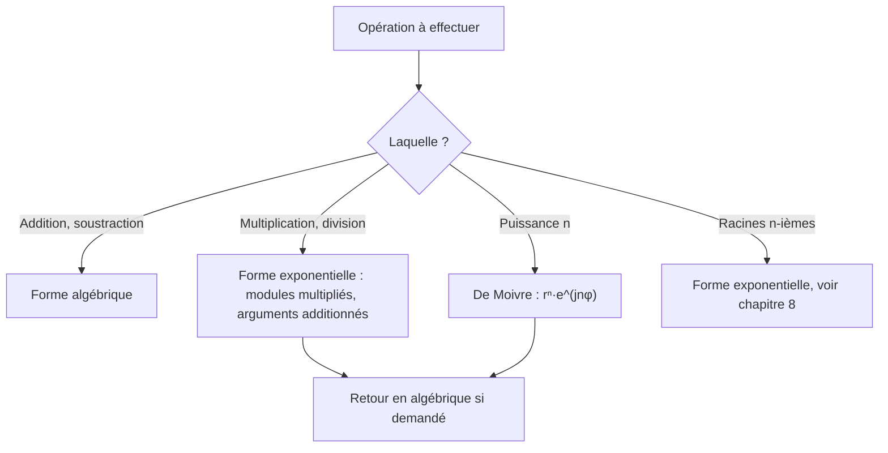

# 7. Nombres complexes : formes et opérations

> 🎯 **Objectif** : passer avec aisance entre les formes **algébrique**, **trigonométrique** et **exponentielle**, calculer produits, quotients et puissances, et dessiner des ensembles dans le plan de Gauss. C'est « Test 2 Pb 2 ».

> ℹ️ **Notation d'ingénieur** : à la HEIA, l'unité imaginaire se note $j$ (la lettre $i$ est réservée au courant électrique). On a $j^2 = -1$.

---

## 1. Introduction & définitions

### 1.1 Forme algébrique

Un nombre complexe s'écrit $z = a + bj$ avec $a, b \in \mathbb{R}$ :

- $a = \operatorname{Re}(z)$ est la **partie réelle** ;
- $b = \operatorname{Im}(z)$ est la **partie imaginaire** (c'est un **réel** !) ;
- le **conjugué** est $\bar{z} = a - bj$ (symétrique par rapport à l'axe réel).

On représente $z$ par le point $(a; b)$ du **plan de Gauss** (axe horizontal réel, axe vertical imaginaire).

### 1.2 Module et argument

- **Module** : la distance à l'origine :

$$\lvert z \rvert = r = \sqrt{a^2 + b^2}$$

- **Argument** : l'angle $\varphi = \arg(z)$ entre l'axe réel positif et le vecteur $\overrightarrow{Oz}$, défini à $2\pi$ près. On a $\cos\varphi = \frac{a}{r}$ et $\sin\varphi = \frac{b}{r}$.

> ⚠️ $\tan\varphi = \frac{b}{a}$ ne suffit pas : si $a < 0$, le point est à gauche et il faut **ajouter $\pi$** à $\arctan\frac{b}{a}$. Faites toujours un petit croquis du point.

### 1.3 Les trois formes

$$z = \underbrace{a + bj}_{\text{algébrique (A)}} = \underbrace{r\left(\cos\varphi + j\sin\varphi\right)}_{\text{trigonométrique (T)}} = \underbrace{r\,e^{j\varphi}}_{\text{exponentielle (E)}}$$

Le lien entre (T) et (E) est la **formule d'Euler** :

$$e^{j\varphi} = \cos\varphi + j\sin\varphi$$

### 1.4 Opérations

| Opération | Forme la plus pratique | Règle |
| --- | --- | --- |
| Somme, différence | algébrique | on additionne parties réelles et imaginaires |
| Produit | exponentielle | $r_1e^{j\varphi_1}\cdot r_2e^{j\varphi_2} = r_1r_2\,e^{j(\varphi_1 + \varphi_2)}$ |
| Quotient | exponentielle, ou algébrique avec le conjugué | $\frac{r_1e^{j\varphi_1}}{r_2e^{j\varphi_2}} = \frac{r_1}{r_2}e^{j(\varphi_1 - \varphi_2)}$ |
| Puissance | exponentielle (**De Moivre**) | $\left(re^{j\varphi}\right)^n = r^n e^{jn\varphi}$ |

Propriétés utiles : $z\bar{z} = \lvert z \rvert^2$, $\lvert z_1z_2 \rvert = \lvert z_1 \rvert\lvert z_2 \rvert$, $\arg(z_1z_2) = \arg z_1 + \arg z_2$.

**Division en forme algébrique** : on multiplie en haut et en bas par le **conjugué du dénominateur**, qui rend le dénominateur réel :

$$\frac{z_1}{z_2} = \frac{z_1\,\bar{z}_2}{z_2\,\bar{z}_2} = \frac{z_1\,\bar{z}_2}{\lvert z_2 \rvert^2}$$

### 1.5 Ensembles de points dans le plan de Gauss

En posant $z = x + yj$ :

| Condition | Traduction | Dessin |
| --- | --- | --- |
| $\lvert z \rvert = R$ | $x^2 + y^2 = R^2$ | cercle de centre $O$, rayon $R$ |
| $R_1 \leq \lvert z \rvert \leq R_2$ | | couronne |
| $\lvert z - z_0 \rvert \leq R$ | | disque de centre $z_0$ |
| $\arg z \in [\theta_1, \theta_2]$ | | secteur angulaire (sans l'origine) |
| $\operatorname{Re}(z) = c$ | $x = c$ | droite verticale |
| $\operatorname{Im}(z) \geq c$ | $y \geq c$ | demi-plan supérieur |

On choisit le **repère cartésien** (grille carrée) pour les conditions sur $\operatorname{Re}$ et $\operatorname{Im}$, et le **repère polaire** (cercles concentriques) pour les conditions sur $\lvert z \rvert$ et $\arg z$.

---

## 2. Méthodes de résolution

### Méthode A — Conversions entre les formes

### Méthode B — Simplifier une expression « mélangée »

1. Évaluer chaque morceau non standard (par exemple $2j\sin\frac{\pi}{3} = \sqrt{3}\,j$, ou $3e^{j\pi/2} = 3j$).
2. Tout ramener en forme algébrique pour **additionner**.
3. Convertir le résultat final dans la forme demandée.

### Méthode C — Conditions sur une puissance ($z^n$ réel, imaginaire pur...)

1. Écrire $z = re^{j\varphi}$.
2. $z^n = r^n e^{jn\varphi} = r^n\left(\cos(n\varphi) + j\sin(n\varphi)\right)$.
3. **Réel** $\iff \sin(n\varphi) = 0$ ; **imaginaire pur** $\iff \cos(n\varphi) = 0$.
4. Résoudre l'équation trigonométrique en $n$ et ne garder que les $n \in \mathbb{N}^*$.

### Méthode D — Dessiner un ensemble

1. Si la condition porte sur $\lvert z \rvert$ ou $\arg z$ : repère polaire, lire directement.
2. Sinon, poser $z = x + yj$, traduire en équation ou inéquation en $x$ et $y$, reconnaître la figure (droite, cercle, bande...).

---

## 3. Exemples de calculs détaillés

### Exemple 1 — Les trois formes (Test 2 Pb 2, variante A)

**a)** $z = -\sqrt{3} + \sqrt{3}\,j$.

- Module : $r = \sqrt{3 + 3} = \sqrt{6}$.
- Le point $(-\sqrt{3}; \sqrt{3})$ est au quadrant II, sur la bissectrice : $\varphi = \frac{3\pi}{4}$.

$$z = \sqrt{6}\left(\cos\frac{3\pi}{4} + j\sin\frac{3\pi}{4}\right) = \sqrt{6}\,e^{j\frac{3\pi}{4}}$$

**b)** $z = 2e^{j\frac{\pi}{3}} = 2\left(\cos\frac{\pi}{3} + j\sin\frac{\pi}{3}\right) = 2\left(\frac{1}{2} + \frac{\sqrt{3}}{2}j\right) = 1 + \sqrt{3}\,j$.

**c)** $z = 3\left[\cos\frac{5\pi}{6} + j\sin\frac{5\pi}{6}\right] = 3e^{j\frac{5\pi}{6}} = 3\left(-\frac{\sqrt{3}}{2} + \frac{1}{2}j\right) = -\frac{3\sqrt{3}}{2} + \frac{3}{2}j$.

### Exemple 2 — Expressions piégées (Test 2 Pb 2, variante A)

**a)** $2j\sin\frac{\pi}{3} = 2j\cdot\frac{\sqrt{3}}{2} = \sqrt{3}\,j = \sqrt{3}\,e^{j\frac{\pi}{2}}$ (un imaginaire pur positif a pour argument $\frac{\pi}{2}$).

**b)** $4\left[\cos\left(-\frac{\pi}{6}\right) + j\sin\frac{5\pi}{6}\right]$ : **attention, les deux angles sont différents**, ce n'est pas une forme trigonométrique ! On calcule : $\cos\left(-\frac{\pi}{6}\right) = \frac{\sqrt{3}}{2}$ et $\sin\frac{5\pi}{6} = \frac{1}{2}$, donc :

$$4\left(\frac{\sqrt{3}}{2} + \frac{1}{2}j\right) = 2\sqrt{3} + 2j = 4e^{j\frac{\pi}{6}}$$

**c)** $3e^{j\frac{\pi}{2}} + 2 - j = 3j + 2 - j = 2 + 2j = 2\sqrt{2}\,e^{j\frac{\pi}{4}}$.

### Exemple 3 — Quotients (Test 2 Pb 3)

**Forme algébrique** : $\dfrac{2 + 3j}{1 - 2j}$. On multiplie par le conjugué $1 + 2j$ :

$$\frac{(2 + 3j)(1 + 2j)}{(1 - 2j)(1 + 2j)} = \frac{2 + 4j + 3j + 6j^2}{1 + 4} = \frac{-4 + 7j}{5} = -\frac{4}{5} + \frac{7}{5}j$$

**Forme exponentielle** : $\dfrac{1 - j}{\sqrt{3} + j}$. On convertit chaque nombre : $1 - j = \sqrt{2}\,e^{-j\frac{\pi}{4}}$ et $\sqrt{3} + j = 2e^{j\frac{\pi}{6}}$ :

$$\frac{\sqrt{2}\,e^{-j\frac{\pi}{4}}}{2e^{j\frac{\pi}{6}}} = \frac{\sqrt{2}}{2}e^{j\left(-\frac{\pi}{4} - \frac{\pi}{6}\right)} = \frac{\sqrt{2}}{2}e^{-j\frac{5\pi}{12}}$$

### Exemple 4 — Puissance imaginaire pure (Test 2 Pb 3, variante A)

*Pour quels $n \in \mathbb{N}^*$ le nombre $(\sqrt{3} - j)^n$ est-il imaginaire pur ?*

1. $\sqrt{3} - j = 2\left(\frac{\sqrt{3}}{2} - \frac{1}{2}j\right) = 2e^{-j\frac{\pi}{6}}$.
2. $(\sqrt{3} - j)^n = 2^n\left(\cos\left(-\frac{n\pi}{6}\right) + j\sin\left(-\frac{n\pi}{6}\right)\right)$.
3. Imaginaire pur $\iff \cos\left(\frac{n\pi}{6}\right) = 0$ (le cosinus est pair) $\iff \frac{n\pi}{6} = \frac{\pi}{2} + k\pi \iff n = 3 + 6k$.
4. Avec $n \geq 1$ : $n \in \{3, 9, 15, 21, \dots\}$.

### Exemple 5 — Grande puissance (Test 2017)

*$z = -\frac{\sqrt{2}}{2} + \frac{\sqrt{6}}{2}j$. Calculer $z^{10}$ en forme algébrique, puis le plus petit $n \in \mathbb{N}^*$ tel que $z^n$ soit réel.*

1. $r = \sqrt{\frac{2}{4} + \frac{6}{4}} = \sqrt{2}$. Point au quadrant II avec $\tan\varphi = \frac{\sqrt{6}}{-\sqrt{2}} = -\sqrt{3}$ : $\varphi = \pi - \frac{\pi}{3} = \frac{2\pi}{3}$.
2. De Moivre : $z^{10} = \left(\sqrt{2}\right)^{10}e^{j\frac{20\pi}{3}} = 32\,e^{j\frac{20\pi}{3}}$. Or $\frac{20\pi}{3} = 6\pi + \frac{2\pi}{3}$, donc :

$$z^{10} = 32\,e^{j\frac{2\pi}{3}} = 32\left(-\frac{1}{2} + \frac{\sqrt{3}}{2}j\right) = -16 + 16\sqrt{3}\,j$$

3. $z^n$ réel $\iff \sin\left(\frac{2n\pi}{3}\right) = 0 \iff \frac{2n\pi}{3} = k\pi \iff n = \frac{3k}{2}$. Le plus petit entier positif : $k = 2$, $n = 3$.

### Exemple 6 — Ensembles (Test 2 Pb 2, variante A)

- $\mathcal{A} = \{z : -1 \leq \lvert z \rvert \leq 3\}$ : un module est toujours $\geq 0$, la condition $-1 \leq$ est automatique. C'est le **disque fermé** de centre $O$ et de rayon $3$.
- $\mathcal{B} = \{z : \operatorname{Re}(z) = \lvert \operatorname{Im}(z) - 2 \rvert\}$ : avec $z = x + yj$, $x = \lvert y - 2 \rvert$. Si $y \geq 2$ : $x = y - 2$, soit $y = x + 2$. Si $y \leq 2$ : $x = 2 - y$, soit $y = 2 - x$. C'est un **« V » couché** de sommet $(0; 2)$ ouvert vers la droite ($x \geq 0$).
- $\mathcal{C} = \left\{z : \arg z \in \left[\frac{2\pi}{3}, \frac{7\pi}{6}\right]\right\}$ : secteur angulaire entre les demi-droites d'angles $120°$ et $210°$.
- $\mathcal{D} = \{z : \lvert z \rvert^2 \leq \operatorname{Im}(z)^2 + 1\}$ : $x^2 + y^2 \leq y^2 + 1 \iff x^2 \leq 1 \iff -1 \leq x \leq 1$. C'est une **bande verticale**.

---

## 4. Visualisation : quelle forme pour quelle opération ?

---

## 5. Exercices pratiques

### Exercice 1 — Conversions (Test 2 Pb 2, variante B)

Écrire dans les trois formes : a) $\sqrt{3} + 3j$ ; b) $\sqrt{2}\,e^{j\frac{3\pi}{4}}$ ; c) $4\left[\cos\frac{7\pi}{6} + j\sin\frac{7\pi}{6}\right]$.

💡 Cliquez pour voir l'indice

Pour a), $r = \sqrt{3 + 9}$ ; factorisez $r$ pour faire apparaître $\cos\varphi$ et $\sin\varphi$ remarquables. Pour b) et c), développez avec les valeurs du cercle trigonométrique.

**Solution détaillée**

a) $r = \sqrt{12} = 2\sqrt{3}$. Alors $\sqrt{3} + 3j = 2\sqrt{3}\left(\frac{1}{2} + \frac{\sqrt{3}}{2}j\right)$, donc $\varphi = \frac{\pi}{3}$ :

$$\sqrt{3} + 3j = 2\sqrt{3}\left(\cos\frac{\pi}{3} + j\sin\frac{\pi}{3}\right) = 2\sqrt{3}\,e^{j\frac{\pi}{3}}$$

b) $\sqrt{2}\left(\cos\frac{3\pi}{4} + j\sin\frac{3\pi}{4}\right) = \sqrt{2}\left(-\frac{\sqrt{2}}{2} + \frac{\sqrt{2}}{2}j\right) = -1 + j$.

c) $4e^{j\frac{7\pi}{6}} = 4\left(-\frac{\sqrt{3}}{2} - \frac{1}{2}j\right) = -2\sqrt{3} - 2j$.

### Exercice 2 — Calcul (Test 2017)

Calculer $\dfrac{(1 - 2j)^*(1 + j)^2}{2 + j}$ en forme algébrique (l'étoile désigne le conjugué).

💡 Cliquez pour voir l'indice

$(1 - 2j)^* = 1 + 2j$ et $(1 + j)^2 = 1 + 2j + j^2 = 2j$. Calculez le numérateur, puis multipliez par le conjugué de $2 + j$.

**Solution détaillée**

1. Numérateur : $(1 + 2j)\cdot 2j = 2j + 4j^2 = -4 + 2j$.
2. Division par $2 + j$ (conjugué $2 - j$, $\lvert 2 + j \rvert^2 = 5$) :

$$\frac{(-4 + 2j)(2 - j)}{5} = \frac{-8 + 4j + 4j - 2j^2}{5} = \frac{-8 + 8j + 2}{5} = -\frac{6}{5} + \frac{8}{5}j$$

### Exercice 3 — Puissance et ensemble

a) Pour quels $n \in \mathbb{N}^*$ le nombre $(1 - j)^n$ est-il imaginaire pur ? b) Dessiner $\{z \in \mathbb{C} : \operatorname{Re}(z) + \operatorname{Im}(z) = 2\}$.

💡 Cliquez pour voir l'indice

a) $1 - j = \sqrt{2}\,e^{-j\frac{\pi}{4}}$. b) Posez $z = x + yj$ : c'est une équation de droite.

**Solution détaillée**

a) $(1 - j)^n = 2^{n/2}\left(\cos\frac{n\pi}{4} - j\sin\frac{n\pi}{4}\right)$. Imaginaire pur $\iff \cos\frac{n\pi}{4} = 0 \iff \frac{n\pi}{4} = \frac{\pi}{2} + k\pi \iff n = 2 + 4k$. Donc $n \in \{2, 6, 10, 14, \dots\}$. Contrôle : $(1 - j)^2 = 1 - 2j + j^2 = -2j$ ✓.

b) $x + y = 2 \iff y = 2 - x$ : la droite passant par $2$ (sur l'axe réel) et $2j$ (sur l'axe imaginaire), de pente $-1$.
