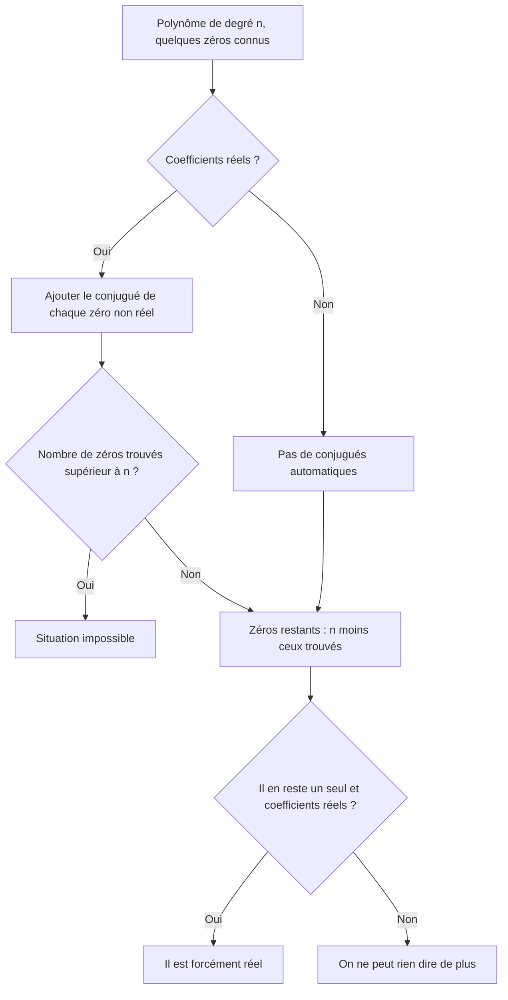
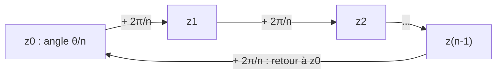

# 8. Racines complexes, équations et polynômes

> 🎯 **Objectif** : calculer toutes les racines $$n$$-ièmes d'un complexe, extraire une racine carrée en forme algébrique, résoudre des équations du second degré à coefficients complexes et des équations faisant intervenir $$\lvert z \rvert$$, $$\operatorname{Re}$$, $$\operatorname{Im}$$, et raisonner sur les zéros d'un polynôme. C'est « Test 2 Pb 3 et Pb 4 ».

---

## 1. Introduction & définitions

### 1.1 Racines $$n$$-ièmes

On appelle **racine $$n$$-ième** de $$c \in \mathbb{C}$$ tout nombre $$z$$ tel que $$z^n = c$$. Contrairement aux réels, **tout** complexe non nul possède **exactement $$n$$ racines $$n$$-ièmes distinctes**.

Si $$c = \rho\,e^{j\theta}$$, on cherche $$z = r\,e^{j\varphi}$$ avec $$r^n e^{jn\varphi} = \rho\,e^{j\theta}$$. Deux complexes sous forme exponentielle sont égaux quand les modules sont égaux et les arguments égaux **à $$2k\pi$$ près** :

$$r^n = \rho \quad\text{et}\quad n\varphi = \theta + 2k\pi$$

D'où la formule :

$$z_k = \sqrt[n]{\rho}\;e^{j\left(\frac{\theta}{n} + \frac{2k\pi}{n}\right)}, \qquad k = 0, 1, \dots, n - 1$$

> 💡 **Interprétation géométrique** : les $$n$$ racines sont les sommets d'un **polygone régulier à $$n$$ côtés**, inscrit dans le cercle de rayon $$\sqrt[n]{\rho}$$. Deux racines consécutives sont séparées de l'angle $$\frac{2\pi}{n}$$. (Pour $$n = 3$$ : un triangle équilatéral ; pour $$n = 6$$ : un hexagone.)

### 1.2 Racine carrée en forme algébrique

Pour $$\sqrt{a + bj}$$, on cherche $$x + yj$$ avec $$(x + yj)^2 = a + bj$$, c'est-à-dire $$x^2 - y^2 = a$$ et $$2xy = b$$. En ajoutant l'égalité des modules $$x^2 + y^2 = \sqrt{a^2 + b^2}$$, on obtient :

$$x = \pm\sqrt{\frac{\sqrt{a^2 + b^2} + a}{2}} \qquad y = \pm\sqrt{\frac{\sqrt{a^2 + b^2} - a}{2}}$$

Les signes ne sont pas libres : **$$xy$$ a le signe de $$b$$** (car $$2xy = b$$). On obtient ainsi exactement **deux** racines opposées.

### 1.3 Équation du second degré dans $$\mathbb{C}$$

Pour $$az^2 + bz + c = 0$$ ($$a, b, c \in \mathbb{C}$$, $$a \neq 0$$), la formule habituelle reste valable :

$$z_{1,2} = \frac{-b \pm \sqrt{\Delta}}{2a}, \qquad \Delta = b^2 - 4ac$$

où $$\pm\sqrt{\Delta}$$ désigne les **deux racines carrées complexes** de $$\Delta$$. Si $$\Delta$$ est un réel négatif, $$\sqrt{\Delta} = \pm j\sqrt{-\Delta}$$.

### 1.4 Zéros des polynômes

**Théorème fondamental de l'algèbre** : un polynôme de degré $$n$$ à coefficients complexes a **exactement $$n$$ zéros** dans $$\mathbb{C}$$ (comptés avec leur multiplicité).

**Polynôme à coefficients réels** : si $$z_0$$ est un zéro, son **conjugué** $$\bar{z}_0$$ l'est aussi. Les zéros non réels vont donc **par paires conjuguées**. Conséquence : un polynôme réel de degré **impair** a toujours **au moins un zéro réel**.

---

## 2. Méthodes de résolution

### Méthode A — Racines $$n$$-ièmes

1. Écrire $$c$$ sous forme exponentielle $$\rho\,e^{j\theta}$$ (croquis !).
2. Appliquer la formule pour $$k = 0, \dots, n - 1$$.
3. Convertir chaque racine en forme algébrique si demandé.
4. Dessiner le polygone régulier ; choisir le repère **polaire**.

### Méthode B — Équation où $$z$$ apparaît avec $$\lvert z \rvert$$, $$\bar{z}$$, $$\operatorname{Re}$$, $$\operatorname{Im}$$

Ces équations ne sont pas « polynomiales en $$z$$ » : on ne peut pas utiliser la formule du discriminant.

1. Poser $$z = x + yj$$ avec $$x, y \in \mathbb{R}$$.
2. Développer ; séparer **partie réelle** et **partie imaginaire**.
3. Un complexe est nul si et seulement si ses deux parties sont nulles : on obtient un **système réel** de deux équations.
4. Factoriser ; attention, les solutions peuvent former un ensemble **infini** (une droite entière, par exemple).

### Méthode C — Raisonner sur les zéros manquants

---

## 3. Exemples de calculs détaillés

### Exemple 1 — Racines cubiques (Test 2 Pb 3, variante A)

*Calculer $$\sqrt[3]{-27j}$$.*

**Étape 1 — Forme exponentielle.** $$-27j$$ est sur l'axe imaginaire négatif : $$\rho = 27$$, $$\theta = -\frac{\pi}{2}$$.

**Étape 2 — Formule** avec $$n = 3$$ : $$\sqrt[3]{27} = 3$$ et $$\frac{\theta}{3} = -\frac{\pi}{6}$$ :

$$z_k = 3\,e^{j\left(-\frac{\pi}{6} + \frac{2k\pi}{3}\right)}, \qquad k = 0, 1, 2$$

**Étape 3 — Forme algébrique.**

- $$k = 0$$ : $$z_0 = 3e^{-j\frac{\pi}{6}} = 3\left(\frac{\sqrt{3}}{2} - \frac{1}{2}j\right) = \frac{3\sqrt{3}}{2} - \frac{3}{2}j$$.
- $$k = 1$$ : $$z_1 = 3e^{j\frac{\pi}{2}} = 3j$$.
- $$k = 2$$ : $$z_2 = 3e^{j\frac{7\pi}{6}} = -\frac{3\sqrt{3}}{2} - \frac{3}{2}j$$.

**Contrôle** : $$z_1^3 = (3j)^3 = 27j^3 = -27j$$ ✓. Les trois points forment un triangle équilatéral inscrit dans le cercle de rayon $$3$$.

### Exemple 2 — Racine carrée algébrique (Test 2 Pb 3, variante A)

*Calculer $$\sqrt{5 - 12j}$$.*

1. $$a = 5$$, $$b = -12$$, $$\sqrt{a^2 + b^2} = \sqrt{25 + 144} = 13$$.
2. $$x = \pm\sqrt{\frac{13 + 5}{2}} = \pm 3$$ et $$y = \pm\sqrt{\frac{13 - 5}{2}} = \pm 2$$.
3. $$b < 0$$, donc $$x$$ et $$y$$ de **signes opposés** :

$$\sqrt{5 - 12j} = \pm(3 - 2j)$$

**Contrôle** : $$(3 - 2j)^2 = 9 - 12j + 4j^2 = 5 - 12j$$ ✓.

### Exemple 3 — Équation du second degré (Test 2 Pb 4, variante A)

*Résoudre $$jz^2 - 3(z - 1) = 3jz - 2$$.*

**Étape 1 — Forme standard.** On regroupe tout à gauche :

$$jz^2 - (3 + 3j)z + 5 = 0 \qquad (a = j,\; b = -(3 + 3j),\; c = 5)$$

**Étape 2 — Discriminant.**

$$\Delta = (3 + 3j)^2 - 4\cdot j\cdot 5 = (9 + 18j + 9j^2) - 20j = 18j - 20j = -2j$$

**Étape 3 — Racine carrée de $$\Delta$$.** $$-2j = 2e^{-j\frac{\pi}{2}}$$, donc $$\sqrt{\Delta} = \pm\sqrt{2}\,e^{-j\frac{\pi}{4}} = \pm(1 - j)$$.

**Étape 4 — Solutions.**

$$z_{1,2} = \frac{(3 + 3j) \pm (1 - j)}{2j}$$

$$z_1 = \frac{4 + 2j}{2j} = \frac{2 + j}{j} = \frac{(2 + j)(-j)}{j(-j)} = \frac{-2j - j^2}{1} = 1 - 2j$$

$$z_2 = \frac{2 + 4j}{2j} = \frac{1 + 2j}{j} = (1 + 2j)(-j) = 2 - j$$

(Diviser par $$j$$ revient à multiplier par $$-j$$, car $$\frac{1}{j} = -j$$.)

### Exemple 4 — Une équation avec $$\lvert z \rvert$$ et $$\operatorname{Im}$$ (Test 2 Pb 4, variante A)

*Résoudre $$\lvert z \rvert^2 - z^2 = 2\operatorname{Im}(z)$$.*

**Étape 1** — $$z = x + yj$$ : $$\lvert z \rvert^2 = x^2 + y^2$$ et $$z^2 = x^2 - y^2 + 2xyj$$.

**Étape 2 — Remplacer** :

$$x^2 + y^2 - x^2 + y^2 - 2xyj = 2y \iff 2y^2 - 2y - 2xyj = 0$$

**Étape 3 — Factoriser** : $$2y\left[(y - 1) - xj\right] = 0$$.

- Soit $$y = 0$$ : $$x$$ est **libre**. Tout réel $$z \in \mathbb{R}$$ est solution.
- Soit $$(y - 1) - xj = 0$$, c'est-à-dire $$y = 1$$ **et** $$x = 0$$ : $$z = j$$.

$$S = \mathbb{R} \cup \{j\}$$

### Exemple 5 — Polynômes réels (Test 2 Pb 4, variante A)

- **$$p_A$$ réel de degré 3, avec $$z_1 = 1 + 2j$$** : $$\bar{z}_1 = 1 - 2j$$ est aussi un zéro ; le troisième zéro existe et est **forcément réel** (s'il était non réel, son conjugué ferait un 4e zéro).
- **$$p_B$$ réel de degré 4, avec $$z_1 = 1 - 2j$$ et $$z_2 = 3$$** : $$z_3 = 1 + 2j$$ ; le 4e zéro $$z_4$$ est forcément réel.
- **$$p_C$$ réel de degré 3, avec $$1 - 2j$$ et $$3 + 4j$$** : les conjugués $$1 + 2j$$ et $$3 - 4j$$ sont aussi zéros, soit **4 zéros** pour un degré 3 : **impossible**.
- **$$p_D$$ complexe de degré 3, avec $$1 - 2j$$ et $$3 + 4j$$** : pas de règle des conjugués. Il existe un 3e zéro $$z_3 \in \mathbb{C}$$, mais on ne peut rien en dire de plus.

---

## 4. Visualisation : les racines forment un polygone

Tous les $$z_k$$ sont sur le **même cercle** de rayon $$\sqrt[n]{\rho}$$.

---

## 5. Exercices pratiques

### Exercice 1 — Racines cubiques (Test 2 Pb 3, variante C)

Calculer toutes les racines de $$\sqrt[3]{-8}$$ en forme algébrique et les placer dans le plan de Gauss.

💡 Cliquez pour voir l'indice

$$-8 = 8e^{j\pi}$$. Les racines sont $$2e^{j\left(\frac{\pi}{3} + \frac{2k\pi}{3}\right)}$$ pour $$k = 0, 1, 2$$.

**Solution détaillée**

1. $$\rho = 8$$, $$\theta = \pi$$ ; $$\sqrt[3]{8} = 2$$.
2. $$z_0 = 2e^{j\frac{\pi}{3}} = 2\left(\frac{1}{2} + \frac{\sqrt{3}}{2}j\right) = 1 + \sqrt{3}\,j$$.
3. $$z_1 = 2e^{j\pi} = -2$$ (la racine réelle attendue).
4. $$z_2 = 2e^{j\frac{5\pi}{3}} = 1 - \sqrt{3}\,j$$.
5. Dessin : triangle équilatéral inscrit dans le cercle de rayon $$2$$, avec un sommet en $$-2$$ et deux sommets conjugués.

### Exercice 2 — Second degré

a) Résoudre $$z^2 + 6z + 13 = 0$$. b) Calculer $$\sqrt{-3 + 4j}$$ en forme algébrique.

💡 Cliquez pour voir l'indice

a) $$\Delta$$ est un réel négatif : $$\sqrt{\Delta} = \pm j\sqrt{-\Delta}$$. b) $$\sqrt{a^2 + b^2} = 5$$ et $$b > 0$$ : $$x$$ et $$y$$ de même signe.

**Solution détaillée**

a) $$\Delta = 36 - 52 = -16$$, donc $$\sqrt{\Delta} = \pm 4j$$ :

$$z_{1,2} = \frac{-6 \pm 4j}{2} = -3 \pm 2j$$

Les deux solutions sont conjuguées, ce qui est normal (coefficients réels).

b) $$x = \pm\sqrt{\frac{5 - 3}{2}} = \pm 1$$, $$y = \pm\sqrt{\frac{5 + 3}{2}} = \pm 2$$, même signe : $$\sqrt{-3 + 4j} = \pm(1 + 2j)$$. Contrôle : $$(1 + 2j)^2 = 1 + 4j - 4 = -3 + 4j$$ ✓.

### Exercice 3 — (Test 2 Pb 4, variante D)

Résoudre dans $$\mathbb{C}$$ : $$\lvert z \rvert^2 + z^2 = 2\operatorname{Re}(z)$$.

💡 Cliquez pour voir l'indice

Posez $$z = x + yj$$, développez, et factorisez par $$2x$$.

**Solution détaillée**

1. $$x^2 + y^2 + x^2 - y^2 + 2xyj = 2x \iff 2x^2 - 2x + 2xyj = 0 \iff 2x\left[(x - 1) + yj\right] = 0$$.
2. Soit $$x = 0$$ et $$y$$ libre : tous les **imaginaires purs** $$z = yj$$ sont solutions.
3. Soit $$x - 1 = 0$$ et $$y = 0$$ : $$z = 1$$.

$$S = \{yj : y \in \mathbb{R}\} \cup \{1\}$$

Vérification pour $$z = 1$$ : $$1 + 1 = 2 = 2\operatorname{Re}(1)$$ ✓. Pour $$z = 3j$$ : $$9 + (-9) = 0 = 2\cdot 0$$ ✓.
