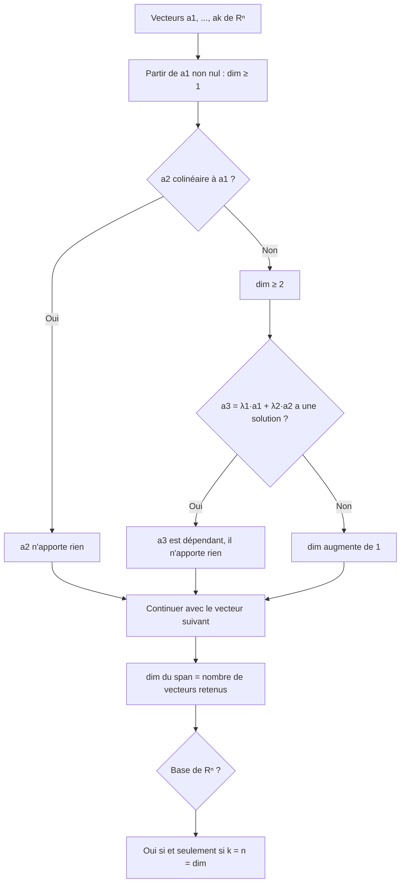
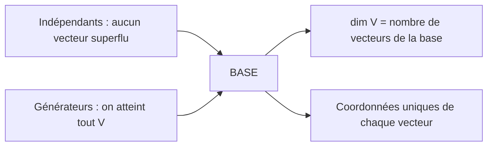

# 9. Vecteurs, combinaisons linéaires et bases

> 🎯 **Objectif** : calculer avec des vecteurs (points, parallélogrammes, barycentres), exprimer un vecteur dans une base, et décider si des vecteurs sont linéairement indépendants, engendrent un espace ou forment une base. C'est « Test 3 Pb 1 », « Test 3A » et l'exercice « Vecteurs » des TE F-2.

---

## 1. Introduction & définitions

### 1.1 Vecteurs et points

Un **vecteur** $$\vec{v}$$ est caractérisé par une direction, un sens et une longueur ; il ne dépend pas de son point de départ. Dans un repère, on l'écrit en **colonne** :

$$\vec{v} = \begin{pmatrix} v_1 \\ v_2 \\ v_3 \end{pmatrix} \in \mathbb{R}^3$$

Un **point** $$A$$ est repéré par son **vecteur-position** $$\overrightarrow{OA}$$. Le vecteur qui va de $$A$$ à $$B$$ est :

$$\overrightarrow{AB} = \overrightarrow{OB} - \overrightarrow{OA} \qquad \text{(« arrivée moins départ »)}$$

**Relation de Chasles** : $$\overrightarrow{AB} + \overrightarrow{BC} = \overrightarrow{AC}$$.

### 1.2 Configurations classiques

- **Parallélogramme** $$ABCD$$ (sommets dans l'ordre) : $$\overrightarrow{AB} = \overrightarrow{DC}$$ et $$\overrightarrow{AD} = \overrightarrow{BC}$$.
- **Milieu** $$M$$ de $$[AB]$$ : $$\overrightarrow{OM} = \frac{1}{2}\left(\overrightarrow{OA} + \overrightarrow{OB}\right)$$.
- **Point qui partage un segment** : si $$P \in [DC]$$ avec $$DP : PC = 1 : 3$$, alors $$\overrightarrow{DP} = \frac{1}{4}\overrightarrow{DC}$$.
- **Barycentre (centre de gravité)** $$S$$ d'un triangle : $$\overrightarrow{OS} = \frac{1}{3}\left(\overrightarrow{OA} + \overrightarrow{OB} + \overrightarrow{OC}\right)$$, ou encore $$\overrightarrow{AS} = \frac{1}{3}\left(\overrightarrow{AB} + \overrightarrow{AC}\right)$$.

### 1.3 Combinaison linéaire, span

Une **combinaison linéaire** de $$\vec{a}_1, \dots, \vec{a}_k$$ est un vecteur de la forme $$\lambda_1\vec{a}_1 + \dots + \lambda_k\vec{a}_k$$ avec $$\lambda_i \in \mathbb{R}$$.

L'ensemble de toutes ces combinaisons est l'**espace engendré** :

$$\operatorname{span}(\vec{a}_1, \dots, \vec{a}_k) = \left\{\lambda_1\vec{a}_1 + \dots + \lambda_k\vec{a}_k : \lambda_i \in \mathbb{R}\right\}$$

C'est un **sous-espace vectoriel** (il contient $$\vec{0}$$ et est stable par addition et multiplication par un scalaire).

### 1.4 Indépendance linéaire

Les vecteurs $$\vec{a}_1, \dots, \vec{a}_k$$ sont **linéairement indépendants** si la seule combinaison nulle est la combinaison triviale :

$$\lambda_1\vec{a}_1 + \dots + \lambda_k\vec{a}_k = \vec{0} \implies \lambda_1 = \dots = \lambda_k = 0$$

Sinon, ils sont **dépendants** : l'un d'eux au moins s'écrit comme combinaison des autres.

Repères rapides :

- deux vecteurs sont dépendants $$\iff$$ ils sont **colinéaires** (parallèles) ;
- trois vecteurs de $$\mathbb{R}^3$$ sont dépendants $$\iff$$ ils sont **coplanaires** ;
- **plus de $$n$$ vecteurs** de $$\mathbb{R}^n$$ sont **toujours** dépendants ;
- toute famille contenant $$\vec{0}$$ est dépendante.

### 1.5 Base, coordonnées, dimension

Une **base** d'un espace $$V$$ est une famille de vecteurs à la fois **indépendants** et **générateurs** de $$V$$. Tout vecteur $$\vec{v} \in V$$ s'écrit alors de **manière unique** $$\vec{v} = \lambda_1\vec{a}_1 + \dots + \lambda_n\vec{a}_n$$ ; les $$\lambda_i$$ sont ses **coordonnées dans la base** $$\mathcal{B}$$ :

$$[\vec{v}]_{\mathcal{B}} = \begin{pmatrix} \lambda_1 \\ \vdots \\ \lambda_n \end{pmatrix}$$

La **dimension** $$\dim V$$ est le nombre de vecteurs d'une base (toutes les bases en ont le même nombre). Ainsi $$\dim\mathbb{R}^n = n$$, et $$\dim\operatorname{span}(\vec{a}_1, \dots, \vec{a}_k)$$ est le nombre **maximal** de vecteurs indépendants parmi les $$\vec{a}_i$$.

> 💡 Dans un espace de dimension $$n$$, **$$n$$ vecteurs indépendants forment automatiquement une base** : pas besoin de vérifier qu'ils engendrent l'espace.

---

## 2. Méthodes de résolution

### Méthode A — Trouver des sommets manquants

1. Traduire la figure en **égalités vectorielles** (parallélogramme : $$\overrightarrow{AB} = \overrightarrow{DC}$$, partage : $$\overrightarrow{DP} = \frac{1}{4}\overrightarrow{DC}$$...).
2. Calculer les vecteurs connus par « arrivée moins départ ».
3. Écrire le vecteur-position du point cherché avec Chasles : $$\overrightarrow{OD} = \overrightarrow{OP} + \overrightarrow{PD}$$.

### Méthode B — Déterminer $$\dim\operatorname{span}(\dots)$$ et tester une base

### Méthode C — Coordonnées dans une base

1. Poser $$\vec{v} = \lambda_1\vec{a}_1 + \lambda_2\vec{a}_2 + \lambda_3\vec{a}_3$$.
2. Écrire le système composante par composante.
3. Résoudre (par substitution ou élimination) ; la solution est unique si c'est une base.

### Méthode D — Lecture graphique dans une base non standard

Sur une figure (quadrillage, carré), on exprime un vecteur en « comptant les pas » dans les directions $$\vec{a}_1$$ et $$\vec{a}_2$$ : par exemple, pour aller de l'origine à l'extrémité de $$\vec{v}$$, il faut « reculer de 2 fois $$\vec{a}_1$$ et avancer de 1 fois $$\vec{a}_2$$ », donc $$\vec{v} = -2\vec{a}_1 + \vec{a}_2$$ et $$[\vec{v}]_{\mathcal{B}} = \begin{pmatrix} -2 \\ 1 \end{pmatrix}$$.

---

## 3. Exemples de calculs détaillés

### Exemple 1 — Parallélogramme (Test 3 Pb 1, variante A)

*$$ABCD$$ est un parallélogramme avec $$A(-2; -3)$$, $$B(2; 5)$$ ; le point $$P(1; 3)$$ est sur $$[DC]$$, plus près de $$D$$, et coupe $$[DC]$$ dans les proportions $$\frac{1}{4} : \frac{3}{4}$$. Trouver $$C$$ et $$D$$.*

**Étape 1** — Vecteur connu :

$$\overrightarrow{AB} = \begin{pmatrix} 2 - (-2) \\ 5 - (-3) \end{pmatrix} = \begin{pmatrix} 4 \\ 8 \end{pmatrix} = \overrightarrow{DC}$$

**Étape 2** — Partage : $$\overrightarrow{DP} = \frac{1}{4}\overrightarrow{DC} = \begin{pmatrix} 1 \\ 2 \end{pmatrix}$$.

**Étape 3** — Point $$D$$ :

$$\overrightarrow{OD} = \overrightarrow{OP} - \overrightarrow{DP} = \begin{pmatrix} 1 - 1 \\ 3 - 2 \end{pmatrix} = \begin{pmatrix} 0 \\ 1 \end{pmatrix} \quad\Rightarrow\quad D(0; 1)$$

**Étape 4** — Point $$C$$ :

$$\overrightarrow{OC} = \overrightarrow{OD} + \overrightarrow{DC} = \begin{pmatrix} 0 + 4 \\ 1 + 8 \end{pmatrix} \quad\Rightarrow\quad C(4; 9)$$

### Exemple 2 — Barycentre (Test 3 Pb 1, variante A)

*Dans l'espace, $$\overrightarrow{AB} = \begin{pmatrix} -1 \\ -5 \\ -1 \end{pmatrix}$$, $$\overrightarrow{AC} = \begin{pmatrix} -2 \\ -1 \\ 1 \end{pmatrix}$$ et le barycentre est $$S(3; 3; 2)$$. Trouver $$A$$, $$B$$, $$C$$.*

**Étape 1 — Relation clé.** $$\overrightarrow{OS} = \frac{1}{3}\left(\overrightarrow{OA} + \overrightarrow{OB} + \overrightarrow{OC}\right)$$. On fait apparaître $$\overrightarrow{AB}$$ et $$\overrightarrow{AC}$$ en écrivant $$\overrightarrow{OB} = \overrightarrow{OA} + \overrightarrow{AB}$$ et $$\overrightarrow{OC} = \overrightarrow{OA} + \overrightarrow{AC}$$ :

$$\overrightarrow{OS} = \overrightarrow{OA} + \frac{1}{3}\left(\overrightarrow{AB} + \overrightarrow{AC}\right) \quad\Rightarrow\quad \overrightarrow{OA} = \overrightarrow{OS} - \frac{1}{3}\left(\overrightarrow{AB} + \overrightarrow{AC}\right)$$

**Étape 2 — Numériquement.** $$\overrightarrow{AB} + \overrightarrow{AC} = \begin{pmatrix} -3 \\ -6 \\ 0 \end{pmatrix}$$, dont le tiers vaut $$\begin{pmatrix} -1 \\ -2 \\ 0 \end{pmatrix}$$ :

$$\overrightarrow{OA} = \begin{pmatrix} 3 + 1 \\ 3 + 2 \\ 2 - 0 \end{pmatrix} = \begin{pmatrix} 4 \\ 5 \\ 2 \end{pmatrix} \Rightarrow A(4; 5; 2) \qquad B = A + \overrightarrow{AB} = (3; 0; 1) \qquad C = A + \overrightarrow{AC} = (2; 4; 3)$$

**Contrôle** : $$\frac{1}{3}(4 + 3 + 2;\; 5 + 0 + 4;\; 2 + 1 + 3) = (3; 3; 2) = S$$ ✓.

### Exemple 3 — Dimension d'un span (Test 3A)

*$$\vec{a}_1 = \begin{pmatrix} 1 \\ 2 \\ 0 \\ 1 \end{pmatrix}$$, $$\vec{a}_2 = \begin{pmatrix} -1 \\ 1 \\ 1 \\ -1 \end{pmatrix}$$, $$\vec{a}_3 = \begin{pmatrix} -1 \\ 4 \\ 2 \\ -1 \end{pmatrix}$$, $$\vec{a}_4 = \begin{pmatrix} 1 \\ 0 \\ -1 \\ 1 \end{pmatrix}$$. Dimension de $$V = \operatorname{span}(\vec{a}_1, \vec{a}_2, \vec{a}_3, \vec{a}_4)$$ ?*

**Étape 1** — $$\vec{a}_1$$ et $$\vec{a}_2$$ ne sont pas colinéaires (la 3e composante de $$\vec{a}_1$$ est nulle mais pas celle de $$\vec{a}_2$$) : $$\dim\operatorname{span}(\vec{a}_1, \vec{a}_2) = 2$$.

**Étape 2** — $$\vec{a}_3 = \lambda_1\vec{a}_1 + \lambda_2\vec{a}_2$$ ? La 3e composante donne $$0\lambda_1 + \lambda_2 = 2$$, donc $$\lambda_2 = 2$$ ; la 1re : $$\lambda_1 - 2 = -1$$, donc $$\lambda_1 = 1$$. Vérification sur les autres : $$2 + 2 = 4$$ ✓ et $$1 - 2 = -1$$ ✓. Donc $$\vec{a}_3 = \vec{a}_1 + 2\vec{a}_2$$ : il **n'augmente pas** la dimension.

**Étape 3** — $$\vec{a}_4 = \lambda_1\vec{a}_1 + \lambda_2\vec{a}_2$$ ? 3e composante : $$\lambda_2 = -1$$ ; 2e : $$2\lambda_1 - 1 = 0$$, donc $$\lambda_1 = \frac{1}{2}$$ ; 1re : $$\frac{1}{2} + 1 = \frac{3}{2} \neq 1$$. **Contradiction** : $$\vec{a}_4$$ est indépendant de $$\vec{a}_1, \vec{a}_2$$.

**Conclusions** :

- $$\dim V = 3$$.
- $$\vec{a}_1, \dots, \vec{a}_4$$ ne sont **pas** indépendants (sinon $$\dim V = 4$$).
- Ils ne forment **pas** une base de $$\mathbb{R}^4$$ ($$\dim V = 3 \neq 4$$).
- $$\vec{a}_1, \vec{a}_2, \vec{a}_3$$ ne forment pas une base de $$V$$ : ils sont dépendants et n'engendrent qu'un espace de dimension 2.

### Exemple 4 — Coordonnées dans une base de $$\mathbb{R}^3$$ (Test 3A, 2015)

*$$\vec{a}_1 = \begin{pmatrix} 1 \\ -1 \\ 1 \end{pmatrix}$$, $$\vec{a}_2 = \begin{pmatrix} 1 \\ 1 \\ 0 \end{pmatrix}$$, $$\vec{a}_3 = \begin{pmatrix} 0 \\ 1 \\ 2 \end{pmatrix}$$ et $$\vec{v} = \begin{pmatrix} 1 \\ 0 \\ 0 \end{pmatrix}$$. Coordonnées de $$\vec{v}$$ dans $$\mathcal{B} = (\vec{a}_1, \vec{a}_2, \vec{a}_3)$$ ?*

On résout $$\lambda_1\vec{a}_1 + \lambda_2\vec{a}_2 + \lambda_3\vec{a}_3 = \vec{v}$$ :

$$\begin{cases} \lambda_1 + \lambda_2 = 1 \\ -\lambda_1 + \lambda_2 + \lambda_3 = 0 \\ \lambda_1 + 2\lambda_3 = 0 \end{cases}$$

De la 1re : $$\lambda_2 = 1 - \lambda_1$$ ; de la 3e : $$\lambda_3 = -\frac{\lambda_1}{2}$$. Dans la 2e : $$-\lambda_1 + 1 - \lambda_1 - \frac{\lambda_1}{2} = 0 \iff \frac{5}{2}\lambda_1 = 1 \iff \lambda_1 = \frac{2}{5}$$. Donc $$\lambda_2 = \frac{3}{5}$$ et $$\lambda_3 = -\frac{1}{5}$$ :

$$[\vec{v}]_{\mathcal{B}} = \frac{1}{5}\begin{pmatrix} 2 \\ 3 \\ -1 \end{pmatrix}$$

La solution est **unique**, ce qui confirme au passage que $$\mathcal{B}$$ est une base.

---

## 4. Visualisation : les trois notions clés

---

## 5. Exercices pratiques

### Exercice 1 — Parallélogramme (Test 3 Pb 1, variante C)

$$ABCD$$ est un parallélogramme avec $$A(-1; -3)$$, $$B(3; 5)$$, et $$P(4; 8)$$ est sur $$[DC]$$, plus près de $$C$$, dans les proportions $$\frac{3}{4} : \frac{1}{4}$$. Trouver $$C$$ et $$D$$.

💡 Cliquez pour voir l'indice

« Plus près de $$C$$ » avec les proportions $$\frac{3}{4} : \frac{1}{4}$$ signifie $$\overrightarrow{DP} = \frac{3}{4}\overrightarrow{DC}$$.

**Solution détaillée**

1. $$\overrightarrow{AB} = \begin{pmatrix} 3 - (-1) \\ 5 - (-3) \end{pmatrix} = \begin{pmatrix} 4 \\ 8 \end{pmatrix} = \overrightarrow{DC}$$.
2. $$\overrightarrow{DP} = \frac{3}{4}\begin{pmatrix} 4 \\ 8 \end{pmatrix} = \begin{pmatrix} 3 \\ 6 \end{pmatrix}$$.
3. $$\overrightarrow{OD} = \overrightarrow{OP} - \overrightarrow{DP} = \begin{pmatrix} 4 - 3 \\ 8 - 6 \end{pmatrix} = \begin{pmatrix} 1 \\ 2 \end{pmatrix}$$, donc $$D(1; 2)$$.
4. $$\overrightarrow{OC} = \overrightarrow{OD} + \overrightarrow{DC} = \begin{pmatrix} 5 \\ 10 \end{pmatrix}$$, donc $$C(5; 10)$$.
5. Contrôle : $$\overrightarrow{AD} = \begin{pmatrix} 2 \\ 5 \end{pmatrix} = \overrightarrow{BC}$$ ✓, et $$\overrightarrow{AD}$$ n'est pas colinéaire à $$\overrightarrow{AB}$$ : le parallélogramme n'est pas aplati.

> ⚠️ Pensez toujours à ce contrôle géométrique : une des variantes d'examen donnait $$D = A$$ et $$C = B$$, c'est-à-dire un parallélogramme **dégénéré**. Dans ce cas, il faut le signaler dans la réponse.

### Exercice 2 — Barycentre

Le triangle $$ABC$$ a pour barycentre $$S(-2; 1; -1)$$, avec $$\overrightarrow{AB} = \begin{pmatrix} 6 \\ 3 \\ -4 \end{pmatrix}$$ et $$\overrightarrow{AC} = \begin{pmatrix} 0 \\ 6 \\ -2 \end{pmatrix}$$. Trouver $$A$$, $$B$$ et $$C$$.

💡 Cliquez pour voir l'indice

$$\overrightarrow{OA} = \overrightarrow{OS} - \frac{1}{3}\left(\overrightarrow{AB} + \overrightarrow{AC}\right)$$.

**Solution détaillée**

1. $$\overrightarrow{AB} + \overrightarrow{AC} = \begin{pmatrix} 6 \\ 9 \\ -6 \end{pmatrix}$$, dont le tiers est $$\begin{pmatrix} 2 \\ 3 \\ -2 \end{pmatrix}$$.
2. $$\overrightarrow{OA} = \begin{pmatrix} -2 - 2 \\ 1 - 3 \\ -1 + 2 \end{pmatrix} = \begin{pmatrix} -4 \\ -2 \\ 1 \end{pmatrix}$$, donc $$A(-4; -2; 1)$$.
3. $$B = A + \overrightarrow{AB} = (2; 1; -3)$$ et $$C = A + \overrightarrow{AC} = (-4; 4; -1)$$.
4. Contrôle : $$\frac{1}{3}(-4 + 2 - 4;\; -2 + 1 + 4;\; 1 - 3 - 1) = (-2; 1; -1)$$ ✓.

### Exercice 3 — Vrai ou faux (Test 3A)

a) Trois vecteurs $$\vec{a}, \vec{b}, \vec{c}$$ tels que $$\vec{a} + \vec{b} = \vec{c}$$ sont forcément linéairement dépendants. b) Si $$0\cdot\vec{a} + 0\cdot\vec{b} + 0\cdot\vec{c} = \vec{0}$$, alors $$\vec{a}, \vec{b}, \vec{c}$$ sont indépendants. c) Trois vecteurs de $$\mathbb{R}^2$$ sont forcément dépendants. d) Si $$\vec{a}_1, \vec{a}_2 \in \mathbb{R}^3$$ et $$V = \operatorname{span}(\vec{a}_1, \vec{a}_2)$$, alors $$\dim V \leq 2$$. e) $$\mathbb{R}^2$$ est un sous-espace vectoriel de $$\mathbb{R}^3$$.

💡 Cliquez pour voir l'indice

Revenez à la **définition** de l'indépendance : c'est une **implication** qui porte sur **toutes** les combinaisons nulles. Pour e), un élément de $$\mathbb{R}^2$$ a-t-il 3 composantes ?

**Solution détaillée**

a) **Vrai** : $$\vec{a} + \vec{b} - \vec{c} = \vec{0}$$ est une combinaison nulle non triviale (coefficients $$1, 1, -1$$).

b) **Faux** : la combinaison triviale est **toujours** nulle, pour n'importe quels vecteurs. Elle ne prouve rien.

c) **Vrai** : plus de $$n = 2$$ vecteurs dans $$\mathbb{R}^2$$ sont toujours dépendants.

d) **Vrai** : deux vecteurs engendrent un espace de dimension 0, 1 ou 2.

e) **Faux** : les vecteurs de $$\mathbb{R}^2$$ ont 2 composantes, ceux de $$\mathbb{R}^3$$ en ont 3 ; $$\mathbb{R}^2$$ n'est pas **inclus** dans $$\mathbb{R}^3$$ (le plan $$\{z = 0\}$$ de $$\mathbb{R}^3$$ lui « ressemble », mais c'est un autre ensemble).
