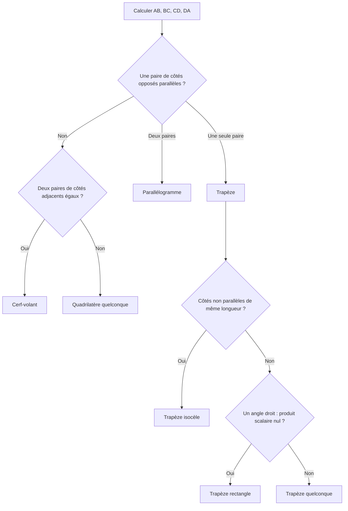
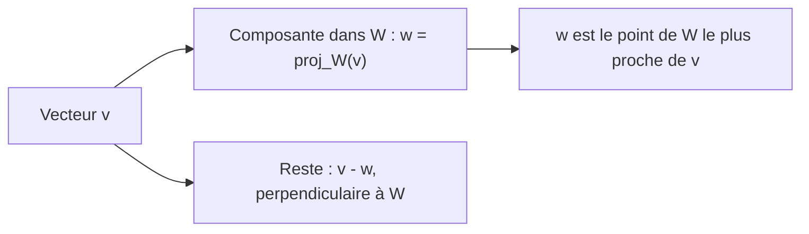

# 10. Produit scalaire, norme, angles et projection orthogonale

> 🎯 **Objectif** : utiliser le produit scalaire euclidien pour calculer longueurs et angles, reconnaître un quadrilatère, projeter un vecteur sur une droite ou sur un sous-espace, et trouver la **meilleure approximation** d'un signal. C'est « Test 3 Pb 2 et Pb 3 ».

---

## 1. Introduction & définitions

### 1.1 Produit scalaire euclidien

Pour $$\vec{a}, \vec{b} \in \mathbb{R}^n$$, le **produit scalaire** (noté $$(\vec{a}, \vec{b})_2$$ ou $$\vec{a}\cdot\vec{b}$$) est le **nombre** :

$$(\vec{a}, \vec{b})_2 = a_1b_1 + a_2b_2 + \dots + a_nb_n$$

Propriétés : symétrique $$(\vec{a}, \vec{b}) = (\vec{b}, \vec{a})$$ ; linéaire $$(\alpha\vec{a} + \beta\vec{b}, \vec{c}) = \alpha(\vec{a}, \vec{c}) + \beta(\vec{b}, \vec{c})$$ ; $$(\vec{a}, \vec{a}) \geq 0$$.

### 1.2 Norme et distance

La **norme euclidienne** (longueur) :

$$\lVert\vec{a}\rVert_2 = \sqrt{(\vec{a}, \vec{a})} = \sqrt{a_1^2 + \dots + a_n^2}$$

La **distance** entre deux points : $$d(A, B) = \lVert\overrightarrow{AB}\rVert$$. Un vecteur **unitaire** a une norme égale à $$1$$ ; on normalise $$\vec{a}$$ en calculant $$\frac{\vec{a}}{\lVert\vec{a}\rVert}$$.

### 1.3 Angle entre deux vecteurs

Le produit scalaire contient l'information d'angle :

$$(\vec{a}, \vec{b}) = \lVert\vec{a}\rVert\,\lVert\vec{b}\rVert\cos\gamma \quad\Rightarrow\quad \gamma = \arccos\left(\frac{(\vec{a}, \vec{b})}{\lVert\vec{a}\rVert\,\lVert\vec{b}\rVert}\right) \in [0, \pi]$$

| Signe de $$(\vec{a}, \vec{b})$$ | Angle | Interprétation (« avis ») |
| --- | --- | --- |
| $$> 0$$ | aigu | orientations **similaires** |
| $$= 0$$ | droit : $$\vec{a} \perp \vec{b}$$ | **indépendants**, complémentaires |
| $$< 0$$ | obtus | orientations **opposées** |

Le quotient $$\cos\gamma$$ s'appelle aussi **similarité cosinus** : il est utilisé pour comparer des profils (réponses à un questionnaire, documents...).

### 1.4 Projection orthogonale sur un vecteur

La **projection orthogonale** de $$\vec{v}$$ sur la direction de $$\vec{a}$$ est l'« ombre » de $$\vec{v}$$ sur la droite portée par $$\vec{a}$$ :

$$\operatorname{proj}_{\vec{a}}(\vec{v}) = \frac{(\vec{v}, \vec{a})}{(\vec{a}, \vec{a})}\,\vec{a}$$

Le reste $$\vec{v} - \operatorname{proj}_{\vec{a}}(\vec{v})$$ est **perpendiculaire** à $$\vec{a}$$.

### 1.5 Projection sur un sous-espace $$W = \operatorname{span}(\vec{a}_1, \vec{a}_2)$$

La projection $$\vec{w} = \operatorname{proj}_W(\vec{v}) = \alpha_1\vec{a}_1 + \alpha_2\vec{a}_2$$ est le vecteur de $$W$$ **le plus proche** de $$\vec{v}$$ : il minimise $$\lVert\vec{v} - \vec{w}\rVert_2$$. Elle est caractérisée par : **$$\vec{v} - \vec{w}$$ est orthogonal à $$\vec{a}_1$$ et à $$\vec{a}_2$$**. Cela donne les **équations normales** :

$$\begin{cases} (\vec{a}_1, \vec{a}_1)\,\alpha_1 + (\vec{a}_1, \vec{a}_2)\,\alpha_2 = (\vec{a}_1, \vec{v}) \\ (\vec{a}_2, \vec{a}_1)\,\alpha_1 + (\vec{a}_2, \vec{a}_2)\,\alpha_2 = (\vec{a}_2, \vec{v}) \end{cases}$$

> 💡 Si $$\vec{a}_1 \perp \vec{a}_2$$, le système se découple et l'on retrouve la somme des projections : $$\alpha_k = \frac{(\vec{a}_k, \vec{v})}{(\vec{a}_k, \vec{a}_k)}$$. **Mais** cette formule est **fausse** si $$\vec{a}_1$$ et $$\vec{a}_2$$ ne sont pas orthogonaux (question « Vrai/Faux » classique).

Propriétés à connaître (Test 3 Pb 3) : $$\vec{w} \in W$$ ; $$(\vec{v} - \vec{w}) \perp \vec{a}_1$$ et $$\perp \vec{a}_2$$ ; si $$\vec{w} = \vec{0}$$ alors $$\vec{v} \perp W$$ ; si $$\vec{w} = \vec{v}$$ alors $$\vec{v} \in W$$ ; $$\lVert\vec{v} - \vec{w}\rVert \leq \lVert\vec{v} - \vec{z}\rVert$$ pour tout $$\vec{z}$$ **de $$W$$** (pas pour tout $$\vec{z}$$ de l'espace).

---

## 2. Méthodes de résolution

### Méthode A — Identifier un quadrilatère $$ABCD$$

Deux côtés sont **parallèles** si leurs vecteurs sont **proportionnels** (par exemple $$\overrightarrow{BC} = -\frac{1}{2}\overrightarrow{DA}$$). Un angle est **droit** si le produit scalaire des deux côtés adjacents est nul.

### Méthode B — Trouver des coefficients vérifiant une condition d'angle et de longueur

1. Écrire la condition d'angle avec le produit scalaire : $$(\vec{v}, \vec{c}) = \lVert\vec{v}\rVert\lVert\vec{c}\rVert\cos\gamma$$ ; la linéarité donne une équation **linéaire** en $$\alpha, \beta$$.
2. Écrire la condition de longueur $$\lVert\vec{v}\rVert^2 = L^2$$ : équation **du second degré**.
3. Substituer et résoudre.

### Méthode C — Meilleure approximation (moindres carrés)

1. Identifier $$\vec{y}$$ (cible) et les vecteurs $$\vec{s}_1, \vec{s}_2$$ de $$W$$.
2. Précalculer les produits scalaires $$(\vec{s}_i, \vec{s}_j)$$ et $$(\vec{s}_i, \vec{y})$$.
3. Résoudre les équations normales en $$\alpha_1, \alpha_2$$.
4. Écrire $$\vec{s} = \alpha_1\vec{s}_1 + \alpha_2\vec{s}_2$$.

---

## 3. Exemples de calculs détaillés

### Exemple 1 — Quel quadrilatère ? (Test 3 Pb 2, variante A)

*$$A(3; 2; -1)$$, $$B(4; 0; 1)$$, $$C(2; -2; 3)$$, $$D(-1; -2; 3)$$.*

**Étape 1 — Côtés** (« arrivée moins départ ») :

$$\overrightarrow{AB} = \begin{pmatrix} 1 \\ -2 \\ 2 \end{pmatrix} \quad \overrightarrow{BC} = \begin{pmatrix} -2 \\ -2 \\ 2 \end{pmatrix} \quad \overrightarrow{CD} = \begin{pmatrix} -3 \\ 0 \\ 0 \end{pmatrix} \quad \overrightarrow{DA} = \begin{pmatrix} 4 \\ 4 \\ -4 \end{pmatrix}$$

**Étape 2 — Parallélisme.** $$\overrightarrow{BC} = -\frac{1}{2}\overrightarrow{DA}$$ : les côtés $$[BC]$$ et $$[DA]$$ sont parallèles. $$\overrightarrow{AB}$$ et $$\overrightarrow{CD}$$ ne sont pas proportionnels. C'est un **trapèze**.

**Étape 3 — Longueurs des côtés non parallèles.**

$$\lVert\overrightarrow{AB}\rVert = \sqrt{1 + 4 + 4} = 3 \qquad \lVert\overrightarrow{CD}\rVert = 3$$

Les deux côtés obliques ont la même longueur : c'est un **trapèze isocèle**.

### Exemple 2 — Coefficients imposés (Test 3 Pb 2, variante A)

*Trouver $$\alpha, \beta$$ tels que $$\vec{v} = \alpha\begin{pmatrix} 2 \\ -3 \\ 1 \end{pmatrix} + \beta\begin{pmatrix} 2 \\ 0 \\ 1 \end{pmatrix}$$ fasse un angle de $$30°$$ avec $$\vec{c} = \begin{pmatrix} 1 \\ 0 \\ 1 \end{pmatrix}$$ et ait une longueur $$\sqrt{6}$$.*

Notons $$\vec{a}$$ et $$\vec{b}$$ les deux vecteurs.

**Étape 1 — Condition d'angle.** $$(\vec{a}, \vec{c}) = 2 + 0 + 1 = 3$$ et $$(\vec{b}, \vec{c}) = 3$$. Par linéarité :

$$3\alpha + 3\beta = \lVert\vec{v}\rVert\,\lVert\vec{c}\rVert\cos 30° = \sqrt{6}\cdot\sqrt{2}\cdot\frac{\sqrt{3}}{2} = \frac{\sqrt{36}}{2} = 3 \quad\Rightarrow\quad \alpha = 1 - \beta$$

**Étape 2 — Condition de longueur.** Avec $$\alpha = 1 - \beta$$ : $$\vec{v} = \vec{a} + \beta(\vec{b} - \vec{a})$$ et $$\vec{b} - \vec{a} = \begin{pmatrix} 0 \\ 3 \\ 0 \end{pmatrix}$$.

$$\lVert\vec{v}\rVert^2 = (\vec{a}, \vec{a}) + 2\beta(\vec{a}, \vec{b} - \vec{a}) + \beta^2(\vec{b} - \vec{a}, \vec{b} - \vec{a}) = 14 - 18\beta + 9\beta^2$$

**Étape 3 — Résoudre** $$14 - 18\beta + 9\beta^2 = 6$$, soit $$9\beta^2 - 18\beta + 8 = 0$$ :

$$\beta = \frac{18 \pm\sqrt{324 - 288}}{18} = \frac{18 \pm 6}{18} \quad\Rightarrow\quad \beta = \frac{4}{3},\ \alpha = -\frac{1}{3} \quad\text{ou}\quad \beta = \frac{2}{3},\ \alpha = \frac{1}{3}$$

### Exemple 3 — Avis de répondants (Test 3 Pb 2, variante A)

*Réponses (de $$-2$$ à $$2$$) aux questions $$Q_1$$ à $$Q_5$$ : $$\vec{a} = (-1, 2, 2, 0, 1)$$, $$\vec{b} = (-1, -2, 1, 0, -1)$$, $$\vec{c} = (1, 0, 2, -1, 1)$$. Quels répondants ont des avis les plus similaires, les plus opposés, complémentaires ?*

$$(\vec{a}, \vec{b}) = 1 - 4 + 2 + 0 - 1 = -2 \qquad (\vec{a}, \vec{c}) = -1 + 0 + 4 + 0 + 1 = 4 \qquad (\vec{b}, \vec{c}) = -1 + 0 + 2 + 0 - 1 = 0$$

- $$A$$ et $$C$$ : angle aigu → avis les plus **similaires**.
- $$A$$ et $$B$$ : angle obtus → avis les plus **opposés**.
- $$B$$ et $$C$$ : angle droit → avis **complémentaires** (indifférents).

### Exemple 4 — Cerf-volant par projection (Test 3 Pb 3, variante A)

*$$A(-1; 3; 2)$$, $$B(3; 3; 0)$$, $$C(2; -3; -1)$$. Trouver $$D$$ tel que $$ABCD$$ soit un cerf-volant d'axe $$(AC)$$ : $$S$$ est le pied de la perpendiculaire issue de $$B$$ sur $$(AC)$$, et $$D$$ est le symétrique de $$B$$ par rapport à $$S$$.*

**Étape 1 — Projection.**

$$\overrightarrow{AB} = \begin{pmatrix} 4 \\ 0 \\ -2 \end{pmatrix} \quad \overrightarrow{AC} = \begin{pmatrix} 3 \\ -6 \\ -3 \end{pmatrix} \quad (\overrightarrow{AB}, \overrightarrow{AC}) = 12 + 0 + 6 = 18 \quad (\overrightarrow{AC}, \overrightarrow{AC}) = 54$$

$$\overrightarrow{AS} = \operatorname{proj}_{\overrightarrow{AC}}\left(\overrightarrow{AB}\right) = \frac{18}{54}\overrightarrow{AC} = \begin{pmatrix} 1 \\ -2 \\ -1 \end{pmatrix} \quad\Rightarrow\quad S = A + \overrightarrow{AS} = (0; 1; 1)$$

**Étape 2 — Symétrique.** $$\overrightarrow{BS} = \begin{pmatrix} -3 \\ -2 \\ 1 \end{pmatrix}$$ et $$\overrightarrow{SD} = \overrightarrow{BS}$$ :

$$D = S + \overrightarrow{BS} = (-3; -1; 2)$$

**Contrôle** : $$(\overrightarrow{BS}, \overrightarrow{AC}) = -9 + 12 - 3 = 0$$ ✓ (la diagonale $$[BD]$$ est bien perpendiculaire à $$[AC]$$).

### Exemple 5 — Reconstruire un signal (Test 3 Pb 3, variante A)

*Signaux échantillonnés en $$t = 1, 2, 3, 4$$ s : $$\vec{y} = (-1, 2, 1, 4)$$, $$\vec{s}_1 = (0, 2, -1, 0)$$, $$\vec{s}_2 = (-1, 1, 2, 2)$$. Trouver $$\vec{s} = \alpha_1\vec{s}_1 + \alpha_2\vec{s}_2$$ qui minimise $$\lVert\vec{y} - \vec{s}\rVert_2$$.*

**Étape 1 — Produits scalaires.**

$$(\vec{s}_1, \vec{s}_1) = 5 \quad (\vec{s}_1, \vec{s}_2) = 0 + 2 - 2 + 0 = 0 \quad (\vec{s}_2, \vec{s}_2) = 10 \quad (\vec{s}_1, \vec{y}) = 0 + 4 - 1 + 0 = 3 \quad (\vec{s}_2, \vec{y}) = 1 + 2 + 2 + 8 = 13$$

**Étape 2 — Équations normales.** Comme $$(\vec{s}_1, \vec{s}_2) = 0$$, le système est découplé :

$$5\alpha_1 = 3 \Rightarrow \alpha_1 = \frac{3}{5} \qquad 10\alpha_2 = 13 \Rightarrow \alpha_2 = \frac{13}{10}$$

**Étape 3 — Résultat.**

$$\vec{s} = \frac{6}{10}\begin{pmatrix} 0 \\ 2 \\ -1 \\ 0 \end{pmatrix} + \frac{13}{10}\begin{pmatrix} -1 \\ 1 \\ 2 \\ 2 \end{pmatrix} = \frac{1}{10}\begin{pmatrix} -13 \\ 25 \\ 20 \\ 26 \end{pmatrix}$$

---

## 4. Visualisation : décomposition orthogonale

$$\vec{v} = \underbrace{\operatorname{proj}_W(\vec{v})}_{\in W} + \underbrace{\left(\vec{v} - \operatorname{proj}_W(\vec{v})\right)}_{\perp W}$$

---

## 5. Exercices pratiques

### Exercice 1 — Projeté d'un point sur une droite (Test 3 Pb 3, 2023)

Soient $$A(1; 3; 1)$$, $$B(3; 1; 1)$$ et $$C(0; 4; 3)$$. Calculer les coordonnées du projeté orthogonal $$C'$$ de $$C$$ sur la droite $$(AB)$$, puis la distance de $$C$$ à cette droite.

💡 Cliquez pour voir l'indice

$$\overrightarrow{AC'} = \operatorname{proj}_{\overrightarrow{AB}}\left(\overrightarrow{AC}\right)$$ ; la distance cherchée est $$\lVert\overrightarrow{C'C}\rVert$$.

**Solution détaillée**

1. $$\overrightarrow{AB} = \begin{pmatrix} 2 \\ -2 \\ 0 \end{pmatrix}$$, $$\overrightarrow{AC} = \begin{pmatrix} -1 \\ 1 \\ 2 \end{pmatrix}$$.
2. $$(\overrightarrow{AC}, \overrightarrow{AB}) = -2 - 2 + 0 = -4$$ et $$(\overrightarrow{AB}, \overrightarrow{AB}) = 8$$.
3. $$\overrightarrow{AC'} = \frac{-4}{8}\overrightarrow{AB} = \begin{pmatrix} -1 \\ 1 \\ 0 \end{pmatrix}$$, donc $$C' = (0; 4; 1)$$.
4. $$\overrightarrow{C'C} = \begin{pmatrix} 0 \\ 0 \\ 2 \end{pmatrix}$$, distance $$= 2$$. Contrôle : $$(\overrightarrow{C'C}, \overrightarrow{AB}) = 0$$ ✓.

### Exercice 2 — Quadrilatère (Test 3 Pb 2, variante B)

$$A(1; 0; -1)$$, $$B(3; 1; 0)$$, $$C(1; 3; 2)$$, $$D(0; 1; 0)$$. De quel type de quadrilatère s'agit-il ?

💡 Cliquez pour voir l'indice

Cherchez deux côtés proportionnels, puis testez les angles avec le produit scalaire.

**Solution détaillée**

1. $$\overrightarrow{AB} = \begin{pmatrix} 2 \\ 1 \\ 1 \end{pmatrix}$$, $$\overrightarrow{BC} = \begin{pmatrix} -2 \\ 2 \\ 2 \end{pmatrix}$$, $$\overrightarrow{CD} = \begin{pmatrix} -1 \\ -2 \\ -2 \end{pmatrix}$$, $$\overrightarrow{DA} = \begin{pmatrix} 1 \\ -1 \\ -1 \end{pmatrix}$$.
2. $$\overrightarrow{BC} = -2\,\overrightarrow{DA}$$ : $$[BC] \parallel [DA]$$ ; $$\overrightarrow{AB}$$ et $$\overrightarrow{CD}$$ ne sont pas proportionnels. C'est un **trapèze**.
3. Côtés obliques : $$\lVert\overrightarrow{AB}\rVert = \sqrt{6}$$ et $$\lVert\overrightarrow{CD}\rVert = 3$$ : pas isocèle.
4. Angle en $$B$$ : $$(\overrightarrow{AB}, \overrightarrow{BC}) = -4 + 2 + 2 = 0$$. Angle droit ! C'est un **trapèze rectangle**.

### Exercice 3 — Meilleure approximation (Test 3 Pb 3, 2023)

Soit $$\vec{v} = (4, 0, -4, 3) \in \mathbb{R}^4$$, $$\vec{a}_1 = (1, 0, -3, 1)$$ et $$\vec{a}_2 = (-1, -1, 1, 2)$$. Le vecteur $$\vec{v}^* = 2\vec{a}_1 + \vec{a}_2$$ est-il la meilleure approximation de $$\vec{v}$$ dans $$\operatorname{span}(\vec{a}_1, \vec{a}_2)$$ ? Sinon, calculer cette meilleure approximation.

💡 Cliquez pour voir l'indice

$$\vec{v}^*$$ est la meilleure approximation si et seulement si $$\vec{v} - \vec{v}^*$$ est orthogonal à $$\vec{a}_1$$ **et** à $$\vec{a}_2$$.

**Solution détaillée**

1. $$\vec{v}^* = (2, 0, -6, 2) + (-1, -1, 1, 2) = (1, -1, -5, 4)$$ et $$\vec{v} - \vec{v}^* = (3, 1, 1, -1)$$.
2. Test : $$(\vec{v} - \vec{v}^*, \vec{a}_1) = 3 + 0 - 3 - 1 = -1 \neq 0$$. **Non**, ce n'est pas la projection.
3. Équations normales : $$(\vec{a}_1, \vec{a}_1) = 11$$, $$(\vec{a}_1, \vec{a}_2) = -1 + 0 - 3 + 2 = -2$$, $$(\vec{a}_2, \vec{a}_2) = 7$$, $$(\vec{a}_1, \vec{v}) = 4 + 12 + 3 = 19$$, $$(\vec{a}_2, \vec{v}) = -4 - 4 + 6 = -2$$ :

$$\begin{cases} 11\alpha_1 - 2\alpha_2 = 19 \\ -2\alpha_1 + 7\alpha_2 = -2 \end{cases}$$

4. De la 2e : $$\alpha_1 = \frac{7\alpha_2 + 2}{2}$$. Dans la 1re : $$\frac{11(7\alpha_2 + 2)}{2} - 2\alpha_2 = 19 \iff 77\alpha_2 + 22 - 4\alpha_2 = 38 \iff \alpha_2 = \frac{16}{73}$$, puis $$\alpha_1 = \frac{7\cdot 16/73 + 2}{2} = \frac{112 + 146}{146} = \frac{129}{73}$$.
5. $$\vec{w} = \frac{129}{73}\vec{a}_1 + \frac{16}{73}\vec{a}_2 = \frac{1}{73}(113, -16, -371, 161)$$.
6. Contrôle : $$(\vec{v} - \vec{w}, \vec{a}_2) = \frac{1}{73}\left[(292 - 113)(-1) + 16(-1) + (-292 + 371)(1) + (219 - 161)(2)\right] = \frac{1}{73}(-179 - 16 + 79 + 116) = 0$$ ✓.
