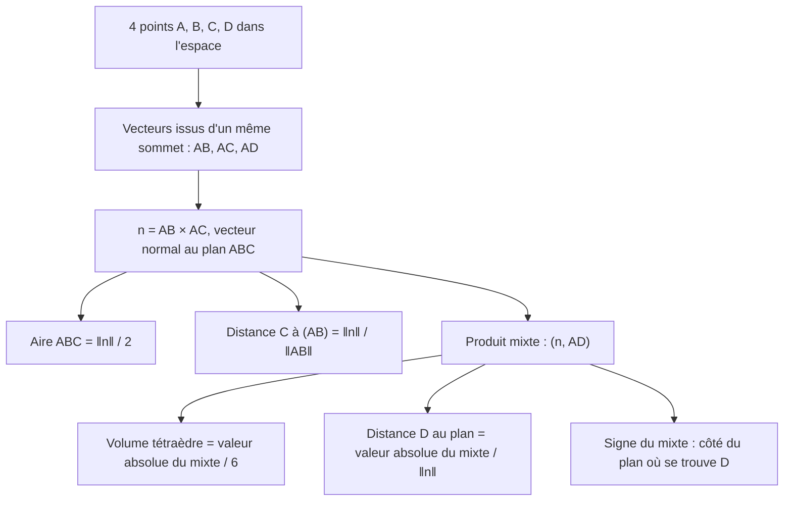
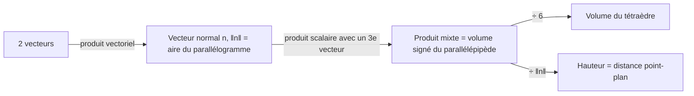

# 11. Produit vectoriel et produit mixte

> 🎯 **Objectif** : calculer produits vectoriels et produits mixtes pour obtenir **aires**, **volumes**, **distances** (point-droite, point-plan) et angles dans l'espace. C'est « Test 3 Pb 4 » et l'exercice « Maison des lapins crétins » des TE F-2.

---

## 1. Introduction & définitions

### 1.1 Produit vectoriel (seulement dans $\mathbb{R}^3$)

$$\vec{a}\times\vec{b} = \begin{pmatrix} a_1 \\ a_2 \\ a_3 \end{pmatrix}\times\begin{pmatrix} b_1 \\ b_2 \\ b_3 \end{pmatrix} = \begin{pmatrix} a_2b_3 - a_3b_2 \\ a_3b_1 - a_1b_3 \\ a_1b_2 - a_2b_1 \end{pmatrix}$$

> 💡 **Astuce de calcul** : pour la 1re composante, on cache la 1re ligne et on fait « produit en croix » des lignes 2 et 3 ; pour la 2e, on cache la 2e ligne et on fait les lignes 3 puis 1 ; pour la 3e, lignes 1 et 2.

**Propriétés géométriques** — le résultat est un **vecteur** :

- **perpendiculaire** à $\vec{a}$ et à $\vec{b}$ (c'est un vecteur normal au plan qu'ils engendrent) ;
- de sens donné par la **règle de la main droite** ($\vec{a}$ = pouce, $\vec{b}$ = index, $\vec{a}\times\vec{b}$ = majeur) ;
- de norme égale à l'**aire du parallélogramme** construit sur $\vec{a}$ et $\vec{b}$ :

$$\lVert\vec{a}\times\vec{b}\rVert = \lVert\vec{a}\rVert\,\lVert\vec{b}\rVert\sin\gamma$$

**Propriétés algébriques** : anticommutatif $\vec{b}\times\vec{a} = -\vec{a}\times\vec{b}$ ; $\vec{a}\times\vec{a} = \vec{0}$ ; $\vec{a}\times\vec{b} = \vec{0} \iff \vec{a} \parallel \vec{b}$ ; **non associatif** : en général $\vec{a}\times(\vec{b}\times\vec{c}) \neq (\vec{a}\times\vec{b})\times\vec{c}$.

**Identité de Lagrange** (pratique pour une aire sans calculer le produit vectoriel) :

$$\lVert\vec{a}\times\vec{b}\rVert^2 = \lVert\vec{a}\rVert^2\lVert\vec{b}\rVert^2 - (\vec{a}, \vec{b})^2$$

### 1.2 Produit mixte

Le **produit mixte** de trois vecteurs de $\mathbb{R}^3$ est le **nombre** :

$$[\vec{a}, \vec{b}, \vec{c}] = (\vec{a}\times\vec{b}, \vec{c}) = \det\begin{pmatrix} a_1 & b_1 & c_1 \\ a_2 & b_2 & c_2 \\ a_3 & b_3 & c_3 \end{pmatrix}$$

- $\lvert[\vec{a}, \vec{b}, \vec{c}]\rvert$ est le **volume du parallélépipède** construit sur les trois vecteurs.
- $[\vec{a}, \vec{b}, \vec{c}] = 0 \iff$ les trois vecteurs sont **coplanaires** (linéairement dépendants).
- Il est invariant par permutation circulaire : $[\vec{a}, \vec{b}, \vec{c}] = [\vec{b}, \vec{c}, \vec{a}] = [\vec{c}, \vec{a}, \vec{b}]$ ; il change de signe si l'on échange deux vecteurs.
- Son **signe** indique de quel côté du plan $(\vec{a}, \vec{b})$ se trouve $\vec{c}$ : positif si $\vec{c}$ est du côté de $\vec{a}\times\vec{b}$.

### 1.3 Le formulaire géométrique

| Grandeur | Formule |
| --- | --- |
| Aire du parallélogramme $ABDC$ | $\lVert\overrightarrow{AB}\times\overrightarrow{AC}\rVert$ |
| Aire du triangle $ABC$ | $\frac{1}{2}\lVert\overrightarrow{AB}\times\overrightarrow{AC}\rVert$ |
| Distance de $C$ à la droite $(AB)$ | $\dfrac{\lVert\overrightarrow{AB}\times\overrightarrow{AC}\rVert}{\lVert\overrightarrow{AB}\rVert}$ (aire / base) |
| Volume du parallélépipède | $\lvert[\overrightarrow{AB}, \overrightarrow{AC}, \overrightarrow{AD}]\rvert$ |
| Volume du tétraèdre $ABCD$ | $\frac{1}{6}\lvert[\overrightarrow{AB}, \overrightarrow{AC}, \overrightarrow{AD}]\rvert$ |
| Volume d'une pyramide à base parallélogramme | $\frac{1}{3}\lvert[\dots]\rvert$ (deux tétraèdres) |
| Distance de $D$ au plan $(ABC)$ | $\dfrac{\lvert[\overrightarrow{AB}, \overrightarrow{AC}, \overrightarrow{AD}]\rvert}{\lVert\overrightarrow{AB}\times\overrightarrow{AC}\rVert}$ (volume / aire de base) |

Les deux formules de distance découlent de « aire = base × hauteur » et « volume = aire de base × hauteur ».

---

## 2. Méthodes de résolution

**Conseils** :

- Toujours partir **du même sommet** pour les trois vecteurs.
- Calculer $\vec{n} = \overrightarrow{AB}\times\overrightarrow{AC}$ **une seule fois** et le réutiliser.
- Vérifier le produit vectoriel : $(\vec{n}, \overrightarrow{AB}) = 0$ et $(\vec{n}, \overrightarrow{AC}) = 0$.

---

## 3. Exemples de calculs détaillés

### Exemple 1 — Le problème complet (Test 3 Pb 4, variante A)

*$A(1; -1; 2)$, $B(2; 0; 1)$, $C(3; -4; 1)$, $D(2; 1; 5)$ en mètres. $\mathcal{P}$ est le plan $(ABC)$ et $\mathcal{L}$ la droite $(AD)$.*

**Vecteurs de base :**

$$\overrightarrow{AB} = \begin{pmatrix} 1 \\ 1 \\ -1 \end{pmatrix} \qquad \overrightarrow{AC} = \begin{pmatrix} 2 \\ -3 \\ -1 \end{pmatrix} \qquad \overrightarrow{AD} = \begin{pmatrix} 1 \\ 2 \\ 3 \end{pmatrix}$$

**Produit vectoriel :**

$$\overrightarrow{AB}\times\overrightarrow{AC} = \begin{pmatrix} 1\cdot(-1) - (-1)(-3) \\ (-1)\cdot 2 - 1\cdot(-1) \\ 1\cdot(-3) - 1\cdot 2 \end{pmatrix} = \begin{pmatrix} -4 \\ -1 \\ -5 \end{pmatrix}, \qquad \lVert\cdot\rVert = \sqrt{16 + 1 + 25} = \sqrt{42}$$

Vérification : $(\vec{n}, \overrightarrow{AB}) = -4 - 1 + 5 = 0$ ✓.

**a) Aire du triangle $ABC$** : $\frac{\sqrt{42}}{2} \approx 3{,}24$ m².

**b) Distance de $C$ à $(AB)$** : $\frac{\sqrt{42}}{\sqrt{3}} = \sqrt{14} \approx 3{,}74$ m.

**Produit mixte :**

$$[\overrightarrow{AB}, \overrightarrow{AC}, \overrightarrow{AD}] = (-4)(1) + (-1)(2) + (-5)(3) = -21$$

**c) Distance de $D$ au plan** : $\frac{\lvert -21 \rvert}{\sqrt{42}} = \frac{21}{\sqrt{42}} = \frac{\sqrt{42}}{2} \approx 3{,}24$ m (même valeur que l'aire, par hasard).

**d) Volume du tétraèdre** : $\frac{21}{6} = \frac{7}{2} = 3{,}5$ m³.

**e) Angle entre $\vec{n}$ (normal, côté $D$) et $\overrightarrow{AD}$.** Le mixte est **négatif** : $D$ est du côté **opposé** à $\overrightarrow{AB}\times\overrightarrow{AC}$. Le normal qui pointe vers $D$ est donc $\vec{n} = \begin{pmatrix} 4 \\ 1 \\ 5 \end{pmatrix}$ :

$$\cos\gamma = \frac{(\vec{n}, \overrightarrow{AD})}{\lVert\vec{n}\rVert\,\lVert\overrightarrow{AD}\rVert} = \frac{4 + 2 + 15}{\sqrt{42}\,\sqrt{14}} = \frac{21}{14\sqrt{3}} = \frac{\sqrt{3}}{2} \quad\Rightarrow\quad \gamma = 30°$$

**f) Point $X \in \mathcal{L}$, du même côté que $D$, tel que $V(ABCX) = 7$ m³.** On pose $\overrightarrow{AX} = \lambda\overrightarrow{AD}$ avec $\lambda > 0$. Le produit mixte est linéaire :

$$V(ABCX) = \frac{1}{6}\lvert[\overrightarrow{AB}, \overrightarrow{AC}, \lambda\overrightarrow{AD}]\rvert = \frac{21\lambda}{6} = 7 \quad\Rightarrow\quad \lambda = 2$$

$$\overrightarrow{OX} = \overrightarrow{OA} + 2\overrightarrow{AD} = \begin{pmatrix} 1 + 2 \\ -1 + 4 \\ 2 + 6 \end{pmatrix} \quad\Rightarrow\quad X(3; 3; 8)$$

### Exemple 2 — Calculs directs (Test 3 Pb 4, variante A)

*$\vec{a} = \begin{pmatrix} 1 \\ 1 \\ 0 \end{pmatrix}$, $\vec{b} = \begin{pmatrix} 1 \\ -1 \\ 3 \end{pmatrix}$, $\vec{c} = \begin{pmatrix} 3 \\ 1 \\ -1 \end{pmatrix}$ : calculer $(\vec{a}, \vec{b})$, $\vec{a}\times\vec{b}$, $[\vec{a}, \vec{b}, \vec{c}]$.*

$$(\vec{a}, \vec{b}) = 1 - 1 + 0 = 0 \qquad \vec{a}\times\vec{b} = \begin{pmatrix} 1\cdot 3 - 0\cdot(-1) \\ 0\cdot 1 - 1\cdot 3 \\ 1\cdot(-1) - 1\cdot 1 \end{pmatrix} = \begin{pmatrix} 3 \\ -3 \\ -2 \end{pmatrix}$$

$$[\vec{a}, \vec{b}, \vec{c}] = (\vec{a}\times\vec{b}, \vec{c}) = 9 - 3 + 2 = 8$$

### Exemple 3 — Pyramide (TE F-2, « Maison des lapins crétins »)

*Une pyramide a pour base le carré $ABCD$ au sol avec $A(1; 1; 0)$, $B(5; -1; 0)$, $C(7; 3; 0)$, $D(3; 5; 0)$ et pour sommet $S(4; 2; 9)$. Montrer que la base est un carré et calculer le volume.*

**Carré** : $\overrightarrow{AB} = \begin{pmatrix} 4 \\ -2 \\ 0 \end{pmatrix}$, $\overrightarrow{AD} = \begin{pmatrix} 2 \\ 4 \\ 0 \end{pmatrix}$, $\overrightarrow{DC} = \begin{pmatrix} 4 \\ -2 \\ 0 \end{pmatrix} = \overrightarrow{AB}$ (parallélogramme). $\lVert\overrightarrow{AB}\rVert = \lVert\overrightarrow{AD}\rVert = \sqrt{20}$ (losange) et $(\overrightarrow{AB}, \overrightarrow{AD}) = 8 - 8 = 0$ (angle droit) : c'est un **carré**.

**Volume** : la pyramide se coupe en deux tétraèdres $ABDS$ et $BCDS$ de même volume, donc $V = 2\cdot\frac{1}{6}\lvert[\overrightarrow{AB}, \overrightarrow{AD}, \overrightarrow{AS}]\rvert = \frac{1}{3}\lvert[\dots]\rvert$ :

$$\overrightarrow{AB}\times\overrightarrow{AD} = \begin{pmatrix} 0 \\ 0 \\ 16 + 4 \end{pmatrix} = \begin{pmatrix} 0 \\ 0 \\ 20 \end{pmatrix} \qquad \overrightarrow{AS} = \begin{pmatrix} 3 \\ 1 \\ 9 \end{pmatrix} \qquad [\dots] = 20\cdot 9 = 180$$

$$V = \frac{180}{3} = 60 \text{ unités}^3$$

Contrôle avec la formule du collège : aire de base $20$, hauteur $9$, $V = \frac{1}{3}\cdot 20\cdot 9 = 60$ ✓.

---

## 4. Visualisation : de l'aire au volume

---

## 5. Exercices pratiques

### Exercice 1 — Calculs de base (Test 3 Pb 4, variante B)

Pour $\vec{a} = \begin{pmatrix} 1 \\ 2 \\ 0 \end{pmatrix}$, $\vec{b} = \begin{pmatrix} -1 \\ 1 \\ 2 \end{pmatrix}$, $\vec{c} = \begin{pmatrix} 2 \\ 1 \\ -1 \end{pmatrix}$, calculer $(\vec{a}, \vec{b})$, $\vec{a}\times\vec{b}$ et $[\vec{a}, \vec{b}, \vec{c}]$. Les trois vecteurs sont-ils coplanaires ?

💡 Cliquez pour voir l'indice

Calculez $\vec{a}\times\vec{b}$ composante par composante, vérifiez qu'il est orthogonal à $\vec{a}$, puis faites le produit scalaire avec $\vec{c}$.

**Solution détaillée**

1. $(\vec{a}, \vec{b}) = -1 + 2 + 0 = 1$.
2. $\vec{a}\times\vec{b} = \begin{pmatrix} 2\cdot 2 - 0\cdot 1 \\ 0\cdot(-1) - 1\cdot 2 \\ 1\cdot 1 - 2\cdot(-1) \end{pmatrix} = \begin{pmatrix} 4 \\ -2 \\ 3 \end{pmatrix}$. Contrôle : $(\vec{a}\times\vec{b}, \vec{a}) = 4 - 4 + 0 = 0$ ✓.
3. $[\vec{a}, \vec{b}, \vec{c}] = 8 - 2 - 3 = 3 \neq 0$ : les vecteurs **ne sont pas** coplanaires.

### Exercice 2 — Tétraèdre (Test 3 Pb 4, 2023)

$A(1; 2; 2)$, $B(2; 1; -2)$, $C(1; 1; 1)$, $D(0; -2; 3)$. Calculer a) le volume du tétraèdre $ABCD$ ; b) l'aire du triangle $ABC$ ; c) la distance de $D$ au plan $(ABC)$.

💡 Cliquez pour voir l'indice

Partez de $A$ : $\overrightarrow{AB}$, $\overrightarrow{AC}$, $\overrightarrow{AD}$. Calculez $\vec{n} = \overrightarrow{AB}\times\overrightarrow{AC}$, puis $(\vec{n}, \overrightarrow{AD})$.

**Solution détaillée**

1. $\overrightarrow{AB} = \begin{pmatrix} 1 \\ -1 \\ -4 \end{pmatrix}$, $\overrightarrow{AC} = \begin{pmatrix} 0 \\ -1 \\ -1 \end{pmatrix}$, $\overrightarrow{AD} = \begin{pmatrix} -1 \\ -4 \\ 1 \end{pmatrix}$.
2. $\vec{n} = \overrightarrow{AB}\times\overrightarrow{AC} = \begin{pmatrix} (-1)(-1) - (-4)(-1) \\ (-4)\cdot 0 - 1\cdot(-1) \\ 1\cdot(-1) - (-1)\cdot 0 \end{pmatrix} = \begin{pmatrix} -3 \\ 1 \\ -1 \end{pmatrix}$, $\lVert\vec{n}\rVert = \sqrt{11}$.
3. Mixte : $(\vec{n}, \overrightarrow{AD}) = 3 - 4 - 1 = -2$.

a) $V = \frac{\lvert -2 \rvert}{6} = \frac{1}{3}$.

b) Aire $= \frac{\sqrt{11}}{2} \approx 1{,}66$.

c) $d = \frac{2}{\sqrt{11}} \approx 0{,}60$.

### Exercice 3 — Vrai ou faux (Test 3 Pb 4, 2023)

a) Pour tous $\vec{a}, \vec{b} \in \mathbb{R}^3$ : $(\vec{a} + \vec{b})\times(\vec{a} - \vec{b}) = 2(\vec{b}\times\vec{a})$. b) Si $\vec{a}, \vec{b}, \vec{c}$ sont coplanaires, alors $(\vec{a}\times\vec{b})\times\vec{c} = \vec{0}$. c) Si $\lVert\overrightarrow{AB}\rVert = 4$, $\lVert\overrightarrow{AC}\rVert = 3$ et $\angle BAC = 30°$, alors $\lVert\overrightarrow{AB}\times\overrightarrow{AC}\rVert = 6$. d) Pour $\vec{e}_1, \vec{e}_2, \vec{e}_3$ la base canonique, $[\vec{e}_1, \vec{e}_2, \vec{e}_3] = 1$.

💡 Cliquez pour voir l'indice

a) Développez en utilisant $\vec{a}\times\vec{a} = \vec{0}$ et l'anticommutativité. b) Où se trouve $\vec{a}\times\vec{b}$ par rapport au plan ? Est-il parallèle à $\vec{c}$ ? c) $\lVert\vec{a}\times\vec{b}\rVert = \lVert\vec{a}\rVert\lVert\vec{b}\rVert\sin\gamma$.

**Solution détaillée**

a) **Vrai** : $(\vec{a} + \vec{b})\times(\vec{a} - \vec{b}) = \vec{a}\times\vec{a} - \vec{a}\times\vec{b} + \vec{b}\times\vec{a} - \vec{b}\times\vec{b} = \vec{0} + \vec{b}\times\vec{a} + \vec{b}\times\vec{a} - \vec{0} = 2(\vec{b}\times\vec{a})$.

b) **Faux** : $\vec{a}\times\vec{b}$ est perpendiculaire au plan, et $\vec{c}$ est dans le plan ; ils sont orthogonaux, donc leur produit **scalaire** est nul, mais leur produit **vectoriel** a pour norme $\lVert\vec{a}\times\vec{b}\rVert\lVert\vec{c}\rVert \neq 0$ en général.

c) **Vrai** : $4\cdot 3\cdot\sin 30° = 12\cdot\frac{1}{2} = 6$.

d) **Vrai** : $\vec{e}_1\times\vec{e}_2 = \vec{e}_3$ et $(\vec{e}_3, \vec{e}_3) = 1$ (c'est le volume du cube unité).
