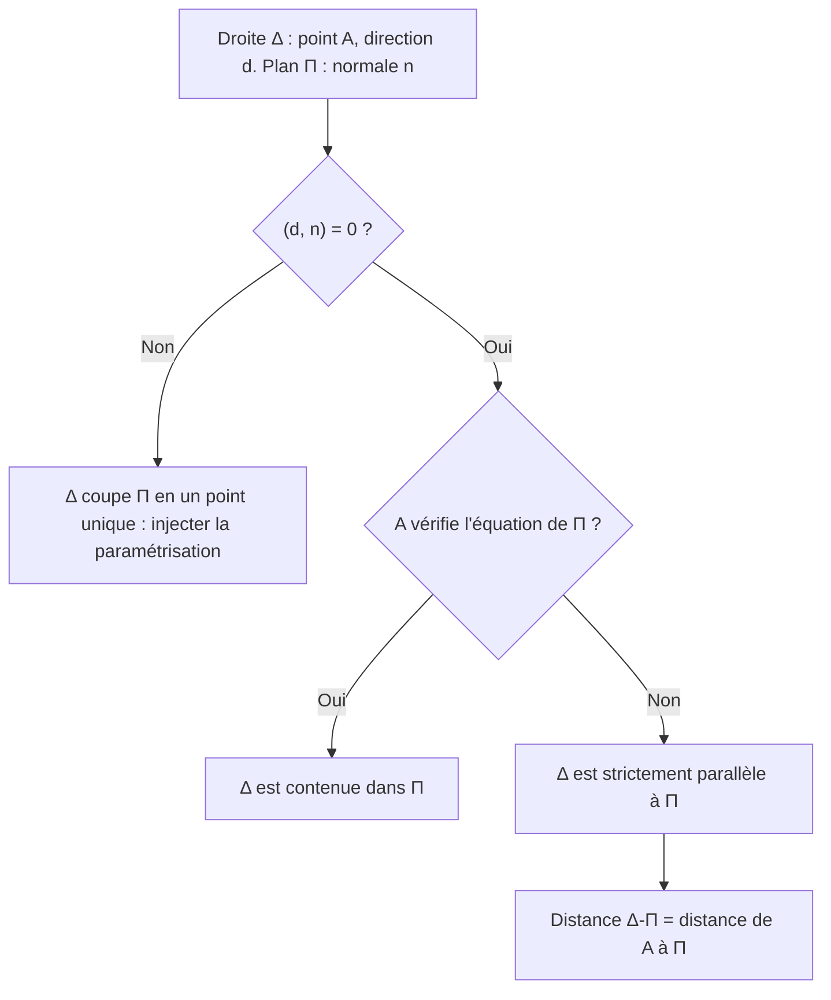
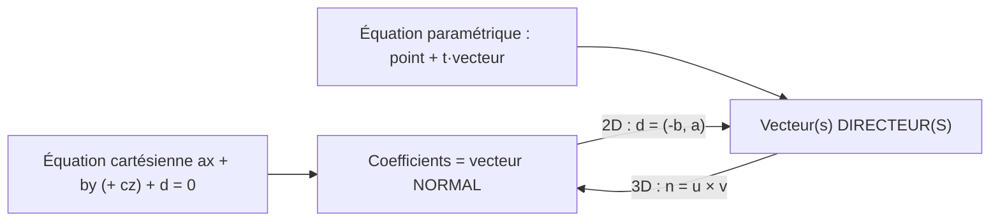

# 12. Droites et plans (géométrie analytique)

> 🎯 **Objectif** : passer d'une forme d'équation à l'autre (cartésienne ↔ paramétrique), calculer intersections, distances et angles pour des droites du plan et des droites/plans de l'espace. C'est l'exercice « Droites & Co » et « Plan » des TE F-2.

---

## 1. Introduction & définitions

### 1.1 Droites dans le plan $$\mathbb{R}^2$$

Une droite peut s'écrire de trois façons :

| Forme | Équation | Informations lisibles |
| --- | --- | --- |
| Cartésienne (implicite) | $$ax + by + c = 0$$ | vecteur **normal** $$\vec{n} = (a; b)$$ |
| Explicite | $$y = mx + p$$ | pente $$m$$, ordonnée à l'origine $$p$$ |
| Paramétrique | $$x = x_0 + t\,d_1$$ et $$y = y_0 + t\,d_2$$, avec $$t \in \mathbb{R}$$ | point $$(x_0; y_0)$$, vecteur **directeur** $$\vec{d} = (d_1; d_2)$$ |

Liens : un vecteur directeur de $$ax + by + c = 0$$ est $$\vec{d} = \begin{pmatrix} -b \\ a \end{pmatrix}$$ ; la pente vaut $$m = \frac{d_2}{d_1}$$. Une droite verticale $$x = c$$ n'a pas de forme explicite.

### 1.2 Droites et plans dans l'espace $$\mathbb{R}^3$$

**Droite** : seulement la forme **paramétrique** (une équation cartésienne seule décrit un plan !) :

$$\Delta : \begin{pmatrix} x \\ y \\ z \end{pmatrix} = \begin{pmatrix} x_0 \\ y_0 \\ z_0 \end{pmatrix} + t\begin{pmatrix} d_1 \\ d_2 \\ d_3 \end{pmatrix}, \quad t \in \mathbb{R}$$

**Plan** :

- forme **cartésienne** $$ax + by + cz + d = 0$$, de vecteur normal $$\vec{n} = \begin{pmatrix} a \\ b \\ c \end{pmatrix}$$ ;
- forme **paramétrique** avec un point et **deux** vecteurs directeurs non colinéaires :

$$\Pi : \begin{pmatrix} x \\ y \\ z \end{pmatrix} = \overrightarrow{OP} + k\,\vec{u} + r\,\vec{v}, \quad k, r \in \mathbb{R}$$

Passage paramétrique → cartésien : $$\vec{n} = \vec{u}\times\vec{v}$$, puis $$d$$ en imposant que $$P$$ vérifie l'équation.

### 1.3 Distances

**Point–droite dans $$\mathbb{R}^2$$** et **point–plan dans $$\mathbb{R}^3$$** (même structure) :

$$d\left(P_0, \Delta\right) = \frac{\lvert ax_0 + by_0 + c \rvert}{\sqrt{a^2 + b^2}} \qquad d\left(P_0, \Pi\right) = \frac{\lvert ax_0 + by_0 + cz_0 + d \rvert}{\sqrt{a^2 + b^2 + c^2}}$$

**Point–droite dans $$\mathbb{R}^3$$** : $$d = \frac{\lVert\overrightarrow{AP_0}\times\vec{d}\rVert}{\lVert\vec{d}\rVert}$$ (voir chapitre 11).

### 1.4 Angles

- Entre deux droites : angle **aigu** entre leurs vecteurs directeurs, $$\cos\theta = \frac{\lvert(\vec{d}_1, \vec{d}_2)\rvert}{\lVert\vec{d}_1\rVert\lVert\vec{d}_2\rVert}$$.
- Entre deux plans : angle entre leurs **normales** (même formule avec $$\vec{n}_1, \vec{n}_2$$).
- Entre une droite et un plan : $$\sin\theta = \frac{\lvert(\vec{d}, \vec{n})\rvert}{\lVert\vec{d}\rVert\lVert\vec{n}\rVert}$$ (complémentaire de l'angle avec la normale).

---

## 2. Méthodes de résolution

### Méthode A — Paramétrique → cartésienne (dans le plan)

Isoler $$t$$ dans une équation, remplacer dans l'autre.

### Méthode B — Intersection

- **Deux droites de $$\mathbb{R}^2$$ cartésiennes** : résoudre le système $$2\times 2$$.
- **Droite paramétrique ∩ plan cartésien** : injecter $$x(t), y(t), z(t)$$ dans l'équation du plan → une équation en $$t$$.
- **Deux plans** : la droite d'intersection a pour direction $$\vec{n}_1\times\vec{n}_2$$ ; un point s'obtient en fixant une coordonnée (par exemple $$z = 0$$) et en résolvant le système restant.
- **Plan et axes** : poser deux coordonnées nulles.

### Méthode C — Position relative d'une droite et d'un plan

### Méthode D — Trois droites concourantes ?

Calculer l'intersection de deux d'entre elles, puis tester si ce point est sur la troisième.

---

## 3. Exemples de calculs détaillés

### Exemple 1 — Droites du plan (TE F-2, 2023, « Droites & Co »)

*$$\Delta_1 : -x + 2y + 1 = 0$$ ; $$\Delta_2 : x = -3t,\ y = t - \frac{4}{3}$$ ; $$\Delta_3 : x = -\frac{1}{2}$$.*

**a) Forme cartésienne de $$\Delta_2$$.** De $$x = -3t$$ : $$t = -\frac{x}{3}$$. Dans la 2e équation :

$$y = -\frac{x}{3} - \frac{4}{3} \iff 3y = -x - 4 \iff x + 3y + 4 = 0$$

**b) Les trois droites sont-elles concourantes ?**

- $$\Delta_1 \cap \Delta_3$$ : $$x = -\frac{1}{2}$$ dans $$\Delta_1$$ : $$\frac{1}{2} + 2y + 1 = 0 \iff y = -\frac{3}{4}$$. Point $$I_1\left(-\frac{1}{2}; -\frac{3}{4}\right)$$.
- $$\Delta_2 \cap \Delta_3$$ : $$-\frac{1}{2} + 3y + 4 = 0 \iff y = -\frac{7}{6}$$. Point $$I_2\left(-\frac{1}{2}; -\frac{7}{6}\right)$$.
- $$I_1 \neq I_2$$ : les trois droites **ne** se coupent **pas** en un même point.

**c) Distance du point $$P(-4; -7)$$ à $$\Delta_1$$** :

$$d = \frac{\lvert -(-4) + 2(-7) + 1 \rvert}{\sqrt{1 + 4}} = \frac{\lvert 4 - 14 + 1 \rvert}{\sqrt{5}} = \frac{9}{\sqrt{5}} \approx 4{,}02$$

**d) Angle entre $$\Delta_1$$ et $$\Delta_3$$.** Directeurs : $$\vec{d}_1 = \begin{pmatrix} 2 \\ 1 \end{pmatrix}$$ (car $$\vec{n}_1 = \begin{pmatrix} -1 \\ 2 \end{pmatrix}$$) et $$\vec{d}_3 = \begin{pmatrix} 0 \\ 1 \end{pmatrix}$$ :

$$\cos\theta = \frac{\lvert 0 + 1 \rvert}{\sqrt{5}\cdot 1} = \frac{1}{\sqrt{5}} \quad\Rightarrow\quad \theta \approx 63{,}4°$$

**e) Projection du normal $$\vec{n}_1$$ sur le directeur $$\vec{d}_2 = \begin{pmatrix} -3 \\ 1 \end{pmatrix}$$** :

$$\operatorname{proj}_{\vec{d}_2}(\vec{n}_1) = \frac{(\vec{n}_1, \vec{d}_2)}{(\vec{d}_2, \vec{d}_2)}\vec{d}_2 = \frac{3 + 2}{10}\begin{pmatrix} -3 \\ 1 \end{pmatrix} = \begin{pmatrix} -\frac{3}{2} \\ \frac{1}{2} \end{pmatrix}$$

### Exemple 2 — Un plan (TE F-2, 2023, « Plan »)

*$$\Pi : 3x - 2y + 4z - 2 = 0$$.*

**a) Intersections avec les axes** (on annule deux coordonnées) :

- axe $$Ox$$ ($$y = z = 0$$) : $$3x = 2$$, $$I_x\left(\frac{2}{3}; 0; 0\right)$$ ;
- axe $$Oy$$ : $$-2y = 2$$, $$I_y(0; -1; 0)$$ ;
- axe $$Oz$$ : $$4z = 2$$, $$I_z\left(0; 0; \frac{1}{2}\right)$$.

**b) Forme paramétrique.** Point $$P = I_y$$ ; directeurs $$\vec{u} = \overrightarrow{I_yI_x} = \begin{pmatrix} \frac{2}{3} \\ 1 \\ 0 \end{pmatrix}$$, $$\vec{v} = \overrightarrow{I_yI_z} = \begin{pmatrix} 0 \\ 1 \\ \frac{1}{2} \end{pmatrix}$$ :

$$\Pi : \begin{cases} x = \frac{2}{3}k \\ y = -1 + k + r \\ z = \frac{1}{2}r \end{cases}, \quad k, r \in \mathbb{R}$$

Contrôle : $$3\cdot\frac{2}{3}k - 2(-1 + k + r) + 4\cdot\frac{1}{2}r - 2 = 2k + 2 - 2k - 2r + 2r - 2 = 0$$ ✓.

**c) Intersection avec $$\Delta : x = -1 - t,\ y = 4 + t,\ z = 2 - t$$.** On injecte :

$$3(-1 - t) - 2(4 + t) + 4(2 - t) - 2 = 0 \iff -3 - 3t - 8 - 2t + 8 - 4t - 2 = 0 \iff -9t - 5 = 0 \iff t = -\frac{5}{9}$$

$$I = \left(-1 + \frac{5}{9};\ 4 - \frac{5}{9};\ 2 + \frac{5}{9}\right) = \left(-\frac{4}{9};\ \frac{31}{9};\ \frac{23}{9}\right)$$

### Exemple 3 — Droite parallèle à un plan (TE F-2, 2026)

*$$\Delta : x = 2 + t,\ y = 1 - 4t,\ z = -2t$$ ; $$\Pi : 6x - y + 5z + 5 = 0$$.*

1. $$\vec{d} = \begin{pmatrix} 1 \\ -4 \\ -2 \end{pmatrix}$$, $$\vec{n} = \begin{pmatrix} 6 \\ -1 \\ 5 \end{pmatrix}$$ : $$(\vec{d}, \vec{n}) = 6 + 4 - 10 = 0$$. La droite est **parallèle** au plan.
2. $$A(2; 1; 0) \in \Delta$$ : $$12 - 1 + 0 + 5 = 16 \neq 0$$, donc $$A \notin \Pi$$. La droite n'est **pas contenue** dans le plan.
3. Distance :

$$d(\Delta, \Pi) = d(A, \Pi) = \frac{\lvert 16 \rvert}{\sqrt{36 + 1 + 25}} = \frac{16}{\sqrt{62}} \approx 2{,}03$$

### Exemple 4 — Deux plans (TE F-2, 2024, « Plans »)

*$$\Pi_1 : x = 1 + k,\ y = 2 + r,\ z = 3 - k + 4r$$ et $$\Pi_2 : 2x + y - z - 1 = 0$$.*

**a) Forme cartésienne de $$\Pi_1$$.** $$\vec{u} = \begin{pmatrix} 1 \\ 0 \\ -1 \end{pmatrix}$$, $$\vec{v} = \begin{pmatrix} 0 \\ 1 \\ 4 \end{pmatrix}$$ :

$$\vec{n}_1 = \vec{u}\times\vec{v} = \begin{pmatrix} 0\cdot 4 - (-1)\cdot 1 \\ (-1)\cdot 0 - 1\cdot 4 \\ 1\cdot 1 - 0\cdot 0 \end{pmatrix} = \begin{pmatrix} 1 \\ -4 \\ 1 \end{pmatrix}$$

$$x - 4y + z + d = 0$$ passe par $$(1; 2; 3)$$ : $$1 - 8 + 3 + d = 0$$, donc $$d = 4$$. $$\Pi_1 : x - 4y + z + 4 = 0$$.

**b) Les plans se coupent-ils ?** $$\vec{n}_1 = (1, -4, 1)$$ et $$\vec{n}_2 = (2, 1, -1)$$ ne sont pas colinéaires : oui. Direction de la droite d'intersection :

$$\vec{n}_1\times\vec{n}_2 = \begin{pmatrix} (-4)(-1) - 1\cdot 1 \\ 1\cdot 2 - 1\cdot(-1) \\ 1\cdot 1 - (-4)\cdot 2 \end{pmatrix} = \begin{pmatrix} 3 \\ 3 \\ 9 \end{pmatrix} \parallel \begin{pmatrix} 1 \\ 1 \\ 3 \end{pmatrix}$$

**c) Angle entre les plans** :

$$\cos\theta = \frac{\lvert(\vec{n}_1, \vec{n}_2)\rvert}{\lVert\vec{n}_1\rVert\lVert\vec{n}_2\rVert} = \frac{\lvert 2 - 4 - 1 \rvert}{\sqrt{18}\sqrt{6}} = \frac{3}{\sqrt{108}} = \frac{1}{2\sqrt{3}} \quad\Rightarrow\quad \theta \approx 73{,}2°$$

---

## 4. Visualisation : vecteur normal ou directeur ?

---

## 5. Exercices pratiques

### Exercice 1 — Droites du plan (TE F-2, 2024)

$$\Delta_1 : \frac{1}{2}x - y - \frac{1}{2} = 0$$ et $$\Delta_2 : x = -3 - 3t,\ y = t - \frac{1}{3}$$. a) Écrire $$\Delta_2$$ sous forme cartésienne. b) Calculer l'intersection de $$\Delta_1$$ et $$\Delta_2$$. c) Calculer l'angle entre les deux droites.

💡 Cliquez pour voir l'indice

a) $$t = y + \frac{1}{3}$$, à injecter dans $$x$$. b) Résolvez le système $$2\times 2$$. c) Utilisez les vecteurs directeurs $$\vec{d}_1 = \begin{pmatrix} 2 \\ 1 \end{pmatrix}$$ et $$\vec{d}_2 = \begin{pmatrix} -3 \\ 1 \end{pmatrix}$$.

**Solution détaillée**

a) $$x = -3 - 3\left(y + \frac{1}{3}\right) = -4 - 3y$$, donc $$\Delta_2 : x + 3y + 4 = 0$$.

b) De $$\Delta_1$$ : $$x = 2y + 1$$. Dans $$\Delta_2$$ : $$2y + 1 + 3y + 4 = 0 \iff y = -1$$, puis $$x = -1$$. Intersection $$(-1; -1)$$.

c) $$\cos\theta = \frac{\lvert -6 + 1 \rvert}{\sqrt{5}\sqrt{10}} = \frac{5}{\sqrt{50}} = \frac{1}{\sqrt{2}}$$, donc $$\theta = 45°$$.

### Exercice 2 — Droite et plan

Soit $$\Pi : 2x - y + 2z - 6 = 0$$ et $$\Delta : x = 1 + t,\ y = 2t,\ z = 3 - t$$. a) Position relative ? b) Distance de l'origine au plan. c) Angle entre $$\Delta$$ et $$\Pi$$.

💡 Cliquez pour voir l'indice

Calculez $$(\vec{d}, \vec{n})$$. Pour c), l'angle droite-plan se calcule avec un **sinus**.

**Solution détaillée**

a) $$\vec{d} = (1, 2, -1)$$, $$\vec{n} = (2, -1, 2)$$ : $$(\vec{d}, \vec{n}) = 2 - 2 - 2 = -2 \neq 0$$. Intersection unique : $$2(1 + t) - 2t + 2(3 - t) - 6 = 0 \iff 2 - 2t = 0 \iff t = 1$$, point $$(2; 2; 2)$$.

b) $$d(O, \Pi) = \frac{\lvert -6 \rvert}{\sqrt{4 + 1 + 4}} = \frac{6}{3} = 2$$.

c) $$\sin\theta = \frac{\lvert -2 \rvert}{\sqrt{6}\cdot 3} = \frac{2}{3\sqrt{6}} \approx 0{,}272$$, donc $$\theta \approx 15{,}8°$$.

### Exercice 3 — Plan par trois points

Trouver l'équation cartésienne du plan passant par $$A(1; 0; 0)$$, $$B(0; 2; 0)$$, $$C(0; 0; 3)$$, puis la distance de $$D(1; 2; 3)$$ à ce plan.

💡 Cliquez pour voir l'indice

$$\vec{n} = \overrightarrow{AB}\times\overrightarrow{AC}$$, puis $$d$$ avec le point $$A$$. (Astuce : un plan qui coupe les axes en $$a$$, $$b$$, $$c$$ a pour équation $$\frac{x}{a} + \frac{y}{b} + \frac{z}{c} = 1$$.)

**Solution détaillée**

1. $$\overrightarrow{AB} = (-1, 2, 0)$$, $$\overrightarrow{AC} = (-1, 0, 3)$$.
2. $$\vec{n} = \begin{pmatrix} 2\cdot 3 - 0\cdot 0 \\ 0\cdot(-1) - (-1)\cdot 3 \\ (-1)\cdot 0 - 2\cdot(-1) \end{pmatrix} = \begin{pmatrix} 6 \\ 3 \\ 2 \end{pmatrix}$$.
3. $$6x + 3y + 2z + d = 0$$ par $$A$$ : $$6 + d = 0$$, $$d = -6$$. Plan : $$6x + 3y + 2z - 6 = 0$$ (équivalent à $$\frac{x}{1} + \frac{y}{2} + \frac{z}{3} = 1$$ ✓).
4. $$d(D, \Pi) = \frac{\lvert 6 + 6 + 6 - 6 \rvert}{\sqrt{36 + 9 + 4}} = \frac{12}{7} \approx 1{,}71$$.
