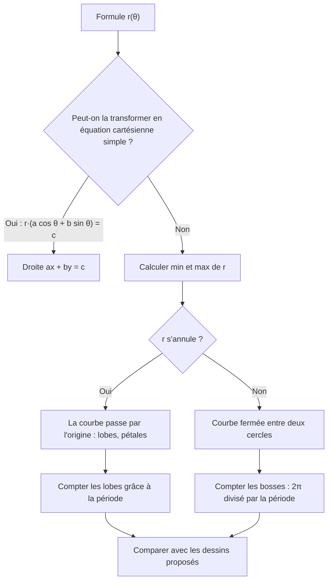
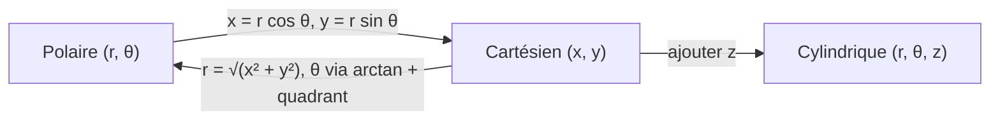

# 13. Coordonnées polaires et courbes polaires

> 🎯 **Objectif** : convertir entre coordonnées cartésiennes et polaires (ou cylindriques), reconnaître une courbe polaire $$r(\theta)$$ à partir de sa formule, et esquisser une courbe à partir du graphe de $$r$$ en fonction de $$\theta$$. C'est l'exercice « Courbes polaires » des TE F-2.

---

## 1. Introduction & définitions

### 1.1 Repérer un point par une distance et un angle

Au lieu de donner $$(x; y)$$, on peut donner :

- $$r \geq 0$$ : la **distance** du point à l'origine ;
- $$\theta$$ : l'**angle** entre l'axe $$Ox$$ positif et la demi-droite $$[OP)$$.

Ce sont les **coordonnées polaires** $$(r; \theta)$$. C'est exactement le module et l'argument d'un nombre complexe (chapitre 7).

**Polaire → cartésien** :

$$x = r\cos\theta \qquad y = r\sin\theta$$

**Cartésien → polaire** :

$$r = \sqrt{x^2 + y^2} \qquad \tan\theta = \frac{y}{x} \quad \text{(avec correction de quadrant !)}$$

> ⚠️ Comme pour l'argument d'un complexe, si $$x < 0$$ il faut ajouter $$\pi$$ à $$\arctan\frac{y}{x}$$.

### 1.2 Coordonnées cylindriques (dans l'espace)

On garde la hauteur $$z$$ et on passe en polaire dans le plan horizontal : $$(r; \theta; z)$$ avec $$x = r\cos\theta$$, $$y = r\sin\theta$$, $$z = z$$.

### 1.3 Courbes polaires

Une **courbe polaire** est l'ensemble des points $$(r(\theta); \theta)$$ lorsque $$\theta$$ parcourt un intervalle. On la lit comme un **radar** : pour chaque direction $$\theta$$, on s'éloigne de l'origine de la distance $$r(\theta)$$.

| Équation polaire | Équation cartésienne | Courbe |
| --- | --- | --- |
| $$r = R$$ | $$x^2 + y^2 = R^2$$ | cercle de centre $$O$$ |
| $$\theta = \theta_0$$ | $$y = \tan(\theta_0)\,x$$ | demi-droite issue de $$O$$ |
| $$r = \frac{c}{a\cos\theta + b\sin\theta}$$ | $$ax + by = c$$ | droite |
| $$r = 2a\sin\theta$$ | $$x^2 + (y - a)^2 = a^2$$ | cercle passant par $$O$$ |
| $$r = a + b\cos(n\theta)$$, $$a > b > 0$$ | | « fleur » à $$n$$ bosses |
| $$r = a\,\theta$$ | | spirale d'Archimède |

### 1.4 Lire une courbe polaire

- **Nombre de bosses** : une fonction $$r = a + b\cos(n\theta)$$ ou $$a + b\sin(n\theta)$$ a pour période $$\frac{2\pi}{n}$$, donc elle présente **$$n$$ bosses** sur un tour. Avec un **carré** ($$\cos^2(n\theta)$$), la période est divisée par 2 : $$2n$$ bosses.
- **Rayon minimal / maximal** : les bornes de $$r$$ donnent le cercle intérieur et le cercle extérieur entre lesquels la courbe oscille.
- **Passage par l'origine** : là où $$r(\theta) = 0$$.
- **Symétries** : si $$r(-\theta) = r(\theta)$$, la courbe est symétrique par rapport à l'axe $$Ox$$.

---

## 2. Méthodes de résolution

### Méthode A — Associer une formule à un dessin

### Méthode B — Esquisser une courbe à partir du graphe $$r(\theta)$$

1. Lire $$r$$ pour des angles clés : $$\theta = 0$$ (point sur l'axe $$Ox$$ positif), $$\frac{\pi}{2}$$ (axe $$Oy$$ positif), $$\pi$$ et $$-\pi$$ (axe $$Ox$$ négatif), $$-\frac{\pi}{2}$$ (axe $$Oy$$ négatif).
2. Repérer où $$r = 0$$ (la courbe touche l'origine) et où $$r \to +\infty$$ (la courbe part à l'infini dans cette direction).
3. Relier les points en tournant dans le sens de $$\theta$$ croissant.

### Méthode C — Transformer une équation cartésienne en polaire (et inversement)

- Remplacer $$x = r\cos\theta$$, $$y = r\sin\theta$$, $$x^2 + y^2 = r^2$$.
- Dans l'autre sens, multiplier par $$r$$ si besoin pour faire apparaître $$r\cos\theta$$, $$r\sin\theta$$ ou $$r^2$$.

---

## 3. Exemples de calculs détaillés

### Exemple 1 — Associer formules et dessins (TE F-2, 2026)

*Associer à chaque courbe le bon graphique : a) $$r = 1 + \sin(2\theta)$$ ; b) $$r = \frac{2}{\cos\theta + 2\sin\theta}$$ ; c) $$r = 2 + \cos^2(4\theta)$$.*

**b)** On multiplie par le dénominateur : $$r\cos\theta + 2r\sin\theta = 2$$, soit $$x + 2y = 2$$. C'est une **droite** coupant les axes en $$(2; 0)$$ et $$(0; 1)$$.

**c)** $$\cos^2(4\theta) \in [0, 1]$$, donc $$r \in [2, 3]$$ : la courbe **ne passe pas** par l'origine et reste entre les cercles de rayons $$2$$ et $$3$$. Période de $$\cos^2(4\theta)$$ : $$\frac{\pi}{4}$$, donc $$\frac{2\pi}{\pi/4} = 8$$ bosses. C'est une **fleur à 8 bosses**.

**a)** $$r = 1 + \sin(2\theta) \in [0, 2]$$ :

- $$r = 0$$ quand $$\sin(2\theta) = -1$$, soit $$\theta = -\frac{\pi}{4}$$ et $$\theta = \frac{3\pi}{4}$$ : la courbe **touche l'origine** dans les directions des quadrants II et IV ;
- $$r = 2$$ (maximum) quand $$\theta = \frac{\pi}{4}$$ ou $$\frac{5\pi}{4}$$ : deux grands lobes dans les quadrants I et III.

C'est une courbe à **deux lobes** orientés selon la bissectrice $$y = x$$.

### Exemple 2 — Conversions

*a) Convertir $$P(r = 4;\ \theta = \frac{5\pi}{6})$$ en cartésien. b) Convertir $$Q(-2; -2\sqrt{3})$$ en polaire.*

a) $$x = 4\cos\frac{5\pi}{6} = 4\cdot\left(-\frac{\sqrt{3}}{2}\right) = -2\sqrt{3}$$ et $$y = 4\sin\frac{5\pi}{6} = 2$$. Donc $$P(-2\sqrt{3}; 2)$$.

b) $$r = \sqrt{4 + 12} = 4$$. $$\tan\theta = \frac{-2\sqrt{3}}{-2} = \sqrt{3}$$, angle de référence $$\frac{\pi}{3}$$, mais $$Q$$ est au **quadrant III** : $$\theta = \frac{\pi}{3} + \pi = \frac{4\pi}{3}$$ (ou $$-\frac{2\pi}{3}$$).

### Exemple 3 — Coordonnées cylindriques (TE F-2, 2024)

*Le sommet $$G(10; 1{,}5; 10)$$ d'un bâtiment : coordonnées cylindriques ?*

$$r = \sqrt{10^2 + 1{,}5^2} = \sqrt{102{,}25} \approx 10{,}11 \qquad \theta = \arctan\left(\frac{1{,}5}{10}\right) \approx 0{,}149 \text{ rad} \approx 8{,}5° \qquad z = 10$$

($$x > 0$$, donc pas de correction de quadrant.)

### Exemple 4 — Esquisse à partir du graphe $$r(\theta)$$ (TE F-2, 2026)

*On lit sur un graphe $$r(\theta)$$, pour $$-\pi < \theta < \pi$$ : $$r \to +\infty$$ quand $$\theta \to \pm\pi$$ ; $$r(-\frac{\pi}{2}) = 0$$ ; $$r(0) = 1$$ ; $$r(\frac{\pi}{2}) = 2$$.*

1. $$\theta = -\frac{\pi}{2}$$ : $$r = 0$$, la courbe passe par l'**origine**.
2. $$\theta = 0$$ : point $$(1; 0)$$ sur l'axe $$Ox$$ positif.
3. $$\theta = \frac{\pi}{2}$$ : point $$(0; 2)$$ sur l'axe $$Oy$$ positif.
4. $$\theta \to \pm\pi$$ : $$r \to \infty$$ dans la direction de l'axe $$Ox$$ **négatif** : la courbe part vers la gauche.

On relie : partant de la gauche à l'infini (en dessous de l'axe, $$\theta$$ proche de $$-\pi$$), la courbe arrive à l'origine, passe par $$(1; 0)$$, monte à $$(0; 2)$$ puis repart vers la gauche à l'infini (au-dessus de l'axe).

---

## 4. Visualisation : conversions

---

## 5. Exercices pratiques

### Exercice 1 — Conversions

a) Convertir en cartésien : $$A(r = 2;\ \theta = -\frac{3\pi}{4})$$. b) Convertir en polaire : $$B(0; -5)$$ et $$C(-\sqrt{3}; 1)$$.

💡 Cliquez pour voir l'indice

Pour $$C$$, placez le point : il est au quadrant II. L'angle de référence vient de $$\tan\theta = \frac{1}{-\sqrt{3}}$$.

**Solution détaillée**

a) $$x = 2\cos\left(-\frac{3\pi}{4}\right) = -\sqrt{2}$$, $$y = 2\sin\left(-\frac{3\pi}{4}\right) = -\sqrt{2}$$ : $$A(-\sqrt{2}; -\sqrt{2})$$.

b) $$B$$ est sur l'axe $$Oy$$ négatif : $$r = 5$$, $$\theta = -\frac{\pi}{2}$$ (ou $$\frac{3\pi}{2}$$).

$$C$$ : $$r = \sqrt{3 + 1} = 2$$ ; $$\arctan\left(\frac{1}{-\sqrt{3}}\right) = -\frac{\pi}{6}$$, puis correction (quadrant II) : $$\theta = -\frac{\pi}{6} + \pi = \frac{5\pi}{6}$$.

### Exercice 2 — Reconnaître des courbes (TE F-2, 2023)

Décrire (nombre de bosses, rayons extrêmes, passage par l'origine) : a) $$r = 3 + \sin(8\theta)$$ ; b) $$r = 3 + \cos(6\theta)$$ ; c) $$r = \frac{3}{\sin\theta}$$.

💡 Cliquez pour voir l'indice

Pour a) et b), calculez la période de la fonction trigonométrique et les bornes de $$r$$. Pour c), multipliez par $$\sin\theta$$.

**Solution détaillée**

a) Période $$\frac{2\pi}{8} = \frac{\pi}{4}$$ : **8 bosses** ; $$r \in [2, 4]$$ ; pas de passage par l'origine. Les sommets sont en $$\theta = \frac{\pi}{16} + \frac{k\pi}{4}$$ (là où $$\sin(8\theta) = 1$$).

b) Période $$\frac{\pi}{3}$$ : **6 bosses** ; $$r \in [2, 4]$$ ; un sommet sur l'axe $$Ox$$ positif ($$\theta = 0$$ donne $$r = 4$$).

c) $$r\sin\theta = 3 \iff y = 3$$ : la **droite horizontale** $$y = 3$$.

### Exercice 3 — Cartésien vers polaire

Écrire en polaire : a) le cercle $$x^2 + y^2 = 4y$$ ; b) la droite $$x - y = 2$$. Puis écrire en cartésien : c) $$r = 6\cos\theta$$.

💡 Cliquez pour voir l'indice

Remplacez $$x^2 + y^2$$ par $$r^2$$ et $$y$$ par $$r\sin\theta$$. Pour c), multipliez les deux membres par $$r$$.

**Solution détaillée**

a) $$r^2 = 4r\sin\theta \iff r = 4\sin\theta$$ (on simplifie par $$r$$ ; l'origine, $$r = 0$$, est déjà sur la courbe pour $$\theta = 0$$). C'est le cercle de centre $$(0; 2)$$ et de rayon $$2$$.

b) $$r\cos\theta - r\sin\theta = 2 \iff r = \frac{2}{\cos\theta - \sin\theta}$$.

c) $$r^2 = 6r\cos\theta \iff x^2 + y^2 = 6x \iff (x - 3)^2 + y^2 = 9$$ : cercle de centre $$(3; 0)$$ et de rayon $$3$$.
