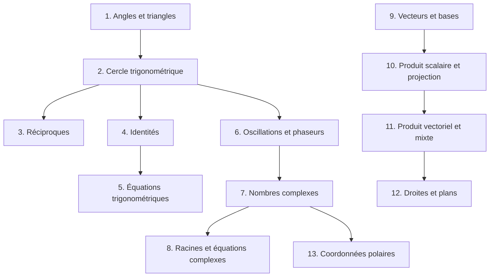

# Algèbre linéaire 1

Ce cours reconstruit, chapitre par chapitre, **toute la matière évaluée** dans les tests et travaux écrits d'Algèbre linéaire 1 (ISC, HEIA-FR) : les tests courts de 15 minutes « sans calculatrice, ni résumé, ni livres », et les TE F-1 / F-2 de 90 minutes.

## Plan du cours

| # | Chapitre | Évalué dans |
| --- | --- | --- |
| 1 | [Angles, triangles et mouvements circulaires](01-angles-et-triangles.md) | Test 1 Pb 1, TE F-1 « Triangle & Co », « Vous avez dit crétins ? » |
| 2 | [Le cercle trigonométrique](02-cercle-trigonometrique.md) | Test 1 Pb 1, TE F-1 « Comparaison d'angles » |
| 3 | [Fonctions trigonométriques réciproques](03-fonctions-trigonometriques-reciproques.md) | Test 1 Pb 2 |
| 4 | [Identités trigonométriques et simplifications](04-identites-trigonometriques.md) | Test 1 Pb 3 |
| 5 | [Équations trigonométriques](05-equations-trigonometriques.md) | Test 1 Pb 4, TE F-1 |
| 6 | [Oscillations harmoniques et phaseurs](06-oscillations-harmoniques.md) | Test 2 Pb 1, TE F-1 « Oscillations » |
| 7 | [Nombres complexes : formes et opérations](07-nombres-complexes.md) | Test 2 Pb 2 et Pb 3 |
| 8 | [Racines complexes, équations et polynômes](08-racines-et-equations-complexes.md) | Test 2 Pb 3 et Pb 4 |
| 9 | [Vecteurs, combinaisons linéaires et bases](09-vecteurs-et-bases.md) | Test 3 Pb 1, Test 3A, TE F-2 |
| 10 | [Produit scalaire, angles et projection orthogonale](10-produit-scalaire-et-projection.md) | Test 3 Pb 2 et Pb 3 |
| 11 | [Produit vectoriel et produit mixte](11-produit-vectoriel-et-mixte.md) | Test 3 Pb 4, TE F-2 « Maison des lapins crétins » |
| 12 | [Droites et plans](12-droites-et-plans.md) | TE F-2 « Droites & Co », « Plan » |
| 13 | [Coordonnées polaires et courbes polaires](13-coordonnees-polaires.md) | TE F-2 « Courbes polaires » |

## Comment les chapitres s'enchaînent

## Structure de chaque chapitre

1. **Introduction & définitions** : la théorie, expliquée pas à pas.
2. **Méthodes de résolution** : une « recette » pour chaque type de question d'examen.
3. **Exemples détaillés** : tirés des tests, avec le **pourquoi** de chaque étape.
4. **Visualisation** : un schéma de synthèse.
5. **Exercices pratiques** : indice repliable, puis solution complète.

> 💡 **Conseil** : les tests courts se font **sans calculatrice**. Entraînez-vous à refaire les exemples à la main, en particulier les valeurs du cercle trigonométrique et les conversions de nombres complexes.
