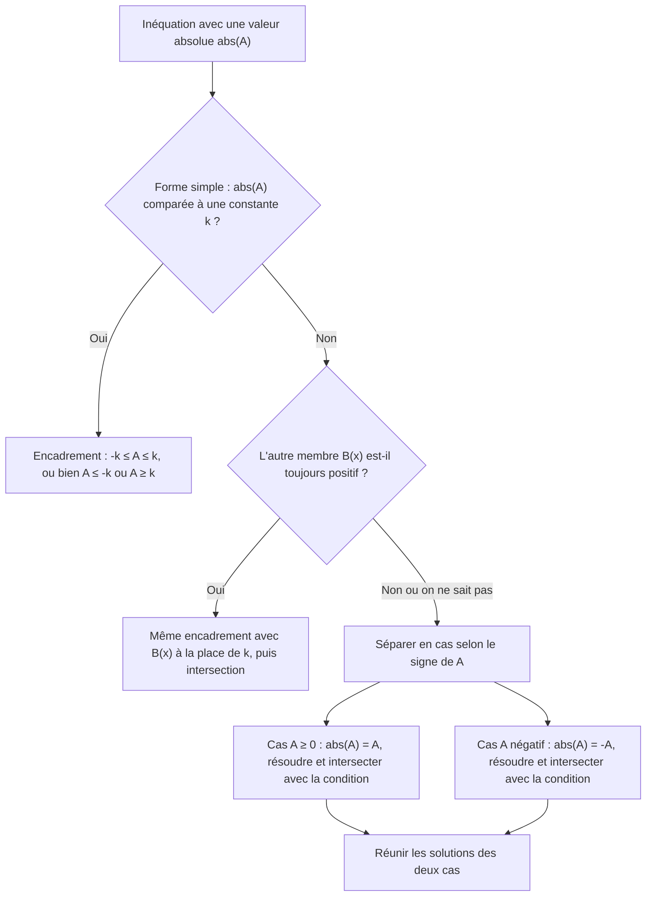
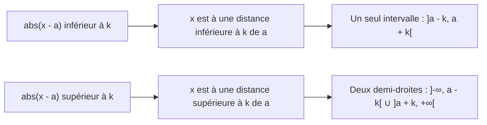

# 1. Inéquations, tableaux de signes et valeurs absolues

> 🎯 **Objectif** : résoudre toute inéquation polynomiale, rationnelle ou avec valeur absolue, et écrire la solution sous forme d'**intervalles**. C'est la première question de **presque tous** les travaux écrits d'Analyse 1 (TE 1 « Révision et limites », « Inéquations »).

---

## 1. Introduction & définitions

### 1.1 Inéquation et ensemble solution

Une **inéquation** compare deux expressions avec $$<$$, $$\leq$$, $$>$$ ou $$\geq$$. La résoudre, c'est trouver **l'ensemble $$S$$ de tous les réels** qui la vérifient. On l'écrit avec des intervalles :

| Notation | Signification |
| --- | --- |
| $$[a, b]$$ | $$a \leq x \leq b$$ (bornes incluses) |
| $$]a, b[$$ | $$a < x < b$$ (bornes exclues) |
| $$]-\infty, a]$$ | $$x \leq a$$ ($$\infty$$ est **toujours** exclu) |
| $$A \cup B$$ | $$x$$ est dans $$A$$ **ou** dans $$B$$ |
| $$\mathbb{R} \setminus \{a\}$$ | tous les réels sauf $$a$$ |
| $$\varnothing$$ | aucune solution |

### 1.2 Règles de manipulation

- On peut **ajouter** ou **soustraire** le même nombre aux deux membres.
- On peut **multiplier** ou **diviser** par un nombre **positif** sans changer le sens.
- Multiplier ou diviser par un nombre **négatif** **inverse le sens** : $$-2x < 6 \iff x > -3$$.
- ⚠️ On ne multiplie **jamais** par une expression contenant $$x$$ dont on ne connaît pas le signe (par exemple un dénominateur $$x - 2$$). On passe tout du même côté et on fait un **tableau de signes**.

### 1.3 Signe d'un facteur du premier degré et d'un trinôme

- $$ax + b$$ s'annule en $$x = -\frac{b}{a}$$ ; il a le **signe de $$a$$ à droite** de cette racine et le signe contraire à gauche.
- $$ax^2 + bx + c$$ de discriminant $$\Delta = b^2 - 4ac$$ :
  - si $$\Delta > 0$$ : deux racines $$x_1 < x_2$$ ; le trinôme a le **signe de $$a$$ à l'extérieur** des racines et le signe contraire **entre** elles ;
  - si $$\Delta = 0$$ : une racine double ; signe de $$a$$ partout ailleurs ;
  - si $$\Delta < 0$$ : aucune racine ; **signe de $$a$$ partout**.

### 1.4 Valeur absolue

$$\lvert A \rvert = \begin{cases} A & \text{si } A \geq 0 \\ -A & \text{si } A < 0 \end{cases}$$

Géométriquement, $$\lvert x - a \rvert$$ est la **distance** entre $$x$$ et $$a$$ sur la droite réelle. Pour $$k > 0$$ :

$$\lvert A \rvert < k \iff -k < A < k \qquad \lvert A \rvert > k \iff A < -k \ \text{ou}\ A > k$$

Si $$k < 0$$ : $$\lvert A \rvert < k$$ n'a **aucune** solution et $$\lvert A \rvert > k$$ est **toujours** vraie. Ces équivalences restent valables si $$k$$ est une expression $$B(x)$$ **positive**.

---

## 2. Méthodes de résolution

### Méthode A — Inéquation polynomiale ou rationnelle

1. Tout passer **d'un seul côté** : $$\text{expression} \;\square\; 0$$.
2. Mettre au **même dénominateur** si besoin.
3. **Factoriser** numérateur et dénominateur au maximum.
4. Chercher les **valeurs critiques** (zéros de chaque facteur) ; marquer les valeurs **interdites** (zéros du dénominateur).
5. Construire le **tableau de signes** : une ligne par facteur, une ligne pour le produit/quotient.
6. Lire les intervalles ; les valeurs interdites sont **toujours exclues**.

### Méthode B — Inéquation avec valeur absolue

### Méthode C — Encadrement double

Pour $$a \leq \dots \leq b$$, on applique **la même opération aux trois membres** (et on inverse les deux signes si l'on multiplie par un négatif).

---

## 3. Exemples de calculs détaillés

### Exemple 1 — Inéquation du second degré (TE 1, 2024)

$$x^2 - x \geq 6$$

1. Un seul côté : $$x^2 - x - 6 \geq 0$$.
2. Factorisation : racines $$x = \frac{1 \pm\sqrt{1 + 24}}{2} = \frac{1 \pm 5}{2}$$, soit $$3$$ et $$-2$$ : $$(x - 3)(x + 2) \geq 0$$.
3. Tableau de signes :

| $$x$$ | $$-\infty$$ à $$-2$$ | $$-2$$ | $$-2$$ à $$3$$ | $$3$$ | $$3$$ à $$+\infty$$ |
| --- | --- | --- | --- | --- | --- |
| $$x + 2$$ | $$-$$ | $$0$$ | $$+$$ | $$+$$ | $$+$$ |
| $$x - 3$$ | $$-$$ | $$-$$ | $$-$$ | $$0$$ | $$+$$ |
| produit | $$+$$ | $$0$$ | $$-$$ | $$0$$ | $$+$$ |

$$S = \left]-\infty, -2\right] \cup \left[3, +\infty\right[$$

### Exemple 2 — Valeur absolue contre expression affine (TE 1, 2024)

$$\lvert 3x - 2 \rvert < 8x + 5$$

L'autre membre $$8x + 5$$ peut être négatif : on **sépare en cas** selon le signe de $$3x - 2$$ (qui change en $$x = \frac{2}{3}$$).

**Cas 1 : $$x \geq \frac{2}{3}$$**, alors $$\lvert 3x - 2 \rvert = 3x - 2$$ :

$$3x - 2 < 8x + 5 \iff -7 < 5x \iff x > -\frac{7}{5}$$

Avec la condition $$x \geq \frac{2}{3}$$ : $$S_1 = \left[\frac{2}{3}, +\infty\right[$$.

**Cas 2 : $$x < \frac{2}{3}$$**, alors $$\lvert 3x - 2 \rvert = -3x + 2$$ :

$$-3x + 2 < 8x + 5 \iff -3 < 11x \iff x > -\frac{3}{11}$$

Avec la condition : $$S_2 = \left]-\frac{3}{11}, \frac{2}{3}\right[$$.

**Réunion** :

$$S = S_1 \cup S_2 = \left]-\frac{3}{11}, +\infty\right[$$

### Exemple 3 — Le membre de droite est toujours positif (TE 2, 2019)

$$\lvert 3x - 5 \rvert < x^2 - 3x + 4$$

1. $$x^2 - 3x + 4$$ a pour discriminant $$9 - 16 < 0$$ et $$a = 1 > 0$$ : il est **toujours positif**. On peut donc encadrer :

$$-(x^2 - 3x + 4) < 3x - 5 < x^2 - 3x + 4$$

2. **Inégalité de droite** : $$0 < x^2 - 6x + 9 = (x - 3)^2$$, vraie pour tout $$x \neq 3$$.
3. **Inégalité de gauche** : $$-x^2 + 3x - 4 < 3x - 5 \iff 1 < x^2 \iff x < -1$$ ou $$x > 1$$.
4. **Intersection** des deux conditions :

$$S = \left]-\infty, -1\right[ \cup \left]1, 3\right[ \cup \left]3, +\infty\right[$$

### Exemple 4 — Carré contre valeur absolue (TE, 2025)

$$(x + 1)^2 \leq \lvert x + 3 \rvert$$

**Cas 1 : $$x \geq -3$$** : $$x^2 + 2x + 1 \leq x + 3 \iff x^2 + x - 2 \leq 0 \iff (x + 2)(x - 1) \leq 0 \iff x \in [-2, 1]$$. Tout cet intervalle respecte $$x \geq -3$$ : $$S_1 = [-2, 1]$$.

**Cas 2 : $$x < -3$$** : $$x^2 + 2x + 1 \leq -x - 3 \iff x^2 + 3x + 4 \leq 0$$. Discriminant $$9 - 16 < 0$$ et $$a > 0$$ : le trinôme est toujours **strictement positif**. $$S_2 = \varnothing$$.

$$S = [-2, 1]$$

### Exemple 5 — Inéquation rationnelle (TE, 2023)

$$\frac{3}{x + 1} > \frac{2}{x - 2}$$

1. Valeurs interdites : $$x \neq -1$$ et $$x \neq 2$$.
2. Un seul côté, même dénominateur :

$$\frac{3}{x + 1} - \frac{2}{x - 2} > 0 \iff \frac{3(x - 2) - 2(x + 1)}{(x + 1)(x - 2)} > 0 \iff \frac{x - 8}{(x + 1)(x - 2)} > 0$$

3. Tableau de signes (valeurs critiques $$-1$$, $$2$$, $$8$$) :

| $$x$$ | $$x < -1$$ | $$-1 < x < 2$$ | $$2 < x < 8$$ | $$x > 8$$ |
| --- | --- | --- | --- | --- |
| $$x - 8$$ | $$-$$ | $$-$$ | $$-$$ | $$+$$ |
| $$x + 1$$ | $$-$$ | $$+$$ | $$+$$ | $$+$$ |
| $$x - 2$$ | $$-$$ | $$-$$ | $$+$$ | $$+$$ |
| quotient | $$-$$ | $$+$$ | $$-$$ | $$+$$ |

$$S = \left]-1, 2\right[ \cup \left]8, +\infty\right[$$

> ⚠️ Erreur classique : « produit en croix » $$3(x - 2) > 2(x + 1)$$. C'est **faux**, car on a multiplié par $$(x + 1)(x - 2)$$ dont le signe varie !

---

## 4. Visualisation : la valeur absolue comme distance

---

## 5. Exercices pratiques

### Exercice 1 — (TE 1, 2022)

Résoudre et écrire la solution sous forme d'intervalles : a) $$-\frac{1}{2} \leq \frac{2x + 3}{5} < \frac{3}{2}$$ ; b) $$\lvert 2x - 9 \rvert > 3$$ ; c) $$\lvert 16 - 3y \rvert \leq 5$$.

💡 Cliquez pour voir l'indice

a) Multipliez les trois membres par $$5$$, soustrayez $$3$$, divisez par $$2$$. c) Attention : diviser par $$-3$$ inverse les deux inégalités.

**Solution détaillée**

a) $$-\frac{5}{2} \leq 2x + 3 < \frac{15}{2} \iff -\frac{11}{2} \leq 2x < \frac{9}{2} \iff -\frac{11}{4} \leq x < \frac{9}{4}$$. Donc $$S = \left[-\frac{11}{4}, \frac{9}{4}\right[$$.

b) $$2x - 9 > 3$$ ou $$2x - 9 < -3$$, soit $$x > 6$$ ou $$x < 3$$. $$S = \left]-\infty, 3\right[ \cup \left]6, +\infty\right[$$.

c) $$-5 \leq 16 - 3y \leq 5 \iff -21 \leq -3y \leq -11 \iff 7 \geq y \geq \frac{11}{3}$$. $$S = \left[\frac{11}{3}, 7\right]$$.

### Exercice 2 — (TE 1, 2019)

Résoudre : a) $$x^2 + 3x \geq -2$$ ; b) $$\frac{-2}{\lvert x - 4 \rvert} < -3$$ ; c) $$5x^2 < -2$$.

💡 Cliquez pour voir l'indice

b) Multipliez par $$-1$$ (le sens change), puis remarquez que $$\lvert x - 4 \rvert > 0$$ : on peut alors multiplier par $$\lvert x - 4 \rvert$$ sans danger.

**Solution détaillée**

a) $$x^2 + 3x + 2 \geq 0 \iff (x + 1)(x + 2) \geq 0$$. Le trinôme ($$a > 0$$) est positif à l'extérieur des racines : $$S = \left]-\infty, -2\right] \cup \left[-1, +\infty\right[$$.

b) Valeur interdite $$x = 4$$. $$\frac{2}{\lvert x - 4 \rvert} > 3$$ ; comme $$\lvert x - 4 \rvert > 0$$ : $$2 > 3\lvert x - 4 \rvert \iff \lvert x - 4 \rvert < \frac{2}{3} \iff \frac{10}{3} < x < \frac{14}{3}$$. On retire $$4$$ :

$$S = \left]\frac{10}{3}, 4\right[ \cup \left]4, \frac{14}{3}\right[$$

c) $$5x^2 \geq 0 > -2$$ pour tout $$x$$ : un carré ne peut pas être négatif. $$S = \varnothing$$.

### Exercice 3 — (TE, 2023)

Résoudre : a) $$x^3 - 4x^2 < -3x$$ ; b) $$\ln(x) > \ln(5x - 2)$$.

💡 Cliquez pour voir l'indice

a) Factorisez par $$x$$. b) Déterminez d'abord le domaine (arguments des logarithmes strictement positifs), puis utilisez que $$\ln$$ est strictement croissante.

**Solution détaillée**

a) $$x^3 - 4x^2 + 3x < 0 \iff x(x^2 - 4x + 3) < 0 \iff x(x - 1)(x - 3) < 0$$.

| $$x$$ | $$x < 0$$ | $$0 < x < 1$$ | $$1 < x < 3$$ | $$x > 3$$ |
| --- | --- | --- | --- | --- |
| $$x$$ | $$-$$ | $$+$$ | $$+$$ | $$+$$ |
| $$x - 1$$ | $$-$$ | $$-$$ | $$+$$ | $$+$$ |
| $$x - 3$$ | $$-$$ | $$-$$ | $$-$$ | $$+$$ |
| produit | $$-$$ | $$+$$ | $$-$$ | $$+$$ |

$$S = \left]-\infty, 0\right[ \cup \left]1, 3\right[$$.

b) Domaine : $$x > 0$$ et $$5x - 2 > 0$$, donc $$x > \frac{2}{5}$$. Comme $$\ln$$ est strictement croissante : $$x > 5x - 2 \iff x < \frac{1}{2}$$. Avec le domaine : $$S = \left]\frac{2}{5}, \frac{1}{2}\right[$$.
