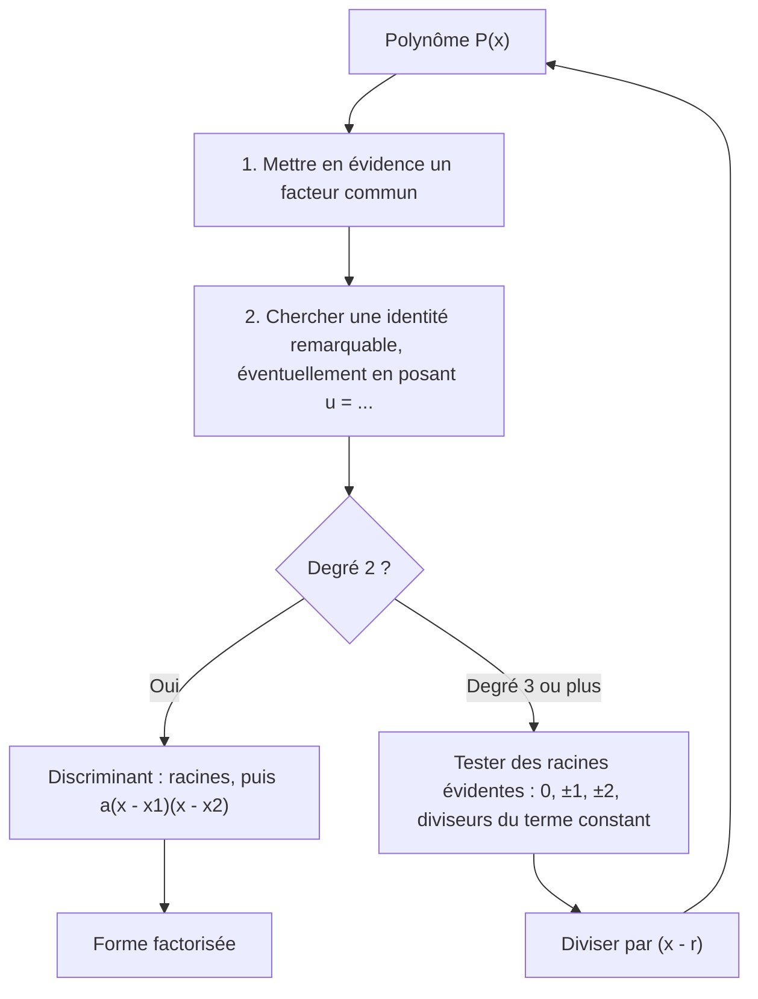
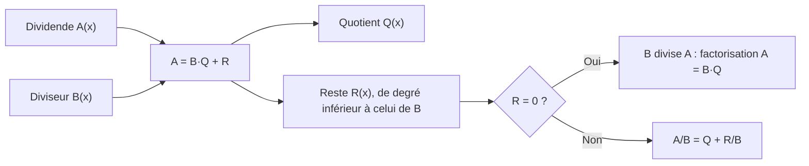

# 2. Polynômes : factorisation et division polynomiale

> 🎯 **Objectif** : factoriser un polynôme en facteurs du premier degré, effectuer une division polynomiale (euclidienne), et simplifier des fractions rationnelles. Ces techniques servent **partout** : tableaux de signes, limites indéterminées $$\frac{0}{0}$$, dérivées. C'est « Produit de facteurs » et « Division polynomiale » du TE 1.

---

## 1. Introduction & définitions

### 1.1 Polynômes

Un **polynôme** de degré $$n$$ est une expression :

$$P(x) = a_nx^n + a_{n-1}x^{n-1} + \dots + a_1x + a_0, \qquad a_n \neq 0$$

Un **zéro** (ou racine) de $$P$$ est un réel $$r$$ tel que $$P(r) = 0$$.

### 1.2 Théorème du facteur

> 💡 $$r$$ est un zéro de $$P$$ **si et seulement si** $$(x - r)$$ divise $$P(x)$$, c'est-à-dire $$P(x) = (x - r)\,Q(x)$$ avec $$\deg Q = n - 1$$.

C'est la clé de la factorisation : **chaque zéro trouvé fournit un facteur**.

### 1.3 Division euclidienne

Pour deux polynômes $$A$$ et $$B$$ ($$B \neq 0$$), il existe un unique **quotient** $$Q$$ et un unique **reste** $$R$$ tels que :

$$A(x) = B(x)\,Q(x) + R(x), \qquad \deg R < \deg B$$

En divisant par $$B$$ :

$$\frac{A(x)}{B(x)} = Q(x) + \frac{R(x)}{B(x)}$$

Si $$B(x) = x - r$$, le reste est un **nombre** et vaut $$R = A(r)$$ (théorème du reste).

### 1.4 Outils de factorisation

| Outil | Formule |
| --- | --- |
| Facteur commun | $$ab + ac = a(b + c)$$ |
| Identités remarquables | $$a^2 \pm 2ab + b^2 = (a \pm b)^2$$ et $$a^2 - b^2 = (a - b)(a + b)$$ |
| Trinôme ($$\Delta \geq 0$$) | $$ax^2 + bx + c = a(x - x_1)(x - x_2)$$ avec $$x_{1,2} = \frac{-b \pm\sqrt{\Delta}}{2a}$$ |
| Cube | $$a^3 - b^3 = (a - b)(a^2 + ab + b^2)$$ et $$a^3 + b^3 = (a + b)(a^2 - ab + b^2)$$ |
| Racine évidente $$r$$ | division par $$(x - r)$$ |

Un trinôme de discriminant **négatif** ne se factorise **pas** dans $$\mathbb{R}$$ : il est « irréductible ».

---

## 2. Méthodes de résolution

### Méthode A — Factoriser au maximum

### Méthode B — Division polynomiale « en potence »

1. Ordonner $$A$$ et $$B$$ par **puissances décroissantes**, en écrivant les termes manquants avec un coefficient $$0$$.
2. Diviser le **terme de plus haut degré** de $$A$$ par celui de $$B$$ : c'est le premier terme du quotient.
3. Multiplier $$B$$ par ce terme et **soustraire** le résultat de $$A$$.
4. Recommencer avec le reste obtenu, tant que son degré est $$\geq \deg B$$.
5. **Vérifier** : $$B \cdot Q + R$$ doit redonner $$A$$.

### Méthode C — Schéma de Horner (division par $$x - r$$)

On écrit les coefficients de $$A$$ ; on abaisse le premier ; puis on répète « multiplier par $$r$$, ajouter au coefficient suivant ». Les nombres obtenus sont les coefficients du quotient, le dernier est le reste.

---

## 3. Exemples de calculs détaillés

### Exemple 1 — Produit de facteurs (TE 1, 2024)

*Écrire $$(4x + 5)^2 - 2(4x + 5) + 1$$ comme produit de facteurs du premier degré.*

**Idée** : l'expression $$(4x + 5)$$ se répète. Posons $$u = 4x + 5$$ :

$$u^2 - 2u + 1 = (u - 1)^2$$

C'est l'identité remarquable $$(a - b)^2$$. On revient à $$x$$ :

$$(4x + 5 - 1)^2 = (4x + 4)^2 = \left[4(x + 1)\right]^2 = 16(x + 1)^2$$

> 💡 Développer d'abord marche aussi ($$16x^2 + 32x + 16 = 16(x^2 + 2x + 1)$$) mais est plus long et plus risqué. **Repérez les blocs qui se répètent.**

### Exemple 2 — Division polynomiale (TE 1, 2024)

*Compléter l'égalité $$\dfrac{x^3 - 4x^2 - 4x - 5}{x - 3} = \dots$$*

**Étape 1** : $$\frac{x^3}{x} = x^2$$. On soustrait $$x^2(x - 3) = x^3 - 3x^2$$ :

$$(x^3 - 4x^2 - 4x - 5) - (x^3 - 3x^2) = -x^2 - 4x - 5$$

**Étape 2** : $$\frac{-x^2}{x} = -x$$. On soustrait $$-x(x - 3) = -x^2 + 3x$$ :

$$(-x^2 - 4x - 5) - (-x^2 + 3x) = -7x - 5$$

**Étape 3** : $$\frac{-7x}{x} = -7$$. On soustrait $$-7(x - 3) = -7x + 21$$ :

$$(-7x - 5) - (-7x + 21) = -26$$

Le reste $$-26$$ est de degré $$0 < 1$$ : on s'arrête. **Quotient** $$Q = x^2 - x - 7$$, **reste** $$R = -26$$ :

$$\frac{x^3 - 4x^2 - 4x - 5}{x - 3} = x^2 - x - 7 - \frac{26}{x - 3}$$

**Vérification par le théorème du reste** : $$A(3) = 27 - 36 - 12 - 5 = -26$$ ✓.

**Même calcul par Horner** (coefficients $$1, -4, -4, -5$$ et $$r = 3$$) :

| | $$1$$ | $$-4$$ | $$-4$$ | $$-5$$ |
| --- | --- | --- | --- | --- |
| $$\times 3$$ | | $$3$$ | $$-3$$ | $$-21$$ |
| somme | $$1$$ | $$-1$$ | $$-7$$ | $$-26$$ |

On lit $$Q = x^2 - x - 7$$ et $$R = -26$$ ✓.

### Exemple 3 — Factorisation par racine évidente

*Factoriser $$P(x) = x^3 - 2x^2 - 5x + 6$$.*

1. On teste $$x = 1$$ : $$1 - 2 - 5 + 6 = 0$$. Donc $$(x - 1)$$ est un facteur.
2. Horner avec $$r = 1$$ sur $$1, -2, -5, 6$$ : on obtient $$1, -1, -6$$ et reste $$0$$. Donc $$P(x) = (x - 1)(x^2 - x - 6)$$.
3. $$x^2 - x - 6 = (x - 3)(x + 2)$$ (racines $$3$$ et $$-2$$).

$$P(x) = (x - 1)(x - 3)(x + 2)$$

### Exemple 4 — Préparer une limite (Test 1, 2023)

*Factoriser $$16x^2 + 16x - 5$$ pour calculer $$\lim_{x \to -5/4}\frac{16x^2 + 16x - 5}{8x + 10}$$.*

Le dénominateur s'annule en $$x = -\frac{5}{4}$$ ; si le numérateur aussi, $$(4x + 5)$$ est un facteur commun. On vérifie : $$16\cdot\frac{25}{16} - 20 - 5 = 0$$ ✓. Division de $$16x^2 + 16x - 5$$ par $$4x + 5$$ : $$16x^2 \div 4x = 4x$$ ; reste $$16x - 20x - 5 = -4x - 5$$ ; puis $$-1$$ ; reste $$0$$. Donc :

$$16x^2 + 16x - 5 = (4x + 5)(4x - 1)$$

et la fraction se simplifie en $$\frac{(4x + 5)(4x - 1)}{2(4x + 5)} = \frac{4x - 1}{2}$$ (voir chapitre 5).

---

## 4. Visualisation : l'égalité de la division

---

## 5. Exercices pratiques

### Exercice 1 — Factoriser au maximum

Factoriser : a) $$3x^3 - 12x$$ ; b) $$(2x - 1)^2 - (x + 3)^2$$ ; c) $$2x^2 - 5x - 3$$.

💡 Cliquez pour voir l'indice

a) Facteur commun puis $$a^2 - b^2$$. b) C'est directement une différence de deux carrés. c) Discriminant.

**Solution détaillée**

a) $$3x(x^2 - 4) = 3x(x - 2)(x + 2)$$.

b) $$a^2 - b^2 = (a - b)(a + b)$$ avec $$a = 2x - 1$$, $$b = x + 3$$ :

$$\left[(2x - 1) - (x + 3)\right]\left[(2x - 1) + (x + 3)\right] = (x - 4)(3x + 2)$$

c) $$\Delta = 25 + 24 = 49$$, racines $$\frac{5 \pm 7}{4}$$, soit $$3$$ et $$-\frac{1}{2}$$ :

$$2x^2 - 5x - 3 = 2(x - 3)\left(x + \frac{1}{2}\right) = (x - 3)(2x + 1)$$

### Exercice 2 — Division polynomiale

Effectuer la division de $$A(x) = 2x^3 + 3x^2 - 5x + 7$$ par $$B(x) = x + 2$$, puis écrire $$\frac{A(x)}{B(x)}$$ sous la forme $$Q(x) + \frac{R}{B(x)}$$.

💡 Cliquez pour voir l'indice

Diviser par $$x + 2$$, c'est diviser par $$x - (-2)$$ : utilisez Horner avec $$r = -2$$ et vérifiez que le reste vaut $$A(-2)$$.

**Solution détaillée**

Horner avec $$r = -2$$ sur $$2, 3, -5, 7$$ :

| | $$2$$ | $$3$$ | $$-5$$ | $$7$$ |
| --- | --- | --- | --- | --- |
| $$\times(-2)$$ | | $$-4$$ | $$2$$ | $$6$$ |
| somme | $$2$$ | $$-1$$ | $$-3$$ | $$13$$ |

$$Q(x) = 2x^2 - x - 3$$ et $$R = 13$$. Vérification : $$A(-2) = -16 + 12 + 10 + 7 = 13$$ ✓.

$$\frac{2x^3 + 3x^2 - 5x + 7}{x + 2} = 2x^2 - x - 3 + \frac{13}{x + 2}$$

### Exercice 3 — Simplifier une fraction (TE 1, 2020)

Écrire sous la forme d'une seule fraction simplifiée : $$\dfrac{2x - 5}{x} - \dfrac{2x - 3}{x - 3}$$.

💡 Cliquez pour voir l'indice

Dénominateur commun $$x(x - 3)$$. Développez soigneusement les deux produits au numérateur ; attention au signe « moins » devant la seconde fraction.

**Solution détaillée**

1. Numérateur : $$(2x - 5)(x - 3) - (2x - 3)x = (2x^2 - 11x + 15) - (2x^2 - 3x) = -8x + 15$$.
2. Résultat :

$$\frac{2x - 5}{x} - \frac{2x - 3}{x - 3} = \frac{15 - 8x}{x(x - 3)}, \qquad x \neq 0,\ x \neq 3$$
