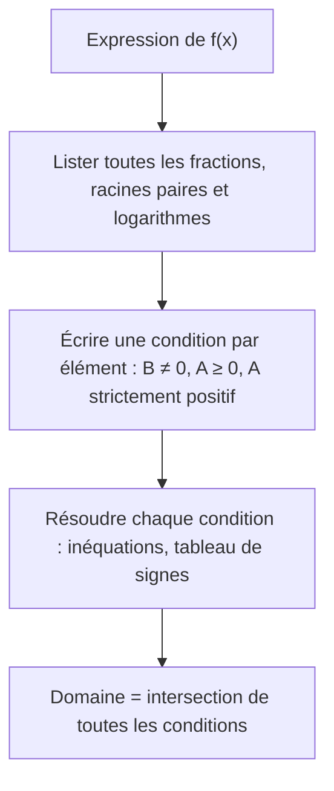
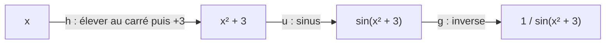

# 3. Fonctions : domaine, image, composition, parité et transformations

> 🎯 **Objectif** : déterminer le domaine de définition et l'image d'une fonction, composer et décomposer des fonctions, étudier la parité, reconnaître les transformations d'un graphe et écrire une fonction définie par morceaux. C'est le cœur du « Travail écrit 1 » (2022) et du TE de novembre 2023.

---

## 1. Introduction & définitions

### 1.1 Fonction, domaine, image

Une **fonction** $f$ associe à chaque $x$ de son **domaine de définition** $D_f$ **un unique** réel $f(x)$.

- Le **domaine** $D_f$ : l'ensemble des $x$ pour lesquels le calcul de $f(x)$ a un sens.
- L'**image** $\operatorname{Im}(f)$ : l'ensemble de toutes les valeurs $f(x)$ effectivement atteintes.
- Le **graphe** : l'ensemble des points $(x; f(x))$.

**Test de la droite verticale** : une courbe est le graphe d'une fonction si et seulement si toute droite verticale la coupe **au plus une fois**.

### 1.2 Les trois interdits pour le domaine

| Expression | Condition |
| --- | --- |
| $\frac{A}{B}$ | $B \neq 0$ |
| $\sqrt{A}$ (et toute racine d'indice pair) | $A \geq 0$ |
| $\ln(A)$, $\log_a(A)$ | $A > 0$ |

Les polynômes, $e^x$, $a^x$, $\sin$, $\cos$, les racines **cubiques** sont définis sur **tout** $\mathbb{R}$.

### 1.3 Composition

La **composée** $g \circ f$ (lire « $g$ rond $f$ ») applique d'abord $f$, puis $g$ :

$$(g \circ f)(x) = g\left(f(x)\right)$$

En général $g \circ f \neq f \circ g$. **Décomposer** une fonction, c'est l'écrire comme une chaîne de fonctions simples (très utile pour la dérivée en chaîne).

### 1.4 Parité

- $f$ est **paire** si $f(-x) = f(x)$ pour tout $x \in D_f$ : graphe **symétrique par rapport à l'axe $Oy$** (ex. : $x^2$, $\cos x$, $\lvert x \rvert$).
- $f$ est **impaire** si $f(-x) = -f(x)$ : graphe **symétrique par rapport à l'origine** (ex. : $x^3$, $\sin x$, $\frac{1}{x}$).
- Le domaine doit être symétrique ($x \in D_f \Rightarrow -x \in D_f$).
- La plupart des fonctions ne sont **ni paires ni impaires**.

Règles de calcul : pair × pair = pair ; impair × impair = pair ; pair × impair = impair (comme les signes $+$ et $-$).

### 1.5 Transformations de graphes

Partant du graphe de $y = f(x)$, avec $c > 0$ :

| Nouvelle fonction | Effet sur le graphe |
| --- | --- |
| $f(x) + c$ | translation de $c$ vers le **haut** |
| $f(x) - c$ | translation de $c$ vers le **bas** |
| $f(x + c)$ | translation de $c$ vers la **gauche** |
| $f(x - c)$ | translation de $c$ vers la **droite** |
| $-f(x)$ | symétrie par rapport à l'axe $Ox$ |
| $f(-x)$ | symétrie par rapport à l'axe $Oy$ |
| $a\,f(x)$ | étirement vertical de facteur $a$ |
| $f(ax)$ | compression horizontale de facteur $a$ |

> ⚠️ Les transformations **à l'intérieur** de $f(\dots)$ agissent sur les $x$ et vont « à l'envers » : $f(x + 3)$ décale vers la **gauche**.

### 1.6 Fonctions affines et définies par morceaux

La droite passant par $(x_1; y_1)$ et $(x_2; y_2)$ a pour pente $m = \frac{y_2 - y_1}{x_2 - x_1}$ et pour équation $y = m(x - x_1) + y_1$. Deux droites sont **parallèles** si elles ont la même pente, **perpendiculaires** si $m_1m_2 = -1$.

Une fonction **définie par morceaux** utilise des formules différentes sur des intervalles différents : on l'écrit avec une accolade.

---

## 2. Méthodes de résolution

### Méthode A — Domaine de définition

### Méthode B — Image d'une fonction

1. Partir des bornes du domaine et suivre les transformations successives (encadrement).
2. Ou esquisser le graphe et lire l'intervalle des ordonnées atteintes.

### Méthode C — Parité

1. Vérifier que le domaine est symétrique.
2. Calculer $f(-x)$ en remplaçant **chaque** $x$ par $(-x)$ et simplifier.
3. Comparer avec $f(x)$ et $-f(x)$. Pour prouver « ni paire ni impaire », un contre-exemple numérique suffit (par ex. $f(1)$ et $f(-1)$).

### Méthode D — Trouver l'expression d'une courbe transformée

Repérer un point caractéristique (sommet, zéro, asymptote) sur le graphe de $f$ et sur la courbe transformée : l'écart horizontal et vertical, et un éventuel « retournement », donnent la formule.

---

## 3. Exemples de calculs détaillés

### Exemple 1 — Domaines (Travail écrit 1, 2022)

**i.** $f_1(x) = \frac{7}{\sqrt{x - 3}}$ : racine au dénominateur → $x - 3 > 0$ (strict, car le dénominateur ne doit pas s'annuler). $D = \left]3, +\infty\right[$.

**ii.** $f_2(x) = \frac{2x - 5}{3(x + 9)(x - 1)}$ : dénominateur $\neq 0$ → $x \neq -9$ et $x \neq 1$. $D = \mathbb{R} \setminus \{-9, 1\}$.

**iii.** $f_3(x) = \ln\left(\frac{1}{x + 2}\right)$ : il faut $x + 2 \neq 0$ **et** $\frac{1}{x + 2} > 0$, soit $x + 2 > 0$. $D = \left]-2, +\infty\right[$.

**iv.** $f_4(x) = 5^{3x + 1}$ : une exponentielle est définie partout. $D = \mathbb{R}$.

### Exemple 2 — Domaine et image (Travail écrit 1, 2022)

*Esquisser $g(x) = -\sqrt{4 - x^2}$ et donner son image.*

- Domaine : $4 - x^2 \geq 0 \iff x^2 \leq 4 \iff -2 \leq x \leq 2$.
- $y = \sqrt{4 - x^2}$ est le **demi-cercle supérieur** de centre $O$ et de rayon $2$ (car $y^2 = 4 - x^2 \iff x^2 + y^2 = 4$ avec $y \geq 0$).
- Le signe « $-$ » le retourne : $g$ est le **demi-cercle inférieur**.
- Image : $\sqrt{4 - x^2}$ varie de $0$ à $2$, donc $g(x)$ varie de $-2$ à $0$. $\operatorname{Im}(g) = [-2, 0]$.

### Exemple 3 — Composition (Travail écrit 1, 2022)

*$f(x) = \sqrt{2x + 3}$ et $g(x) = x^2 + 1$. Calculer $(f \circ g)(x)$ et $(g \circ f)(x)$.*

$$(f \circ g)(x) = f\left(x^2 + 1\right) = \sqrt{2(x^2 + 1) + 3} = \sqrt{2x^2 + 5}$$

$$(g \circ f)(x) = g\left(\sqrt{2x + 3}\right) = \left(\sqrt{2x + 3}\right)^2 + 1 = 2x + 4$$

(la dernière égalité est valable sur le domaine de $f$, $x \geq -\frac{3}{2}$).

*Décomposer $f(x) = \frac{1}{\sin(x^2 + 3)}$ en $g \circ u \circ h$.* On lit les opérations **de l'intérieur vers l'extérieur** : $h(x) = x^2 + 3$, puis $u(x) = \sin x$, puis $g(x) = \frac{1}{x}$.

### Exemple 4 — Parité (Travail écrit 1, 2022)

*a) $f(x) = \frac{x^3 - 2x}{4\sin x}$.* Domaine symétrique ($\sin x \neq 0$). Avec $\sin(-x) = -\sin x$ :

$$f(-x) = \frac{(-x)^3 - 2(-x)}{4\sin(-x)} = \frac{-(x^3 - 2x)}{-4\sin x} = f(x)$$

$f$ est **paire** (quotient de deux fonctions impaires).

*b) $g(x) = 3x^2 - x^4 + 2x^5$.* $g(-x) = 3x^2 - x^4 - 2x^5$, qui n'est égal ni à $g(x)$ ni à $-g(x) = -3x^2 + x^4 - 2x^5$. Contre-exemple : $g(1) = 4$ et $g(-1) = 0$. $g$ n'est **ni paire ni impaire**.

### Exemple 5 — Suite de composées (TE, novembre 2025)

*$f_0(x) = \frac{x}{x + 1}$ et $f_{n+1} = f_0 \circ f_n$. Trouver $f_1$, $f_2$, $f_3$, puis $f_n$.*

$$f_1(x) = f_0\left(f_0(x)\right) = \frac{\frac{x}{x + 1}}{\frac{x}{x + 1} + 1} = \frac{\frac{x}{x + 1}}{\frac{2x + 1}{x + 1}} = \frac{x}{2x + 1}$$

De même :

$$f_2(x) = \frac{\frac{x}{2x + 1}}{\frac{x}{2x + 1} + 1} = \frac{x}{3x + 1} \qquad f_3(x) = \frac{x}{4x + 1}$$

On devine le motif : $f_n(x) = \frac{x}{(n + 1)x + 1}$. (Et $D_{f_0} = \mathbb{R}\setminus\{-1\}$.)

### Exemple 6 — Fonction par morceaux (TE, novembre 2023)

*Graphe formé du segment joignant $(-2; 2)$ à $(-1; 0)$, puis de la moitié supérieure du cercle de centre $O$ et de rayon $1$.*

- Segment : pente $m = \frac{0 - 2}{-1 - (-2)} = -2$ ; $y = -2(x + 1) = -2x - 2$.
- Demi-cercle supérieur : $y = \sqrt{1 - x^2}$ pour $-1 \leq x \leq 1$.

$$f(x) = \begin{cases} -2x - 2 & \text{si } -2 \leq x < -1 \\ \sqrt{1 - x^2} & \text{si } -1 \leq x \leq 1 \end{cases}$$

Les deux morceaux se raccordent en $(-1; 0)$ : la fonction est continue.

---

## 4. Visualisation : lire une composition

---

## 5. Exercices pratiques

### Exercice 1 — Domaines

Déterminer le domaine de : a) $f(x) = \sqrt{-x^2 + 6x - 8}$ ; b) $g(x) = \frac{1}{\sqrt{x^2 - 3x}}$ ; c) $h(x) = \ln(\ln(x) - 3)$.

💡 Cliquez pour voir l'indice

a) Factorisez $-x^2 + 6x - 8 = -(x - 2)(x - 4)$. b) Racine au dénominateur : inégalité **stricte**. c) Deux logarithmes emboîtés : deux conditions.

**Solution détaillée**

a) $-(x - 2)(x - 4) \geq 0 \iff (x - 2)(x - 4) \leq 0 \iff x \in [2, 4]$. $D_f = [2, 4]$.

b) $x^2 - 3x > 0 \iff x(x - 3) > 0 \iff x < 0$ ou $x > 3$. $D_g = \left]-\infty, 0\right[ \cup \left]3, +\infty\right[$.

c) $x > 0$ et $\ln x - 3 > 0 \iff \ln x > 3 \iff x > e^3$. $D_h = \left]e^3, +\infty\right[$.

### Exercice 2 — Transformations (Travail écrit 1, 2022)

Le graphe (b) est celui de $-f(x)$. Le graphe (a) est le graphe de $f$ décalé de 4 unités vers la gauche et 1 unité vers le haut ; le graphe (c) est le symétrique de $f$ par rapport à l'axe $Oy$, décalé de 2 unités vers le bas. Donner les équations de (a) et (c).

💡 Cliquez pour voir l'indice

Décalage vers la gauche de 4 : $f(x + 4)$. Symétrie par rapport à $Oy$ : $f(-x)$.

**Solution détaillée**

(a) : $y = f(x + 4) + 1$ (translation horizontale **à l'intérieur**, verticale **à l'extérieur**).

(c) : $y = f(-x) - 2$.

Contrôle sur un point : si $f$ a un sommet en $(1; 3)$, alors (a) a son sommet en $(1 - 4; 3 + 1) = (-3; 4)$ et (c) en $(-1; 1)$.

### Exercice 3 — Parité et composition

a) Étudier la parité de $f(x) = x^2\sin(x) + \tan(x)$. b) Pour $f(x) = \cos x$ et $g(x) = \frac{1}{x}$, calculer $f \circ g$, $g \circ f$ et $f \circ f$.

💡 Cliquez pour voir l'indice

a) $x^2$ est paire, $\sin$ et $\tan$ sont impaires. b) Appliquez la définition $(g \circ f)(x) = g(f(x))$.

**Solution détaillée**

a) $f(-x) = (-x)^2\sin(-x) + \tan(-x) = -x^2\sin x - \tan x = -f(x)$ : $f$ est **impaire**.

b) $(f \circ g)(x) = \cos\left(\frac{1}{x}\right)$ ; $(g \circ f)(x) = \frac{1}{\cos x} = \sec x$ ; $(f \circ f)(x) = \cos(\cos x)$.
