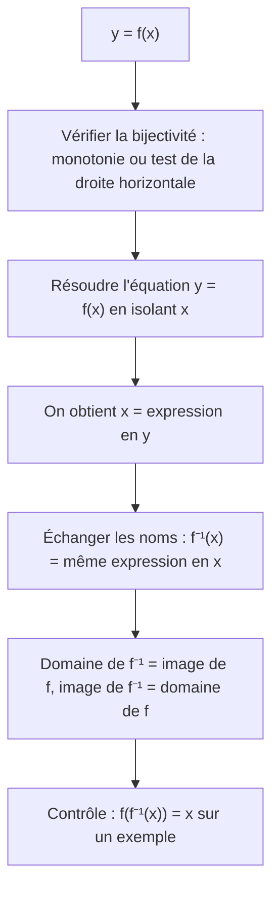
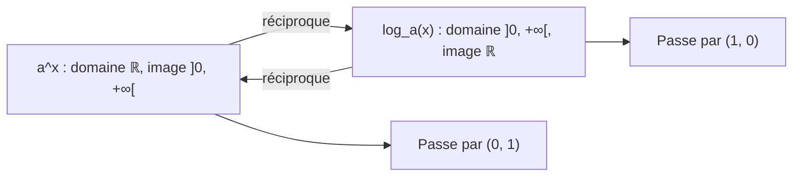

# 4. Fonctions réciproques, exponentielles et logarithmes

> 🎯 **Objectif** : savoir quand une fonction admet une réciproque, la calculer (avec domaine et image), et résoudre des équations exponentielles et logarithmiques, y compris dans des modèles appliqués (échelle de Richter, charge d'un condensateur). C'est la fin du « Travail écrit 1 » et des TE de novembre.

---

## 1. Introduction & définitions

### 1.1 Bijection et réciproque

Une fonction $$f : A \to B$$ est **bijective** si **chaque** $$y \in B$$ est atteint par **exactement un** $$x \in A$$. Elle possède alors une **réciproque** $$f^{-1} : B \to A$$ telle que :

$$y = f(x) \iff x = f^{-1}(y) \qquad f^{-1}\left(f(x)\right) = x \qquad f\left(f^{-1}(y)\right) = y$$

- **Test de la droite horizontale** : $$f$$ est injective (donc bijective sur son image) si toute droite horizontale coupe le graphe **au plus une fois**. Une fonction strictement monotone passe toujours ce test.
- Le domaine de $$f^{-1}$$ est l'**image** de $$f$$, et l'image de $$f^{-1}$$ est le **domaine** de $$f$$.
- Le graphe de $$f^{-1}$$ est le symétrique de celui de $$f$$ par rapport à la droite $$y = x$$.

> ⚠️ $$f^{-1}(x)$$ ne signifie **pas** $$\frac{1}{f(x)}$$.

### 1.2 Exponentielles et logarithmes

Pour $$a > 0$$, $$a \neq 1$$, la fonction $$x \mapsto a^x$$ est une bijection de $$\mathbb{R}$$ sur $$\left]0, +\infty\right[$$. Sa réciproque est le **logarithme de base $$a$$** :

$$y = a^x \iff x = \log_a(y) \qquad (y > 0)$$

Cas particuliers : $$\ln = \log_e$$ (base $$e \approx 2{,}718$$) et $$\log_{10}$$.

**Règles de calcul** ($$x, y > 0$$) :

| Exponentielles | Logarithmes |
| --- | --- |
| $$a^x a^y = a^{x + y}$$ | $$\log_a(xy) = \log_a x + \log_a y$$ |
| $$\frac{a^x}{a^y} = a^{x - y}$$ | $$\log_a\frac{x}{y} = \log_a x - \log_a y$$ |
| $$(a^x)^y = a^{xy}$$ | $$\log_a(x^y) = y\log_a x$$ |
| $$a^0 = 1$$ | $$\log_a 1 = 0$$ et $$\log_a a = 1$$ |

**Changement de base** : $$\log_a x = \frac{\ln x}{\ln a}$$ et $$a^x = e^{x\ln a}$$.

> ⚠️ $$\log_a(x + y) \neq \log_a x + \log_a y$$ : il n'y a **pas** de règle pour le logarithme d'une somme.

---

## 2. Méthodes de résolution

### Méthode A — Calculer la réciproque

### Méthode B — Équation exponentielle

1. Si possible, écrire les deux membres comme **puissances d'une même base** : $$a^{A} = a^{B} \iff A = B$$.
2. Sinon, **isoler** la puissance puis appliquer $$\ln$$ aux deux membres : $$e^{A} = c \iff A = \ln c$$ (si $$c > 0$$ ; si $$c \leq 0$$, aucune solution).

### Méthode C — Équation logarithmique

1. **Domaine d'abord** : chaque argument de logarithme doit être $$> 0$$.
2. Regrouper avec les règles en **un seul logarithme** de chaque côté.
3. Passer à l'exponentielle : $$\log_a(A) = c \iff A = a^c$$.
4. Résoudre, puis **rejeter** les solutions hors du domaine.

---

## 3. Exemples de calculs détaillés

### Exemple 1 — Réciproque d'une homographie (Travail écrit 1, 2022)

*$$g : \mathbb{R}\setminus\left\{\frac{3}{2}\right\} \to \mathbb{R}\setminus\left\{\frac{5}{2}\right\}$$, $$g(x) = \frac{5x - 7}{2x - 3}$$, est bijective. Trouver $$g^{-1}$$.*

On résout $$y = \frac{5x - 7}{2x - 3}$$ en $$x$$ :

$$y(2x - 3) = 5x - 7 \iff 2xy - 3y = 5x - 7 \iff 2xy - 5x = 3y - 7 \iff x(2y - 5) = 3y - 7$$

$$x = \frac{3y - 7}{2y - 5}$$

On échange les noms des variables :

$$g^{-1}(x) = \frac{3x - 7}{2x - 5}, \qquad D_{g^{-1}} = \mathbb{R}\setminus\left\{\frac{5}{2}\right\}$$

Cohérent : le domaine de $$g^{-1}$$ est bien l'image de $$g$$.

### Exemple 2 — Réciproque avec racine (Travail écrit 1, 2022)

*$$h : [3, +\infty[ \to \operatorname{Im}(h)$$, $$h(x) = \sqrt{x - 3} - 5$$.*

- $$h$$ est la racine carrée décalée de 3 vers la droite et de 5 vers le bas : elle est **strictement croissante**, donc passe le test de la droite horizontale. $$\operatorname{Im}(h) = [-5, +\infty[$$.
- $$y = \sqrt{x - 3} - 5 \iff y + 5 = \sqrt{x - 3} \iff (y + 5)^2 = x - 3$$ (légitime car $$y + 5 \geq 0$$) $$\iff x = (y + 5)^2 + 3$$.

$$h^{-1}(x) = (x + 5)^2 + 3 = x^2 + 10x + 28, \qquad h^{-1} : [-5, +\infty[ \to [3, +\infty[$$

### Exemple 3 — Réciproque d'un logarithme emboîté (TE, novembre 2025)

*$$f(x) = \ln(\ln(x) - 3)$$.*

- Domaine : $$x > 0$$ et $$\ln x > 3$$, soit $$D_f = \left]e^3, +\infty\right[$$.
- $$y = \ln(\ln x - 3) \iff e^y = \ln x - 3 \iff \ln x = e^y + 3 \iff x = e^{e^y + 3}$$.

$$f^{-1}(x) = e^{e^x + 3}, \qquad D_{f^{-1}} = \mathbb{R}$$

### Exemple 4 — Équations (Travail écrit 1, 2022)

**b)** $$4^{x^2 + x} = 16$$. Même base : $$16 = 4^2$$, donc $$x^2 + x = 2 \iff x^2 + x - 2 = 0 \iff (x + 2)(x - 1) = 0$$. $$S = \{-2; 1\}$$.

**c)** $$e^{2x + 3} - 7 = 0 \iff e^{2x + 3} = 7 \iff 2x + 3 = \ln 7 \iff x = \frac{\ln 7 - 3}{2} \approx -0{,}527$$.

**d)** $$\log_3(2x + 1) - 2\log_3(x - 3) = 2$$.

1. Domaine : $$2x + 1 > 0$$ et $$x - 3 > 0$$, soit $$x > 3$$.
2. Un seul logarithme : $$2\log_3(x - 3) = \log_3\left((x - 3)^2\right)$$, donc $$\log_3\frac{2x + 1}{(x - 3)^2} = 2$$.
3. Exponentielle de base 3 : $$\frac{2x + 1}{(x - 3)^2} = 9 \iff 2x + 1 = 9(x^2 - 6x + 9) \iff 9x^2 - 56x + 80 = 0$$.
4. $$\Delta = 3136 - 2880 = 256$$ : $$x = \frac{56 \pm 16}{18}$$, soit $$x = 4$$ ou $$x = \frac{20}{9} \approx 2{,}2$$.
5. $$\frac{20}{9} < 3$$ est **hors domaine** : rejetée. $$S = \{4\}$$.

### Exemple 5 — Échelle de Richter (TE, novembre 2025)

*$$M = \frac{\log_{10}(E) - 11{,}4}{1{,}5}$$ ($$E$$ en joules). a) Exprimer $$E$$ en fonction de $$M$$. b) Combien d'énergie un séisme de magnitude 6 libère-t-il de plus qu'un séisme de magnitude 4 ?*

a) $$1{,}5M = \log_{10}E - 11{,}4 \iff \log_{10}E = 1{,}5M + 11{,}4 \iff E = 10^{1{,}5M + 11{,}4}$$.

b) Le **rapport** des énergies :

$$\frac{E(6)}{E(4)} = \frac{10^{1{,}5\cdot 6 + 11{,}4}}{10^{1{,}5\cdot 4 + 11{,}4}} = 10^{1{,}5\cdot 2} = 10^3 = 1000$$

Un séisme de magnitude 6 libère **1000 fois plus** d'énergie. En valeur absolue, la différence vaut $$E(6) - E(4) = 10^{20{,}4} - 10^{17{,}4} \approx 2{,}51\cdot 10^{20}$$ J.

### Exemple 6 — Charge d'un condensateur (TE, 2022)

*$$Q(t) = Q_0\left(1 - e^{-t/a}\right)$$, $$a > 0$$. Écrire la réciproque et l'interpréter.*

$$\frac{Q}{Q_0} = 1 - e^{-t/a} \iff e^{-t/a} = 1 - \frac{Q}{Q_0} \iff -\frac{t}{a} = \ln\left(1 - \frac{Q}{Q_0}\right) \iff t = -a\ln\left(1 - \frac{Q}{Q_0}\right)$$

Cette fonction donne le **temps nécessaire** pour atteindre une charge $$Q$$ (avec $$0 \leq Q < Q_0$$).

---

## 4. Visualisation : exponentielle et logarithme sont « miroirs »

---

## 5. Exercices pratiques

### Exercice 1 — (Travail écrit 1, 2022)

La fonction $$f(x) = 2\log_3(x)$$, de $$\left]0, +\infty\right[$$ dans $$\mathbb{R}$$, est bijective. Déterminer $$f^{-1}$$, son domaine et son image.

💡 Cliquez pour voir l'indice

Isolez $$\log_3(x) = \frac{y}{2}$$ puis passez à l'exponentielle de base $$3$$.

**Solution détaillée**

1. $$y = 2\log_3 x \iff \log_3 x = \frac{y}{2} \iff x = 3^{y/2}$$.
2. $$f^{-1}(x) = 3^{x/2} = \left(\sqrt{3}\right)^x$$.
3. $$D_{f^{-1}} = \mathbb{R}$$ (image de $$f$$) et $$\operatorname{Im}(f^{-1}) = \left]0, +\infty\right[$$ (domaine de $$f$$).

### Exercice 2 — Équations

Résoudre : a) $$2^{2x + 1} = 3\cdot 2^x + 2$$ ; b) $$\ln(x) + \ln(x + 2) = \ln(8)$$ ; c) $$e^{2x} - 5e^x + 6 = 0$$.

💡 Cliquez pour voir l'indice

a) et c) : posez $$u = 2^x$$ (resp. $$u = e^x$$), on obtient une équation du second degré en $$u$$, avec $$u > 0$$. b) Domaine, puis $$\ln A + \ln B = \ln(AB)$$.

**Solution détaillée**

a) $$2^{2x + 1} = 2\cdot(2^x)^2$$. Avec $$u = 2^x > 0$$ : $$2u^2 - 3u - 2 = 0$$, $$\Delta = 9 + 16 = 25$$, $$u = \frac{3 \pm 5}{4}$$, soit $$u = 2$$ ou $$u = -\frac{1}{2}$$ (rejeté, car $$u > 0$$). $$2^x = 2 \iff x = 1$$.

b) Domaine : $$x > 0$$. $$\ln\left(x(x + 2)\right) = \ln 8 \iff x^2 + 2x - 8 = 0 \iff (x + 4)(x - 2) = 0$$. $$x = -4$$ est hors domaine. $$S = \{2\}$$.

c) $$u = e^x > 0$$ : $$u^2 - 5u + 6 = 0 \iff u = 2$$ ou $$u = 3$$. Donc $$x = \ln 2$$ ou $$x = \ln 3$$.

### Exercice 3 — Modèle de refroidissement

La température d'un café suit $$T(t) = 20 + 70e^{-0{,}05t}$$ ($$t$$ en minutes, $$T$$ en °C). a) Température initiale ? b) Au bout de combien de temps le café est-il à $$50$$ °C ? c) Exprimer $$t$$ en fonction de $$T$$.

💡 Cliquez pour voir l'indice

Isolez l'exponentielle avant d'appliquer $$\ln$$.

**Solution détaillée**

a) $$T(0) = 20 + 70 = 90$$ °C.

b) $$50 = 20 + 70e^{-0{,}05t} \iff e^{-0{,}05t} = \frac{30}{70} = \frac{3}{7} \iff -0{,}05t = \ln\frac{3}{7} \iff t = 20\ln\frac{7}{3} \approx 16{,}9$$ min.

c) $$e^{-0{,}05t} = \frac{T - 20}{70} \iff t = -20\ln\left(\frac{T - 20}{70}\right) = 20\ln\left(\frac{70}{T - 20}\right)$$, pour $$20 < T \leq 90$$.
