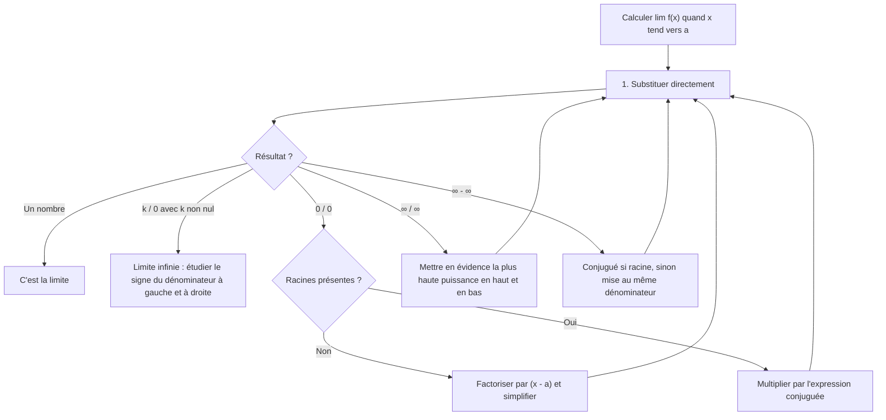
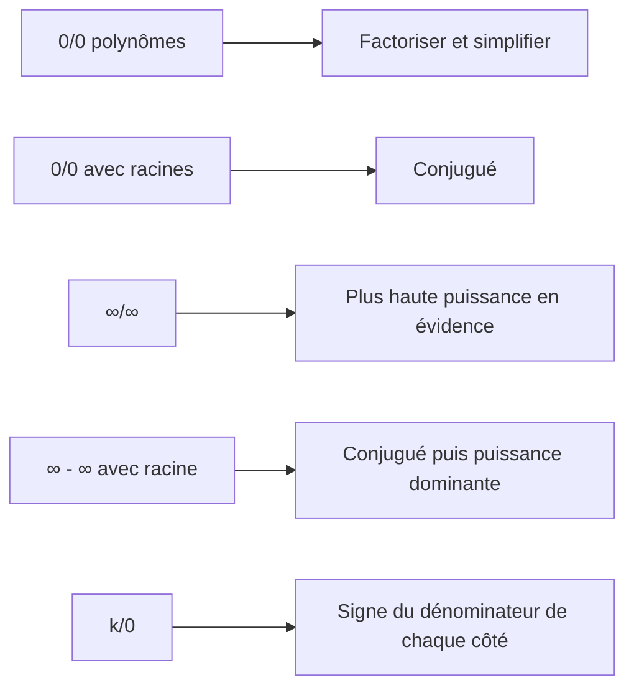

# 5. Limites et asymptotes

> 🎯 **Objectif** : lire des limites sur un graphe, calculer des limites en levant les indéterminations ($\frac{0}{0}$, $\frac{\infty}{\infty}$, $\infty - \infty$, $\frac{k}{0}$), trouver les asymptotes, et esquisser une fonction à partir de conditions de limites. C'est dans **tous** les TE 1 et TE 2 d'Analyse (« Calculs de limites », « Limites graphiques »).

> ℹ️ Consigne fréquente : « il n'est pas autorisé d'utiliser la règle de l'Hospital ». Toutes les méthodes ci-dessous sont **algébriques**.

---

## 1. Introduction & définitions

### 1.1 L'idée de limite

$\lim_{x \to a} f(x) = L$ signifie : **quand $x$ s'approche de $a$** (sans forcément l'atteindre), **$f(x)$ s'approche de $L$**. La valeur $f(a)$ elle-même n'intervient pas (elle peut même ne pas exister).

### 1.2 Limites latérales

- $\lim_{x \to a^-} f(x)$ : $x$ s'approche de $a$ **par la gauche** ($x < a$).
- $\lim_{x \to a^+} f(x)$ : $x$ s'approche **par la droite** ($x > a$).

> 💡 La limite (bilatérale) existe **si et seulement si** les deux limites latérales existent et sont **égales**.

### 1.3 Limites infinies et à l'infini

- $\lim_{x \to a} f(x) = +\infty$ : $f(x)$ devient arbitrairement grand. On écrit toujours **$+\infty$ ou $-\infty$**, jamais « $\infty$ » sans signe.
- $\lim_{x \to +\infty} f(x) = L$ : comportement quand $x$ devient très grand.

### 1.4 Asymptotes

| Type | Condition | Équation |
| --- | --- | --- |
| Verticale | $\lim_{x \to a^\pm} f(x) = \pm\infty$ | $x = a$ |
| Horizontale | $\lim_{x \to \pm\infty} f(x) = L$ | $y = L$ |
| Oblique | $\lim_{x \to \pm\infty}\left[f(x) - (mx + p)\right] = 0$ | $y = mx + p$ |

Les asymptotes verticales se cherchent aux **valeurs interdites** (zéros du dénominateur qui **ne** sont **pas** aussi zéros du numérateur).

### 1.5 Règles de calcul et formes indéterminées

Si $f$ est continue en $a$ (polynômes, fractions hors valeurs interdites, racines, exp, ln...), on **substitue** directement : $\lim_{x \to a} f(x) = f(a)$.

Les formes suivantes sont **déterminées** ($k$ réel non nul) :

$$\frac{k}{\pm\infty} = 0 \qquad \frac{k}{0^{\pm}} = \pm\infty \text{ (règle des signes)} \qquad +\infty + \infty = +\infty \qquad k\cdot\infty = \pm\infty$$

Les formes **indéterminées** demandent un travail algébrique :

$$\frac{0}{0} \qquad \frac{\infty}{\infty} \qquad \infty - \infty \qquad 0\cdot\infty$$

---

## 2. Méthodes de résolution

### Arbre de décision

### Méthode A — $\frac{0}{0}$ avec des polynômes

Si $P(a) = 0$ et $Q(a) = 0$, alors $(x - a)$ divise $P$ **et** $Q$ (théorème du facteur, chapitre 2). On factorise, on simplifie, on substitue.

### Méthode B — $\frac{0}{0}$ ou $\infty - \infty$ avec des racines : le conjugué

On utilise $(\sqrt{A} - \sqrt{B})(\sqrt{A} + \sqrt{B}) = A - B$ : on multiplie numérateur **et** dénominateur par l'expression conjuguée pour faire disparaître la racine « gênante ».

### Méthode C — $\frac{\infty}{\infty}$ pour une fraction rationnelle (en $\pm\infty$)

On met en évidence la plus haute puissance. Résultat à retenir ($a_n$, $b_m$ coefficients dominants) :

| Degrés | $\lim_{x \to \pm\infty}\frac{a_nx^n + \dots}{b_mx^m + \dots}$ |
| --- | --- |
| $n < m$ | $0$ |
| $n = m$ | $\frac{a_n}{b_m}$ (asymptote horizontale) |
| $n > m$ | $\pm\infty$ (signe à étudier) |

### Méthode D — $\frac{k}{0}$ : étude du signe

On détermine si le dénominateur tend vers $0^+$ ou $0^-$ **de chaque côté**, en regardant le signe de chaque facteur.

### Méthode E — Fonctions bornées

$\sin x$ et $\cos x$ restent entre $-1$ et $1$ : face à un terme qui tend vers l'infini, ils sont **négligeables**.

---

## 3. Exemples de calculs détaillés

### Exemple 1 — Lecture graphique (TE 1, 2024)

*Sur un graphe : autour de $x = -1$ la courbe arrive à la hauteur $1$ des deux côtés (avec un point isolé ailleurs) ; en $x = 1$ il y a un saut ; en $x = 2$ une asymptote verticale où la courbe plonge vers $-\infty$ des deux côtés.*

- $\lim_{x \to -1} f(x) = 1$ : les deux côtés arrivent à la même hauteur, peu importe la valeur $f(-1)$.
- $\lim_{x \to 1} f(x)$ **n'existe pas** : les limites à gauche et à droite diffèrent (saut).
- $\lim_{x \to 2^+} f(x) = -\infty$.

### Exemple 2 — Limite infinie (TE 2, 2024)

$$\lim_{x \to -1^+}\frac{4x^2 - 5x + 7}{x + 1}$$

Substitution : numérateur $\to 4 + 5 + 7 = 16$ ; dénominateur $\to 0$. Forme $\frac{16}{0}$. Pour $x > -1$, $x + 1 > 0$ : le dénominateur tend vers $0^+$.

$$\lim_{x \to -1^+}\frac{4x^2 - 5x + 7}{x + 1} = \frac{16}{0^+} = +\infty$$

### Exemple 3 — $\frac{0}{0}$ polynomial (TE 2, 2024)

$$\lim_{x \to -2}\frac{2x^2 + 5x + 2}{-2 - x}$$

Substitution : $\frac{8 - 10 + 2}{0} = \frac{0}{0}$. On factorise : $2x^2 + 5x + 2 = (x + 2)(2x + 1)$ et $-2 - x = -(x + 2)$ :

$$\lim_{x \to -2}\frac{(x + 2)(2x + 1)}{-(x + 2)} = \lim_{x \to -2}-(2x + 1) = -(-4 + 1) = 3$$

### Exemple 4 — Conjugué (TE 2, 2024)

$$\lim_{x \to -3}\frac{\sqrt{2x + 7} - \sqrt{4 + x}}{x + 3}$$

Substitution : $\frac{\sqrt{1} - \sqrt{1}}{0} = \frac{0}{0}$. On multiplie par le conjugué $\sqrt{2x + 7} + \sqrt{4 + x}$ :

$$= \lim_{x \to -3}\frac{(2x + 7) - (4 + x)}{(x + 3)\left(\sqrt{2x + 7} + \sqrt{4 + x}\right)} = \lim_{x \to -3}\frac{x + 3}{(x + 3)\left(\sqrt{2x + 7} + \sqrt{4 + x}\right)}$$

$$= \frac{1}{\sqrt{1} + \sqrt{1}} = \frac{1}{2}$$

### Exemple 5 — Conjugué au numérateur (Travail écrit 2, 2022)

$$\lim_{x \to -2}\frac{3 - \sqrt{x^2 + 5}}{3x + 6}$$

Forme $\frac{0}{0}$. Conjugué $3 + \sqrt{x^2 + 5}$ :

$$= \lim_{x \to -2}\frac{9 - (x^2 + 5)}{3(x + 2)\left(3 + \sqrt{x^2 + 5}\right)} = \lim_{x \to -2}\frac{(2 - x)(2 + x)}{3(x + 2)\left(3 + \sqrt{x^2 + 5}\right)} = \frac{4}{3\cdot 6} = \frac{2}{9}$$

### Exemple 6 — $\frac{\infty}{\infty}$ (TE 2, 2024 et TE 2025)

$$\lim_{x \to -\infty}\frac{(3x + 2)(x^2 - 4x + 3)}{5x^3 - x}$$

Numérateur et dénominateur de degré 3 ; coefficients dominants $3\cdot 1 = 3$ et $5$. En détail :

$$= \lim_{x \to -\infty}\frac{x^3\left(3 + \frac{2}{x}\right)\left(1 - \frac{4}{x} + \frac{3}{x^2}\right)}{x^3\left(5 - \frac{1}{x^2}\right)} = \frac{3\cdot 1}{5} = \frac{3}{5}$$

De même $\lim_{x \to +\infty}\frac{8x^2 + 2}{-x^2 + x + 1} = \frac{8}{-1} = -8$.

### Exemple 7 — $\infty - \infty$ (TE, novembre 2023)

$$\lim_{x \to +\infty}\left(\sqrt{x^2 + 2x} - x\right)$$

Conjugué :

$$= \lim_{x \to +\infty}\frac{(x^2 + 2x) - x^2}{\sqrt{x^2 + 2x} + x} = \lim_{x \to +\infty}\frac{2x}{x\left(\sqrt{1 + \frac{2}{x}} + 1\right)} = \frac{2}{1 + 1} = 1$$

(pour $x > 0$, $\sqrt{x^2} = x$).

### Exemple 8 — Fonction bornée (Travail écrit 2, 2022)

$$\lim_{x \to +\infty}\frac{3x^2 + 4}{5x^2 + \sin x} = \lim_{x \to +\infty}\frac{3 + \frac{4}{x^2}}{5 + \frac{\sin x}{x^2}} = \frac{3}{5}$$

car $-\frac{1}{x^2} \leq \frac{\sin x}{x^2} \leq \frac{1}{x^2}$, donc $\frac{\sin x}{x^2} \to 0$.

### Exemple 9 — Trouver des paramètres (TE, novembre 2025)

*$f(x) = ax + \frac{2}{x - b}$. Déterminer $a$ et $b$ sachant que $\lim_{x \to 3^-} f(x) = -\infty$ et $\lim_{x \to 5} f(x) = 11$.*

1. Une limite infinie en $3$ ne peut venir que de la fraction : il faut $x - b \to 0$ en $x = 3$, donc $b = 3$. Vérification : pour $x < 3$, $x - 3 \to 0^-$ et $\frac{2}{0^-} = -\infty$ ✓.
2. $\lim_{x \to 5} f(x) = 5a + \frac{2}{5 - 3} = 5a + 1 = 11$, donc $a = 2$.

### Exemple 10 — Asymptotes (Travail écrit 2, 2022)

*$f(x) = \frac{3x^2 + x - 4}{(x + 1)^2}$.*

- Domaine : $\mathbb{R}\setminus\{-1\}$. En $x = -1$ : numérateur $3 - 1 - 4 = -4 \neq 0$, dénominateur $\to 0^+$ (un carré). $\lim_{x \to -1} f(x) = \frac{-4}{0^+} = -\infty$ des deux côtés : **asymptote verticale** $x = -1$.
- Degrés égaux, coefficients dominants $3$ et $1$ : $\lim_{x \to \pm\infty} f(x) = 3$ : **asymptote horizontale** $y = 3$.

---

## 4. Visualisation : les formes indéterminées et leur remède

---

## 5. Exercices pratiques

### Exercice 1 — (Travail écrit 2, 2022)

Calculer, sans la règle de l'Hospital : a) $\lim_{x \to 4}\frac{x^2 - 4x}{x^2 - 3x - 4}$ ; b) $\lim_{x \to 5^+}\frac{7}{x^2 - 3x - 10}$ ; c) $\lim_{x \to -\infty}\frac{7x^3 + 2x^2 + x}{3x^2 - 5x + 1}$.

💡 Cliquez pour voir l'indice

a) Forme $\frac{0}{0}$ : factorisez. b) Factorisez le dénominateur $(x - 5)(x + 2)$ et étudiez son signe à droite de $5$. c) Degré du haut supérieur au degré du bas.

**Solution détaillée**

a) $\frac{x(x - 4)}{(x - 4)(x + 1)} = \frac{x}{x + 1} \to \frac{4}{5}$.

b) Pour $x > 5$ : $x - 5 \to 0^+$ et $x + 2 \to 7 > 0$, donc le dénominateur tend vers $0^+$ : la limite vaut $\frac{7}{0^+} = +\infty$.

c) $\frac{x^3\left(7 + \frac{2}{x} + \frac{1}{x^2}\right)}{x^2\left(3 - \frac{5}{x} + \frac{1}{x^2}\right)} = x\cdot\frac{7 + \dots}{3 - \dots}$. Quand $x \to -\infty$, cela se comporte comme $\frac{7}{3}x \to -\infty$.

### Exercice 2 — (TE, novembre 2023)

Calculer : a) $\lim_{x \to 0}\frac{\sqrt{x^2 + 4} + 1}{2x + 1}$ ; b) $\lim_{x \to 1}\frac{2x^2 + x - 3}{1 - x}$ ; c) $\lim_{x \to -\infty}\frac{2x + 7x^2 - 3x^5}{x^2 + 3x^6}$.

💡 Cliquez pour voir l'indice

a) Essayez d'abord la substitution directe ! b) $x = 1$ annule le numérateur. c) Comparez les degrés.

**Solution détaillée**

a) Pas d'indétermination : $\frac{\sqrt{4} + 1}{1} = 3$.

b) $2x^2 + x - 3 = (x - 1)(2x + 3)$ et $1 - x = -(x - 1)$ : la limite vaut $-(2 + 3) = -5$.

c) Degré 5 en haut, 6 en bas : la limite vaut $0$.

### Exercice 3 — Asymptotes et esquisse (TE 2, 2019)

Soit $f(x) = \frac{3 - x}{4 + x}$. a) Trouver les asymptotes. b) Calculer $f'(x)$ par la définition (chapitre 7) ou vérifier son signe, et esquisser le graphe.

💡 Cliquez pour voir l'indice

Valeur interdite $x = -4$ ; étudiez le signe de $\frac{7}{0^\pm}$. En $\pm\infty$, degrés égaux.

**Solution détaillée**

a) En $x = -4$ : numérateur $\to 7$.

- $\lim_{x \to -4^+} f(x) = \frac{7}{0^+} = +\infty$ et $\lim_{x \to -4^-} f(x) = \frac{7}{0^-} = -\infty$ : **asymptote verticale** $x = -4$.
- $\lim_{x \to \pm\infty}\frac{-x + 3}{x + 4} = \frac{-1}{1} = -1$ : **asymptote horizontale** $y = -1$.

b) $f'(x) = \frac{-(4 + x) - (3 - x)}{(4 + x)^2} = \frac{-7}{(4 + x)^2} < 0$ : $f$ décroît sur chaque intervalle du domaine. Esquisse : une hyperbole, branche de droite descendant de $+\infty$ (près de $x = -4$) vers $-1$, passant par $(3; 0)$ et $\left(0; \frac{3}{4}\right)$ ; branche de gauche descendant de $-1$ (en $-\infty$) vers $-\infty$ (près de $x = -4$).
