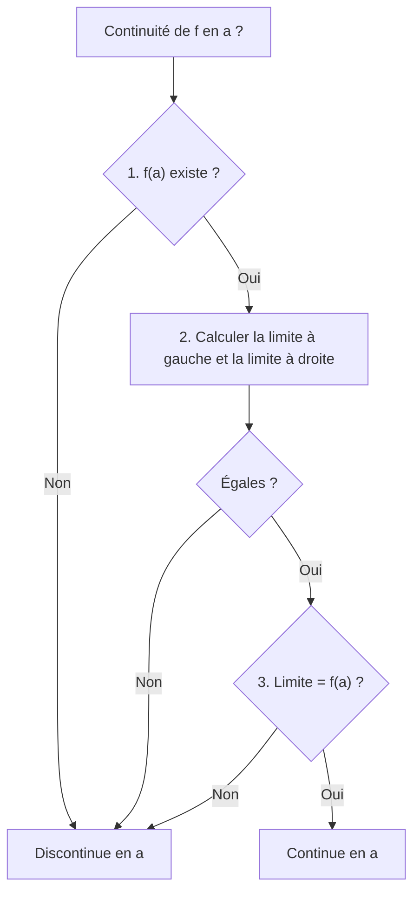
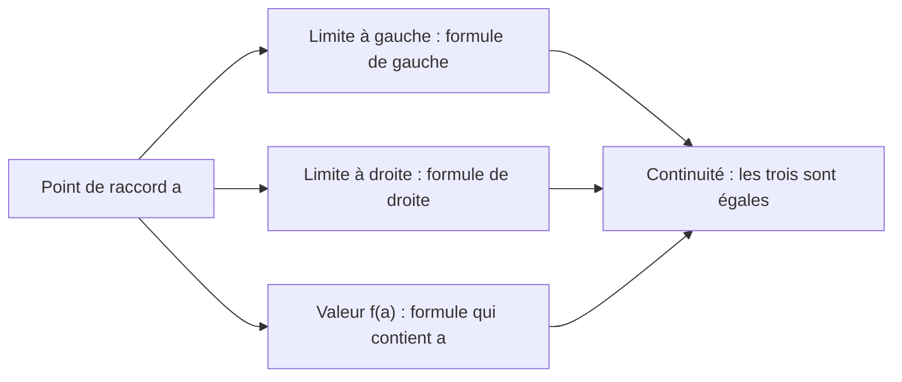

# 6. Continuité

> 🎯 **Objectif** : justifier la continuité (ou non) d'une fonction en un point avec la définition, lire les intervalles de continuité sur un graphe, et **déterminer des paramètres** pour qu'une fonction définie par morceaux soit continue. C'est le « Problème 4. Continuité » des TE 2 et l'exercice 2 du Travail écrit 2 (2022).

---

## 1. Introduction & définitions

### 1.1 Définition

Intuitivement, une fonction est **continue** si l'on peut tracer son graphe **sans lever le crayon**. Formellement :

> 💡 $f$ est **continue en $a$** si et seulement si les **trois conditions** suivantes sont réunies :
> 1. $f(a)$ existe ($a \in D_f$) ;
> 2. $\lim_{x \to a} f(x)$ existe (limites à gauche et à droite égales) ;
> 3. $\lim_{x \to a} f(x) = f(a)$.

$f$ est continue **sur un intervalle** si elle est continue en chacun de ses points (aux bornes fermées, on utilise la limite latérale appropriée).

### 1.2 Types de discontinuités

| Type | Ce qui ne va pas | Dessin |
| --- | --- | --- |
| **Saut** | limites à gauche et à droite différentes | la courbe « saute » |
| **Trou** (discontinuité évitable) | la limite existe mais $f(a)$ n'existe pas ou est différente | un point « déplacé » ou manquant |
| **Infinie** | une limite latérale est infinie | asymptote verticale |

### 1.3 Fonctions continues « de référence »

Sont continues **sur leur domaine** : polynômes, fractions rationnelles, racines, $e^x$, $\ln x$, $\sin$, $\cos$, $\tan$, et toutes les sommes, produits, quotients et composées de telles fonctions. Pour une fonction **par morceaux**, il ne reste donc à étudier que les **points de raccord**.

### 1.4 Continuité et dérivabilité

Une fonction dérivable en $a$ est forcément continue en $a$. La réciproque est fausse : $\lvert x \rvert$ est continue en $0$ mais présente un **point anguleux** (pas de tangente unique).

---

## 2. Méthodes de résolution

### Méthode A — Justifier la continuité en un point

Rédaction attendue : écrire explicitement les trois quantités $f(a)$, $\lim_{x \to a^-} f(x)$, $\lim_{x \to a^+} f(x)$ et conclure.

### Méthode B — Paramètres d'une fonction par morceaux

1. Pour chaque point de raccord $a$ : calculer la limite à gauche avec la formule de gauche, la limite à droite avec la formule de droite, et $f(a)$ avec la formule qui contient $a$.
2. Écrire les **égalités** (une ou deux équations par raccord).
3. Résoudre le système d'équations en les paramètres.

### Méthode C — Intervalles de continuité sur un graphe

Repérer tous les points « à problème » (sauts, trous, asymptotes, points isolés). Les intervalles de continuité s'arrêtent à ces points ; une borne est **fermée** si la fonction y est définie et que le graphe « arrive » sur le point plein depuis l'intérieur de l'intervalle.

---

## 3. Exemples de calculs détaillés

### Exemple 1 — Deux paramètres, un raccord (TE 2, 2019)

*Déterminer $a$ et $b$ pour que $f$ soit continue en $x = 1$ :*

$$f(x) = \begin{cases} x^2 + b & \text{si } x < 1 \\ 3 & \text{si } x = 1 \\ ax + b & \text{si } x > 1 \end{cases}$$

1. $f(1) = 3$.
2. À gauche : $\lim_{x \to 1^-}(x^2 + b) = 1 + b$. Il faut $1 + b = 3$, donc $b = 2$.
3. À droite : $\lim_{x \to 1^+}(ax + b) = a + b$. Il faut $a + b = 3$, donc $a = 1$.

### Exemple 2 — Continuité sur $\mathbb{R}$ (Travail écrit 2, 2022)

*Déterminer $A$ et $B$ pour que $f$ soit continue sur $\mathbb{R}$ :*

$$f(x) = \begin{cases} Ax + 3 & \text{si } x < 1 \\ 2 & \text{si } x = 1 \\ x^2 + B & \text{si } x > 1 \end{cases}$$

Chaque morceau est un polynôme, donc continu ; seul $x = 1$ pose question. Il faut $\lim_{1^-} = f(1) = \lim_{1^+}$ :

$$A + 3 = 2 \Rightarrow A = -1 \qquad 1 + B = 2 \Rightarrow B = 1$$

### Exemple 3 — Discontinuité évitable (TE, 2022)

*$f(x) = \frac{x^2 - x}{x^2 - 1}$ pour $x \neq 1$ et $f(1) = 0$. $f$ est-elle continue en $x = 1$ ?*

1. $f(1) = 0$ existe.
2. $\lim_{x \to 1}\frac{x(x - 1)}{(x - 1)(x + 1)} = \lim_{x \to 1}\frac{x}{x + 1} = \frac{1}{2}$ (la limite existe).
3. $\frac{1}{2} \neq 0 = f(1)$ : **$f$ n'est pas continue en $1$**. C'est un « trou » : en posant $f(1) = \frac{1}{2}$, on la rendrait continue.

### Exemple 4 — Deux raccords, système (TE, 2020)

*Trouver $a$ et $b$ pour que $f$ soit continue sur $\mathbb{R}$ :*

$$f(x) = \begin{cases} \frac{x^2 - 4}{x - 2} & \text{si } x < 2 \\ ax^2 - bx + 3 & \text{si } 2 \leq x < 3 \\ 2x - a + b & \text{si } x \geq 3 \end{cases}$$

**Raccord en 2** : $\lim_{x \to 2^-}\frac{(x - 2)(x + 2)}{x - 2} = 4$ et $f(2) = 4a - 2b + 3$. Donc $4a - 2b + 3 = 4$, soit $4a - 2b = 1$.

**Raccord en 3** : $\lim_{x \to 3^-}(ax^2 - bx + 3) = 9a - 3b + 3$ et $f(3) = 6 - a + b$. Donc $9a - 3b + 3 = 6 - a + b$, soit $10a - 4b = 3$.

**Système** : on multiplie la 1re équation par $2$ : $8a - 4b = 2$. En soustrayant de la 2e : $2a = 1$, donc $a = \frac{1}{2}$, puis $4\cdot\frac{1}{2} - 2b = 1 \Rightarrow b = \frac{1}{2}$.

### Exemple 5 — Lecture graphique (TE, novembre 2025)

*Sur le graphe de $g$ : saut en $x = -2$ (point plein isolé en dessous) ; en $x = 2$, la courbe de gauche arrive sur un cercle vide et celle de droite part d'un point plein plus bas ; asymptote verticale en $x = 4$ ; en $x = 6$, trou avec un point isolé ailleurs ; la courbe s'arrête en $x = 8$ sur un cercle vide.*

Intervalles de continuité : $[-4, -2[$ ; $]-2, 2[$ ; $[2, 4[$ ; $]4, 6[$ ; $]6, 8[$.

Justification des bornes : en $-2$ et $6$, la valeur $g(\cdot)$ ne correspond à aucune des deux limites (bornes ouvertes des deux côtés) ; en $2$, le point plein appartient à la branche de droite (borne fermée à droite) ; en $4$, asymptote (bornes ouvertes).

---

## 4. Visualisation

---

## 5. Exercices pratiques

### Exercice 1 — (TE 2, 2019)

Déterminer l'intervalle de continuité de $g(x) = \begin{cases} x^2 & \text{si } 0 \leq x < 2 \\ 3x + 1 & \text{si } 2 \leq x < 5 \end{cases}$.

💡 Cliquez pour voir l'indice

Chaque morceau est continu. Comparez la limite à gauche en $2$ avec $g(2)$.

**Solution détaillée**

1. $g(2) = 3\cdot 2 + 1 = 7$ et $\lim_{x \to 2^+} g(x) = 7$.
2. $\lim_{x \to 2^-} g(x) = 4 \neq 7$ : **saut** en $x = 2$.
3. $g$ est continue sur $[0, 2[$ et sur $[2, 5[$ (en $2$, elle est continue **à droite**), mais pas sur $[0, 5[$.

### Exercice 2 — Continuité en un point (TE, 2022)

$f(x) = \begin{cases} \sqrt{-x} & \text{si } x < 0 \\ 2 - x & \text{si } 0 \leq x < 2 \\ (x - 2)^2 & \text{si } x \geq 2 \end{cases}$. Étudier la continuité en $x = 0$ et en $x = 2$.

💡 Cliquez pour voir l'indice

Calculez les trois quantités (gauche, droite, valeur) à chaque raccord.

**Solution détaillée**

En $x = 0$ : $\lim_{0^-}\sqrt{-x} = 0$, $\lim_{0^+}(2 - x) = 2$. Limites différentes : **discontinue** (saut) en $0$.

En $x = 2$ : $\lim_{2^-}(2 - x) = 0$, $\lim_{2^+}(x - 2)^2 = 0$ et $f(2) = 0$. **Continue** en $2$ (point anguleux, mais sans saut).

### Exercice 3 — Paramètre unique

Pour quelle valeur de $k$ la fonction $h(x) = \begin{cases} \frac{\sqrt{x + 4} - 2}{x} & \text{si } x \neq 0 \\ k & \text{si } x = 0 \end{cases}$ est-elle continue en $0$ ?

💡 Cliquez pour voir l'indice

La limite en $0$ est de la forme $\frac{0}{0}$ avec une racine : conjugué.

**Solution détaillée**

$$\lim_{x \to 0}\frac{\sqrt{x + 4} - 2}{x} = \lim_{x \to 0}\frac{(x + 4) - 4}{x\left(\sqrt{x + 4} + 2\right)} = \lim_{x \to 0}\frac{1}{\sqrt{x + 4} + 2} = \frac{1}{4}$$

Il faut $k = \frac{1}{4}$.
