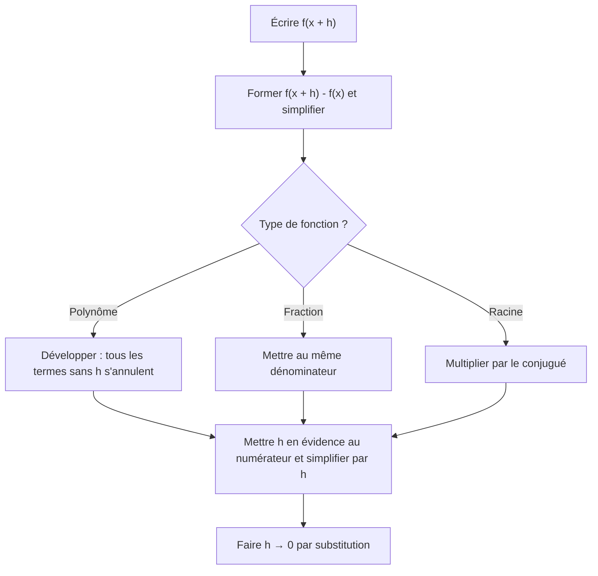
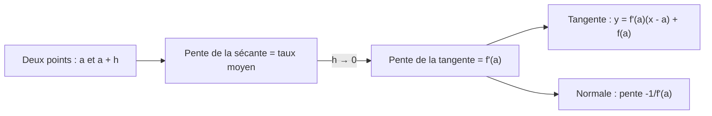

# 7. La dérivée : taux de variation, définition et tangentes

> 🎯 **Objectif** : comprendre la dérivée comme **taux de variation instantané** et **pente de la tangente**, la calculer **par la définition** (limite), écrire les équations des droites sécante, tangente et normale, et interpréter une dérivée dans un contexte (population, vitesse). C'est « Taux de variation », « Définition de la dérivée » et « Droites sécantes, tangentes et normales » des TE 1 et TE 2.

---

## 1. Introduction & définitions

### 1.1 Taux de variation moyen

Entre $x = a$ et $x = b$, la fonction passe de $f(a)$ à $f(b)$. Le **taux de variation moyen** est :

$$\frac{\Delta f}{\Delta x} = \frac{f(b) - f(a)}{b - a}$$

C'est la **pente de la droite sécante** passant par $(a; f(a))$ et $(b; f(b))$. En physique : vitesse moyenne, accélération moyenne...

En posant $b = x + h$ (un petit pas $h$ à partir de $x$) :

$$T_v(x, h) = \frac{f(x + h) - f(x)}{h}$$

### 1.2 Taux de variation instantané : la dérivée

En faisant tendre le pas $h$ vers $0$, la sécante « pivote » et devient la **tangente**. Sa pente est la **dérivée** :

$$f'(x) = \lim_{h \to 0}\frac{f(x + h) - f(x)}{h}$$

Notations équivalentes : $f'(x)$, $\frac{df}{dx}$, $\frac{dy}{dx}$, $\dot{x}(t)$ (en physique). Si la limite existe, $f$ est **dérivable** en $x$.

### 1.3 Interprétations

| Contexte | $f'(a)$ signifie... | Unité |
| --- | --- | --- |
| Géométrie | pente de la tangente au graphe en $a$ | — |
| Position $x(t)$ | vitesse instantanée | m/s |
| Vitesse $v(t)$ | accélération instantanée | m/s² |
| Population $N(t)$ | vitesse de croissance de la population | individus/an |

> 💡 L'**unité** d'une dérivée est toujours « unité de $f$ » **par** « unité de $x$ ».

### 1.4 Tangente et normale

La **tangente** au graphe de $f$ au point d'abscisse $a$ :

$$t(x) = f'(a)\,(x - a) + f(a)$$

La **normale** est la droite **perpendiculaire** à la tangente au même point. Sa pente vaut $-\frac{1}{f'(a)}$ (si $f'(a) \neq 0$) :

$$n(x) = -\frac{1}{f'(a)}\,(x - a) + f(a)$$

Si $f'(a) = 0$, la tangente est horizontale et la normale est la droite verticale $x = a$.

### 1.5 Où une fonction n'est-elle pas dérivable ?

- en un **point de discontinuité** ;
- en un **point anguleux** (pentes différentes à gauche et à droite, ex. $\lvert x \rvert$ en $0$) ;
- en un point à **tangente verticale** (ex. $\sqrt[3]{x}$ en $0$).

---

## 2. Méthodes de résolution

### Méthode A — Dérivée par la définition

> ⚠️ On ne remplace **jamais** $h$ par $0$ avant d'avoir simplifié : on obtiendrait $\frac{0}{0}$.

### Méthode B — Équations de droites

1. **Sécante** par $(a; f(a))$ et $(b; f(b))$ : pente $m = \frac{f(b) - f(a)}{b - a}$, puis $y = m(x - a) + f(a)$.
2. **Tangente** en $a$ : calculer $f(a)$ **et** $f'(a)$, puis la formule.
3. **Normale** en $a$ : pente $-\frac{1}{f'(a)}$, même point.
4. **Contrôle** : la droite doit passer par le point ; la pente doit être cohérente avec l'allure du graphe.

### Méthode C — Lire le graphe de $f'$ à partir de celui de $f$

- Là où $f$ monte, $f' > 0$ ; là où $f$ descend, $f' < 0$.
- Aux sommets et creux (tangente horizontale), $f' = 0$.
- Là où $f$ est la plus raide, $\lvert f' \rvert$ est maximale.
- En un point anguleux, $f'$ n'est pas définie (saut dans le graphe de $f'$).

---

## 3. Exemples de calculs détaillés

### Exemple 1 — Taux de variation (TE 1, 2024)

*Donner le taux de variation de $f(x) = 5x^2 + 3$.*

$$T_v = \frac{f(x + h) - f(x)}{h} = \frac{5(x + h)^2 + 3 - 5x^2 - 3}{h} = \frac{5x^2 + 10xh + 5h^2 - 5x^2}{h} = \frac{10xh + 5h^2}{h} = 10x + 5h$$

(pour $h \neq 0$). En faisant $h \to 0$, on obtient la dérivée $f'(x) = 10x$.

### Exemple 2 — Dérivée par la définition d'une fraction (Travail écrit 3, 2023)

*Calculer la dérivée de $f(x) = \frac{1}{2 - 3x}$ par la définition.*

**Étape 1 — Différence** au même dénominateur :

$$f(x + h) - f(x) = \frac{1}{2 - 3x - 3h} - \frac{1}{2 - 3x} = \frac{(2 - 3x) - (2 - 3x - 3h)}{(2 - 3x - 3h)(2 - 3x)} = \frac{3h}{(2 - 3x - 3h)(2 - 3x)}$$

**Étape 2 — Division par $h$** et limite :

$$f'(x) = \lim_{h \to 0}\frac{3}{(2 - 3x - 3h)(2 - 3x)} = \frac{3}{(2 - 3x)^2}$$

### Exemple 3 — Définition avec une racine (TE 2, 2019)

*Calculer la dérivée de $g(x) = \sqrt{1 - x}$ par la définition.*

$$\frac{g(x + h) - g(x)}{h} = \frac{\sqrt{1 - x - h} - \sqrt{1 - x}}{h}\cdot\frac{\sqrt{1 - x - h} + \sqrt{1 - x}}{\sqrt{1 - x - h} + \sqrt{1 - x}} = \frac{(1 - x - h) - (1 - x)}{h\left(\sqrt{1 - x - h} + \sqrt{1 - x}\right)}$$

$$= \frac{-1}{\sqrt{1 - x - h} + \sqrt{1 - x}} \xrightarrow[h \to 0]{} \frac{-1}{2\sqrt{1 - x}}$$

### Exemple 4 — Sécante, tangente, normale (TE 2, 2019)

*Soit $f(x) = 3x^2$ (donc $f'(x) = 6x$).*

**a) Sécante** par $(2; f(2)) = (2; 12)$ et $(5; f(5)) = (5; 75)$ :

$$m = \frac{75 - 12}{5 - 2} = 21 \qquad y = 21(x - 2) + 12 = 21x - 30$$

**b) Tangente** en $x = 2$ : $f'(2) = 12$ :

$$y = 12(x - 2) + 12 = 12x - 12$$

**c) Normale** en $x = 2$ : pente $-\frac{1}{12}$ :

$$y = -\frac{1}{12}(x - 2) + 12 = -\frac{x}{12} + \frac{73}{6}$$

### Exemple 5 — Tangente et normale plus riches (TE 3, 2019)

*$f(x) = 3x^3 - 6x + \frac{2}{x}$ et $g(x) = 3e^{2x}$. a) Tangente à $f$ en $x = 2$. b) Normale à $g$ en $x = -1$.*

a) $f(2) = 24 - 12 + 1 = 13$ et $f'(x) = 9x^2 - 6 - \frac{2}{x^2}$, donc $f'(2) = 36 - 6 - \frac{1}{2} = \frac{59}{2}$ :

$$t(x) = \frac{59}{2}(x - 2) + 13 = \frac{59}{2}x - 46$$

b) $g(-1) = 3e^{-2}$ et $g'(x) = 6e^{2x}$, donc $g'(-1) = 6e^{-2}$. Pente de la normale : $-\frac{1}{6e^{-2}} = -\frac{e^2}{6}$ :

$$n(x) = -\frac{e^2}{6}(x + 1) + \frac{3}{e^2}$$

### Exemple 6 — Taux de variation en contexte (Travail écrit 2, 2022)

*a) Une population vaut $N(t) = \frac{200t}{1 + t} + 60$ ($t$ en années). Taux de variation instantané en $t = 2$ ?*

On peut utiliser la définition ou les règles (chapitre 8) : $N'(t) = \frac{200(1 + t) - 200t}{(1 + t)^2} = \frac{200}{(1 + t)^2}$, donc

$$N'(2) = \frac{200}{9} \approx 22{,}2 \text{ individus/an}$$

**Interprétation** : à l'instant $t = 2$ ans, la population augmente à la vitesse d'environ 22 individus par an.

*b) Un objet a une vitesse $v(t) = 1{,}2\sqrt{t}$ m/s. Taux de variation moyen de la vitesse sur $[1\text{ s}, 4\text{ s}]$ ?*

$$\frac{v(4) - v(1)}{4 - 1} = \frac{2{,}4 - 1{,}2}{3} = 0{,}4 \text{ m/s}^2$$

C'est l'**accélération moyenne** entre 1 s et 4 s. Le taux instantané $v'(4) = \frac{0{,}6}{\sqrt{4}} = 0{,}3$ m/s² est la **pente de la tangente** au graphe de $v$ en $t = 4$.

---

## 4. Visualisation : de la sécante à la tangente

---

## 5. Exercices pratiques

### Exercice 1 — Définition (TE, 2024)

Calculer par la définition la dérivée de $f(x) = \frac{x}{x + 1}$.

💡 Cliquez pour voir l'indice

Mettez $\frac{x + h}{x + h + 1} - \frac{x}{x + 1}$ au même dénominateur ; au numérateur, tous les termes sauf un multiple de $h$ se simplifient.

**Solution détaillée**

1. Numérateur de la différence : $(x + h)(x + 1) - x(x + h + 1) = x^2 + x + hx + h - x^2 - xh - x = h$.
2. Donc $\frac{f(x + h) - f(x)}{h} = \frac{h}{h(x + h + 1)(x + 1)} = \frac{1}{(x + h + 1)(x + 1)}$.
3. Limite : $f'(x) = \frac{1}{(x + 1)^2}$.

### Exercice 2 — Tangente, sécante, normale (TE 2, 2024)

Une fonction $f$ passe par les points $(1; -1)$ et $(2; 8)$ et sa dérivée est $f'(x) = 6x$. Déterminer : a) la sécante par ces deux points ; b) la tangente en $x = 1$ ; c) la normale en $x = 1$.

💡 Cliquez pour voir l'indice

Pour b) et c), le point de contact est $(1; -1)$ et la pente de la tangente est $f'(1)$.

**Solution détaillée**

a) $m = \frac{8 - (-1)}{2 - 1} = 9$ ; $y = 9(x - 1) - 1 = 9x - 10$.

b) $f'(1) = 6$ ; $y = 6(x - 1) - 1 = 6x - 7$.

c) Pente $-\frac{1}{6}$ ; $y = -\frac{1}{6}(x - 1) - 1 = -\frac{x}{6} - \frac{5}{6}$.

### Exercice 3 — Lecture de dérivée (Test 1, 2023)

Une population $P(t)$ **augmente** sur $[a, b]$, mais son **taux de croissance diminue**. a) Quelle expression correspond au taux de croissance instantané ? b) Quel est le signe de $P'(t)$ sur $]a, b[$ ? c) Comment traduire mathématiquement que le taux de croissance décroît ? d) Décrire l'allure de la courbe.

💡 Cliquez pour voir l'indice

Le taux de croissance est une dérivée ; « ce taux diminue » concerne la dérivée **de la dérivée**.

**Solution détaillée**

a) $P'(t)$.

b) La population augmente : $P'(t) > 0$.

c) Le taux $P'$ décroît : sa dérivée est négative, $P''(t) < 0$.

d) Une courbe **croissante** mais qui **s'aplatit** : elle monte de moins en moins vite (concave, « en dôme »), comme $\sqrt{t}$ ou $\ln t$.
