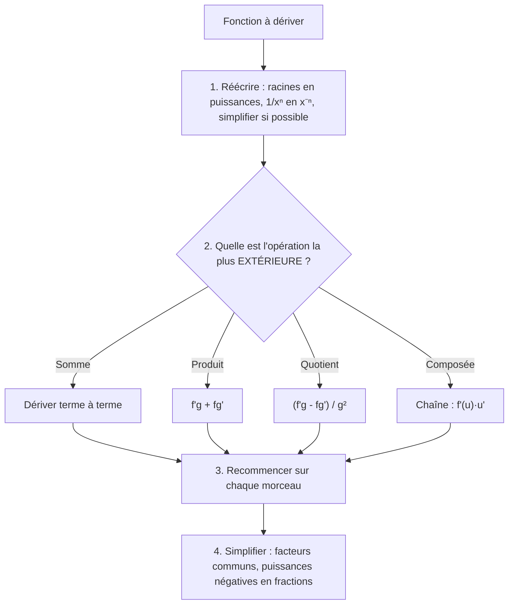
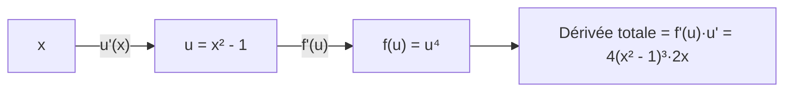

# 8. Règles de dérivation

> 🎯 **Objectif** : dériver rapidement et sans erreur **n'importe quelle** fonction construite à partir des fonctions usuelles (puissances, racines, exponentielles, logarithmes, trigonométriques, arctan), en combinant les règles du produit, du quotient et de la chaîne, puis **simplifier** le résultat. C'est « Dérivées » dans les TE 2, TE 3, Test 1 (2023) et l'examen de décembre 2023.

---

## 1. Introduction & définitions

Calculer une dérivée par la définition (chapitre 7) est long. On établit une fois pour toutes les dérivées des fonctions de base et des **règles** pour les combiner.

### 1.1 Table des dérivées usuelles

| $$f(x)$$ | $$f'(x)$$ | Remarque |
| --- | --- | --- |
| $$c$$ (constante) | $$0$$ | $$\pi$$, $$e^2$$, $$\ln 2$$, $$\sin 4$$ sont des constantes ! |
| $$x^n$$ | $$nx^{n-1}$$ | valable pour tout exposant réel $$n$$ |
| $$\sqrt{x}$$ | $$\frac{1}{2\sqrt{x}}$$ | cas $$n = \frac{1}{2}$$ |
| $$\frac{1}{x}$$ | $$-\frac{1}{x^2}$$ | cas $$n = -1$$ |
| $$e^x$$ | $$e^x$$ | |
| $$a^x$$ | $$a^x\ln a$$ | |
| $$\ln x$$ | $$\frac{1}{x}$$ | |
| $$\log_a x$$ | $$\frac{1}{x\ln a}$$ | |
| $$\sin x$$ | $$\cos x$$ | |
| $$\cos x$$ | $$-\sin x$$ | |
| $$\tan x$$ | $$\frac{1}{\cos^2 x} = 1 + \tan^2 x = \sec^2 x$$ | |
| $$\arctan x$$ | $$\frac{1}{1 + x^2}$$ | |
| $$\arcsin x$$ | $$\frac{1}{\sqrt{1 - x^2}}$$ | |
| $$\arccos x$$ | $$-\frac{1}{\sqrt{1 - x^2}}$$ | |

### 1.2 Règles de combinaison

**Linéarité** : $$(af + bg)' = af' + bg'$$.

**Produit** :

$$(f\cdot g)' = f'g + fg'$$

**Quotient** :

$$\left(\frac{f}{g}\right)' = \frac{f'g - fg'}{g^2}$$

**Chaîne** (fonction composée) — « dérivée de l'extérieur, évaluée à l'intérieur, **fois** dérivée de l'intérieur » :

$$\left(f(u(x))\right)' = f'(u(x))\cdot u'(x)$$

Formes fréquentes de la règle de chaîne :

$$\left(u^n\right)' = nu^{n-1}u' \qquad \left(e^u\right)' = e^uu' \qquad \left(\ln u\right)' = \frac{u'}{u} \qquad \left(\sin u\right)' = u'\cos u \qquad \left(\sqrt{u}\right)' = \frac{u'}{2\sqrt{u}}$$

### 1.3 Dérivées d'ordre supérieur

$$f'' = (f')'$$ est la **dérivée seconde** (concavité, accélération), $$f''' = (f'')'$$ la dérivée troisième, etc. Notation de Leibniz : $$\frac{d^2y}{dx^2}$$, $$\frac{d^3x}{dt^3}$$.

---

## 2. Méthodes de résolution

### Méthode générale

### Astuces

- **Avant de dériver, simplifier** : $$\frac{x}{e^x} = xe^{-x}$$ ; $$\ln(5t^2) = \ln 5 + 2\ln t$$ ; $$\frac{x^2 - 3x}{x^3} = \frac{1}{x} - \frac{3}{x^2}$$.
- Pour un **produit de puissances**, mettre en évidence les **plus petites puissances** communes à la fin.
- Pour évaluer une dérivée en un point, dériver d'abord, **puis** substituer.

---

## 3. Exemples de calculs détaillés

### Exemple 1 — Somme de puissances (TE 2, 2024)

$$a(x) = 2x^5 - 8x^3 + 11x^2 + 7\sqrt[3]{x} + \frac{1}{3x} + \frac{5}{\sqrt{x}}$$

**Réécriture** en puissances : $$a(x) = 2x^5 - 8x^3 + 11x^2 + 7x^{1/3} + \frac{1}{3}x^{-1} + 5x^{-1/2}$$.

**Dérivation** terme à terme avec $$(x^n)' = nx^{n-1}$$ :

$$a'(x) = 10x^4 - 24x^2 + 22x + \frac{7}{3}x^{-2/3} - \frac{1}{3}x^{-2} - \frac{5}{2}x^{-3/2}$$

$$a'(x) = 10x^4 - 24x^2 + 22x + \frac{7}{3\sqrt[3]{x^2}} - \frac{1}{3x^2} - \frac{5}{2x\sqrt{x}}$$

> ⚠️ Erreur vue en examen : $$\left(\frac{1}{3x}\right)' = -\frac{1}{3x^2}$$, et non $$-\frac{1}{9x^2}$$ ni $$-3x^{-2}$$. Le $$\frac{1}{3}$$ est une constante multiplicative.

### Exemple 2 — Quotient (TE 2, 2024)

$$b(t) = \frac{2t - 5}{1 - 3t} \qquad b'(t) = \frac{2(1 - 3t) - (2t - 5)(-3)}{(1 - 3t)^2} = \frac{2 - 6t + 6t - 15}{(1 - 3t)^2} = \frac{-13}{(1 - 3t)^2}$$

### Exemple 3 — La chaîne sous toutes ses formes (TE 3, 2024)

**a)** $$a(x) = \log_7(5x^2 - 3)$$ : $$(\log_7 u)' = \frac{u'}{u\ln 7}$$ avec $$u' = 10x$$ :

$$a'(x) = \frac{10x}{(5x^2 - 3)\ln 7}$$

**b)** $$b(x) = 3^{4x + 5}$$ : $$(3^u)' = 3^u\ln 3\cdot u'$$ :

$$b'(x) = 4\ln 3\cdot 3^{4x + 5}$$

(Attention : on ne peut **pas** écrire $$4\cdot 3^{4x+5} = 12^{4x+5}$$ !)

**c)** $$c(x) = 4\arctan\left(\sqrt{x - 1}\right)$$ : chaîne à deux étages :

$$c'(x) = 4\cdot\frac{1}{1 + \left(\sqrt{x - 1}\right)^2}\cdot\frac{1}{2\sqrt{x - 1}} = \frac{4}{x}\cdot\frac{1}{2\sqrt{x - 1}} = \frac{2}{x\sqrt{x - 1}}$$

**d)** $$d(x) = \cos\left(\frac{2}{3x}\right)$$ : intérieur $$u = \frac{2}{3}x^{-1}$$, $$u' = -\frac{2}{3x^2}$$ :

$$d'(x) = -\sin\left(\frac{2}{3x}\right)\cdot\left(-\frac{2}{3x^2}\right) = \frac{2}{3x^2}\sin\left(\frac{2}{3x}\right)$$

### Exemple 4 — Produit de puissances et factorisation (TE 3, 2024)

$$e(x) = (x^2 - 1)^4(x^3 + 2)^5$$

Produit, puis chaîne sur chaque facteur :

$$e'(x) = 4(x^2 - 1)^3\cdot 2x\cdot(x^3 + 2)^5 + (x^2 - 1)^4\cdot 5(x^3 + 2)^4\cdot 3x^2$$

On met en évidence les plus petites puissances communes $$x(x^2 - 1)^3(x^3 + 2)^4$$ :

$$e'(x) = x(x^2 - 1)^3(x^3 + 2)^4\left[8(x^3 + 2) + 15x(x^2 - 1)\right] = x(x^2 - 1)^3(x^3 + 2)^4\left(23x^3 - 15x + 16\right)$$

### Exemple 5 — Exponentielles et logarithmes (TE 3, 2024)

- $$h(x) = (x - 1)e^{-2x}$$ : $$h'(x) = e^{-2x} + (x - 1)(-2)e^{-2x} = e^{-2x}(1 - 2x + 2) = e^{-2x}(3 - 2x)$$.
- $$i(x) = \ln\left(\sin(3e^{2x})\right)$$ : $$i'(x) = \frac{\cos(3e^{2x})\cdot 6e^{2x}}{\sin(3e^{2x})} = 6e^{2x}\cot\left(3e^{2x}\right)$$.
- $$j(x) = \frac{x}{e^x} = xe^{-x}$$ : $$j'(x) = e^{-x} - xe^{-x} = e^{-x}(1 - x)$$.
- $$g(x) = 5\sin^2(4x)$$ : $$g'(x) = 5\cdot 2\sin(4x)\cdot\cos(4x)\cdot 4 = 40\sin(4x)\cos(4x) = 20\sin(8x)$$ (duplication).

### Exemple 6 — Dérivée en un point et dérivée troisième (Travail écrit 3, 2023)

*e) $$\frac{dy}{dx}\Big\vert_{x = 4}$$ pour $$y = \frac{x^2 - x - 2}{x^2 - 6}$$.*

$$y' = \frac{(2x - 1)(x^2 - 6) - (x^2 - x - 2)(2x)}{(x^2 - 6)^2} \qquad y'(4) = \frac{7\cdot 10 - 10\cdot 8}{100} = -\frac{1}{10}$$

*f) $$x'''(t)$$ pour $$x(t) = \ln(5t^2)$$.* On simplifie d'abord : $$x(t) = \ln 5 + 2\ln t$$ (pour $$t > 0$$).

$$x'(t) = \frac{2}{t} \qquad x''(t) = -\frac{2}{t^2} \qquad x'''(t) = \frac{4}{t^3}$$

---

## 4. Visualisation : la règle de chaîne comme une chaîne d'engrenages

Chaque « étage » multiplie par sa propre dérivée, évaluée à l'étage inférieur.

---

## 5. Exercices pratiques

### Exercice 1 — (Travail écrit 3, 2023)

Dériver : a) $$f(x) = 5x^6\tan x$$ ; b) $$g(t) = 2\sqrt{t^2 + t}$$ ; c) $$k(y) = \cos(3y^3 - 5y) + 2$$ ; d) $$h(t) = 2te^{4t^2}$$.

💡 Cliquez pour voir l'indice

a) produit ; b) chaîne avec $$\sqrt{u}$$ ; c) chaîne avec $$\cos u$$ (la constante $$2$$ disparaît) ; d) produit **et** chaîne.

**Solution détaillée**

a) $$f'(x) = 30x^5\tan x + 5x^6\cdot\frac{1}{\cos^2 x} = 5x^5\left(6\tan x + \frac{x}{\cos^2 x}\right)$$.

b) $$g'(t) = 2\cdot\frac{2t + 1}{2\sqrt{t^2 + t}} = \frac{2t + 1}{\sqrt{t^2 + t}}$$.

c) $$k'(y) = -\sin(3y^3 - 5y)\cdot(9y^2 - 5) = (5 - 9y^2)\sin(3y^3 - 5y)$$.

d) $$h'(t) = 2e^{4t^2} + 2t\cdot e^{4t^2}\cdot 8t = 2e^{4t^2}\left(1 + 8t^2\right)$$.

### Exercice 2 — (TE 3, 2019)

Dériver : a) $$f(x) = 2e^{-\sqrt{x}} + \pi^2x - \ln(2)x^2$$ ; b) $$g(a) = \sqrt[7]{(4a^3 + 2)^5}$$ ; c) $$h(u) = \frac{u^2 - 2}{7 - 3u}$$.

💡 Cliquez pour voir l'indice

a) $$\pi^2$$ et $$\ln 2$$ sont des **constantes**. b) Écrivez $$(4a^3 + 2)^{5/7}$$. c) Quotient.

**Solution détaillée**

a) $$f'(x) = 2e^{-\sqrt{x}}\cdot\left(-\frac{1}{2\sqrt{x}}\right) + \pi^2 - 2\ln(2)\,x = -\frac{e^{-\sqrt{x}}}{\sqrt{x}} + \pi^2 - 2\ln(2)\,x$$.

b) $$g'(a) = \frac{5}{7}(4a^3 + 2)^{-2/7}\cdot 12a^2 = \frac{60a^2}{7\sqrt[7]{(4a^3 + 2)^2}}$$.

c) $$h'(u) = \frac{2u(7 - 3u) - (u^2 - 2)(-3)}{(7 - 3u)^2} = \frac{14u - 6u^2 + 3u^2 - 6}{(7 - 3u)^2} = \frac{-3u^2 + 14u - 6}{(7 - 3u)^2}$$.

### Exercice 3 — (Examen, décembre 2023)

a) $$f(x) = \frac{(x^2 - 16)^2}{\pi}$$ ; b) $$f(x) = \ln\left(e^{x^2 - 5x + 3}\right)$$ ; c) $$f(x) = (x^2 - 7)\sqrt{3x - 5}$$ ; d) sachant que $$f(2) = -4$$ et $$f'(2) = 1$$, écrire la tangente en $$x = 2$$.

💡 Cliquez pour voir l'indice

a) $$\frac{1}{\pi}$$ est une constante. b) Simplifiez d'abord : $$\ln(e^A) = A$$. d) Formule de la tangente.

**Solution détaillée**

a) $$f'(x) = \frac{2(x^2 - 16)\cdot 2x}{\pi} = \frac{4x(x^2 - 16)}{\pi} = \frac{4x^3 - 64x}{\pi}$$.

b) $$f(x) = x^2 - 5x + 3$$, donc $$f'(x) = 2x - 5$$.

c) $$f'(x) = 2x\sqrt{3x - 5} + (x^2 - 7)\cdot\frac{3}{2\sqrt{3x - 5}} = \frac{4x(3x - 5) + 3(x^2 - 7)}{2\sqrt{3x - 5}} = \frac{15x^2 - 20x - 21}{2\sqrt{3x - 5}}$$.

d) $$y = f'(2)(x - 2) + f(2) = (x - 2) - 4 = x - 6$$.
