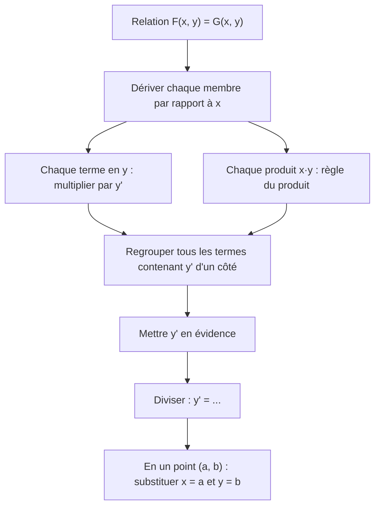
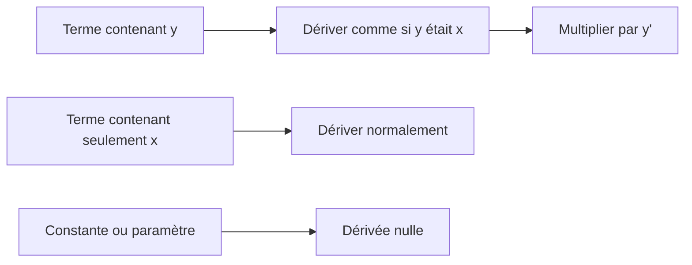

# 9. Dérivation implicite et dérivation logarithmique

> 🎯 **Objectif** : dériver une relation $F(x, y) = 0$ où $y$ n'est pas isolable (dérivation **implicite**), trouver la pente d'une courbe en un point, et dériver des fonctions du type $f(x)^{g(x)}$ (dérivation **logarithmique**). C'est « Dérivée implicite » (TE 2, TE 3), « Dérivées logarithmiques » (TE 3, 2024) et le « folium de Descartes » (Test 1, 2023).

---

## 1. Introduction & définitions

### 1.1 Fonctions implicites

Une équation comme $x^2 + y^2 = 25$ décrit une courbe (ici un cercle) sans donner $y$ **explicitement** en fonction de $x$. Localement, autour d'un point, $y$ **est** une fonction de $x$ : $y = y(x)$. On peut la dériver **sans l'isoler**.

**Principe** : on dérive les deux membres par rapport à $x$, en se souvenant que $y$ dépend de $x$. Par la règle de chaîne :

$$\frac{d}{dx}\left(y^2\right) = 2y\cdot y' \qquad \frac{d}{dx}\left(e^y\right) = e^y\cdot y' \qquad \frac{d}{dx}\left(\sin y\right) = \cos y\cdot y'$$

et, par la règle du produit :

$$\frac{d}{dx}\left(xy\right) = 1\cdot y + x\cdot y'$$

> 💡 **Réflexe** : chaque fois qu'on dérive une expression contenant $y$, on multiplie par $y'$ (ou $\frac{dy}{dx}$). C'est la règle de chaîne, avec $y$ comme « fonction intérieure ».

### 1.2 Dérivation logarithmique

Pour une fonction où la variable est **à la fois dans la base et dans l'exposant**, comme $y = x^x$ ou $y = (\cos 3x)^{\sin 3x}$, aucune règle du chapitre 8 ne s'applique directement ($(u^n)' = nu^{n-1}u'$ exige un exposant constant ; $(a^u)' = a^u\ln a\, u'$ exige une base constante).

On prend le logarithme :

$$y = f(x)^{g(x)} \implies \ln y = g(x)\ln f(x)$$

puis on dérive implicitement : $\frac{y'}{y} = \left(g(x)\ln f(x)\right)'$, et enfin $y' = y\cdot\left(g(x)\ln f(x)\right)'$.

Équivalent : $f^g = e^{g\ln f}$, puis règle de chaîne.

---

## 2. Méthodes de résolution

### Méthode A — Dérivation implicite

### Méthode B — Tangente à une courbe implicite

1. Vérifier que le point appartient à la courbe.
2. Calculer $y'$ implicitement et l'évaluer au point : pente $m$.
3. $y = m(x - a) + b$.

### Méthode C — Dérivation logarithmique

1. Écrire $\ln y = g(x)\ln f(x)$ (en supposant $y > 0$).
2. Dériver : $\frac{y'}{y} = g'(x)\ln f(x) + g(x)\frac{f'(x)}{f(x)}$.
3. Multiplier par $y$ et remplacer $y$ par son expression.

---

## 3. Exemples de calculs détaillés

### Exemple 1 — Un exemple de base (TE 3, 2024)

$$e^{xy} + x^2 = 10 + y^2$$

**Étape 1 — Dériver** chaque terme :

- $\frac{d}{dx}e^{xy} = e^{xy}\cdot\frac{d}{dx}(xy) = e^{xy}(y + xy')$ (chaîne puis produit) ;
- $\frac{d}{dx}x^2 = 2x$ ; $\frac{d}{dx}10 = 0$ ; $\frac{d}{dx}y^2 = 2yy'$.

$$e^{xy}(y + xy') + 2x = 2yy'$$

**Étape 2 — Regrouper** les $y'$ à gauche :

$$xe^{xy}y' - 2yy' = -ye^{xy} - 2x \iff y'\left(xe^{xy} - 2y\right) = -\left(ye^{xy} + 2x\right)$$

**Étape 3 — Isoler** :

$$y' = -\frac{ye^{xy} + 2x}{xe^{xy} - 2y}$$

### Exemple 2 — Deux variables et un paramètre (TE 3, 2019)

*Calculer $\frac{dy}{dx}$ et $\frac{dy}{du}$ pour $8ux^3y + 3e^{-4x} - 7x^2y^{-3} = 0$.*

**$\frac{dy}{dx}$** ($u$ est une **constante**) :

$$8u\left(3x^2y + x^3y'\right) - 12e^{-4x} - 7\left(2xy^{-3} - 3x^2y^{-4}y'\right) = 0$$

$$y'\left(8ux^3 + 21x^2y^{-4}\right) = 12e^{-4x} + 14xy^{-3} - 24ux^2y$$

$$\frac{dy}{dx} = \frac{12e^{-4x} + 14xy^{-3} - 24ux^2y}{8ux^3 + 21x^2y^{-4}}$$

**$\frac{dy}{du}$** ($x$ est maintenant **constant**, $y = y(u)$) :

$$8x^3\left(y + uy'\right) + 0 - 7x^2\left(-3y^{-4}y'\right) = 0 \iff y'\left(8ux^3 + 21x^2y^{-4}\right) = -8x^3y$$

$$\frac{dy}{du} = \frac{-8x^3y}{8ux^3 + 21x^2y^{-4}}$$

### Exemple 3 — Pente d'une courbe en un point : le folium de Descartes (Test 1, 2023)

*La courbe $x^3 + y^3 = 9xy$ passe par $P(4; 2)$. Pente de la tangente en $P$ ?*

**Vérification** : $64 + 8 = 72$ et $9\cdot 4\cdot 2 = 72$ ✓.

**Dérivation** :

$$3x^2 + 3y^2y' = 9y + 9xy' \iff y'\left(3y^2 - 9x\right) = 9y - 3x^2 \iff y' = \frac{3y - x^2}{y^2 - 3x}$$

**En $P$** :

$$y'(4; 2) = \frac{6 - 16}{4 - 12} = \frac{-10}{-8} = \frac{5}{4}$$

Tangente : $y = \frac{5}{4}(x - 4) + 2 = \frac{5}{4}x - 3$.

### Exemple 4 — Tangente avec des fonctions trigonométriques (Examen, janvier 2023)

*Équation de la tangente à la courbe $\sin(x + y) = 2x - 2y$ au point $(\pi; \pi)$.*

**Vérification** : $\sin(2\pi) = 0$ et $2\pi - 2\pi = 0$ ✓.

**Dérivation** : $\cos(x + y)\cdot(1 + y') = 2 - 2y'$.

**Isoler** : $y'\left(\cos(x + y) + 2\right) = 2 - \cos(x + y)$, donc $y' = \frac{2 - \cos(x + y)}{2 + \cos(x + y)}$.

**En $(\pi; \pi)$** : $\cos(2\pi) = 1$, donc $y' = \frac{1}{3}$ :

$$y = \frac{1}{3}(x - \pi) + \pi = \frac{x}{3} + \frac{2\pi}{3}$$

### Exemple 5 — Dérivation logarithmique (TE 3, 2024)

*a) $f(x) = (\cos 3x)^{\sin 3x}$ sur $\left]-\frac{\pi}{6}, \frac{\pi}{6}\right[$ (où $\cos 3x > 0$).*

$$\ln y = \sin(3x)\ln\left(\cos 3x\right)$$

$$\frac{y'}{y} = 3\cos(3x)\ln(\cos 3x) + \sin(3x)\cdot\frac{-3\sin 3x}{\cos 3x}$$

$$f'(x) = 3(\cos 3x)^{\sin 3x}\left[\cos(3x)\ln(\cos 3x) - \sin(3x)\tan(3x)\right]$$

*b) $f(x) = x^{2e^x}$ pour $x > 0$.*

$$\ln y = 2e^x\ln x \implies \frac{y'}{y} = 2e^x\ln x + \frac{2e^x}{x} \implies f'(x) = 2e^x\,x^{2e^x}\left(\ln x + \frac{1}{x}\right)$$

---

## 4. Visualisation

---

## 5. Exercices pratiques

### Exercice 1 — (TE 3, 2024)

Déterminer $\frac{dy}{dx}$ pour $3^x + \ln(xy^2) = 5y$ (on suppose $x > 0$ et $y \neq 0$).

💡 Cliquez pour voir l'indice

Simplifiez d'abord $\ln(xy^2) = \ln x + 2\ln\lvert y \rvert$. La dérivée de $2\ln\lvert y \rvert$ est $\frac{2y'}{y}$.

**Solution détaillée**

1. $3^x + \ln x + 2\ln\lvert y \rvert = 5y$.
2. Dérivation : $3^x\ln 3 + \frac{1}{x} + \frac{2y'}{y} = 5y'$.
3. Regrouper : $y'\left(5 - \frac{2}{y}\right) = 3^x\ln 3 + \frac{1}{x}$.
4. Simplifier en multipliant haut et bas par $xy$ :

$$\frac{dy}{dx} = \frac{3^x\ln 3 + \frac{1}{x}}{5 - \frac{2}{y}} = \frac{y\left(x\,3^x\ln 3 + 1\right)}{x(5y - 2)}$$

### Exercice 2 — (Examen, janvier 2023)

Calculer $\frac{dy}{dx}$ pour $\cos(xy) = \sin(x + y)$.

💡 Cliquez pour voir l'indice

$\frac{d}{dx}\cos(xy) = -\sin(xy)\cdot(y + xy')$ et $\frac{d}{dx}\sin(x + y) = \cos(x + y)\cdot(1 + y')$.

**Solution détaillée**

1. $-\sin(xy)(y + xy') = \cos(x + y)(1 + y')$.
2. Développer : $-y\sin(xy) - xy'\sin(xy) = \cos(x + y) + y'\cos(x + y)$.
3. Regrouper : $-y'\left[x\sin(xy) + \cos(x + y)\right] = \cos(x + y) + y\sin(xy)$.

$$\frac{dy}{dx} = -\frac{\cos(x + y) + y\sin(xy)}{x\sin(xy) + \cos(x + y)}$$

### Exercice 3 — Tangente à un cercle et dérivation logarithmique

a) Trouver la tangente au cercle $x^2 + y^2 = 25$ au point $(3; -4)$. b) Dériver $y = x^{\sin x}$ pour $x > 0$.

💡 Cliquez pour voir l'indice

a) $2x + 2yy' = 0$. Contrôle : la tangente à un cercle est perpendiculaire au rayon. b) $\ln y = \sin x\ln x$.

**Solution détaillée**

a) $y' = -\frac{x}{y}$, donc en $(3; -4)$ : $y' = \frac{3}{4}$. Tangente : $y = \frac{3}{4}(x - 3) - 4 = \frac{3}{4}x - \frac{25}{4}$. Contrôle : le rayon a pour pente $\frac{-4}{3}$ et $\frac{3}{4}\cdot\left(-\frac{4}{3}\right) = -1$ ✓ (perpendiculaires).

b) $\frac{y'}{y} = \cos x\ln x + \frac{\sin x}{x}$, donc $y' = x^{\sin x}\left(\cos x\ln x + \frac{\sin x}{x}\right)$.
