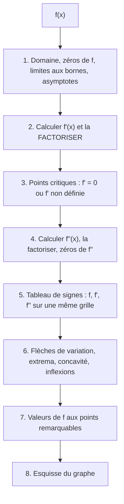
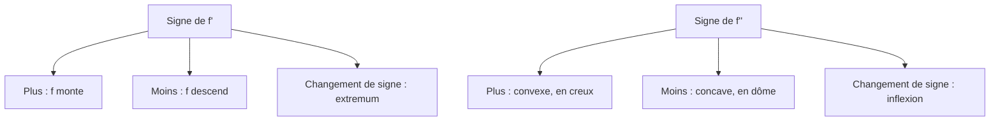

# 10. Étude de fonction : variations, extrema et concavité

> 🎯 **Objectif** : utiliser $f'$ et $f''$ pour trouver les intervalles de croissance, les extrema (relatifs et absolus), la concavité et les points d'inflexion, construire le **tableau de signes complet** et esquisser le graphe. C'est « Étude de fonction » (TE 3, 2019), « Croissance/décroissance et extrema » (TE 4, 2025), « Représentation graphique » et les exercices 6-7 du Travail écrit 3 (2023).

---

## 1. Introduction & définitions

### 1.1 Monotonie et signe de la dérivée

Sur un intervalle :

- $f'(x) > 0 \implies f$ **croissante** ;
- $f'(x) < 0 \implies f$ **décroissante** ;
- $f'(x) = 0$ partout $\implies f$ constante.

### 1.2 Points critiques et extrema

Un **point critique** (ou valeur critique) est un $c \in D_f$ où $f'(c) = 0$ **ou** $f'(c)$ n'existe pas.

- **Maximum relatif (local)** en $c$ : $f(c) \geq f(x)$ pour les $x$ proches de $c$.
- **Minimum relatif** : $f(c) \leq f(x)$ au voisinage.
- **Extremum absolu (global)** sur un intervalle $I$ : la plus grande (plus petite) valeur de $f$ sur **tout** $I$.

> 💡 **Théorème** : un extremum relatif à l'intérieur du domaine ne peut se trouver qu'en un **point critique**. Mais un point critique n'est pas forcément un extremum : $f(x) = x^3$ a $f'(0) = 0$ sans extremum (c'est un **point selle**, ou « replat »).

### 1.3 Test de la dérivée première

En un point critique $c$ :

| Signe de $f'$ à gauche puis à droite | Conclusion |
| --- | --- |
| $+$ puis $-$ | **maximum** relatif |
| $-$ puis $+$ | **minimum** relatif |
| même signe des deux côtés | pas d'extremum (point selle si $f'(c) = 0$) |

### 1.4 Concavité et dérivée seconde

- $f''(x) > 0$ : $f$ est **convexe** (courbe « en creux », $\cup$) ; les tangentes sont **sous** la courbe.
- $f''(x) < 0$ : $f$ est **concave** (courbe « en dôme », $\cap$).
- Un **point d'inflexion** est un point où la concavité **change** (souvent là où $f'' = 0$ **et** change de signe).

**Test de la dérivée seconde** : si $f'(c) = 0$ et $f''(c) < 0$, c'est un maximum ; si $f''(c) > 0$, un minimum ; si $f''(c) = 0$, on ne peut pas conclure (revenir au test de la dérivée première).

### 1.5 Extrema absolus sur un intervalle fermé $[a, b]$

Une fonction **continue** sur $[a, b]$ atteint toujours un maximum et un minimum absolus. Ils se trouvent **soit en un point critique, soit à une borne**.

### 1.6 Points particuliers du graphe

- **Point anguleux** : $f$ continue mais pentes différentes à gauche et à droite ($f'$ n'existe pas).
- **Point de rebroussement** : tangente verticale, pentes $\pm\infty$ (ex. $x^{2/3}$ en $0$).
- **Asymptotes** : voir chapitre 5.

---

## 2. Méthodes de résolution

### Méthode complète d'étude de fonction

### Méthode — Extrema absolus sur $[a, b]$

1. Trouver les points critiques **dans** $]a, b[$.
2. Calculer $f$ en ces points **et** en $a$ et $b$.
3. La plus grande valeur est le maximum absolu, la plus petite le minimum absolu.
4. Nature des autres points (extrema relatifs) par le tableau de variation.

### Méthode inverse — Tableau de signes à partir de conditions

Quand l'énoncé donne les signes de $f'$ et $f''$ sur des intervalles, on les reporte dans un tableau puis on traduit chaque combinaison :

| $f'$ | $f''$ | Allure |
| --- | --- | --- |
| $+$ | $+$ | monte de plus en plus vite ($\nearrow$, convexe) |
| $+$ | $-$ | monte de moins en moins vite ($\nearrow$, concave) |
| $-$ | $+$ | descend en ralentissant ($\searrow$, convexe) |
| $-$ | $-$ | descend en accélérant ($\searrow$, concave) |

---

## 3. Exemples de calculs détaillés

### Exemple 1 — Étude complète d'un polynôme (TE 3, 2019)

*$f(x) = (x^2 - 2x + 1)(2x + 7)$.*

**a) Zéros.** $x^2 - 2x + 1 = (x - 1)^2$, donc $f(x) = (x - 1)^2(2x + 7)$ : zéros $x = 1$ (double) et $x = -\frac{7}{2}$.

**b) Dérivée** (produit) :

$$f'(x) = 2(x - 1)(2x + 7) + (x - 1)^2\cdot 2 = 2(x - 1)\left[(2x + 7) + (x - 1)\right] = 2(x - 1)(3x + 6) = 6(x - 1)(x + 2)$$

Zéros de $f'$ : $x = 1$ et $x = -2$.

**c) Dérivée seconde** : $f'(x) = 6(x^2 + x - 2)$, donc $f''(x) = 6(2x + 1)$, qui s'annule en $x = -\frac{1}{2}$.

**d) Tableau de signes.**

| $x$ | $x < -\frac{7}{2}$ | $-\frac{7}{2}$ | $]-\frac{7}{2}, -2[$ | $-2$ | $]-2, -\frac{1}{2}[$ | $-\frac{1}{2}$ | $]-\frac{1}{2}, 1[$ | $1$ | $x > 1$ |
| --- | --- | --- | --- | --- | --- | --- | --- | --- | --- |
| $f$ | $-$ | $0$ | $+$ | $+$ | $+$ | $+$ | $+$ | $0$ | $+$ |
| $f'$ | $+$ | $+$ | $+$ | $0$ | $-$ | $-$ | $-$ | $0$ | $+$ |
| $f''$ | $-$ | $-$ | $-$ | $-$ | $-$ | $0$ | $+$ | $+$ | $+$ |
| allure | $\nearrow$ concave | | $\nearrow$ concave | **max** | $\searrow$ concave | **inflexion** | $\searrow$ convexe | **min** | $\nearrow$ convexe |

**Valeurs** : $f(-2) = 9\cdot 3 = 27$ (maximum relatif) ; $f(1) = 0$ (minimum relatif) ; $f\left(-\frac{1}{2}\right) = \frac{9}{4}\cdot 6 = \frac{27}{2}$ (point d'inflexion).

### Exemple 2 — Croissance et extrema (TE 4, 2025)

*$f(x) = x^5 - \frac{25}{3}x^3 + 20x + e^{2\pi}$.*

$e^{2\pi}$ est une **constante** : sa dérivée est nulle.

$$f'(x) = 5x^4 - 25x^2 + 20 = 5(x^4 - 5x^2 + 4) = 5(x^2 - 1)(x^2 - 4)$$

Zéros : $\pm 1$ et $\pm 2$. Signes :

| $x$ | $x < -2$ | $-2 < x < -1$ | $-1 < x < 1$ | $1 < x < 2$ | $x > 2$ |
| --- | --- | --- | --- | --- | --- |
| $x^2 - 1$ | $+$ | $+$ | $-$ | $+$ | $+$ |
| $x^2 - 4$ | $+$ | $-$ | $-$ | $-$ | $+$ |
| $f'$ | $+$ | $-$ | $+$ | $-$ | $+$ |

- Croissante sur $]-\infty, -2]$, $[-1, 1]$ et $[2, +\infty[$ ; décroissante sur $[-2, -1]$ et $[1, 2]$.
- **Maxima** relatifs en $x = -2$ et $x = 1$ ; **minima** relatifs en $x = -1$ et $x = 2$.

### Exemple 3 — Avec une exponentielle (Travail écrit 3, 2023)

*$f(x) = x^2e^{-x^2}$.*

**a) Valeurs critiques** (produit + chaîne) :

$$f'(x) = 2xe^{-x^2} + x^2\cdot(-2x)e^{-x^2} = 2xe^{-x^2}\left(1 - x^2\right) = 2x(1 - x)(1 + x)e^{-x^2}$$

$e^{-x^2} > 0$ ne s'annule jamais : points critiques $x = 0$, $x = 1$, $x = -1$.

**b) Variations** : signe de $2x(1 - x^2)$ :

| $x$ | $x < -1$ | $-1 < x < 0$ | $0 < x < 1$ | $x > 1$ |
| --- | --- | --- | --- | --- |
| $f'$ | $+$ | $-$ | $+$ | $-$ |

Maxima relatifs en $x = \pm 1$ : $f(\pm 1) = e^{-1} \approx 0{,}37$ ; minimum relatif en $x = 0$ : $f(0) = 0$.

**c) Esquisse** : un seul zéro ($x = 0$), $f \geq 0$, $f \to 0$ en $\pm\infty$ : une courbe **paire** en forme de « M » arrondi, qui touche l'axe en $0$ et culmine à $e^{-1}$ en $\pm 1$.

### Exemple 4 — Point critique où $f'$ n'existe pas (Travail écrit 3, 2023)

*$f(x) = x^{2/3}(2x - 5)$, $D_f = \mathbb{R}$. a) Montrer que $f'(x) = \frac{10(x - 1)}{3\sqrt[3]{x}}$. b) Sachant $f(3) \approx 2{,}08$, trouver les extrema de $f$ sur $[-1, 3]$.*

**a)** Produit :

$$f'(x) = \frac{2}{3}x^{-1/3}(2x - 5) + 2x^{2/3} = \frac{2(2x - 5)}{3x^{1/3}} + \frac{6x}{3x^{1/3}} = \frac{4x - 10 + 6x}{3\sqrt[3]{x}} = \frac{10(x - 1)}{3\sqrt[3]{x}}$$

(on a écrit $2x^{2/3} = \frac{2x^{2/3}\cdot 3x^{1/3}}{3x^{1/3}} = \frac{6x}{3x^{1/3}}$).

**b)** Points critiques : $x = 1$ ($f' = 0$) et $x = 0$ ($f'$ **non définie** : dénominateur nul). Signes :

| $x$ | $-1 < x < 0$ | $0 < x < 1$ | $1 < x < 3$ |
| --- | --- | --- | --- |
| $10(x - 1)$ | $-$ | $-$ | $+$ |
| $\sqrt[3]{x}$ | $-$ | $+$ | $+$ |
| $f'$ | $+$ | $-$ | $+$ |

Valeurs : $f(-1) = 1\cdot(-7) = -7$ ; $f(0) = 0$ ; $f(1) = 1\cdot(-3) = -3$ ; $f(3) \approx 2{,}08$.

- **Maximum relatif** en $x = 0$ ($f = 0$) : c'est un **point de rebroussement** (tangente verticale).
- **Minimum relatif** en $x = 1$ ($f = -3$).
- **Minimum absolu** sur $[-1, 3]$ : $-7$ en $x = -1$ ; **maximum absolu** : $\approx 2{,}08$ en $x = 3$.

### Exemple 5 — Extrema sur un intervalle (Test 2, 2024)

*$f(x) = 2x^2e^{-x} + 4xe^{-x} - 4e^{-x}$ sur $[-2, 8]$.*

$f(x) = e^{-x}(2x^2 + 4x - 4)$, donc :

$$f'(x) = -e^{-x}(2x^2 + 4x - 4) + e^{-x}(4x + 4) = e^{-x}(8 - 2x^2) = 2e^{-x}(2 - x)(2 + x)$$

Points critiques : $x = \pm 2$ (dans l'intervalle, $-2$ est aussi une borne). $f' \geq 0$ sur $[-2, 2]$, $f' < 0$ sur $]2, 8]$.

$$f(-2) = e^2(8 - 8 - 4) = -4e^2 \approx -29{,}6 \qquad f(2) = e^{-2}(8 + 8 - 4) = 12e^{-2} \approx 1{,}62 \qquad f(8) = 156e^{-8} \approx 0{,}05$$

- **Minimum absolu** : $-4e^2$ en $x = -2$.
- **Maximum absolu** : $12e^{-2}$ en $x = 2$.
- En $x = 8$ : **minimum relatif** (la fonction décroît jusqu'à la borne), mais pas absolu.

---

## 4. Visualisation : ce que disent $f'$ et $f''$

---

## 5. Exercices pratiques

### Exercice 1 — Tableau à partir de conditions (TE 4, 2025)

$f$ est continue, avec $f'(2) = f'(5) = 0$, $f'(7)$ n'existe pas ; $f' > 0$ si $x < 2$ ou $2 < x < 5$ ; $f' < 0$ si $x > 5$. $f'' > 0$ si $2 < x < 4$ ou $x > 7$ ; $f'' < 0$ si $x < 2$ ou $4 < x < 7$. a) Dresser le tableau et décrire les points $x = 2, 4, 5, 7$. b) Que se passe-t-il en $x = 7$ ?

💡 Cliquez pour voir l'indice

En $x = 2$, $f'$ s'annule sans changer de signe. En $x = 7$, $f$ est continue mais pas dérivable, et $f'$ garde le même signe.

**Solution détaillée**

| $x$ | $x < 2$ | $2$ | $]2, 4[$ | $4$ | $]4, 5[$ | $5$ | $]5, 7[$ | $7$ | $x > 7$ |
| --- | --- | --- | --- | --- | --- | --- | --- | --- | --- |
| $f'$ | $+$ | $0$ | $+$ | $+$ | $+$ | $0$ | $-$ | non déf. | $-$ |
| $f''$ | $-$ | | $+$ | $0$ | $-$ | $-$ | $-$ | | $+$ |
| allure | $\nearrow$ concave | **selle** | $\nearrow$ convexe | **inflexion** | $\nearrow$ concave | **max** | $\searrow$ concave | **anguleux** | $\searrow$ convexe |

a) $x = 2$ : point selle (tangente horizontale, pas d'extremum, et changement de concavité). $x = 4$ : point d'inflexion. $x = 5$ : maximum relatif.

b) En $x = 7$, $f$ est continue mais $f'$ n'existe pas : c'est un **point anguleux** (pas une asymptote, ni un trou, puisque $f$ est continue).

### Exercice 2 — Points critiques et nature (Examen, janvier 2023)

Soit $f(x) = \frac{x}{x^2 + 4}$. a) Trouver les points critiques. b) Utiliser le test de la dérivée seconde pour déterminer leur nature.

💡 Cliquez pour voir l'indice

$f'(x) = \frac{4 - x^2}{(x^2 + 4)^2}$. Pour $f''$, simplifiez par un facteur $(x^2 + 4)$ avant de développer.

**Solution détaillée**

a) $f'(x) = \frac{(x^2 + 4) - x\cdot 2x}{(x^2 + 4)^2} = \frac{4 - x^2}{(x^2 + 4)^2}$, nul en $x = \pm 2$.

b) Dérivée seconde :

$$f''(x) = \frac{-2x(x^2 + 4)^2 - (4 - x^2)\cdot 2(x^2 + 4)\cdot 2x}{(x^2 + 4)^4} = \frac{-2x(x^2 + 4) - 4x(4 - x^2)}{(x^2 + 4)^3} = \frac{2x(x^2 - 12)}{(x^2 + 4)^3}$$

- $f''(2) = \frac{4\cdot(-8)}{8^3} < 0$ : **maximum** relatif, $f(2) = \frac{1}{4}$.
- $f''(-2) = \frac{-4\cdot(-8)}{8^3} > 0$ : **minimum** relatif, $f(-2) = -\frac{1}{4}$.

### Exercice 3 — Extrema absolus (Examen, janvier 2023)

Déterminer les valeurs extrêmes absolues de $f(x) = (x^2 - 4)^2$ sur $[-2, 3]$.

💡 Cliquez pour voir l'indice

$f'(x) = 4x(x^2 - 4)$. Comparez les valeurs de $f$ aux points critiques de $]-2, 3[$ et aux deux bornes.

**Solution détaillée**

1. $f'(x) = 2(x^2 - 4)\cdot 2x = 4x(x - 2)(x + 2)$ : points critiques $0$, $2$ (et $-2$, qui est une borne).
2. Valeurs : $f(-2) = 0$, $f(0) = 16$, $f(2) = 0$, $f(3) = 25$.
3. **Maximum absolu** : $25$ en $x = 3$. **Minimum absolu** : $0$ en $x = -2$ et $x = 2$. (En $x = 0$ : maximum **relatif** $16$.)
