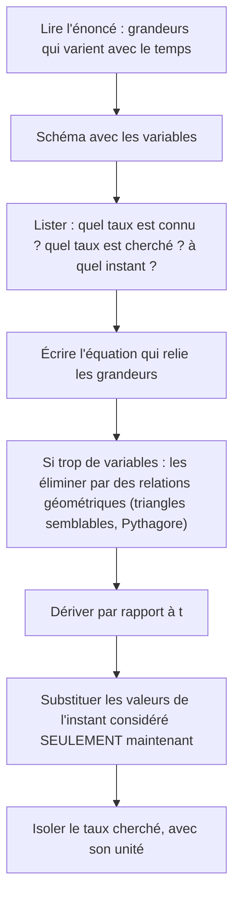
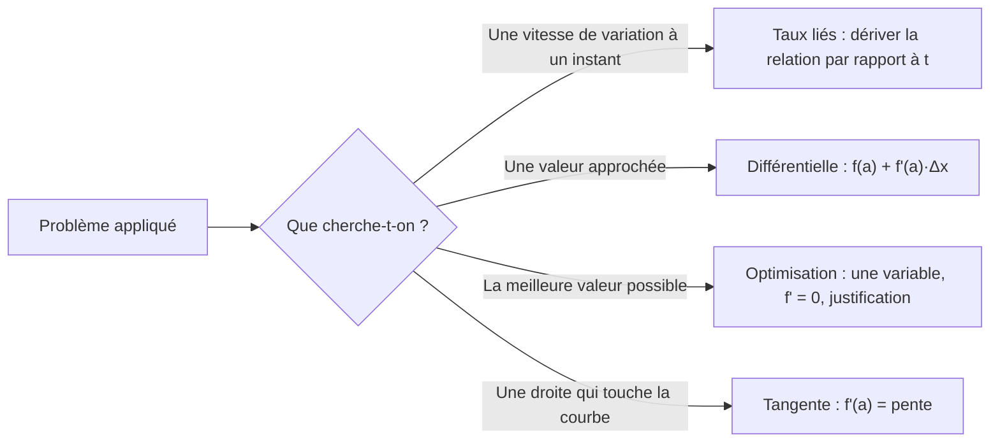

# 11. Applications des dérivées : taux liés, approximations et optimisation

> 🎯 **Objectif** : résoudre les trois grands types de problèmes appliqués : **taux de variation liés** (ballon, cône, radar), **approximation linéaire** par la différentielle, et **optimisation** (poutre, boîte de conserve, photosynthèse), ainsi que les problèmes de **tangentes** (avions et cibles, tangentes horizontales). C'est le TE 4 « Dérivées – applications » (2025), le Test 2 « Applications des dérivées » (2024) et l'examen de janvier 2023.

---

## 1. Introduction & définitions

### 1.1 Taux de variation liés

Quand plusieurs grandeurs dépendent du **temps** et sont reliées par une équation (géométrique ou physique), leurs **vitesses de variation** sont reliées aussi. On dérive l'équation par rapport à $t$ (dérivation implicite, chapitre 9) :

$$V = \frac{4}{3}\pi r^3 \implies \frac{dV}{dt} = 4\pi r^2\frac{dr}{dt}$$

### 1.2 Approximation linéaire (différentielle)

Près d'un point $a$, le graphe se confond avec sa tangente. Pour un petit écart $\Delta x$ :

$$f(a + \Delta x) \approx f(a) + f'(a)\,\Delta x$$

La quantité $df = f'(a)\,dx$ s'appelle la **différentielle**. On choisit $a$ **proche** du point voulu et **où $f(a)$ se calcule facilement**.

### 1.3 Optimisation

Trouver la valeur d'une variable qui rend une grandeur **maximale** ou **minimale** : c'est chercher un extremum absolu (chapitre 10), mais d'une fonction qu'il faut d'abord **construire** à partir de l'énoncé.

---

## 2. Méthodes de résolution

### Méthode A — Taux liés

> ⚠️ Ne substituer les valeurs numériques **qu'après** avoir dérivé : une grandeur qui varie ne doit pas être remplacée par une constante avant la dérivation.

### Méthode B — Approximation linéaire

1. Identifier la fonction $f$ (par ex. $f(x) = e^x$, $\sin x$, $\sqrt[3]{x}$).
2. Choisir $a$ « facile » proche de la valeur voulue et poser $\Delta x = \text{valeur} - a$.
3. Pour un angle : **convertir $\Delta x$ en radians**.
4. Calculer $f(a) + f'(a)\Delta x$.

### Méthode C — Optimisation

1. Identifier la grandeur à optimiser et l'écrire en formule (plusieurs variables au départ).
2. Utiliser la **contrainte** pour n'avoir qu'**une seule variable**.
3. Déterminer le **domaine** réaliste de cette variable (longueurs positives...).
4. Dériver, chercher les points critiques.
5. Justifier qu'il s'agit bien d'un maximum ou d'un minimum (tableau de signes ou $f''$).
6. Répondre à la question **posée** (toutes les dimensions, avec unités).

### Méthode D — Tangente passant par un point extérieur

1. Écrire la tangente en un point **inconnu** $a$ : $y = f'(a)(x - a) + f(a)$.
2. Imposer que le point extérieur $(x_0; y_0)$ vérifie cette équation.
3. Résoudre l'équation obtenue en $a$.

---

## 3. Exemples de calculs détaillés

### Exemple 1 — Ballon sphérique (TE 4, 2025)

*On gonfle un ballon sphérique. Quand son rayon vaut $2$ m, son volume augmente de $2\pi$ m³/min. a) À quel taux varie son rayon ? b) Sa surface ?*

**a)** $V = \frac{4}{3}\pi r^3$. Dérivée par rapport à $t$ :

$$\frac{dV}{dt} = 4\pi r^2\frac{dr}{dt} \implies \frac{dr}{dt} = \frac{dV/dt}{4\pi r^2} = \frac{2\pi}{4\pi\cdot 4} = \frac{1}{8} \text{ m/min}$$

**b)** $A = 4\pi r^2$ :

$$\frac{dA}{dt} = 8\pi r\frac{dr}{dt} = 8\pi\cdot 2\cdot\frac{1}{8} = 2\pi \text{ m}^2/\text{min}$$

### Exemple 2 — Récipient conique (Test 2, 2024)

*On verse de l'eau dans un cône (pointe en bas) de hauteur $H = 100$ cm et de rayon $R = 20$ cm. Lorsque la hauteur d'eau vaut $5$ cm, elle monte à $2$ cm/s. À quel rythme le volume augmente-t-il ?*

**Étape 1 — Variables** : $h(t)$ hauteur d'eau, $r(t)$ rayon de la surface. $V = \frac{1}{3}\pi r^2h$.

**Étape 2 — Éliminer $r$** : par triangles semblables, $\frac{r}{h} = \frac{R}{H}$, donc $r = \frac{R}{H}h$ et :

$$V = \frac{1}{3}\pi\frac{R^2}{H^2}h^3$$

**Étape 3 — Dériver** :

$$\frac{dV}{dt} = \pi\frac{R^2}{H^2}h^2\frac{dh}{dt}$$

**Étape 4 — Substituer** ($h = 5$, $\frac{dh}{dt} = 2$) :

$$\frac{dV}{dt} = \pi\cdot\frac{400}{10\,000}\cdot 25\cdot 2 = 2\pi \text{ cm}^3/\text{s} \approx 6{,}28 \text{ cm}^3/\text{s}$$

### Exemple 3 — Approximations linéaires (TE 4, 2025)

**a)** $e^{0{,}03}$ : $f(x) = e^x$, $a = 0$, $\Delta x = 0{,}03$ :

$$e^{0{,}03} \approx e^0 + e^0\cdot 0{,}03 = 1{,}03$$

**b)** $\sin(59°)$ : $f(x) = \sin x$, $a = 60° = \frac{\pi}{3}$, $\Delta x = -1° = -\frac{\pi}{180}$ rad :

$$\sin(59°) \approx \sin\frac{\pi}{3} + \cos\frac{\pi}{3}\cdot\left(-\frac{\pi}{180}\right) = \frac{\sqrt{3}}{2} - \frac{\pi}{360} \approx 0{,}8573$$

**c)** $\sqrt[3]{124}$ : $f(x) = \sqrt[3]{x}$, $a = 125$, $\Delta x = -1$, $f'(x) = \frac{1}{3\sqrt[3]{x^2}}$ :

$$\sqrt[3]{124} \approx 5 + \frac{1}{3\cdot 25}\cdot(-1) = 5 - \frac{1}{75} = \frac{374}{75} \approx 4{,}9867$$

(valeur exacte : $4{,}98663...$ : l'approximation est excellente).

### Exemple 4 — La poutre la plus résistante (TE 4, 2025)

*La résistance d'une poutre de section rectangulaire (base $b$, hauteur $h$) vaut $R = bh^2$. Quelles dimensions donnent la poutre la plus résistante tirée d'une bille de $30$ cm de diamètre ?*

**Contrainte** : la diagonale du rectangle est un diamètre : $b^2 + h^2 = 30^2 = 900$, donc $h^2 = 900 - b^2$.

**Une seule variable** : $R(b) = b(900 - b^2) = 900b - b^3$, pour $b \in \left]0, 30\right[$.

**Dérivée** : $R'(b) = 900 - 3b^2 = 0 \iff b^2 = 300 \iff b = 10\sqrt{3}$ (on rejette la valeur négative).

**Nature** : $R''(b) = -6b < 0$ : c'est un **maximum**.

**Réponse** : $b = 10\sqrt{3} \approx 17{,}3$ cm et $h = \sqrt{900 - 300} = 10\sqrt{6} \approx 24{,}5$ cm.

### Exemple 5 — La boîte de conserve (Test 2, 2024)

*Dimensions d'une boîte cylindrique de volume $16\pi$ cm³ utilisant le moins de métal possible ?*

- Surface totale (deux disques + paroi) : $A = 2\pi r^2 + 2\pi rh$.
- Contrainte : $\pi r^2h = 16\pi$, donc $h = \frac{16}{r^2}$.
- $A(r) = 2\pi r^2 + \frac{32\pi}{r}$, pour $r > 0$.
- $A'(r) = 4\pi r - \frac{32\pi}{r^2} = 0 \iff r^3 = 8 \iff r = 2$ cm.
- $A'' = 4\pi + \frac{64\pi}{r^3} > 0$ : minimum.
- $h = \frac{16}{4} = 4$ cm et $A = 8\pi + 16\pi = 24\pi$ cm².

(On remarque $h = 2r$ : la boîte optimale est aussi haute que large.)

### Exemple 6 — L'avion et les cibles (Test 1, 2023)

*Un avion suit la trajectoire $y = \frac{2x + 1}{x}$ ($x > 0$) et tire selon la **tangente** vers des cibles sur l'axe $Ox$ en $x = 1, 2, 3, 4$. a) Touche-t-il la cible 4 s'il tire depuis $(1; 3)$ ? b) D'où doit-il tirer pour atteindre la cible 2 ?*

On écrit $y = 2 + \frac{1}{x}$, donc $y' = -\frac{1}{x^2}$.

**a)** En $x = 1$ : pente $-1$ ; tangente $y = -(x - 1) + 3 = -x + 4$. En $x = 4$ : $y = 0$. **Oui**, la cible 4 est touchée.

**b)** Tangente au point d'abscisse $a$ : $y = -\frac{1}{a^2}(x - a) + 2 + \frac{1}{a}$. On impose le passage par $(2; 0)$ :

$$0 = -\frac{2 - a}{a^2} + 2 + \frac{1}{a} \iff 0 = -(2 - a) + 2a^2 + a \iff 2a^2 + 2a - 2 = 0 \iff a^2 + a - 1 = 0$$

$$a = \frac{-1 + \sqrt{5}}{2} \approx 0{,}618 \quad (\text{la racine négative est exclue car } x > 0)$$

Point de tir : $\left(\frac{\sqrt{5} - 1}{2};\ 2 + \frac{2}{\sqrt{5} - 1}\right) = \left(\frac{\sqrt{5} - 1}{2};\ \frac{5 + \sqrt{5}}{2}\right) \approx (0{,}618; 3{,}618)$.

### Exemple 7 — Tangentes horizontales (TE 3, 2019)

*Pour quelles valeurs de $x$ la fonction $f(x) = (5 - x^3)^4(4x^2 - 11)^5$ a-t-elle une tangente horizontale ?*

Tangente horizontale $\iff f'(x) = 0$. Produit et chaîne :

$$f'(x) = 4(5 - x^3)^3(-3x^2)(4x^2 - 11)^5 + (5 - x^3)^4\cdot 5(4x^2 - 11)^4\cdot 8x$$

On met en évidence $4x(5 - x^3)^3(4x^2 - 11)^4$ :

$$f'(x) = 4x(5 - x^3)^3(4x^2 - 11)^4\left[-3x(4x^2 - 11) + 10(5 - x^3)\right] = 4x(5 - x^3)^3(4x^2 - 11)^4\left(-22x^3 + 33x + 50\right)$$

Zéros faciles : $x = 0$, $x = \sqrt[3]{5}$, $x = \pm\frac{\sqrt{11}}{2}$. Cela fait **quatre valeurs** (le dernier facteur a encore une racine réelle, difficile à calculer à la main).

---

## 4. Visualisation : les trois familles de problèmes

---

## 5. Exercices pratiques

### Exercice 1 — Mobile sur une courbe (Examen, janvier 2023)

Un mobile parcourt la courbe $y = \sqrt{1 + x^3}$. Au moment où il passe par le point $(2; 3)$, son ordonnée croît à la vitesse de $8$ cm/s. À quelle vitesse croît son abscisse à cet instant ?

💡 Cliquez pour voir l'indice

Dérivez $y = \sqrt{1 + x^3}$ par rapport au temps : $\frac{dy}{dt} = \frac{3x^2}{2\sqrt{1 + x^3}}\cdot\frac{dx}{dt}$.

**Solution détaillée**

1. $\frac{dy}{dt} = \frac{3x^2}{2\sqrt{1 + x^3}}\frac{dx}{dt}$.
2. En $(2; 3)$ : $\frac{3\cdot 4}{2\cdot 3} = 2$, donc $8 = 2\frac{dx}{dt}$.
3. $\frac{dx}{dt} = 4$ cm/s.

### Exercice 2 — Photosynthèse (Examen, janvier 2023)

Le taux de photosynthèse d'un phytoplancton vaut $P(I) = \frac{100I}{I^2 + I + 4}$, où $I > 0$ est l'intensité lumineuse. Pour quelle intensité $P$ est-il maximal ?

💡 Cliquez pour voir l'indice

Règle du quotient ; au numérateur de $P'$, les termes en $I^2$ et en $I$ se simplifient en partie.

**Solution détaillée**

1. $P'(I) = \frac{100(I^2 + I + 4) - 100I(2I + 1)}{(I^2 + I + 4)^2} = \frac{100(4 - I^2)}{(I^2 + I + 4)^2}$.
2. $P'(I) = 0 \iff I = 2$ (car $I > 0$).
3. $P' > 0$ pour $0 < I < 2$ et $P' < 0$ pour $I > 2$ : **maximum** en $I = 2$, avec $P(2) = \frac{200}{10} = 20$.

### Exercice 3 — Radar et différentielle (TE, 2022 et Test 2, 2024)

a) Un avion vole horizontalement à $750$ km/h, à une altitude de $1{,}8$ km, et passe exactement à la verticale d'une station radar à $t = 0$. À quelle vitesse la distance avion-radar augmente-t-elle quand l'avion est à $2{,}4$ km (horizontalement) de la station ? b) Utiliser la différentielle pour approcher $\ln\left(\frac{1}{0{,}98}\right)$.

💡 Cliquez pour voir l'indice

a) $s^2 = 1{,}8^2 + d^2$ avec $\frac{dd}{dt} = 750$. b) $\ln\left(\frac{1}{x}\right) = -\ln x$ avec $a = 1$ et $\Delta x = -0{,}02$.

**Solution détaillée**

a) Dérivée de $s^2 = 1{,}8^2 + d^2$ : $2s\frac{ds}{dt} = 2d\frac{dd}{dt}$, donc $\frac{ds}{dt} = \frac{d}{s}\cdot\frac{dd}{dt}$. Pour $d = 2{,}4$ : $s = \sqrt{3{,}24 + 5{,}76} = 3$ km. Donc $\frac{ds}{dt} = \frac{2{,}4}{3}\cdot 750 = 600$ km/h.

b) $f(x) = -\ln x$, $f'(x) = -\frac{1}{x}$ ; en $a = 1$ : $f(1) = 0$, $f'(1) = -1$. Avec $\Delta x = -0{,}02$ :

$$\ln\left(\frac{1}{0{,}98}\right) \approx 0 + (-1)(-0{,}02) = 0{,}02$$

(valeur exacte $\approx 0{,}0202$).
