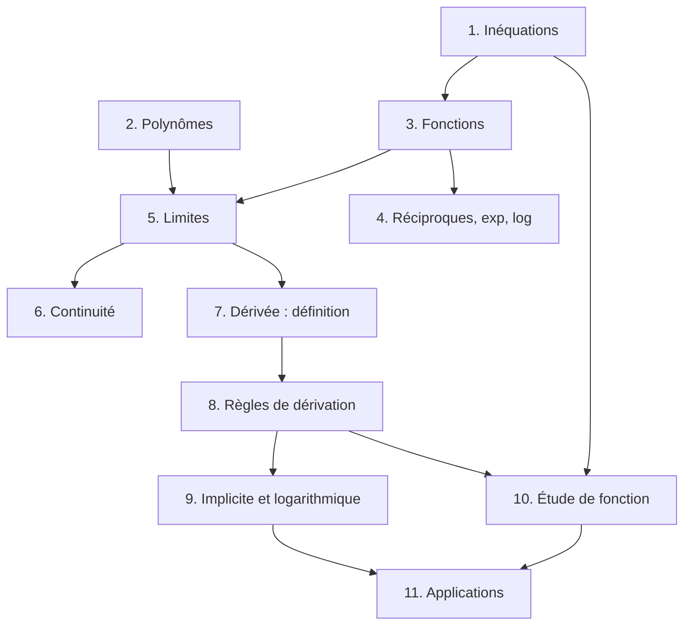

# Analyse 1

Ce cours reconstruit **toute la matière évaluée** dans les travaux écrits d'Analyse 1 (ISC, HEIA-FR) de 2019 à 2025 : TE « Révision et limites », « Limites et dérivées », « Dérivées », « Dérivées – applications », les Tests 1 et 2 (2023-2024) et les examens (« Travail écrit A/B »).

## Plan du cours

| # | Chapitre | Évalué dans |
| --- | --- | --- |
| 1 | [Inéquations, tableaux de signes et valeurs absolues](01-inequations-et-valeurs-absolues.md) | TE 1 « Inéquations », examens (Question 1) |
| 2 | [Polynômes : factorisation et division polynomiale](02-polynomes-factorisation-division.md) | TE 1 « Produit de facteurs », « Division polynomiale » |
| 3 | [Fonctions : domaine, image, composition, parité, transformations](03-fonctions-generalites.md) | Travail écrit 1 (2022), examens 2023-2025 |
| 4 | [Fonctions réciproques, exponentielles et logarithmes](04-reciproques-exponentielles-logarithmes.md) | Travail écrit 1 (2022), TE novembre 2025 (Richter) |
| 5 | [Limites et asymptotes](05-limites-et-asymptotes.md) | TE 1, TE 2, Travail écrit 2, Test 1 |
| 6 | [Continuité](06-continuite.md) | TE 2 « Continuité », Travail écrit 2 |
| 7 | [La dérivée : taux de variation, définition et tangentes](07-derivee-definition-et-tangentes.md) | TE 1, TE 2, Travail écrit 2 et 3 |
| 8 | [Règles de dérivation](08-regles-de-derivation.md) | TE 2, TE 3, Test 1, examen décembre 2023 |
| 9 | [Dérivation implicite et logarithmique](09-derivation-implicite-et-logarithmique.md) | TE 3, Test 1 (folium de Descartes), examen 2023 |
| 10 | [Étude de fonction : variations, extrema et concavité](10-etude-de-fonction.md) | TE 3, TE 4, Travail écrit 3, Test 2 |
| 11 | [Applications des dérivées : taux liés, approximations, optimisation](11-applications-des-derivees.md) | TE 4, Test 2 (2024), examen janvier 2023 |

## Comment les chapitres s'enchaînent

## Structure de chaque chapitre

1. **Introduction & définitions** : la théorie, expliquée pas à pas.
2. **Méthodes de résolution** : une « recette » pour chaque type de question d'examen.
3. **Exemples détaillés** : tirés des travaux écrits, avec le **pourquoi** de chaque étape.
4. **Visualisation** : un schéma de synthèse.
5. **Exercices pratiques** : indice repliable, puis solution complète.

> 💡 **Rappel des consignes d'examen** : « Dans tous les problèmes, il est demandé d'écrire le détail des calculs ; une réponse sans développement sera considérée comme fausse. Toute solution algébrique doit être simplifiée. Toute solution numérique doit être exacte. » Et souvent : **pas de règle de l'Hospital** pour les limites.
