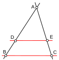

# 3. Théorème de Thalès et triangles semblables

## Énoncé

Soit un triangle $ABC$ et deux points $D$ sur la droite $(AB)$ et $E$ sur la droite $(AC)$, tels que la droite $(DE)$ soit **parallèle** à $(BC)$. Alors :

$$\frac{AD}{AB} = \frac{AE}{AC} = \frac{DE}{BC}$$

## Comment le comprendre ?

Le petit triangle $ADE$ est une **réduction** du grand triangle $ABC$ : même forme, taille différente. On dit que les triangles sont **semblables**. Tous les côtés sont multipliés par un **même rapport** $k$.

$$k = \frac{AD}{AB} = \frac{AE}{AC} = \frac{DE}{BC}$$

## ✏️ Exemple

On donne $AD = 3$, $AB = 6$, $AE = 5$ et $DE = 4$. Calculer $AC$ et $BC$.

1. Rapport : $k = \dfrac{AD}{AB} = \dfrac{3}{6} = \dfrac{1}{2}$.
2. $\dfrac{AE}{AC} = \dfrac{1}{2}$ ⇒ $AC = 2 \times 5 = 10$.
3. $\dfrac{DE}{BC} = \dfrac{1}{2}$ ⇒ $BC = 2 \times 4 = 8$.

> 💡 **À retenir** : « tant que deux droites sont parallèles, on a des rapports égaux » : on écrit les fractions dans le **même ordre** (petit triangle sur grand triangle).
