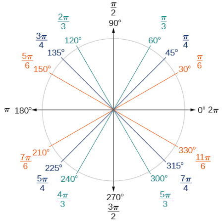

# 4. Angles et unités de mesure

## Qu'est-ce qu'un angle ?

Un **angle**, c'est l'**écart** entre deux droites (ou demi-droites) qui ont la **même origine**.

## Les unités

| Unité | Symbole | Tour complet |
| --- | --- | --- |
| Degré | $^\circ$ | $360^\circ$ |
| **Radian** | rad | $2\pi$ rad |
| Grade (gon) | gon | $400$ gon |

$$360^\circ = 2\pi \text{ rad} = 400 \text{ gon}$$

> 💡 **Le radian est l'unité à maîtriser** : c'est celle qu'on utilise en analyse.

## Convertir degrés ↔ radians

On utilise que $180^\circ = \pi$ rad :

$$\text{angle en rad} = \text{angle en }^\circ \times \frac{\pi}{180} \qquad\qquad \text{angle en }^\circ = \text{angle en rad} \times \frac{180}{\pi}$$

### Valeurs à connaître

| Degrés | $30^\circ$ | $45^\circ$ | $60^\circ$ | $90^\circ$ | $180^\circ$ | $360^\circ$ |
| --- | --- | --- | --- | --- | --- | --- |
| Radians | $\dfrac{\pi}{6}$ | $\dfrac{\pi}{4}$ | $\dfrac{\pi}{3}$ | $\dfrac{\pi}{2}$ | $\pi$ | $2\pi$ |

## Degrés, minutes, secondes

Un degré se divise en 60 minutes, et une minute en 60 secondes :

$$1^\circ = 60' \qquad 1' = 60'' \qquad\text{donc}\qquad 1'' = \frac{1}{3600} \text{ degré}$$

✏️ **Exemple** : $36^\circ 32' 48''$ en degrés décimaux : $36 + \dfrac{32}{60} + \dfrac{48}{3600} \approx 36{,}547^\circ$.

## Définir le radian

Un angle $\alpha$ en radians est le rapport entre la **longueur de l'arc** et le **rayon** :

$$\alpha = \frac{\text{longueur}}{\text{rayon}}$$

Un angle de **1 radian** est donc celui qui « découpe » sur le cercle un arc de longueur égale au rayon.

## À propos des grades (gon)

Le grade date de la Révolution française. Il est surtout utilisé en topographie et on **peut l'ignorer** en pratique. Pour info :

$$\frac{\pi}{2} = 100 \text{ gon} \qquad \pi = 200 \text{ gon}$$
