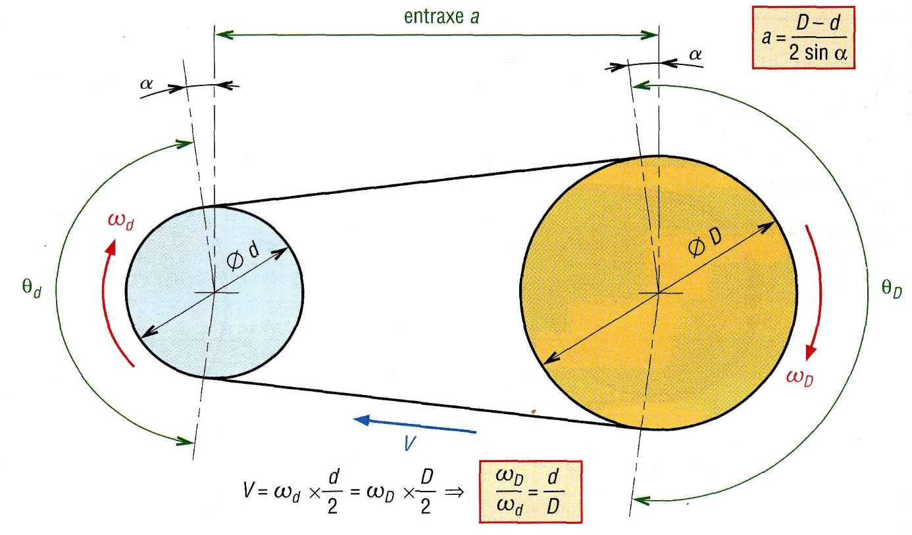

# 5. Longueur d'arc, aire d'un secteur et vitesses

## Le cercle complet

Pour un cercle de rayon $r$ :

| Grandeur                        | Formule                |
| ------------------------------- | ---------------------- |
| Longueur totale (circonférence) | $L\_{tot} = 2\pi r$    |
| Aire totale                     | $A\_{tot} = \pi r^2$   |
| Angle total                     | $\angle\_{tot} = 2\pi$ |

## Un morceau de cercle

Pour un angle $\alpha$ (en **radians**), on prend la même proportion de la longueur et de l'aire.

**Longueur d'arc**

$$L = r\,\alpha$$

**Aire du secteur**

$$A = \frac{r \cdot L}{2} = \frac{r^2\,\alpha}{2}$$

✏️ **Exemple** : $r = 5$ cm et $\alpha = 2$ rad ⇒ $L = 5 \times 2 = 10$ cm et $A = \dfrac{5 \times 10}{2} = 25$ cm².

> ⚠️ Ces formules ne fonctionnent que si $\alpha$ est en **radians**.

## Application : vitesse angulaire et vitesse linéaire

### Vitesse angulaire

La **vitesse angulaire** $\omega$ (oméga) mesure l'angle parcouru par seconde, en rad/s :

$$\omega = \frac{\Delta\theta}{\Delta t}$$

Si un objet fait $n$ tours par seconde (fréquence de rotation), chaque tour vaut $2\pi$ rad, donc :

$$\omega = 2\pi \times n$$

### Vitesse linéaire

Un point situé à la distance $r$ du centre avance à la vitesse :

$$v = r \times \omega$$

✏️ **Exemple** : une roue de rayon $0{,}5$ m tourne à $\omega = 10$ rad/s ⇒ $v = 0{,}5 \times 10 = 5$ m/s.

## Application : transmission (deux roues reliées)

Deux roues sont reliées par une courroie (ou en contact) :

**Idée clé** : la courroie avance à la **même vitesse** pour les deux roues. Donc :

$$v = \omega_d \times \frac{d}{2} = \omega_D \times \frac{D}{2}$$

On en déduit :

$$\frac{\omega_D}{\omega_d} = \frac{d}{D}$$

> 💡 **À retenir** : la **petite roue tourne plus vite** que la grande. Le rapport des vitesses angulaires est l'**inverse** du rapport des tailles.

De la même façon, la courroie parcourt la **même longueur** sur les deux roues :

$$L_1 = L_2 \quad\Rightarrow\quad \alpha_1 \, r_1 = \alpha_2 \, r_2 \quad\Rightarrow\quad \alpha_2 = \alpha_1 \times \frac{r_1}{r_2}$$

> 🎯 **Astuce** : on a 4 grandeurs ($\alpha\_1$, $r\_1$, $\alpha\_2$, $r\_2$). Dès qu'on en connaît **3**, on trouve la 4ᵉ avec $\alpha\_1 r\_1 = \alpha\_2 r\_2$. Voir les [exercices](11-exercices.md).
