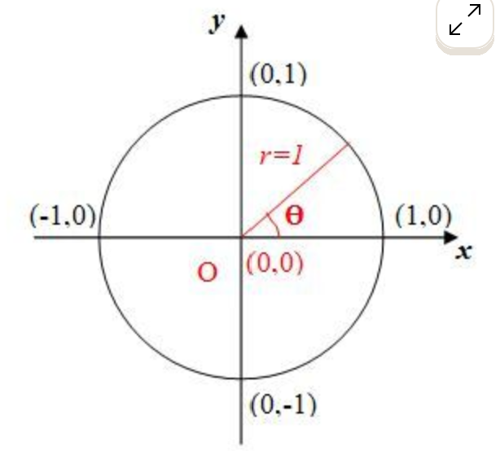
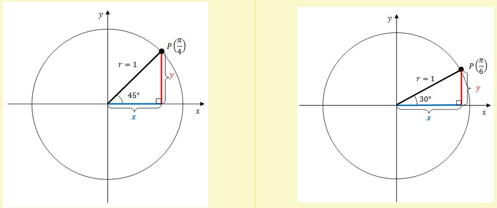

# 6. Le cercle trigonométrique

## Définition

Le **cercle trigonométrique** (ou **cercle unité**) est le cercle :

* de **centre** l'origine $(0,0)$,
* de **rayon** $1$.

Son équation est :

$$x^2 + y^2 = 1$$

## Les points du cercle

* On mesure toujours un angle **à partir du point $(1,0)$**.
* Par convention, on tourne dans le **sens inverse des aiguilles d'une montre** pour un angle positif.

Pour trouver les coordonnées d'un point sur le cercle, il suffit de connaître l'angle au centre, puis d'appliquer **Pythagore** dans un triangle rectangle d'**hypoténuse 1**.

Dans ces schémas :

* $x$ (en bleu) est la **longueur horizontale**,
* $y$ (en rouge) est la **longueur verticale**,
* comme l'hypoténuse vaut $1$ : $x^2 + y^2 = 1$.

> ➡️ Ces coordonnées $x$ et $y$ ne sont autres que le **cosinus** et le **sinus** de l'angle : voir le [chapitre suivant](07-sinus-cosinus.md).
