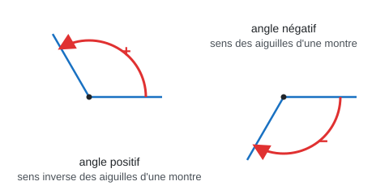
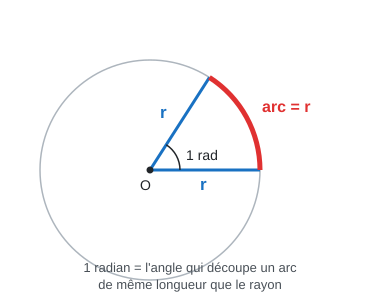
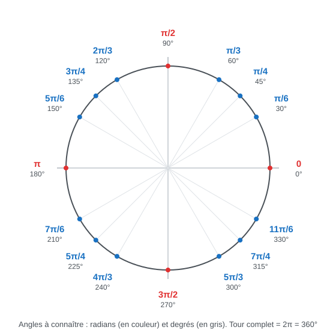
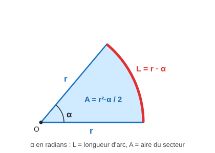
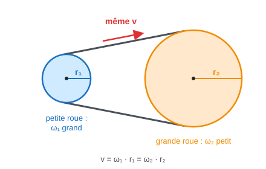
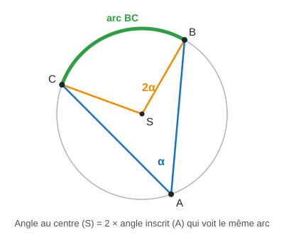

# 2. Angles

## Objectifs

À la fin de ce chapitre, tu sais :

- **mesurer et convertir des angles** : degrés (avec virgule ou en degrés-minutes-secondes), radians, grades ;
- calculer des **longueurs d'arc** et des **aires de secteur** ;
- relier **vitesse angulaire** et **vitesse linéaire** (roues, courroies, aiguilles de montre).

> Source : module_1_trigonometrie.pdf, p. 1 (objectifs, partie 2)

## Prérequis

- [Chapitre 1 : Rappels de géométrie du triangle](01-geometrie-du-triangle.md) : somme des angles.
- Règle de trois, conversion d'unités (km/h → m/s, cm → m).

---

## Définitions

### 2.1 Définition de l'angle

- **Angle** → l'**écart** entre deux demi-droites qui ont la **même origine** (le **sommet**)
- **Angle orienté** → on choisit un **sens de rotation** :
  - sens **inverse** des aiguilles d'une montre → angle **positif**
  - sens des aiguilles d'une montre → angle **négatif**
- On mesure depuis la demi-droite de départ (sur le cercle trigo : depuis le point $$(1;0)$$, chapitre 3)
- Un angle peut dépasser un tour ($$> 360^\circ$$) → on refait un ou plusieurs tours

⚠ Une aiguille de montre tourne dans le sens **négatif**. Correction du TE 2025 : « $$\omega < 0$$ ! ».

> Source : anciennes notes Analyse 1 (historique git 898580e) : 04-angles-et-unites.md et 06-cercle-trigonometrique.md ; sens de la montre : Algebre_merged.pdf, p. 243

### 2.2 Le degré

- **Tour complet** $$= 360^\circ$$ ; demi-tour $$= 180^\circ$$ ; angle droit $$= 90^\circ$$
- **Degrés-minutes-secondes** (DMS) :

$$
1^\circ = 60' \qquad 1' = 60'' \qquad 1'' = \frac{1}{3600}^\circ
$$

- **DMS → degrés avec virgule** : $$d^\circ\, m'\, s'' = d + \frac{m}{60} + \frac{s}{3600}$$
- **Degrés avec virgule → DMS** : la partie décimale × 60 → minutes, puis la partie décimale des minutes × 60 → secondes

**Ex :** $$7^\circ 12' = 7 + \frac{12}{60} = 7{,}2^\circ$$ ; $$3{,}\overline{3}^\circ = 3^\circ + 0{,}\overline{3} \cdot 60' = 3^\circ 20'$$

⚠ $$3{,}3^\circ \neq 3^\circ 30'$$ : les minutes vont de 0 à 59, ce n'est **pas** du décimal.

> Source : anciennes notes Analyse 1 (historique git 898580e) : 04-angles-et-unites.md ; exemples : Algebre_merged.pdf, p. 249 (Janka, Test 1 Pb 1, Q2)

### 2.3 Le radian

**Définition** : l'angle $$\alpha$$ en radians est le rapport entre la **longueur de l'arc** $$L$$ et le **rayon** $$r$$ :

$$
\alpha = \frac{L}{r}
$$

↳ **1 rad** = l'angle qui découpe un arc **de même longueur que le rayon**

- Tour complet : l'arc = circonférence $$2\pi r$$ → $$\alpha = \frac{2\pi r}{r} = 2\pi$$
- Donc :

$$
360^\circ = 2\pi \text{ rad} \qquad 180^\circ = \pi \text{ rad}
$$

**Conversions** (règle de trois avec $$180^\circ = \pi$$) :

$$
\alpha_{\text{rad}} = \alpha_{\text{deg}} \cdot \frac{\pi}{180} \qquad\qquad \alpha_{\text{deg}} = \alpha_{\text{rad}} \cdot \frac{180}{\pi}
$$

**Valeurs à connaître par cœur :**

| Degrés | $$0^\circ$$ | $$30^\circ$$ | $$45^\circ$$ | $$60^\circ$$ | $$90^\circ$$ | $$180^\circ$$ | $$270^\circ$$ | $$360^\circ$$ |
| --- | --- | --- | --- | --- | --- | --- | --- | --- |
| Radians | $$0$$ | $$\frac{\pi}{6}$$ | $$\frac{\pi}{4}$$ | $$\frac{\pi}{3}$$ | $$\frac{\pi}{2}$$ | $$\pi$$ | $$\frac{3\pi}{2}$$ | $$2\pi$$ |

**Longueur d'arc et aire du secteur** (α en **radians**) :

$$
L = r \cdot \alpha \qquad\qquad A = \frac{r^2 \cdot \alpha}{2} = \frac{r \cdot L}{2}
$$

↳ c'est une proportion du cercle entier : $$\frac{\alpha}{2\pi}$$ de la circonférence $$2\pi r$$, et $$\frac{\alpha}{2\pi}$$ de l'aire $$\pi r^2$$.

**Vitesse angulaire et vitesse linéaire :**

- **Vitesse angulaire** $$\omega$$ (oméga) → angle parcouru par unité de temps, en rad/s :

$$
\omega = \frac{\Delta\theta}{\Delta t}
$$

- $$f$$ tours par seconde (fréquence, en Hz) → chaque tour vaut $$2\pi$$ :

$$
\omega = 2\pi f \qquad\qquad T = \frac{1}{f} = \frac{2\pi}{\omega} \quad (\text{période = durée d'un tour})
$$

- **Vitesse linéaire** d'un point à distance $$r$$ du centre :

$$
v = r \cdot \omega
$$

↳ c'est $$L = r \cdot \alpha$$ « par seconde »

**Transmission** (courroie, chaîne, roues en contact) → la courroie a **la même vitesse** $$v$$ sur les deux roues :

$$
v = \omega_1 \cdot r_1 = \omega_2 \cdot r_2 \quad\Rightarrow\quad \frac{\omega_1}{\omega_2} = \frac{r_2}{r_1}
$$

↳ la **petite** roue tourne **plus vite**.

> Source : anciennes notes Analyse 1 (historique git 898580e) : 04-angles-et-unites.md, 05-arc-secteur-vitesses.md ; $$\omega = 2\pi f$$ et $$v = \omega r$$ : Algebre_merged.pdf, p. 234 (correction TE 2023) ; $$\omega = \frac{2\pi}{T}$$ : p. 243 (TE 2025)

### 2.4 Le grade ou gon

- **Tour complet** $$= 400$$ gon ; angle droit $$= 100$$ gon
- Utilisé surtout en **topographie** (mesure de terrain)

$$
360^\circ = 2\pi \text{ rad} = 400 \text{ gon}
$$

> Source : anciennes notes Analyse 1 (historique git 898580e) : 04-angles-et-unites.md

---

## Intuition

- **Degré** → on coupe le tour en 360 parts. C'est un choix historique, pas « naturel ».
- **Radian** → on mesure l'angle **en rayons** : « combien de rayons je parcours sur l'arc ? ». Un tour = un peu plus de 6 rayons ($$2\pi \approx 6{,}28$$).
  - ↳ c'est pour ça que $$L = r \cdot \alpha$$ est si simple **en radians** (et faux en degrés)
- **Vitesse angulaire** → à quelle vitesse **l'angle** change.
- **Vitesse linéaire** → à quelle vitesse **le point** avance sur le cercle.
  - ↳ même $$\omega$$ pour tous les points d'une roue, mais plus on est loin du centre, plus on va vite ($$v = r\omega$$)

> Source : rédigé hors cours (style des notes)

## Propriétés / théorèmes

| Propriété | Formule | Condition |
| --- | --- | --- |
| Conversion | $$180^\circ = \pi$$ rad $$= 200$$ gon | — |
| Arc | $$L = r\alpha$$ | $$\alpha$$ en **rad** |
| Secteur | $$A = \frac{r^2\alpha}{2}$$ | $$\alpha$$ en **rad** |
| Vitesse angulaire | $$\omega = \frac{\Delta\theta}{\Delta t} = 2\pi f = \frac{2\pi}{T}$$ | rad/s |
| Vitesse linéaire | $$v = r\omega$$ | $$\omega$$ en rad/s, $$r$$ en m → $$v$$ en m/s |
| Transmission | $$\omega_1 r_1 = \omega_2 r_2$$ | même courroie |

**Angle inscrit** : un angle dont le sommet est **sur le cercle** vaut **la moitié** de l'angle au centre qui voit le même arc.


**Complément (hors cours).** L'angle inscrit n'est pas dans tes notes, mais les tests de M. Janka l'utilisent : « on voit l'arc $$BC$$ sous l'angle de 40° en se situant sur le périmètre ». La correction pose alors $$\widehat{BSC} = 2 \cdot \widehat{BAC} = 80^\circ$$ (p. 1).


> Source : anciennes notes Analyse 1 (historique git 898580e) : 05-arc-secteur-vitesses.md ; angle inscrit : Algebre_merged.pdf, p. 1 et p. 45–48

## Marche à suivre

**A. Convertir un angle**

1. Degrés ↔ radians : multiplier par $$\frac{\pi}{180}$$ ou par $$\frac{180}{\pi}$$, puis **simplifier la fraction**
2. DMS → décimal : $$d + \frac{m}{60} + \frac{s}{3600}$$
3. Décimal → DMS : partie décimale × 60 (deux fois)

**B. Longueur d'arc / aire de secteur**

1. Mettre l'angle **en radians**
2. Si l'angle est vu depuis le **cercle** (angle inscrit), le **doubler** pour avoir l'angle au centre
3. $$L = r\alpha$$ ; $$A = \frac{r^2\alpha}{2}$$ ; ou isoler $$r = \frac{L}{\alpha}$$

**C. Problème de vitesses (type « lapins crétins »)**

1. Tout en **unités SI** : km/h ÷ 3,6 → m/s ; cm → m ; **diamètre ÷ 2 = rayon**
2. Écrire ce qui est **commun** (la même $$v$$ pour deux roues du même véhicule ou de la même courroie)
3. $$v = \omega r$$ et $$\omega = 2\pi f$$ → $$f = \frac{v}{2\pi r}$$ ou $$r = \frac{v}{2\pi f}$$
4. Vérifier le **sens** (horaire → $$\omega < 0$$) et **commenter** le résultat si demandé

> Source : rédigé hors cours (style des notes), à partir des corrections : Algebre_merged.pdf, p. 1, 234, 243, 249

## Exemples résolus

**Ex 1 : arc et secteur (Janka, Test 1 Pb 1 var. C, 2023/24).** Cercle de centre $$O$$, rayon $$4$$ m, angle au centre $$15^\circ$$. Calculer $$L$$ et $$A$$ (sans calculatrice).

- Angle en rad : $$15^\circ = \frac{15\pi}{180} = \frac{\pi}{12}$$
- $$L = r\alpha = 4 \cdot \frac{\pi}{12} = \frac{\pi}{3}$$ m
- $$A = \frac{r^2\alpha}{2} = \frac{16 \cdot \frac{\pi}{12}}{2} = \frac{2\pi}{3}$$ m²
- ↳ sans calculatrice → on laisse $$\pi$$ dans le résultat

**Ex 2 : tableau de conversions (même test, Q2).**

| angle | degrés avec virgule | degrés-minutes | radians |
| --- | --- | --- | --- |
| $$\alpha$$ | $$3{,}\overline{3}^\circ$$ (donné) | $$0{,}\overline{3} \cdot 60 = 20$$ → $$3^\circ 20'$$ | $$\frac{10}{3} \cdot \frac{\pi}{180} = \frac{\pi}{54}$$ |
| $$\beta$$ | $$\frac{180}{24} = 7{,}5^\circ$$ | $$0{,}5 \cdot 60 = 30$$ → $$7^\circ 30'$$ | $$\frac{\pi}{24}$$ (donné) |
| $$\gamma$$ | $$7 + \frac{12}{60} = 7{,}2^\circ$$ | $$7^\circ 12'$$ (donné) | $$7{,}2 \cdot \frac{\pi}{180} = \frac{\pi}{25}$$ |

**Ex 3 : angle inscrit (Janka, Test 1 Pb 1 var. B, 2024/25).** L'arc $$BC$$ mesure $$30$$ cm. Depuis un point $$A$$ du cercle, on le voit sous $$40^\circ$$. Rayon $$r$$ ?

- $$A$$ est **sur** le cercle → angle inscrit → angle au centre $$= 2 \cdot 40^\circ = 80^\circ$$
- $$80^\circ = \frac{80\pi}{180} = \frac{4\pi}{9}$$
- $$r = \frac{L}{\alpha} = \frac{30}{\frac{4\pi}{9}} = \frac{270}{4\pi} = \frac{135}{2\pi} \approx 21{,}5$$ cm
- ↳ la copie avait trouvé $$\frac{15}{2\pi}$$ ; la correction indique $$\frac{270}{4\pi} = \frac{135}{2\pi}$$

**Ex 4 : « Vous avez dit crétins ? » (TE F-1 nov. 2023, Ex. 3).** Le caddie doit rouler à au moins $$79{,}168$$ km/h pour décoller. a) Roue arrière $$B$$ de diamètre $$10$$ cm : combien de tours par seconde ? b) La roue $$A$$ fait $$50$$ tours/s : quel est son rayon ? Commenter.

- SI : $$v = \frac{79{,}168}{3{,}6} \approx 21{,}991$$ m/s ; $$r_B = 5$$ cm $$= 0{,}05$$ m (diamètre ÷ 2 !)
- Les deux roues avancent avec le caddie → **même** $$v$$
- a) $$v = 2\pi f_B \cdot r_B$$ ↳ $$f_B = \frac{v}{2\pi r_B} = \frac{21{,}991}{2\pi \cdot 0{,}05} \approx 70$$ tours/s
- b) $$r_A = \frac{v}{2\pi f_A} = \frac{21{,}991}{2\pi \cdot 50} \approx 0{,}07$$ m $$= 7$$ cm
- Commentaire : $$r_A = 7$$ cm $$> r_B = 5$$ cm, alors que sur le dessin $$A$$ est la petite roue → le caddie roule **en arrière** (réponse de la copie, validée)

**Ex 5 : aiguilles de montre (TE F-1 oct. 2025, Ex. 3 a–b).** Il est 2 h 38. a) $$\omega_H$$ et $$\omega_M$$ en degrés/minute, puis en rad/s. b) Angle entre les aiguilles, en degrés.

- a) Minutes : 1 tour en $$60$$ min → $$\omega_M = \frac{360^\circ}{60\ \text{min}} = 6^\circ$$/min ; $$T_M = 3600$$ s → $$\omega_M = \frac{2\pi}{3600} \approx 1{,}75 \cdot 10^{-3}$$ rad/s
- Heures : 1 tour en $$12$$ h $$= 720$$ min → $$\omega_H = \frac{360^\circ}{720} = 0{,}5^\circ$$/min ; $$T_H = 43\,200$$ s → $$\omega_H = \frac{2\pi}{43\,200} \approx 1{,}45 \cdot 10^{-4}$$ rad/s
- ⚠ Les aiguilles tournent dans le sens **horaire** → la correction rappelle $$\omega < 0$$
- b) Depuis midi (aiguilles sur 12) :
  - aiguille des minutes : $$38 \cdot 6^\circ = 228^\circ$$
  - aiguille des heures : $$158$$ min $$\cdot\, 0{,}5^\circ = 79^\circ$$
  - écart : $$228^\circ - 79^\circ = 149^\circ$$
- ↳ la partie c) (distance entre les pointes) utilise la loi du cosinus → chapitre 4

> Source : Ex 1–2 : Algebre_merged.pdf, p. 249 ; Ex 3 : p. 1 et p. 47 ; Ex 4 : p. 234 ; Ex 5 : p. 243

## Pièges fréquents

- ⚠ $$L = r\alpha$$ et $$A = \frac{r^2\alpha}{2}$$ → **seulement en radians**
- ⚠ **Diamètre ≠ rayon** (le TE donne souvent le diamètre)
- ⚠ **km/h → m/s** : diviser par $$3{,}6$$
- ⚠ **Tours/s ≠ rad/s** : $$\omega = 2\pi f$$
- ⚠ Angle vu **depuis le cercle** = angle inscrit → l'angle au centre est le **double**
- ⚠ DMS : $$3^\circ 30' = 3{,}5^\circ$$, pas $$3{,}3^\circ$$
- ⚠ Sens horaire → angle / $$\omega$$ **négatif**
- ⚠ Janka = **sans calculatrice** → garder $$\pi$$ et les fractions simplifiées

**Synthèse :**

- conversion → $$180^\circ = \pi$$ rad $$= 200$$ gon
- arc / secteur → radians, puis $$L = r\alpha$$, $$A = \frac{r^2\alpha}{2}$$
- roues → même $$v$$, puis $$v = \omega r$$ et $$\omega = 2\pi f$$
- montre → $$\omega_M = 6^\circ$$/min, $$\omega_H = 0{,}5^\circ$$/min, sens négatif

> Source : rédigé hors cours (style des notes), d'après les corrections : Algebre_merged.pdf, p. 1, 234, 243, 249

## Exercices


Pas encore de séries d'exercices dans `sources/exercices/`. Les exercices 1 à 4 viennent des **anciens tests**. L'exercice 5 est **rédigé hors cours**.


**Exercice 1 (Janka, Test 1 Pb 1 var. A, 2024/25).** L'arc $$BC$$ mesure $$10$$ cm. Depuis un point $$A$$ du cercle, on le voit sous $$20^\circ$$. Calculer le rayon $$r$$ (sans calculatrice).

Indice

$$A$$ est sur le cercle : quel est l'angle **au centre** ? Convertis-le en radians, puis $$r = \frac{L}{\alpha}$$.

Solution

- Angle au centre $$= 2 \cdot 20^\circ = 40^\circ = \frac{40\pi}{180} = \frac{2\pi}{9}$$
- $$r = \frac{10}{\frac{2\pi}{9}} = \frac{90}{2\pi} = \frac{45}{\pi} \approx 14{,}3$$ cm

**Exercice 2 (conversions).** Convertir : a) $$135^\circ$$ en rad ; b) $$\frac{7\pi}{6}$$ en degrés ; c) $$12^\circ 45'$$ en degrés avec virgule ; d) $$100$$ gon en rad.

Indice

$$180^\circ = \pi = 200$$ gon. Pour les minutes : $$\div 60$$.

Solution

- a) $$135 \cdot \frac{\pi}{180} = \frac{3\pi}{4}$$
- b) $$\frac{7\pi}{6} \cdot \frac{180}{\pi} = 210^\circ$$
- c) $$12 + \frac{45}{60} = 12{,}75^\circ$$
- d) $$100$$ gon = un quart de tour = $$\frac{\pi}{2}$$

**Exercice 3 (« Vous avez dit crétins ? », TE F-1 oct. 2022, Ex. 3).** Le caddie doit rouler à au moins $$79{,}2$$ km/h. a) Nombre de tours par seconde de la roue arrière $$B$$, de diamètre $$10$$ cm. b) Diamètre de la roue avant $$A$$ si elle fait $$50$$ tours/s au décollage.

Indice

$$v$$ en m/s d'abord. Les deux roues ont la même $$v$$. $$f = \frac{v}{2\pi r}$$, et attention : on demande un **diamètre** en b).

Solution

- $$v = \frac{79{,}2}{3{,}6} = 22$$ m/s ; $$r_B = 0{,}05$$ m
- a) $$f_B = \frac{22}{2\pi \cdot 0{,}05} \approx 70{,}0$$ tours/s
- b) $$r_A = \frac{22}{2\pi \cdot 50} \approx 0{,}07$$ m → diamètre $$d_A \approx 0{,}14$$ m $$= 14$$ cm

**Exercice 4 (variante de « Aiguilles de montre », TE F-1 oct. 2025).** Refais l'Ex 5 résolu pour **4 h 15**. Angle entre les aiguilles ?

Indice

Position de chaque aiguille depuis midi : minutes $$6^\circ$$/min, heures $$0{,}5^\circ$$/min. 4 h 15 = $$255$$ min.

Solution

- Minutes : $$15 \cdot 6^\circ = 90^\circ$$
- Heures : $$255 \cdot 0{,}5^\circ = 127{,}5^\circ$$
- Écart : $$127{,}5^\circ - 90^\circ = 37{,}5^\circ$$

**Exercice 5 (transmission).** Un vélo : plateau (pédalier) de rayon $$10$$ cm, pignon arrière de rayon $$4$$ cm, reliés par la chaîne. Le cycliste pédale à $$1$$ tour/s. Combien de tours/s fait la roue arrière (fixée au pignon) ?

Indice

La chaîne a la même vitesse sur le plateau et sur le pignon : $$\omega_1 r_1 = \omega_2 r_2$$, donc aussi $$f_1 r_1 = f_2 r_2$$.

Solution

- $$f_2 = f_1 \cdot \frac{r_1}{r_2} = 1 \cdot \frac{10}{4} = 2{,}5$$ tours/s
- ↳ petit pignon → tourne plus vite

> Source : Ex 1 : Algebre_merged.pdf, p. 45 ; Ex 3 : p. 225 ; Ex 4 : variante de p. 243 ; Ex 2 et 5 : rédigés hors cours

## Liens avec les évaluations

| Test | Question | Ce qui vient du chapitre 2 | Page |
| --- | --- | --- | --- |
| Janka Test 1 Pb 1 (2023/24, 2024/25) | Q1 | arc, secteur, rayon via angle inscrit | 1, 45–51, 249 |
| Janka Test 1 Pb 1 (2023/24) | Q2 | tableau de conversions décimal / DMS / rad | 249 |
| TE F-1 oct. 2020, oct. 2022, nov. 2023 | Ex. 3 « Vous avez dit crétins ? » (4–5 pts, ~5 min) | $$v = \omega r$$, $$\omega = 2\pi f$$, conversions | 216, 225, 234 |
| TE F-1 oct. 2025 | Ex. 3 « Aiguilles de montre » (5 pts, ~10 min) | $$\omega$$ en °/min et rad/s, angle entre aiguilles, **signe** | 243 |
| TE F-1 (vrai/faux) | « Dans le cercle trigo, sans unités, vitesses angulaire et linéaire sont identiques » | $$v = r\omega$$ avec $$r = 1$$ → **vrai** | 230 |

**Démarche attendue :**

- unités écrites à chaque ligne (m/s, Hz, rad/s)
- formule littérale **avant** le calcul numérique ($$f_B = \frac{v}{2\pi r_B}$$, puis les valeurs)
- commentaire quand il est demandé (« le caddie roule en arrière »)


**Complément (hors cours).** Pour le vrai/faux, la réponse cochée sur la copie (p. 230) est difficile à lire sur le scan. « Vrai » est déduit de $$v = r\omega$$ avec $$r = 1$$.


> Source : Algebre_merged.pdf, p. 1, 45–51, 216, 225, 230, 234, 243, 249
